# Federation over Text per la diagnosi di serie temporali

## Narrazione tecnica e didattica autorevole del progetto FoT–TEP

**Stato documentale:** ricostruzione del progetto concluso, non nuovo esperimento.  
**Repository di riferimento:** `sorrentinoluca/fot-phd`, branch `phase-b-fot`.  
**Fonte interpretativa canonica della chiusura:** `FOT_TEP_POC_FINAL_SYNTHESIS.md`.  
**Repository state used for factual verification:** `a422af31fbf0dc2a84720e5d489fcb94396c034d`.
**Technical narrative initially added in:** `d5a0599edf0f8d9e8909fde52aafd29db21f7cef`.
**Visual narrative integration:** `61e228a847c6bcd915b5f933fbd77da1386d875a`.

Questo documento racconta l'intero percorso scientifico: dall'idea di usare la
**Federation over Text (FoT)** per futuri sistemi fotovoltaici distribuiti, al
proof-of-concept controllato sul **Tennessee Eastman Process (TEP)**, fino al
freeze delle prediction e alla valutazione offline finale. I fatti sono
ricostruiti dagli artefatti versionati; quando una scelta recente supera una
scelta storica, entrambe sono indicate come tali.

**Framing del programma di PhD.** L'obiettivo finale del dottorato è applicare e
studiare Federation over Text nel dominio fotovoltaico reale. TEP è un
**preliminary feasibility gate** e un **methodological proving ground**: serve a
stabilire preliminarmente fattibilità, disciplina di valutazione e failure mode
prima della fase fotovoltaica principale. Non è il dominio finale, non è
l'intera tesi e non fornisce evidenza empirica di generalizzazione cross-domain.
La sequenza del programma è quindi:

`idea FoT→PV → rischio metodologico → proving ground TEP controllato → Phase A
→ Phase B → lezioni apprese → feasibility gate superato → transizione al PV`.

## Indice

- [0. Come leggere questo documento](#s0)
- [1. Origine del progetto: perché FoT per il fotovoltaico](#s1)
- [2. Concetti fondamentali](#s2)
- [3. Perché il Tennessee Eastman Process](#s3)
- [4. Audit iniziale del dataset TEP](#s4)
- [5. Prima versione: V1](#s5)
- [6. Phase A V2: obiettivo](#s6)
- [7. Feature engineering V2](#s7)
- [8. Calibrazione delle soglie senza leakage](#s8)
- [9. Structured evidence e neutral text](#s9)
- [10. Evaluator di Phase A](#s10)
- [11. Freeze, validation e historical test di Phase A](#s11)
- [12. Perché serviva un nuovo held-out](#s12)
- [13. Audit del simulatore MATLAB/Simulink](#s13)
- [14. Generazione del nuovo held-out](#s14)
- [15. Dalla Phase A alla Phase B](#s15)
- [16. Pseudolabel e protezione dalla prior knowledge](#s16)
- [17. Topologia non-IID dei quattro agenti](#s17)
- [18. Local knowledge](#s18)
- [19. Generazione degli insight](#s19)
- [20. Federation over Text nella Phase B](#s20)
- [21. Condizioni A, B ed E](#s21)
- [22. Output diagnostico e abstention](#s22)
- [23. R=3 e aggregazione](#s23)
- [24. Bootstrap e unità statistica](#s24)
- [25. Freeze chain della Phase B](#s25)
- [26. Perché fu necessario l'amendment dello schedule](#s26)
- [27. Esecuzione delle 540 inference](#s27)
- [28. Freeze delle prediction](#s28)
- [29. Evaluation offline](#s29)
- [30. Risultati finali](#s30)
- [31. Interpretazione corretta dei risultati](#s31)
- [32. Cosa il PoC dimostra o supporta](#s32)
- [33. Cosa il PoC non dimostra](#s33)
- [34. Problemi metodologici e lezioni apprese](#s34)
- [35. Evoluzione della claim scientifica](#s35)
- [36. Repository map](#s36)
- [37. Cronologia Git e freeze reference](#s37)
- [38. Glossario](#s38)
- [39. Come interrogare il progetto con un LLM](#s39)
- [40. Dal TEP al fotovoltaico](#s40)
- [41. Conclusione generale](#s41)

---

<a id="s0"></a>
# 0. Come leggere questo documento

### Introduzione

Il testo è rivolto a chi incontra il progetto per la prima volta: dottorandi,
revisori, ingegneri e agenti LLM. È insieme una spiegazione progressiva e una
mappa di provenance. Non sostituisce gli artefatti frozen: indica dove
verificarli.

### Timeline sintetica del progetto

La timeline seguente è una mappa di orientamento: il diagramma rende memorabile
il percorso, mentre la tabella precisa domanda, decisione e boundary tecnica.
La cronologia Git normativa e completa resta nel §37.

```mermaid
flowchart TD
    subgraph VISION["VISION"]
        V1["Idea FoT per PV"] --> V2["Serve un proving ground controllato"]
    end

    subgraph PA["TEP / PHASE A"]
        A1["Scelta TEP"] --> A2["Audit dataset e split"]
        A2 --> A3["Prototype V1"]
        A3 --> A4["Problemi metodologici"]
        A4 --> A5["Phase A V2"]
        A5 --> A6["Freeze Phase A"]
        A6 --> A7["Validation e historical test"]
    end

    subgraph HO["NEW HELD-OUT"]
        H1["Serve un test untouched"] --> H2["Audit simulatore parent"]
        H2 --> H3["15 nuovi casi e held-out freeze"]
    end

    subgraph PB["PHASE B"]
        B1["Design A / B / E"] --> B2["Pseudolabel, local knowledge, peer-only"]
        B2 --> B3["Generazione insight"]
        B3 --> B4["Protocol freeze"]
        B4 --> B5["Verbalizzazione held-out"]
        B5 --> B6["Schedule sottospecificato: STOP 0/540"]
        B6 --> B7["Schedule amendment frozen"]
        B7 --> B8["540 inference, A/B/E con R=3"]
        B8 --> B9["Inference freeze"]
        B9 --> B10["Ground-truth evaluation offline"]
        B10 --> B11["Results freeze"]
    end

    subgraph TR["TRANSITION"]
        T1["Interpretazione finale del PoC"] --> T2["TEP feasibility gate PASSED"]
        T2 --> T3["Next: adattamento e validazione su PV reale"]
    end

    V2 --> A1
    A7 --> H1
    H3 --> B1
    B11 --> T1
```

| Step | Fase | Problema / domanda | Decisione / risultato | Perché conta |
|---:|---|---|---|---|
| 1 | Vision | Come applicare FoT al dominio finale del PhD? | Obiettivo: conoscenza testuale fra siti PV non-IID. | Fissa origine e destinazione del programma. |
| 2 | Vision → TEP | Come ridurre il rischio prima dei dati PV reali? | TEP scelto come preliminary feasibility gate controllato. | Non pretende generalizzazione cross-domain. |
| 3 | TEP audit | Quanti batch esistono e come separarli? | Verificati 10 batch; development 1–5, validation 6–7, historical test 8–10. | Impedisce leakage fra scelta e valutazione. |
| 4 | V1 | È possibile trasformare numeri in testo e farli classificare? | Prototype V1 e sanity check 5/5. | Dimostra plumbing, non ancora FoT. |
| 5 | Svolta metodologica | Prototipi hard-coded, Normal tautologico e std ambigua regalavano conoscenza discriminativa. | STOP alla lettura forte del 5/5; separazione level/trend/variabilità e rimozione della diagnosi dal renderer. | Il design cambia per critica, non per tuning del test. |
| 6 | Phase A V2 | Come descrivere senza classificare? | `time series → structured evidence → neutral text`. | Separa representation e reasoning. |
| 7 | Phase A freeze | Come impedire aggiustamenti dopo development? | Freeze `3fd960a192bafacbaabce9471e3c3614d6b2d2db`, tag `verbalizer-v2-pre-validation`; closure `0a45817fd783513e23d58a35c55489404c95feec`. | Congela feature, soglie, renderer ed evaluator. |
| 8 | Phase A evaluation | Le firme persistono fuori development? | Validation `1d9c1617b56c19d2bc71dfef7b7902df0670b537`; historical test e scientific closure `0a45817fd783513e23d58a35c55489404c95feec`, tag `phase-a-verbalizer-v2-complete`. | Registra stabilità e limiti senza creare V2.1. |
| 9 | New held-out | I batch 8–10 erano già osservati. | Decisione di generare un final test Phase B realmente untouched. | Evita che il test storico influenzi il PoC FoT. |
| 10 | Simulator audit | Il commit con supporto setpoint non era self-contained per il workflow standard. | Audit del parent `a0413e16c940f0fc8b554d6a86248020d7fb7527`; plant/stato/solver comparabili. | Risolve l'incompatibilità prima della generazione. |
| 11 | Held-out | Come fissare nuove repliche senza leggerne le firme? | Generati e auditati 15 casi; freeze `86baaa65e72cea22ecb89dd0e7b213aea5a1284b`, tag `phase-b-heldout-frozen`. | Identità byte-level prima della diagnosi. |
| 12 | Phase B design | Come isolare trasferimento, benchmark prior ed effetto-volume? | Quattro agenti non-IID; pseudolabel opache; A isolated, B FoT, E corrupted; peer-only. | E è il specificity control; B−E non è primary. |
| 13 | Insight generation | Come evitare una prototype library scritta dal ricercatore? | Due insight per classe, first structurally valid wins, provenance completa, nessuna selezione manuale. | La conoscenza nasce dagli esempi locali. |
| 14 | Protocol freeze | Quali regole devono precedere l'apertura diagnostica del test? | Commit `3d86f64d43e14e7e0de520cb047ca1043bf9c1c0`, tag `phase-b-protocol-frozen`. | Blocca prompt, insight, A/B/E, R, metriche e bootstrap. |
| 15 | Held-out verbalization | Come preparare input finali senza usare ground truth? | Verbalizzazioni frozen al commit `32f0856040614870d3784a4811e76cee0eee77e3`. | Mantiene Phase A deterministica e separata. |
| 16 | Svolta schedule | Il protocollo non specificava l'ordine delle 540 call. | STOP a 0/540, zero prediction osservate. | Corregge una sottospecifica prima dei risultati. |
| 17 | Schedule freeze | Come bilanciare posizione e mantenere statelessness? | Rotazione ABE/BEA/EAB; commit `eef0bc58e5ab14fb0cd2aece180fb5b1b5a7962b`, tag `phase-b-execution-schedule-frozen`. | Ogni condizione occupa equamente le posizioni. |
| 18 | Final inference | Eseguire la matrice frozen senza tuning. | 540/540 inference A/B/E con R=3; un solo retry strutturale. | Produce repetition e aggregate record tracciabili. |
| 19 | Prediction freeze | Come impedire correzioni dopo la correctness? | Commit `11c34358e28e875cd5c7249061ac2b89ffcd42f4`, tag `phase-b-inference-frozen`. | Congela prediction prima del ground-truth join. |
| 20 | Offline evaluation | Cosa mostrano le prediction frozen? | Ground truth solo evaluator-side; commit `45ec4eed65b263a5803ced7d01064c4672e81e86`, tag `phase-b-results-frozen`. | B−A resta primary; B−E specificity/mechanistic contrast. |
| 21 | Interpretazione | Il floor di A rende lecite claim più forti? | No ripunteggio: floor caratterizzato post-hoc; FoT feasibility supported e specificity control positivo. | Prudenza interpretativa senza cambiare metriche. |
| 22 | Transition | Cosa segue il gate TEP? | Adattamento e validazione indipendente su PV reale; FoT-vs-central-ICL resta open question. | Il PoC termina, il programma di PhD continua. |

> **Nota per lettori e futuri LLM.** Questa timeline è una mappa di
> orientamento. Per la versione normativa di ogni decisione seguire gli
> artefatti frozen e le sezioni di dettaglio citate nel documento; uno step
> storico può essere stato successivamente superseded.

### Obiettivo della fase

Separare tre livelli che nella cronologia possono facilmente confondersi:

1. **historical state**, cioè ciò che si pensava o si provava in un dato momento;
2. **decisione successiva**, che corregge o delimita quello stato;
3. **final/canonical state**, vincolante per la claim conclusiva.

### Come è stato raggiunto

La ricostruzione segue Git, hash SHA-256, manifest, configurazioni, codice,
record di esecuzione e report. Per la Fase A le fonti principali sono
`VERBALIZER_V2_FREEZE.md` e `PHASE_A_STATUS.md`; per la Fase B sono
`phase_b/PHASE_B_PROTOCOL_FREEZE.md`,
`phase_b/PHASE_B_PROTOCOL_AMENDMENT_001.md` e
`phase_b/final_evaluation/EVALUATION_REPORT.md`; l'interpretazione finale è
quella di `FOT_TEP_POC_FINAL_SYNTHESIS.md`.

### Problemi incontrati e decisioni

Documenti storici come `PHASE_B_EXPERIMENT_DESIGN.md` e
`PHASE_B_EXPERIMENT_DESIGN_V2.md` contengono opzioni ancora aperte. Non vanno
letti come se fossero già il protocollo eseguito. Il freeze machine-readable
`phase_b/config/phase_b_protocol_frozen.json` risolve quelle opzioni.

### Risultato ottenuto

Il lettore può seguire una catena auditabile: idea → prototipo V1 → critica →
verbalizer V2 frozen → nuovo held-out → protocollo FoT frozen → inference
frozen → ground-truth evaluation frozen.

### Collegamento con l'obiettivo finale

Questa disciplina è trasferibile al futuro PV: prima definire la rappresentazione,
poi congelare il protocollo, infine aprire il test. Non è ancora una validazione
su dati fotovoltaici.

### Domande e risposte

**D: Questo documento è esso stesso un artefatto scientifico frozen?**  
R: No. È una narrazione documentale post-risultati. Gli oggetti scientifici
autorevoli restano quelli puntati dai tag di freeze; questa pagina li collega
senza spostarli o reinterpretarli retroattivamente.

**D: Perché non basta leggere l'ultimo report?**  
R: Il risultato finale dice *cosa* è emerso, ma non insegna perché furono
necessari neutralità, pseudolabel, nuovo held-out e freeze multipli. La storia
degli errori è parte della metodologia.

**D: Quale fonte prevale in caso di conflitto interpretativo?**  
R: Per la chiusura del PoC prevale `FOT_TEP_POC_FINAL_SYNTHESIS.md`; per regole e
numeri prevalgono rispettivamente protocol/config frozen e artefatti di
evaluation al tag `phase-b-results-frozen`.

---

<a id="s1"></a>
# 1. Origine del progetto: perché Federation over Text per il fotovoltaico

### Introduzione

La motivazione di lungo periodo è un insieme di impianti fotovoltaici (PV)
distribuiti. Ogni sito osserva proprie serie temporali e propri eventi; clima,
impianto, inverter e regime operativo rendono plausibile una conoscenza locale
eterogenea, cioè **non-IID**. Questo è il dominio empirico principale previsto
dal programma di PhD; il lavoro TEP è il gate metodologico preliminare che ne
riduce i rischi.

### Obiettivo della fase

Esplorare una federazione in cui i siti non debbano centralizzare dati grezzi
né scambiarsi necessariamente pesi di un modello: ciascun nodo sintetizza
conoscenza locale in testo strutturato, e gli altri nodi la usano per ragionare.

### Come è stato raggiunto

L'idea è formalizzata come flusso concettuale:


TEP è quindi un banco di prova intermedio, non la destinazione applicativa.
Lo stato storico più antico conservato in `FoT_setup_prompt_server.md` parte dal
paradigma del lavoro *Federation over Text: Insight Sharing for Multi-Agent
Reasoning*: agenti con LLM frozen distillano reasoning trace in insight, che
vengono aggregati e ridistribuiti come testo, senza gradienti né fine-tuning.
Prima di TEP fu riprodotto un ciclo software minimale con due agenti su due task
matematici; il server produsse una libreria di 13 insight, con costo allora
registrato di circa 0,005 USD. Era una prova di plumbing, non un risultato PV o
diagnostico.

Lo stesso runbook distingue storicamente il “FoT puro” con libreria condivisa
da una futura idea personalizzata con contesto \(G_i\) per client e
`harmed-client rate`. Quella variante non è stata testata nel PoC TEP. La
Phase B ha invece adottato una topologia peer-only deterministica per isolare il
trasferimento su classi unseen. La formulazione successiva della Phase A è in
`PROJECT_UNDERSTANDING.md`; la chiusura canonica è
`FOT_TEP_POC_FINAL_SYNTHESIS.md`.

### Problemi incontrati e decisioni

Un testo può comprimere informazione, ma può anche introdurre interpretazioni
del ricercatore. Per questo il progetto ha separato la verbalizzazione neutrale
dalla diagnosi e ha impedito che i prototipi delle classi fossero regalati al
reasoner. Inoltre il successo del plumbing matematico non fu confuso con una
validazione sul dominio: prima occorreva costruire il collo di bottiglia
numeri→testo.

### Risultato ottenuto

Il PoC ha dimostrato la fattibilità di una catena representation→text→reasoning
e ha prodotto evidenza, su TEP e nei limiti dichiarati, che insight testuali
peer corretti trasferiscono conoscenza su classi localmente unseen. Il gate TEP
ha quindi dato esito positivo per la feasibility del meccanismo e della
disciplina sperimentale; non ha testato la validità empirica nel PV.

È essenziale distinguere:

- **generalizzazione empirica:** non dimostrata; al momento l'evidenza
  sperimentale riguarda esclusivamente TEP;
- **trasferibilità metodologica:** argomentabile per architettura e protocollo.
  L'architettura metodologica è progettata per essere trasferibile fra domini
  diagnostici a serie temporali, mentre il layer di rappresentazione concreto
  deve essere adattato al dominio fisico e validato nuovamente e in modo
  indipendente.

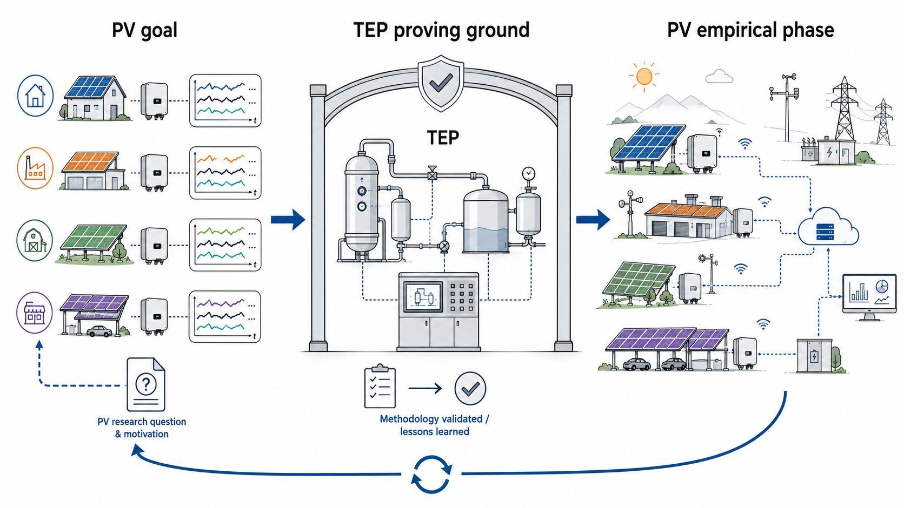

**Figura 1 — Dal problema PV al proving ground TEP e ritorno.**
Il progetto nasce dalla domanda FoT nel fotovoltaico distribuito e usa TEP come
ambiente controllato per verificare il metodo. La destinazione empirica resta
il PV reale, dove architettura e ipotesi dovranno essere valutate nuovamente.

**Da ricordare:** TEP è il ponte metodologico, non la destinazione.

### Collegamento con l'obiettivo finale

Sono riutilizzabili architettura e disciplina sperimentale. Feature, tassonomia,
baseline e ground truth dovranno invece essere riprogettati per PV: questo è
**FUTURE WORK**, non parte del risultato TEP.

### Domande e risposte

**D: FoT è semplicemente federated learning scritto in linguaggio naturale?**  
R: No. Nel federated learning classico si aggregano aggiornamenti di parametri;
qui l'oggetto federato è una conoscenza testuale con provenance. Condividono la
motivazione distribuita, non il meccanismo.

**D: Il progetto prova già benefici di privacy?**  
R: No. Non centralizzare i dati è una motivazione architetturale, ma il PoC non
misura formalmente privacy, leakage informativo del testo o attacchi di
ricostruzione.

**D: Perché non iniziare direttamente dai dati PV?**  
R: TEP offre fault controllati, repliche e ground truth, permettendo di isolare
problemi metodologici prima di affrontare stagionalità, meteo e labeling più
difficili del dominio reale.

---

<a id="s2"></a>
# 2. Concetti fondamentali

### Introduzione

Il progetto collega statistica delle serie temporali, diagnosi, sistemi
federati e LLM. Questa sezione stabilisce il vocabolario minimo.

### Obiettivo della fase

Evitare ambiguità tra dato, evidenza, conoscenza e decisione.

### Come è stato raggiunto

| Termine | Spiegazione intuitiva | Ruolo nel progetto |
|---|---|---|
| Time series | valori ordinati nel tempo | XMEAS campionati ogni minuto |
| Fault diagnosis | associare un comportamento a una classe di guasto | compito del reasoner Phase B, non del verbalizer |
| Non-IID | nodi con distribuzioni/conoscenze diverse | ogni agente conosce una sola fault class |
| Local knowledge | esempi disponibili a un nodo | Normal + fault locale |
| Insight | regola testuale sintetizzata da esempi locali | unità federata con provenance |
| Verbalizer | trasforma serie numeriche in evidenza testuale | Phase A V2 |
| Neutral representation | descrive ciò che supera soglia senza diagnosticare | input del reasoner |
| Held-out | dati tenuti fuori da sviluppo e tuning | 15 nuovi run Phase B |
| Leakage | informazione test che influenza design o prompt | prevenuto da guard, freeze e separazione evaluator-side |
| Development/validation/test | scelta / verifica / stima finale | split disciplinato e poi nuovo test indipendente |
| Physical replication | nuova simulazione del processo | tre run per classe nel held-out |
| LLM repetition | ripetizione stocastica dello stesso prompt | R=3, non nuova evidenza fisica |

Un **pseudolabel** è un nome opaco, per esempio `CLS-ZOGAA`, che sostituisce
`F1` nei materiali prompt-facing. Un **freeze** è un confine versionato oltre il
quale un artefatto non può cambiare senza un nuovo protocollo.

### Problemi incontrati e decisioni

La parola “oscillazione” era inizialmente inferita da una deviazione standard
alta; la distinzione concettuale ha mostrato che dispersione, trend e
periodicità non sono sinonimi. Analogamente, 36 righe agent-case non equivalgono
a 36 run fisici indipendenti.

### Risultato ottenuto

La pipeline finale assegna responsabilità nette: feature numeriche osservano,
testo neutrale comunica, insight trasferiscono conoscenza, LLM decide, evaluator
unisce ground truth solo offline.

### Collegamento con l'obiettivo finale

Queste distinzioni rimangono necessarie in PV, dove un'anomalia apparente può
dipendere da meteo, stagionalità o configurazione del sito.

### Domande e risposte

**D: Una ripetizione LLM aumenta il numero di casi fisici?**  
R: No. Tre risposte allo stesso prompt misurano stabilità stocastica del modello;
non aggiungono un nuovo impianto o una nuova traiettoria del processo.

**D: Un held-out è tale solo perché si chiama “test”?**  
R: No. Deve non aver influenzato feature, soglie, prompt, insight o regole. I
batch TEP 8–10 furono test Phase A, ma non potevano più essere il test finale
indipendente Phase B dopo essere stati ispezionati.

**D: Neutral text significa testo privo di informazione?**  
R: No. Contiene conteggi, segni, finestre e variabili dominanti; evita soltanto
di convertire automaticamente tali fatti in una diagnosi causale.

---

<a id="s3"></a>
# 3. Perché il Tennessee Eastman Process

### Introduzione

Il Tennessee Eastman Process è un benchmark simulato di processo chimico con
variabili misurate, variabili manipolate e disturbi/fault controllabili.

### Obiettivo della fase

Usare un proxy abbastanza realistico da produrre dinamiche multivariate, ma
abbastanza controllato da conoscere classe, run e tempo di attivazione.

### Come è stato raggiunto

Il lavoro considera il Mode 1 e 41 variabili misurate `XMEAS-1`…`XMEAS-41`.
I workbook fault includono anche 12 `XMV`; il verbalizer usa solo Time e XMEAS.
Ogni run standard copre 0–50 h con 3001 righe, passo `1/60 h` = un minuto. I
fault iniziali sono F1, F8, F10 e F13, più Normal. Le fonti sono il dataset
pinnato e `VERBALIZER_V2_FREEZE.md`.

### Problemi incontrati e decisioni

Il tempo di injection non è stato assunto dal benchmark classico. Nel sorgente
specifico il vettore disturbance è ritardato di 10 unità di simulazione, cioè
10 h. Questa verifica è documentata in `INJECTION_TIME_VERIFICATION.md`.

### Risultato ottenuto

TEP ha fornito un ambiente con classi note all'evaluator e firme non banali al
verbalizer. Ha anche reso visibili limiti reali: variabilità tra run, trip
anticipati di alcuni fault e dipendenze tra finestre della stessa simulazione.
In questo programma TEP serve come proving ground metodologico preliminare:
stabilisce feasibility, disciplina di valutazione e failure mode prima della
fase PV principale; non è progettato per fornire evidenza empirica di
generalizzazione cross-domain.

### Collegamento con l'obiettivo finale

Come i siti PV, TEP produce serie multivariate e conoscenza che può essere
locale. A differenza del PV reale, consente ground truth controllata: è utile
per validare il meccanismo FoT prima del trasferimento di dominio.

### Domande e risposte

**D: Le 41 XMEAS sono 41 campioni?**  
R: No. Sono 41 canali; ogni canale ha 3001 osservazioni temporali per run.

**D: Perché non usare le XMV?**  
R: Il layer Phase A è stato definito sulle misure di processo XMEAS e congelato
così. Aggiungere XMV dopo aver visto i dati avrebbe cambiato la rappresentazione.

**D: TEP rende il risultato automaticamente generalizzabile all'industria?**  
R: No. È un simulatore e il PoC copre un mode, quattro fault e pochi run. Offre
controllo sperimentale, non una garanzia di generalizzazione industriale.

---

<a id="s4"></a>
# 4. Audit iniziale del dataset TEP

### Introduzione

Prima delle feature fu necessario verificare direttamente struttura, quantità
e tempi del dataset, senza fidarsi del README.

### Obiettivo della fase

Definire una boundary dati che impedisse a validation e test di influenzare le
scelte development.

### Come è stato raggiunto

L'audit usa lo snapshot upstream
`309b944f35ac440ff0c70616947ffe723c766e14`. Il tree contiene 10 batch per
ciascuno dei 21 fault, cioè 210 workbook; il README storico di `mode_1` indicava
ancora 5 batch/105 file. Per F1/F8/F10/F13 i dieci batch furono confermati dai
nomi reali. `mode1_normal_500.xlsx` contiene 30001 righe su 500 h: fu diviso in
dieci blocchi cronologici non sovrapposti di 50 h; l'endpoint finale resta fuori
dai blocchi uniformi.

| Uso | Fault batch | Blocchi Normal | Stato |
|---|---|---|---|
| Development | 1–5 | N1–N5, 0–250 h | scelta feature, soglie, regole |
| Validation | 6–7 | N6–N7, 250–350 h | descrittivo, nessun tuning |
| Historical test Phase A | 8–10 | N8–N10, 350–500 h | test frozen V2 |
| Final test Phase B | nuovi run | nuovi Normal | generato e congelato separatamente |

Il normal workbook ha intestazioni storicamente fuorvianti `xmv-1`…`xmv-41`,
ma 42 colonne complessive e contenuto trattato come 41 XMEAS; la normalizzazione
esplicita è in `code/tep_features.py`.

### Problemi incontrati e decisioni

Un caso Normal non doveva essere confrontato con statistiche contenenti lo
stesso segmento. La calibrazione ha quindi usato baseline leave-one-block-out:
per una finestra di Ni, baseline dagli altri quattro blocchi development.

### Risultato ottenuto

L'unità di replica fisica storica è il run/batch, non la singola finestra. Il
sampling è costante a un minuto, senza timestamp duplicati o valori mancanti
nei file auditati.

### Collegamento con l'obiettivo finale

L'audit insegna che anche in PV i metadati dichiarati non bastano: sampling,
contiguità, schema e indipendenza delle unità vanno verificati dal dato e dal
sorgente.

### Domande e risposte

**D: Perché N1–N10 non sono file separati?**  
R: Sono blocchi cronologici costruiti dal singolo workbook Normal di 500 h, con
confini deterministici di 50 h.

**D: Una finestra da 5 h è una replica indipendente?**  
R: No. Finestre adiacenti dello stesso run sono temporalmente dipendenti. Sono
unità di descrizione, non nuovi esperimenti fisici.

**D: La discrepanza del README invalida il dataset?**  
R: No, ma mostra perché l'audit del tree è necessario. Lo split usa ciò che
esiste realmente e documenta la divergenza storica.

---

<a id="s5"></a>
# 5. Prima versione: V1

### Introduzione

La V1 fu un prototipo utile: provava rapidamente che serie TEP potevano essere
riassunte e passate a un LLM. Non era ancora una validazione FoT.

### Obiettivo della fase

Costruire un end-to-end minimo: baseline Normal, caratterizzazione shift/std,
verbalizzazione e scelta fra Normal e prototipi A/B/C/D.

### Come è stato raggiunto

`code/tep_characterize.py` calcolava spostamenti e rapporti di deviazione
standard; `code/tep_verbalize.py` consolidava il post-onset e costruiva un prompt
con prototipi diagnostici già esplicitati. Il risultato 5/5 era un sanity check
del prompt/verbalizer.

### Problemi incontrati e decisioni

La review metodologica individuò cinque problemi:

1. `std_fault/std_normal` è un rapporto di **deviazioni standard**, non varianze;
2. std alta può derivare da step o drift, non prova oscillazione;
3. i prototipi A/B/C/D erano hard-coded nel prompt;
4. Normal era definito in modo vicino a una tautologia rispetto alla baseline;
5. aggregare tutto `[onset,50h]` confondeva transiente iniziale e regime tardivo.

Per esempio F1 mostrava dispersione elevata sul segmento post-injection
aggregato, ma nell'ultima finestra raw/residual tornavano circa normali mentre
lo shift restava enorme: chiamare tutto “instabilità” era scorretto. Il 5/5 non
fu quindi promosso a evidenza scientifica.

### Risultato ottenuto

La V1 dimostrò fattibilità software e, soprattutto, rese visibili i rischi di
leakage concettuale. La decisione fu non aggiungere un classificatore numerico
più sofisticato, ma rendere rigoroso il layer numeri→testo.

### Collegamento con l'obiettivo finale

In un sistema PV federato, regalare una libreria di prototipi al nodo centrale
annullerebbe la domanda sul trasferimento di conoscenza. La critica alla V1 ha
quindi protetto la validità della futura FoT.

### Domande e risposte

**D: Il 5/5 era falso?**  
R: Era reale come esito tecnico del prompt, ma non rispondeva alla domanda FoT:
la conoscenza discriminativa era già fornita e i casi non costituivano una
validazione indipendente del trasferimento.

**D: Perché non correggere solo il nome “variance”?**  
R: Il problema non era lessicale. Anche chiamandola dispersione, una singola std
non separa level shift, trend e variabilità residua.

**D: La V1 è canonical?**  
R: No. È stato storico superseded dalla V2 frozen. Resta importante per capire
perché le regole finali sono più neutrali.

---

<a id="s6"></a>
# 6. Phase A V2: obiettivo

### Introduzione

La Phase A V2 ridefinì il problema: il verbalizer non deve classificare e non
deve conoscere F1/F8/F10/F13.

### Obiettivo della fase

Produrre una rappresentazione ripetibile e neutrale:

`time series → structured numerical evidence → neutral text`.

### Come è stato raggiunto

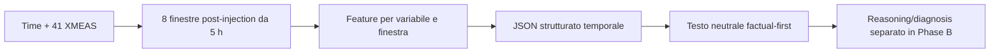

Il codice è diviso fra `code/tep_features.py` (feature senza soglie),
`code/tep_verbalize_v2.py` (soglie, firma, renderer) e
`code/verbalizer_config_v2.json` (parametri frozen).

### Problemi incontrati e decisioni

Termini come “transiente”, “drift persistente” e “oscillazione” furono rimossi
dal renderer automatico. Anche una finestra Normal sopra soglia doveva essere
descritta come evidenza locale, non trasformata in “fault”.

### Risultato ottenuto

Phase A ha prodotto un layer informativo ma label-blind. Il JSON conserva più
dettaglio del testo; il testo comunica fatti utili senza incorporare la
decisione che Phase B deve studiare.

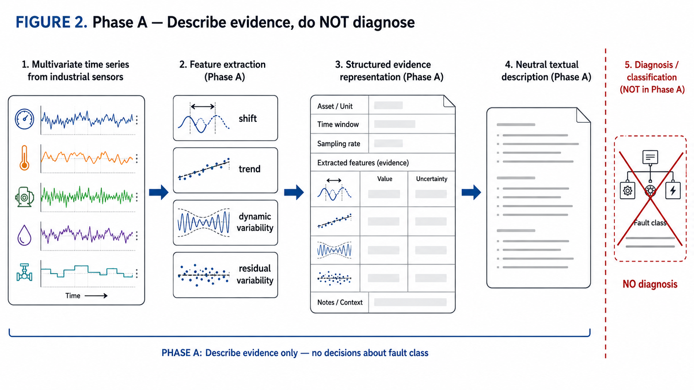

**Figura 2 — Separazione tra rappresentazione e diagnosi.**
Phase A trasforma le serie temporali in feature, evidenza strutturata e testo
neutrale. Il verbalizer descrive ciò che è osservato senza assegnare una classe;
la decisione diagnostica appartiene alla Phase B.

**Da ricordare:** Rappresentazione e reasoning sono deliberatamente separati.

### Collegamento con l'obiettivo finale

Questa interfaccia consente a nodi PV eterogenei di federare conoscenza a un
livello comprensibile e ispezionabile, separando sensori specifici dal reasoning.

### Domande e risposte

**D: Perché non far classificare direttamente il verbalizer?**  
R: Avrebbe mescolato representation quality e knowledge transfer. Separandoli,
un errore può essere localizzato nel testo o nel reasoning.

**D: “Neutral” significa che il testo non nomina neppure la feature?**  
R: La nomina e quantifica. Evita il salto non giustificato da feature a causa o
classe.

**D: La Phase A usa un LLM?**  
R: No per l'evaluator e il renderer frozen. È una trasformazione deterministica
di dati e soglie; l'LLM entra nella Phase B.

---

<a id="s7"></a>
# 7. Feature engineering V2

### Introduzione

Le feature minime dovevano separare spostamento, tendenza e variabilità senza
ricorrere subito a FFT, wavelet o modelli complessi.

### Obiettivo della fase

Misurare fenomeni distinti e dichiarare esplicitamente ciò che ogni misura non
può provare.

### Come è stato raggiunto

Per una finestra (x(t)) e baseline Normal con media \(\mu_0\) e deviazione
standard \(s_0\):

| Feature | Definizione/intuizione | Cosa non prova |
|---|---|---|
| `shift_sigma` | \((\bar{x}-\mu_0)/s_0\), spostamento signed in sigma | non distingue da solo causa o stabilità |
| `slope_sigma_h` | slope OLS divisa per \(s_0\), sigma/ora | una sola slope non prova drift persistente |
| `raw_std_ratio` | std finestra / std baseline | è dispersione, non oscillazione né rapporto di varianze |
| `diff_std_ratio` | std di `diff(x)` / equivalente Normal | può perdere oscillazioni lente; uno step interno contamina |
| `residual_std_ratio` | std dopo detrend lineare / equivalente Normal | non separa sempre oscillazione, noise e transiente curvo |

**ESEMPIO DIDATTICO.** Se \(\mu_0=10\), \(s_0=2\) e una finestra ha media 15,
allora `shift_sigma=(15−10)/2=+2.5`: è evidenza di livello positivo, non il nome
di un fault.

Test sintetici in `code/test_features.py` e
`code/test_verbalize_v2.py` coprono Normal, step, drift lineare, oscillazioni
lente/rapide, noise std×3, combinazioni e step al bordo. Essi confermarono che
raw std confonde fenomeni, diff può perdere il lento, detrend rimuove il drift
lineare ma non uno step interno, e uno step al bordo diventa correttamente shift.

### Problemi incontrati e decisioni

Oscillazione rapida e aumento di noise variance restano ambigui; oscillazione
molto lenta e transiente non lineare pure. La decisione fu documentare il limite
e usare combinazione residual+diff+persistenza, senza inventare una feature
complessa dopo aver visto le classi target.

### Risultato ottenuto

Il nucleo decisionale frozen usa shift, slope, residual e diff. `raw_std_ratio`
resta nel JSON come descrittore di dispersione, ma non decide l'attivazione
primaria.

### Collegamento con l'obiettivo finale

La lezione per PV è metodologica: separare effetti fisici prima di scegliere
feature. Le formule TEP non vanno trasferite automaticamente a segnali con
stagionalità e dipendenza meteorologica.

### Domande e risposte

**D: Perché una std alta non è oscillazione?**  
R: Una finestra metà a livello 0 e metà a livello 6 ha grande dispersione pur
senza periodicità; anche una rampa gonfia la std.

**D: Perché conservare `raw_std_ratio` se è ridondante?**  
R: Come descrizione della dispersione complessiva è utile e auditabile; è
escluso dal nucleo decisionale per evitare l'interpretazione errata.

**D: Perché non usare subito la FFT?**  
R: Avrebbe aumentato gradi di libertà e rischio di tuning. Prima andava testato
se feature time-domain minime e struttura temporale fossero sufficienti.

---

<a id="s8"></a>
# 8. Calibrazione delle soglie senza leakage

### Introduzione

Le feature diventano “attive” solo rispetto a soglie. Sceglierle sui fault o sul
test avrebbe adattato il verbalizer alle classi da riconoscere.

### Obiettivo della fase

Calibrare anomalie rispetto al solo comportamento Normal development, con
controllo max-over-variables per finestra.

### Come è stato raggiunto

Da N1–N5 furono estratte 50 finestre non sovrapposte da 5 h. Per ogni finestra
di Ni, la baseline usa gli altri quattro blocchi. Per ciascuna feature si prende
il massimo su 41 XMEAS; con \(n=50\), \(\alpha=0.05\), il rank frozen è
`k=ceil((n+1)*(1-alpha))=ceil(51*0.95)=49`. La soglia è il 49° valore ordinato e
l'attivazione usa confronto **strettamente maggiore** (`>`).

| Feature primaria | Soglia frozen completa |
|---|---:|
| `abs(shift_sigma)` | `1.9695333234149084` |
| `abs(slope_sigma_h)` | `0.7468621213669596` |
| `residual_std_ratio` | `1.3681613543196571` |
| `diff_std_ratio` | `1.4051245046201666` |

**ESEMPIO DIDATTICO.** In una lista ordinata di 50 massimi, il rank 49 sceglie
il penultimo valore: solo osservazioni strettamente sopra di esso sono positive.
L'esempio illustra il rank; i numeri reali sono in
`code/tep_analysis_v2/threshold_calibration.json` e la procedura riproducibile
in `code/calibrate_thresholds_v2.py`.

### Problemi incontrati e decisioni

Le 50 finestre servono sia alla calibrazione sia alla descrizione del tasso
development; non sono indipendenti e le quattro soglie sono marginali, non un
controllo family-wise dell'unione. Infatti si osservano 1/50 positivi per
ciascuna feature e 3/50 (6%) su almeno una primaria. Questo non autorizza a
imporre che ogni Normal sia negativo.

### Risultato ottenuto

Soglie definite senza fault, validation o test. La verifica di riproducibilità
in `reproducibility/threshold_calibration_verification.json` riporta zero
scarto dalle soglie frozen.

### Collegamento con l'obiettivo finale

In PV la baseline dovrà probabilmente essere condizionata a regime, meteo e
stagione; il principio invariato è calibrarla prima e fuori dal test finale.

### Domande e risposte

**D: Perché usare il massimo su 41 variabili?**  
R: La soglia descrive l'estremo di sistema per finestra, non 41 test separati
calibrati come se non esistesse molteplicità tra canali.

**D: `alpha=0.05` garantisce any-primary=5%?**  
R: No. È per-feature; l'unione di quattro eventi può avere frequenza maggiore.
Il 4/20 Normal validation non fu usato per ricalibrare.

**D: Perché `>` e non `>=`?**  
R: È una regola frozen esplicita che tratta il valore di calibrazione stesso
come non eccedente e rende la riproduzione non ambigua.

---

<a id="s9"></a>
# 9. Structured evidence e neutral text

### Introduzione

Una media su 40 h nasconde quando una firma appare o scompare. Il V2 conserva
la sequenza temporale prima di renderla in testo.

### Obiettivo della fase

Produrre un JSON scientifico ricco e una vista testuale fedele, senza fault ID
né diagnosi automatica.

### Come è stato raggiunto

Il post-injection `[10,50)` è diviso in otto finestre `[10,15)`, …, `[45,50)`.
Per feature e XMEAS il JSON conserva almeno `n_active_windows`,
`active_fraction`, conteggi di segno, `sign_consistency`, longest run,
prima/ultima finestra attiva e attività initial/late. `rapid` vale vero solo
quando residual e diff sono entrambi attivi nello stesso canale/finestra.

**ESEMPIO DIDATTICO.** “XMEAS-1 supera la soglia di spostamento in 8/8 finestre,
sempre con segno positivo. La variabilità residua è sopra soglia nelle prime due
e sotto nelle ultime quattro.” È informativo, ma non dice “step con transiente”.

### Problemi incontrati e decisioni

Il primo renderer V2 usava ancora parole interpretative. Fu rivisto
incrementalmente in factual-first, mantenendo invariato il JSON. Test di
regressione impediscono fault ID, A/B/C/D e terminologia come oscillazione,
periodicità o transiente.

### Risultato ottenuto

Il JSON è adatto ad audit e metriche deterministiche; il neutral text è
l'interfaccia esclusiva del reasoner Phase B. Le label reali restano fuori.

### Collegamento con l'obiettivo finale

Il principio favorisce interoperabilità: un sito PV può esportare descrizioni
compatte senza imporre agli altri il proprio schema numerico completo.

### Domande e risposte

**D: Perché il LLM non riceve direttamente il JSON numerico?**  
R: Il protocollo vuole testare federazione e reasoning su testo; il JSON rimane
artefatto scientifico, mentre il prompt usa solo neutral text per mantenere
l'interfaccia coerente e ridurre dettagli dataset-specifici.

**D: `rapid` significa oscillazione rapida?**  
R: No. È la congiunzione residual+diff sopra soglia; anche noise aumentato può
produrla. Il nome è un'abbreviazione strutturale, non una diagnosi periodica.

**D: Un Normal con una feature attiva diventa fault?**  
R: No. Il renderer descrive l'evidenza locale e lascia la decisione al reasoner.

---

<a id="s10"></a>
# 10. Evaluator di Phase A

### Introduzione

Prima di classificare, serviva misurare se firme dello stesso fault fossero
simili fra run e diverse da altre classi.

### Obiettivo della fase

Valutare stabilità e separabilità strutturale senza LLM, classificatore,
prototipi appresi o pesi adattati.

### Come è stato raggiunto

`code/evaluate_verbalizer_v2.py` emette 17 componenti per XMEAS:

- level: active fraction, signed activity affine in `[0,1]`, late fraction,
  longest same-sign run/8;
- trend: le stesse quattro;
- residual, diff e rapid: active fraction, late fraction, longest run/8.

Sono `17×41=697` componenti, tutte validate in `[0,1]`. La similarità è
`1 - mean(abs(a-b))`, senza pesi; quindi resta in `[0,1]`. Le variabili
dominanti sono confrontate con Jaccard sui set top-4 (`top_k=4`). Il margine è
median intra-classe meno la massima median inter-classe relativa alla classe.

### Problemi incontrati e decisioni

La mean-L1 può essere dominata dalle molte componenti inattive condivise. Il
Jaccard è undefined se entrambi i set sono vuoti. Questi limiti furono
documentati, non “corretti” dopo F1/F8/F10/F13. Nessuna normalizzazione usa
validation/test o statistiche per classe.

### Risultato ottenuto

Un evaluator semplice, deterministico e descriptive-only. Le true label servono
solo per raggruppare offline; nessuna accuracy diagnostica è prodotta.

### Collegamento con l'obiettivo finale

Per PV una rappresentazione testuale dovrebbe essere auditata per stabilità
prima di attribuire al reasoner ogni errore. La metrica specifica può cambiare,
la separazione dei layer no.

### Domande e risposte

**D: Similarità 0.99 significa 99% accuracy?**  
R: No. Significa che due vettori normalizzati differiscono mediamente di 0.01;
non implica una decisione di classe corretta.

**D: Le 697 componenti hanno pesi appresi?**  
R: No. Contribuiscono tutte allo stesso modo e sono normalizzate solo mediante
conteggi di finestre dello stesso caso.

**D: Perché aggiungere Jaccard se esiste la similarità vettoriale?**  
R: La mean-L1 valuta l'intera firma; Jaccard verifica se ricorrono le stesse
variabili dominanti, una proprietà più interpretabile e complementare.

---

<a id="s11"></a>
# 11. Freeze, validation e historical test di Phase A

### Introduzione

Una rappresentazione development promettente non basta: doveva essere congelata
prima di aprire batch successivi e poi osservata senza aggiustamenti.

### Obiettivo della fase

Verificare se le proprietà development persistessero fuori sviluppo, mantenendo
immutati feature, soglie, renderer, config ed evaluator.

### Come è stato raggiunto

Il freeze pre-validation è il commit
`3fd960a192bafacbaabce9471e3c3614d6b2d2db`, tag
`verbalizer-v2-pre-validation`. Gli hash frozen sono:

| File | SHA-256 |
|---|---|
| `code/verbalizer_config_v2.json` | `552a0b8a9cf9e416de77daa7aca2d8dee152a2700bbfaab4ae5e039081712519` |
| `code/tep_verbalize_v2.py` | `3a9129b6353cac6f8c9e02281282f137dd07885b1f882ca633ee9d6bf52393be` |
| `code/evaluate_verbalizer_v2.py` | `972e06fa29bee5a58d57ca757bd158c5cddaa2f4ed12eb5c739169c7fef79a92` |
| `code/tep_features.py` | `cbade7a295dfae6550df7ecbe35fa2be1f844b63c4c528ec194f95a20961040c` |

Validation usa esclusivamente fault 6–7 e N6–N7; historical test usa 8–10 e
N8–N10. `tep_validation_v2/validation_report.md` registra Normal any-primary
4/20 (20%) contro 3/50 development, senza ricalibrazione. Il test in
`tep_test_v2/test_report.md` registra 2/30 (6,7%) any-primary, entrambi diff.

### Problemi incontrati e decisioni

F8 mostrò variazione più forte, soprattutto batch 10; F13 variazione moderata
di level/trend; F1 e F10 furono stabili. Nessuna osservazione autorizzò V2.1 o
tuning. Il verdict indipendente fu “GO WITH CAVEATS”, caveat di
riproducibilità/documentazione chiusi al commit
`145b6b79c59c352e06028166185bad3c9fb49607` e tag
`phase-a-reproducibility-complete`.

### Risultato ottenuto

Verdetti descrittivi finali Phase A: F1 stable across splits; F10 stable; F13
moderate distributional variation; F8 unstable/generalization issue nella
firma storica. Phase A dimostra un layer descrittivo frozen e auditato, non
accuratezza di un classificatore.

### Collegamento con l'obiettivo finale

La validazione onesta delle rappresentazioni riduce il rischio che il futuro
reasoner PV riceva testo fragile e che la fragilità venga attribuita alla
federazione.

### Domande e risposte

**D: Perché non correggere F8 dopo il test?**  
R: Il test serve a scoprire generalizzazione, non a ottimizzarla. Correggere
feature o soglie avrebbe trasformato il test in development.

**D: Il 20% any-primary Normal validation invalida le soglie?**  
R: No. Le soglie sono marginali per feature e non controllano l'unione. Il dato
è conservato come caveat, non usato retrospettivamente.

**D: La Phase A “riconosce” F1/F10?**  
R: No. Mostra firme stabili/separabili secondo metriche descrittive. La diagnosi
di classe è una domanda distinta della Phase B.

---

<a id="s12"></a>
# 12. Perché serviva un nuovo held-out

### Introduzione

Al termine di Phase A i batch 8–10 erano già stati aperti e interpretati. Non
erano più untouched per una valutazione finale Phase B.

### Obiettivo della fase

Creare un test indipendente la cui identità fosse congelata prima di
verbalizzazione, insight e inference diagnostica.

### Come è stato raggiunto

Si decise di generare nuove repliche dal simulatore, verificarne solo integrità
meccanica e congelarne manifest e hash. I vecchi batch 8–10 furono
esplicitamente declassati a historical test Phase A in
`phase_b/PHASE_B_PROTOCOL_FREEZE.md`.

### Problemi incontrati e decisioni

“Non usare per tuning” non basta se i pattern sono già noti al ricercatore. Il
nuovo held-out evita che la scelta di prompt, insight o controlli reagisca anche
inconsciamente alle firme finali.

### Risultato ottenuto

Quindici nuovi casi fisici furono identificati come PBH-001…PBH-015 e congelati
al tag `phase-b-heldout-frozen` prima dell'uso diagnostico.

### Collegamento con l'obiettivo finale

In PV sarà altrettanto importante riservare siti, periodi o eventi realmente
non ispezionati fino al protocol freeze.

### Domande e risposte

**D: Perché non basta nascondere le label dei batch 8–10?**  
R: Le loro firme erano già state analizzate; il design poteva esserne
influenzato anche senza label nel prompt.

**D: Nuovo held-out significa nuovo tipo di fault?**  
R: No. Sono nuove repliche fisiche delle quattro classi target e di Normal,
necessarie per indipendenza temporale del test, non per ampliare la tassonomia.

**D: Gli XLSX raw sono in Git?**  
R: No. Restano in una directory ignorata; identità e integrità sono congelate
tramite filename, size e SHA-256 nel manifest.

---

<a id="s13"></a>
# 13. Audit del simulatore MATLAB/Simulink

### Introduzione

Generare nuovi run richiedeva una versione eseguibile e comparabile del
simulatore TEP. Il working tree dataset corrente non poteva essere assunto
automaticamente valido.

### Obiettivo della fase

Identificare il sorgente corretto, dimostrare injection e dinamiche standard, e
documentare limiti di riproducibilità prima di generare dati.

### Come è stato raggiunto

Il commit dataset `309b944f35ac440ff0c70616947ffe723c766e14` (“Add simulations
with sp changes”) introduce input `xmv*_setpoint` che il workflow standard
corrente non inizializzava in modo self-contained. Fu quindi isolato il parent
diretto `a0413e16c940f0fc8b554d6a86248020d7fb7527`.

`phase_b/heldout/SIMULATOR_PARENT_AUDIT.md` mostra:

- `temexd_mod.c`, `teprob_mod.h`, `TElib.mdl`, `tesys.mdl` byte-identici;
- 35/35 segnali `xInitial` numericamente identici, differenza massima zero;
- 257 blocchi parent, 361 child, 257 comuni, 104 aggiunti per custom setpoint;
- un solo blocco comune con cambio di port count per il wrapper setpoint;
- solver `ode45`, start 0, stop 50, `Ts_save=1/60`, `Ts_base=0.0005`.

La catena injection, verificata nel sorgente pinnato, è:

```mermaid
flowchart LR
    AR[auto_run: dist=zeros; dist(faultNum)=1] --> C[Constant Disturbances = dist]
    D[Constant = 10] -->|delay input 2| V[VariableTransportDelay]
    C -->|data input 1| V
    V -->|output| P[Plant input 13: Disturbances]
    P --> S[temexd_mod / setidv]
```

`MaximumDelay=20` è capacità, non prova del delay applicato; la prova è la
connessione del Constant 10 all'ingresso 2. `InitialOutput` non è serializzato:
il default Simulink compatibile è zero. Con Time in ore, StopTime=50 e sampling
1/60 h, l'attivazione è `t_inject=10 h`. La catena e le linee sono in
`INJECTION_TIME_VERIFICATION.md`.

### Problemi incontrati e decisioni

La S-function usa `Parameters=[] rand()`: run successivi ricevono valori
successivi di MATLAB `rand()`. Nessun `rng(seed)` manuale è nei generatori e lo
stato RNG iniziale non fu registrato. Si può quindi documentare la produzione
di repliche stocastiche distinte, ma non promettere replay bitwise dai soli
script. Un documento Phase A precedente, `PROJECT_UNDERSTANDING.md`, marcava
ancora come non disponibile il controllo empirico pre/post 10 h e manteneva il
default `InitialOutput=0` come caveat aperto. La successiva closure
`INJECTION_TIME_VERIFICATION.md` ha aggiunto il controllo development-only:
nessuna firma fault sistematica prima di 10 h e risposta attesa in `[10,15)`.
La prova primaria resta il routing sorgente; il confronto empirico è solo
consistency check. Questo stato successivo supersede il caveat documentale
precedente senza riscriverne la storia.

### Risultato ottenuto

Il parent è stato giudicato meccanicamente comparabile per run standard senza
custom setpoint. Il MEX macOS usato ha hash
`68f632388cb698dd7b8c595000bc03c2e1d19200546b9d4357df90e3fc93af0d`;
il C sorgente corrispondente è invariato.

### Collegamento con l'obiettivo finale

La lezione per PV è che provenance software, firmware, configurazione e stato
iniziale sono parte del dato: senza di essi “nuovo run” è una nozione debole.

### Domande e risposte

**D: Perché il parent è preferibile al commit dataset dichiarato?**  
R: Il child aggiunge un layer setpoint non self-contained nel workflow standard;
l'audit dimostra che il parent preserva plant, controllo e stato standard prima
di quella modifica.

**D: `MaximumDelay=20` implica injection a 20 h?**  
R: No. Il delay effettivo è il segnale del secondo ingresso, esplicitamente 10;
20 è solo la capacità massima configurata.

**D: Run consecutivi sono “indipendenti” in senso statistico assoluto?**  
R: Sono repliche fisiche simulate distinte alimentate da successivi random draw.
La documentazione non afferma indipendenza probabilistica perfetta né replay
bitwise, perché lo stato RNG iniziale manca.

---

<a id="s14"></a>
# 14. Generazione del nuovo held-out

### Introduzione

Con il simulatore auditato furono prodotti nuovi run, ma senza selezionarli in
base ai segnali.

### Obiettivo della fase

Ottenere tre repliche per Normal e per ciascuno dei quattro fault, complete e
meccanicamente valide.

### Come è stato raggiunto

| Case ID | Classe offline | Run | File |
|---|---|---:|---|
| PBH-001 | Normal | 12 | `mode1_normal_12.xlsx` |
| PBH-002 | Normal | 13 | `mode1_normal_13.xlsx` |
| PBH-003 | Normal | 14 | `mode1_normal_14.xlsx` |
| PBH-004 | F1 | 11 | `mode1_1_11.xlsx` |
| PBH-005 | F1 | 12 | `mode1_1_12.xlsx` |
| PBH-006 | F1 | 13 | `mode1_1_13.xlsx` |
| PBH-007 | F8 | 11 | `mode1_8_11.xlsx` |
| PBH-008 | F8 | 12 | `mode1_8_12.xlsx` |
| PBH-009 | F8 | 13 | `mode1_8_13.xlsx` |
| PBH-010 | F10 | 11 | `mode1_10_11.xlsx` |
| PBH-011 | F10 | 12 | `mode1_10_12.xlsx` |
| PBH-012 | F10 | 13 | `mode1_10_13.xlsx` |
| PBH-013 | F13 | 11 | `mode1_13_11.xlsx` |
| PBH-014 | F13 | 12 | `mode1_13_12.xlsx` |
| PBH-015 | F13 | 13 | `mode1_13_13.xlsx` |

Ogni file è un vero XLSX con `Sheet1`, 3001 righe dati × 54 colonne: Time, 41
XMEAS, 12 XMV; 0–50 h inclusi, passo un minuto, numeri finiti. Il manifest è
`phase_b/heldout/phase_b_heldout_manifest.csv`, SHA-256
`610c8a5fa6e763c25a9f9602a7e095c5fe850ed41b22552b0b92cec7edb450a3`.

### Problemi incontrati e decisioni

Una prima generazione batch 11 incluse tutti i fault; F6 terminò presto a 1029
righe per “Low Stripper Liquid Level”. Non fu rigenerato e non appartiene al
subset finale. Inoltre `xlswrite` su macOS produsse CSV con estensione `.xlsx`:
la scrittura fu corretta con `writecell`+`writematrix` prima del freeze. Warning
MEX temporanei e allargamento buffer delay furono conservati, non nascosti.

### Risultato ottenuto

Il freeze `86baaa65e72cea22ecb89dd0e7b213aea5a1284b`, tag
`phase-b-heldout-frozen`, identifica i 15 file esatti. Le limitazioni di replay
(stato RNG, script F1-11 e Normal-14 non separatamente preservati) sono in
`phase_b/heldout/HELDOUT_GENERATION_SUMMARY.md`.

### Collegamento con l'obiettivo finale

Un futuro held-out PV dovrà analogamente congelare bytes, schema e provenance
prima di ogni analisi, anche quando i raw data non possono essere versionati.

### Domande e risposte

**D: L'early trip di F6 influenza F1/F8/F10/F13?**  
R: No. F6 non è nei 15 casi finali e non fu usato per selezionare o modificare i
run target.

**D: `complete_no_early_stop` prova che il processo è sano?**  
R: No. Significa solo 3001 righe fino a 50 h; non interpreta XMEAS/XMV.

**D: Perché congelare hash se il run non è riproducibile bitwise?**  
R: L'hash rende immutabile l'identità dei workbook effettivamente valutati,
anche se non garantisce di rigenerare gli stessi random draw.

---

<a id="s15"></a>
# 15. Dalla Phase A alla Phase B

### Introduzione

Con il verbalizer congelato e un held-out indipendente, la domanda poteva
spostarsi dalla qualità della rappresentazione al trasferimento di conoscenza.

### Obiettivo della fase

Testare: a verbalizer e LLM fissi, insight testuali di peer con conoscenza locale
non-IID aiutano un agente su classi mai viste localmente?

### Come è stato raggiunto

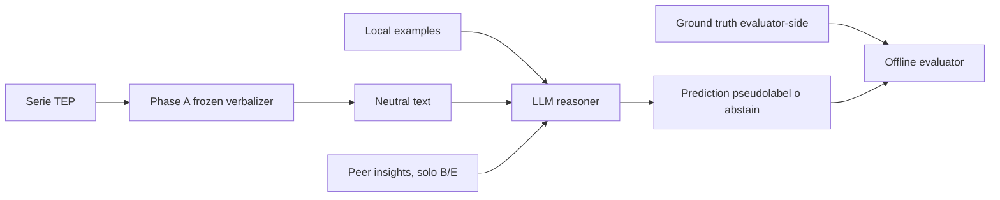

Phase A è **representation**; Phase B è **reasoning + federation**. La fonte
normativa è `phase_b/PHASE_B_PROTOCOL_FREEZE.md`.

### Problemi incontrati e decisioni

Se feature o renderer fossero cambiati durante Phase B, un miglioramento avrebbe
potuto dipendere dalla rappresentazione. Gli hash Phase A furono quindi
ricontrollati a ogni boundary.

### Risultato ottenuto

Un esperimento appaiato: lo stesso agent-case riceve lo stesso neutral text e
local knowledge, variando soltanto il blocco di peer insight fra A/B/E.

### Collegamento con l'obiettivo finale

È la struttura concettuale desiderata per PV: siti producono evidenza neutrale,
generano conoscenza locale ed esportano solo insight.

### Domande e risposte

**D: Perché non misurare FoT già nella Phase A?**  
R: Phase A non ha agenti non-IID né insight peer; verifica solo la qualità
strutturale del linguaggio che alimenta l'esperimento FoT.

**D: Un errore Phase B può dipendere dal verbalizer?**  
R: Sì. Il freeze impedisce di nasconderlo con tuning e la storia di F8 è un
caveat esplicito.

**D: Il LLM conosce i numeri raw?**  
R: No nel protocollo diagnostico. Riceve neutral text e conoscenza prompt-facing,
non XMEAS raw né JSON numerico strutturato.

---

<a id="s16"></a>
# 16. Pseudolabel e protezione dalla prior knowledge

### Introduzione

Un LLM può conoscere che “TEP F1” corrisponde a un certo disturbo. Lasciare i
nomi reali nel prompt avrebbe confuso prior knowledge e conoscenza federata.

### Obiettivo della fase

Nascondere l'identità semantica delle fault class durante diagnosis, mantenendo
una mappa stabile solo per l'evaluator.

### Come è stato raggiunto

La mappa in `phase_b/config/evaluator_side/pseudolabel_mapping.json` è:

| Fault reale (offline) | Pseudolabel opaca |
|---|---|
| F1 | `CLS-ZOGAA` |
| F8 | `CLS-OJNSG` |
| F10 | `CLS-R463B` |
| F13 | `CLS-Z3ISU` |

`Normal` resta `Normal`, perché è condiviso da tutti e rappresenta una classe
semantica necessaria. I token fault sono equal-length `CLS-` più cinque
caratteri; la mappa è evaluator-side-only.

### Problemi incontrati e decisioni

Pseudonimizzare il nome non cancella una firma eventualmente riconoscibile
dalla conoscenza enciclopedica del modello. Questo threat resta dichiarato in
`PHASE_B_EXPERIMENT_DESIGN_V2.md`; non viene presentato come anonimizzazione
perfetta.

### Risultato ottenuto

Prompt, insight e prediction usano solo pseudolabel valide. Leakage scanner e
guard verificano che fault ID e mapping non entrino nel contesto diagnostico.

### Collegamento con l'obiettivo finale

Nel PV pseudolabel o identificatori neutrali potrebbero ridurre leakage di
nomi-sito/evento, ma privacy e re-identification richiederebbero uno studio
separato.

### Domande e risposte

**D: Perché pubblicare qui la mappa se era evaluator-side?**  
R: Questa è documentazione post-evaluation; la restrizione vale per i prompt e
l'esecuzione frozen, non per la riproducibilità scientifica successiva.

**D: Perché non pseudonimizzare Normal?**  
R: Normal è conoscenza locale condivisa e una risposta semanticamente distinta;
il rischio principale era il mapping dei quattro fault benchmark-specifici.

**D: Le pseudolabel cambiano fra agenti?**  
R: No. La stessa classe reale ha lo stesso token in tutto il protocollo; solo la
condizione E altera intenzionalmente l'associazione label-insight nel prompt.

---

<a id="s17"></a>
# 17. Topologia non-IID dei quattro agenti

### Introduzione

La FoT ha senso solo se i nodi possiedono conoscenze diverse. Qui l'eterogeneità
è costruita in modo semplice e controllabile.

### Obiettivo della fase

Far sì che ogni agente conosca Normal e una sola pseudoclasse fault, lasciando
le altre tre realmente unseen localmente.

### Come è stato raggiunto

| Agente | Conoscenza locale | Classi unseen locali |
|---|---|---|
| `agent_1` | Normal + `CLS-ZOGAA` (F1 offline) | `CLS-OJNSG`, `CLS-R463B`, `CLS-Z3ISU` |
| `agent_2` | Normal + `CLS-OJNSG` (F8 offline) | `CLS-ZOGAA`, `CLS-R463B`, `CLS-Z3ISU` |
| `agent_3` | Normal + `CLS-R463B` (F10 offline) | `CLS-ZOGAA`, `CLS-OJNSG`, `CLS-Z3ISU` |
| `agent_4` | Normal + `CLS-Z3ISU` (F13 offline) | `CLS-ZOGAA`, `CLS-OJNSG`, `CLS-R463B` |

La topologia è congelata in
`phase_b/config/phase_b_protocol_frozen.json`.

### Problemi incontrati e decisioni

Non-IID qui significa non-IID della **conoscenza supervisionata locale**, non
una simulazione completa di tutte le eterogeneità operative possibili. Ogni
agente ha esattamente una fault class per mantenere leggibile il contrasto.

### Risultato ottenuto

Per ciascuno dei 12 run fault finali, tre agenti lo vedono come unseen e uno
come local-seen. Si ottengono 36 osservazioni agent-case unseen appaiate, ma
solo 12 cluster fisici.

### Collegamento con l'obiettivo finale

I siti PV potrebbero possedere eventi diversi; la topologia TEP mostra il
meccanismo in forma minimale, non pretende di riprodurre la frequenza reale.

### Domande e risposte

**D: Ogni agente è un LLM diverso?**  
R: No. È lo stesso modello e configurazione, con diverso local knowledge e
diversa libreria peer. “Agente” indica il ruolo informativo.

**D: Perché tutti conoscono Normal?**  
R: Serve una base comune per distinguere comportamento nominale; la domanda FoT
riguarda il trasferimento delle fault class mancanti.

**D: Le 36 osservazioni unseen sono indipendenti?**  
R: No. Tre agenti giudicano lo stesso physical run; per questo il bootstrap le
mantiene insieme per `physical_case_id`.

---

<a id="s18"></a>
# 18. Local knowledge

### Introduzione

Ogni agente necessita esempi della propria classe e di Normal, ma la selezione
non deve essere adattata ai risultati held-out.

### Obiettivo della fase

Costruire few-shot locali piccoli, deterministici e separati dalla base più
ampia usata per generare insight.

### Come è stato raggiunto

Gli esempi diagnostici sono esattamente fault batch 1–2 e Normal N1–N2, due per
classe locale, selezionati in ordine numerico senza cherry-picking. Sono neutral
text generati dal V2 e salvati in
`phase_b/local_knowledge/local_examples.json`. Per generare gli insight si usa
invece tutta l'evidenza development batch 1–5.

### Problemi incontrati e decisioni

Usare tutti e cinque i batch come few-shot avrebbe allungato il prompt e reso
meno netto il ruolo dell'insight. Scegliere “i due migliori” avrebbe introdotto
selezione adattiva. La regola “primi due” fu congelata prima del test.

### Risultato ottenuto

Ogni agente può diagnosticare la propria fault class local-seen e Normal anche
in A; non riceve esempi diretti delle tre unseen.

### Collegamento con l'obiettivo finale

Nel PV la quantità di local knowledge varierà fra siti; il principio di
selezione dichiarata e provenance resta essenziale.

### Domande e risposte

**D: Insight generation e local few-shot usano gli stessi dati?**  
R: Si sovrappongono nel development ma hanno scope diverso: insight su 1–5,
few-shot diagnostico fisso su 1–2. Nessuno usa validation o held-out finale.

**D: Perché due esempi?**  
R: È una scelta minimale frozen che limita costo e prompt volume; non è una
stima ottimizzata della quantità ideale.

**D: Le true fault label appaiono nei local examples?**  
R: No nei materiali prompt-facing. Gli esempi sono associati a pseudolabel
opache e Normal.

---

<a id="s19"></a>
# 19. Generazione degli insight

### Introduzione

La prototype library non doveva essere scritta a mano dal ricercatore: doveva
emergere dalla conoscenza locale.

### Obiettivo della fase

Generare una quantità fissa di insight per agente con stessa pipeline LLM,
provenance completa e nessuna selezione contenutistica.

### Come è stato raggiunto

Ogni agente ha fornito al prompt `phase_b/prompts/insight_generation.txt`
l'evidenza dei cinque batch development della propria fault pseudoclasse. La
prima risposta strutturalmente valida vince; si conservano due insight per
fault, otto totali. Tutti i quattro agenti hanno richiesto un solo attempt e
zero retry, come registra
`phase_b/insights/FINAL_INSIGHT_GENERATION_REPORT.md`.

Il contenuto include `insight_id`, `source_agent`, `pseudolabel`, osservazione e
scope di evidenza label-neutral; provenance e hash sono salvati in
`phase_b/insights/final_local_insights.json` e
`phase_b/insights/final_insight_hashes.json`.

### Problemi incontrati e decisioni

Ranking, merge, deduplica semantica o rigenerazione perché un insight “sembra
migliore” avrebbero inserito il ricercatore nel meccanismo. Furono esclusi; i
retry sono solo strutturali.

### Risultato ottenuto

Una libreria definitiva di otto insight, due per pseudoclasse, generata prima
del held-out e con leakage audit PASS.

### Collegamento con l'obiettivo finale

Questo è il cuore riutilizzabile per PV: un sito trasforma esempi locali in
conoscenza testuale scambiabile senza inviare le serie originali.

### Domande e risposte

**D: “First valid wins” garantisce il miglior insight?**  
R: No, e intenzionalmente non lo cerca. Garantisce che la selezione non reagisca
alla performance finale; qualità media e robustezza richiedono studi futuri.

**D: Il ricercatore ha editato gli insight?**  
R: No. Il report frozen esclude selezione umana, ranking, merge, deduplica ed
editing.

**D: Perché due insight per fault?**  
R: Quantità fissa e piccola riduce effetto-volume e costo, mantenendo più di una
osservazione; è parte del protocollo, non un optimum universale.

---

<a id="s20"></a>
# 20. Federation over Text nella Phase B

### Introduzione

Federare significa rendere disponibili ai peer gli insight generati localmente,
non condividere esempi raw né parametri.

### Obiettivo della fase

Consentire a ciascun agente di ottenere conoscenza sulle tre classi che non ha
mai visto localmente, preservando la separazione peer-only.

### Come è stato raggiunto

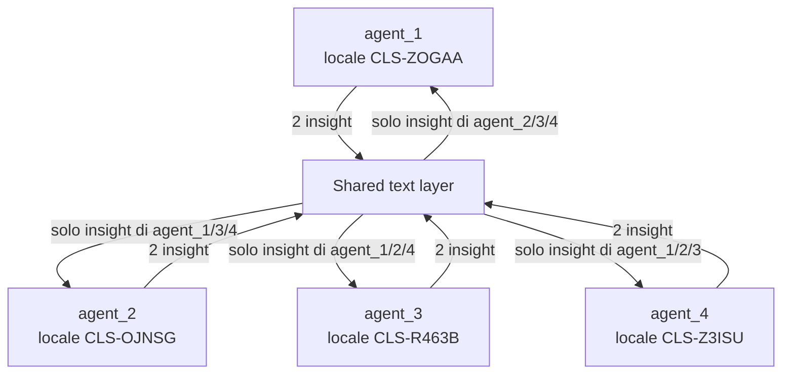

Ogni libreria B contiene sei insight: due da ciascuno dei tre peer. Self insight
e Normal insight sono esclusi. Le librerie sono in
`phase_b/insights/peer_libraries/`.

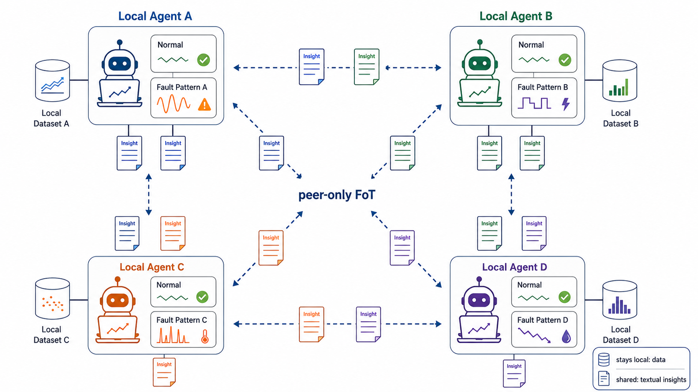

**Figura 3 — Topologia peer-only della Federation over Text.**
Ogni agente deriva conoscenza dal proprio dataset locale e conserva localmente
le serie originali. Fra peer circolano soltanto insight testuali identificabili,
non dati grezzi, gradienti o pesi di modello.

**Da ricordare:** Viaggia la conoscenza testuale, non il dato grezzo.

### Problemi incontrati e decisioni

Includere self insight avrebbe mescolato consolidamento locale e trasferimento;
includere Normal avrebbe aggiunto testo su conoscenza già condivisa. Entrambi
furono esclusi prima del freeze.

### Risultato ottenuto

Il canale federato è un insieme deterministico di testi con ID, sorgente e
scope, non una “memoria globale” indistinta.

### Collegamento con l'obiettivo finale

La topologia può essere estesa a siti PV, ma policy di accesso, trust,
aggiornamento e privacy degli insight sono future work.

### Domande e risposte

**D: Un agente riceve mai il proprio insight?**  
R: No nel protocollo frozen. La libreria è filtrata peer-only per costruzione e
testata.

**D: Gli insight contengono dati raw?**  
R: No: sono sintesi testuali da evidenza development. La loro privacy effettiva
non è però stata formalmente misurata.

**D: Perché chiamarla “federation” se non c'è training distribuito?**  
R: Perché conoscenza prodotta localmente viene condivisa fra nodi senza
centralizzare i dati; l'oggetto federato è testo anziché gradiente.

---

<a id="s21"></a>
# 21. Condizioni A, B ed E

### Introduzione

Un miglioramento con più testo potrebbe derivare da informazione corretta,
volume, attenzione o semplice suggerimento di label. Servono condizioni che
distinguano queste spiegazioni.

### Obiettivo della fase

Confrontare isolamento, FoT genuina e controllo corrotto mantenendo invariato
tutto il resto.

### Come è stato raggiunto

| Condizione | Peer block | Significato |
|---|---|---|
| A — isolated | assente | local examples soltanto |
| B — FoT | sei insight peer genuini | informazione firma→pseudolabel corretta |
| E — corrupted | gli stessi sei insight | solo associazione `pseudolabel` deranged |

In E pattern osservati, `insight_id`, ordine, sorgente, scope e lunghezza restano
uguali a B; la permutazione per agente ha zero fixed point. La strong normalized
invariance e l'equivalenza carattere sono verificate in
`phase_b/insights/FINAL_INSIGHT_GENERATION_REPORT.md`. Nel dry-run B/E avevano
anche 1850/1850 input token provider-side, differenza zero
(`phase_b/reports/LLM_CAPABILITY_PROBE.md`).

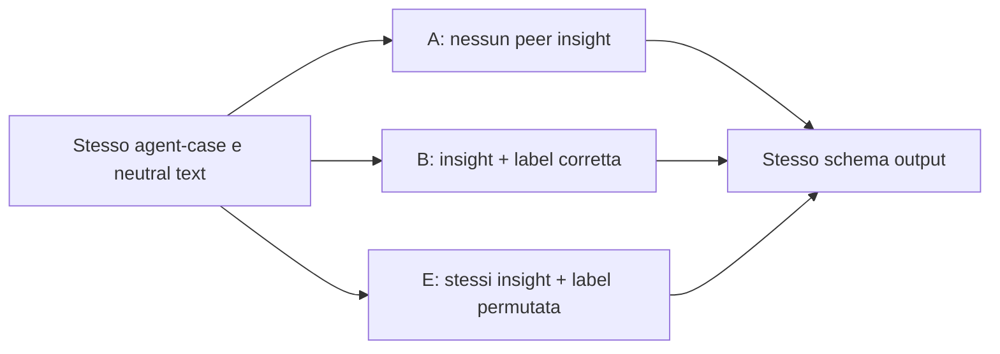

### Problemi incontrati e decisioni

Una condition D con insight casuali/irrilevanti fu discussa storicamente ma
declassata. A/B/E è il protocollo finale minimale. E non è una seconda primary:
è controllo pre-registrato di specificità/meccanismo.

### Risultato ottenuto

Il contrasto B−A misura il beneficio primario della presenza di FoT rispetto
all'isolamento; B−E testa se conta la correttezza dell'associazione e non il solo
volume di testo.

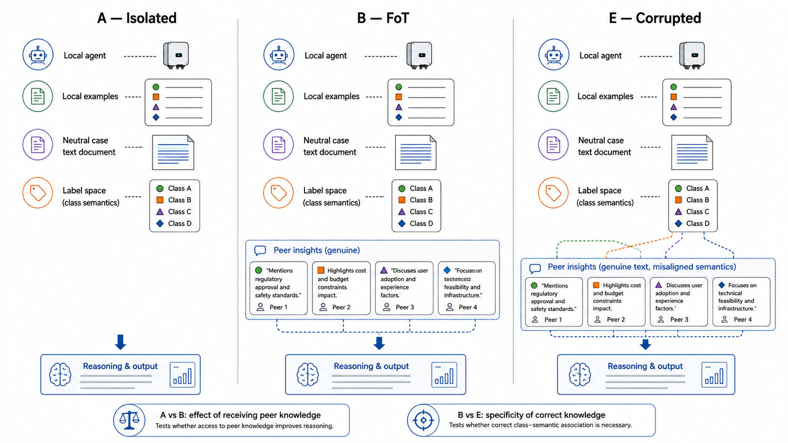

**Figura 4 — Condizioni sperimentali A, B ed E.**
A conserva soltanto conoscenza locale; B aggiunge insight peer genuini; E usa
un blocco matched a B ma con associazione pseudolabel–semantica corrotta. Il
confronto B−E controlla la specificità dell'informazione corretta senza
sostituire la primary B−A.

**Da ricordare:** B−A misura il guadagno rispetto all'isolamento; B−E verifica la specificità dell'informazione corretta.

### Collegamento con l'obiettivo finale

Nel PV controlli corrotti o placebo saranno necessari per distinguere vero
trasferimento da generic prompting effects.

### Domande e risposte

**D: Perché E è necessario se esiste già A?**  
R: A differisce da B anche per quantità di testo. E mantiene lo stesso contenuto
osservativo e volume, ma rompe il mapping; rende l'interpretazione più specifica.

**D: B−E è la metrica primaria?**  
R: No. È un contrasto di specificità pre-registrato. La primary resta B−A; i due
ruoli sono distinti e complementari.

**D: E è identica a B byte-per-byte?**  
R: Non nell'intero prompt, perché le pseudolabel devono cambiare. È invariata in
tutti gli altri campi normalizzati e nella lunghezza, come richiesto.

---

<a id="s22"></a>
# 22. Output diagnostico e abstention

### Introduzione

L'LLM deve produrre un record parsabile e semanticamente coerente, non testo
libero difficile da valutare.

### Obiettivo della fase

Vincolare prediction, astensione, uso degli insight e breve motivazione in uno
schema verificabile.

### Come è stato raggiunto

L'output contiene obbligatoriamente:

```json
{
  "predicted_label": "CLS-XXXXX oppure null",
  "abstain": false,
  "used_insight_ids": [],
  "reasoning_summary": "testo breve"
}
```

Lo schema locale `phase_b/conditions/diagnostic_output.schema.json` impone:
`abstain=false` → label valida; `abstain=true` → label null; ID insight unici e
prompt-visible. Il provider OpenAI non accettava `allOf/if/then/else` e
`uniqueItems`; lo schema strict provider-side separato rimuove solo questi
keyword, mentre `phase_b/conditions/parser.py` conserva tutti i vincoli locali.

### Problemi incontrati e decisioni

La compatibilità provider non fu risolta indebolendo la semantica locale. Ogni
retry è ammesso solo per errore strutturale, massimo due; non si rigenera perché
la prediction sembra sbagliata. Nello scoring primary, **abstention = incorrect**.

### Risultato ottenuto

Strict Structured Outputs è rimasto attivo con `gpt-5.6-terra`, reasoning
`medium`, temperature e seed `null`; token accounting proviene da
`response.usage`. Il capability record è
`phase_b/config/execution_config.json`.

### Collegamento con l'obiettivo finale

Un sistema PV operativo avrebbe bisogno di schema, provenance e astensione;
politica di costo/rischio dell'astensione dovrebbe però essere definita per il
dominio, non copiata dal PoC.

### Domande e risposte

**D: Perché l'astensione conta come errore?**  
R: È la regola pre-frozen della primary accuracy: il task richiede una diagnosi.
Analizzarla epistemicamente è utile, ma non modifica il punteggio.

**D: `used_insight_ids=[]` è valido in B/E?**  
R: Sì. Il modello può non dichiarare insight usati; se ne dichiara, devono essere
nel prompt e senza duplicati.

**D: Lo schema provider-side è la fonte autoritativa?**  
R: No. È un adattamento API più debole sui vincoli condizionali; parser e
validator locale restano autoritativi.

---

<a id="s23"></a>
# 23. R=3 e aggregazione

### Introduzione

Il provider non esponeva temperature o seed per questa configurazione; una
singola risposta non avrebbe rappresentato la stabilità stocastica del LLM.

### Obiettivo della fase

Ripetere ogni identico input tre volte e ottenere un esito agent-case-condition
con una regola deterministica congelata.

### Come è stato raggiunto

Per ogni cella sono richieste esattamente repetition 1, 2 e 3 con lo stesso
input hash. Una pseudolabel valida che riceve almeno due voti vince; senza
maggioranza di label valida, l'aggregato astiene.

| Tre output | Aggregato |
|---|---|
| X, X, Y | X |
| X, X, ABSTAIN | X |
| X, Y, Z | ABSTAIN |
| X, Y, ABSTAIN | ABSTAIN |
| ABSTAIN, ABSTAIN, X | ABSTAIN |

Le regole sono in `phase_b/evaluation/aggregation.py` e nel protocol freeze.

### Problemi incontrati e decisioni

R=3 mitiga ma non elimina stochasticity. Le tre chiamate non sono conteggiate
come tre casi fisici. L'aggregazione non fu ricalcolata durante evaluation: si
usarono i 180 aggregate record già frozen.

### Risultato ottenuto

540 repetition record diventano 180 aggregate outcome: 15 casi × 4 agenti × 3
condizioni.

### Collegamento con l'obiettivo finale

In PV R e regola di aggregazione potranno dipendere da costo e rischio; dovranno
comunque essere fissati prima del test.

### Domande e risposte

**D: Perché non majority fra label e ABSTAIN come categorie simmetriche?**  
R: La regola frozen richiede una majority di pseudolabel valida; in assenza,
astiene. Gli esempi sopra rendono il comportamento esplicito.

**D: Tre repliche eliminano il caso?**  
R: No. Un modello può ancora produrre tre label diverse o due risposte errate
uguali; R=3 misura e aggrega, non garantisce correttezza.

**D: Si può aumentare R dopo aver visto i risultati?**  
R: Non senza un nuovo protocollo. Aumentarlo selettivamente altererebbe costo e
probabilità di maggioranza.

---

<a id="s24"></a>
# 24. Bootstrap e unità statistica

### Introduzione

La struttura multi-agente moltiplica le righe, ma non i processi fisici
simulati. Una statistica che trattasse tutte le righe come indipendenti sarebbe
troppo ottimista.

### Obiettivo della fase

Costruire intervalli appaiati che rispettino i 12 physical fault-run e le
quattro classi.

### Come è stato raggiunto

Ci sono 4 fault × 3 run = 12 cluster fisici. Ogni run è unseen per tre agenti,
quindi 36 agent-case observations per condizione. Il bootstrap frozen esegue
10000 draw, seed `20260829`; dentro ognuna delle quattro pseudoclassi ricampiona
i tre `physical_case_id` con rimpiazzo e mantiene insieme le tre righe-agent del
run selezionato.

**ESEMPIO DIDATTICO.** Se in una classe esistono run A, B, C e un draw estrae
B, B, A, entrano due copie dell'intero cluster B (tutti i tre agenti unseen) e
una di A. Non si estrae separatamente “agent_2 su B” da “agent_4 su B”.

### Problemi incontrati e decisioni

Con soli tre run per strato l'intervallo bootstrap non elimina l'incertezza
piccolo-campione. Il report dichiara `independence_claim=false` e non trasforma
36 in un n fisico indipendente.

### Risultato ottenuto

Il bootstrap paired/clustered produce CI coerenti con il design e preserva
l'appaiamento A/B/E sullo stesso agent-case. Implementazione:
`phase_b/evaluation/bootstrap.py`; output:
`phase_b/final_evaluation/bootstrap_results.json`.

### Collegamento con l'obiettivo finale

In PV l'unità potrebbe essere sito, inverter o evento; definirla prima di
contare finestre o agenti sarà decisivo.

### Domande e risposte

**D: “36 osservazioni” significa n=36?**  
R: È il denominatore delle accuracy unseen per condizione, ma l'indipendenza
fisica è n=12 cluster; tre righe condividono lo stesso run.

**D: Perché stratificare per pseudoclasse?**  
R: Mantiene quattro strati × tre run e impedisce che un draw cambi
accidentalmente la composizione per classe.

**D: Il bootstrap prova generalizzazione universale?**  
R: No. Quantifica variabilità interna a questo piccolo design; non copre nuovi
fault, mode, simulatori, modelli o PV.

---

<a id="s25"></a>
# 25. Freeze chain della Phase B

### Introduzione

Il progetto usa più freeze perché dati, protocollo, ordine, prediction e
risultati diventano conoscibili in momenti differenti.

### Obiettivo della fase

Impedire che informazioni a valle modifichino decisioni a monte e rendere ogni
boundary verificabile.

### Come è stato raggiunto

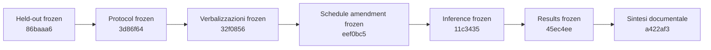

| Boundary | Commit completo | Tag |
|---|---|---|
| Held-out | `86baaa65e72cea22ecb89dd0e7b213aea5a1284b` | `phase-b-heldout-frozen` |
| Protocollo | `3d86f64d43e14e7e0de520cb047ca1043bf9c1c0` | `phase-b-protocol-frozen` |
| Verbalizzazioni | `32f0856040614870d3784a4811e76cee0eee77e3` | — |
| Schedule | `eef0bc58e5ab14fb0cd2aece180fb5b1b5a7962b` | `phase-b-execution-schedule-frozen` |
| Prediction | `11c34358e28e875cd5c7249061ac2b89ffcd42f4` | `phase-b-inference-frozen` |
| Risultati | `45ec4eed65b263a5803ced7d01064c4672e81e86` | `phase-b-results-frozen` |

### Problemi incontrati e decisioni

Il protocol tag storico resta al commit originale anche dopo l'amendment: lo
schedule ha un proprio tag, preservando la cronologia invece di spostare il
freeze precedente.

### Risultato ottenuto

Prediction e ground truth evaluation hanno un confine formale. La sintesi
post-results non sposta `phase-b-results-frozen`.

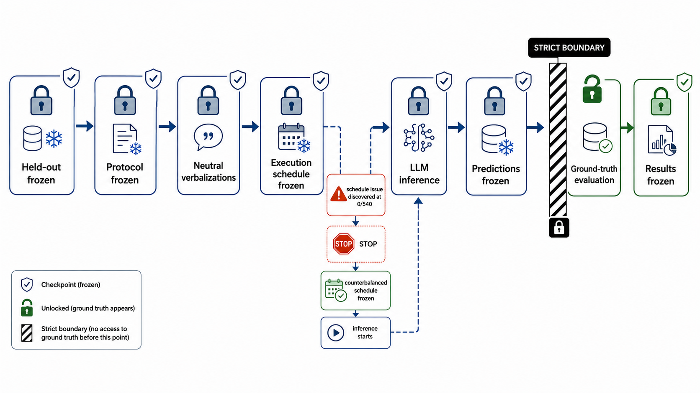

**Figura 5 — Catena di integrità sperimentale.**
Held-out, protocollo, verbalizzazioni e schedule vengono fissati prima
dell'inference; le prediction sono poi congelate dietro una boundary esplicita.
La ground-truth evaluation avviene soltanto oltre quel confine e precede il
freeze dei risultati.

**Da ricordare:** Prima si congela la decisione o la prediction; solo dopo si osserva ciò che potrebbe influenzarla.

### Collegamento con l'obiettivo finale

Questa catena è un template forte per PV: data freeze, analysis freeze,
inference freeze e results freeze devono restare distinguibili.

### Domande e risposte

**D: Perché non basta un solo tag finale?**  
R: Un tag finale non mostra se prompt e metriche fossero decisi prima di vedere
prediction o ground truth. I confini intermedi rendono verificabile l'ordine.

**D: Lo schedule amendment invalida il protocol freeze?**  
R: No: aggiunge una sottospecifica a 0/540 inference senza cambiare condizioni,
prompt o metriche, e viene congelato separatamente.

**D: La sintesi finale è nel results freeze?**  
R: No. È un commit documentale post-results; il tag risultati continua a
puntare al commit scientifico `45ec4eed...`.

---

<a id="s26"></a>
# 26. Perché fu necessario l'amendment dello schedule

### Introduzione

Il protocollo fissava 540 chiamate ma non l'ordine temporale A/B/E. Anche
chiamate stateless possono essere esposte a drift del provider o effetti di
posizione temporale.

### Obiettivo della fase

Eliminare la sottospecifica prima di osservare una sola prediction diagnostica.

### Come è stato raggiunto

Al commit di decisione le inference erano 0/540 e le verbalizzazioni erano già
frozen. L'amendment `phase_b/PHASE_B_PROTOCOL_AMENDMENT_001.md` definisce 180
blocchi `physical_case_id × agent_id × repetition`, iterati in ordine esplicito.
Dentro il blocco, `block_index mod 3` assegna:

- 0 → A, B, E;
- 1 → B, E, A;
- 2 → E, A, B.

Risultato: ogni condizione compare 60 volte in ciascuna posizione globale e 15
volte per posizione per agente. Ogni call è stateless, con prompt completo,
`store=false` e senza `previous_response_id`.

### Problemi incontrati e decisioni

Lasciare l'ordine al filesystem, a un dict o a una scelta runtime avrebbe reso
la riproduzione ambigua. Non fu usata randomizzazione: l'ordine è deterministico
e hashato.

### Risultato ottenuto

Schedule SHA-256
`d30cdf6a6c622c1653176b393114073b447fdde69729086f6399291d776c0c9b`, congelato
al tag `phase-b-execution-schedule-frozen`.

### Collegamento con l'obiettivo finale

La lezione generale è fermarsi quando emerge una sottospecifica, purché prima
di risultati: documentarla è più credibile che fingere fosse sempre prevista.

### Domande e risposte

**D: Perché l'ordine conta se le chiamate sono stateless?**  
R: Statelessness elimina contaminazione di conversazione, ma non possibili
variazioni temporali del servizio; counterbalancing distribuisce tali effetti.

**D: L'amendment fu scelto dopo aver visto output?**  
R: No. Il documento registra 0/540 inference, zero prediction e zero metrica al
momento della decisione.

**D: Il counterbalancing rende il provider deterministico?**  
R: No. Bilancia la posizione; R=3 e aggregazione gestiscono parte della
stochasticity residua.

---

<a id="s27"></a>
# 27. Esecuzione delle 540 inference

### Introduzione

Dopo tutti i freeze poteva iniziare l'unica fase di inference finale.

### Obiettivo della fase

Eseguire la matrice completa senza missing, duplicati, state carry-over o uso
di ground truth.

### Come è stato raggiunto

**ESEMPIO NUMERICO REALE:** `15 casi × 4 agenti × 3 condizioni × R=3 = 540`.
`phase_b/final_evaluation/run_frozen_inference.py` segue lo schedule, salva raw
attempt, repetition record, prompt/input hash, response ID, modello e token,
supporta resume e verifica provenance.

`phase_b/final_evaluation/inference/execution_metadata.json` registra:

| Voce | Valore frozen |
|---|---:|
| Repetition completate | 540/540 |
| A/B/E | 180/180/180 |
| Aggregate outcome | 180/180 |
| Provider attempt | 541 |
| Structural retry | 1, in E |
| Provider/network failure | 0 |
| Final parse failure | 0 |
| Input token cumulativi | 1,121,799 |
| Output token cumulativi | 85,347 |
| Total token cumulativi | 1,207,146 |

### Problemi incontrati e decisioni

Una sola risposta E richiese structural retry; non fu interpretata e non
innescò prompt tuning. Non ci furono retry di rete. Temperature e seed restano
null perché provider-unsupported; requested/returned model è
`gpt-5.6-terra`, reasoning medium.

### Risultato ottenuto

Schedule adherence, statelessness, leakage, provenance, token accounting e
inference hash manifest risultarono PASS. Le prediction furono congelate prima
del join ground truth.

### Collegamento con l'obiettivo finale

La tracciabilità per-call è necessaria anche in PV, dove provider drift, costo e
resumability possono influenzare grandi campagne.

### Domande e risposte

**D: 541 provider attempt significa 541 prediction finali?**  
R: No. Sono 540 repetition valide più un retry strutturale; l'attempt invalido
non crea una quarta replica scientifica.

**D: La vera classe era nel prompt?**  
R: No. `ground_truth_joined=false` e `metrics_calculated=false` sono registrati
nel metadata inference frozen.

**D: Perché conservare token accounting?**  
R: Per audit di costo e comparabilità delle condizioni; non è usato come
metrica diagnostica.

---

<a id="s28"></a>
# 28. Freeze delle prediction

### Introduzione

Calcolare correctness rende visibile il ground truth. Prima di farlo bisognava
rendere immutabili le risposte del modello.

### Obiettivo della fase

Creare un confine formale fra **frozen predictions** e **ground-truth
evaluation**.

### Come è stato raggiunto

Il commit `11c34358e28e875cd5c7249061ac2b89ffcd42f4` contiene repetition records,
aggregate records, metadata e hash manifest già verificati. Il tag annotato
`phase-b-inference-frozen` punta esattamente a quel commit.

### Problemi incontrati e decisioni

Nessuna accuracy, Delta, helped/harmed, confusion matrix o bootstrap fu
calcolata prima del tag. Ciò impedisce di modificare parsing, aggregazione o
prediction sulla base della correttezza.

### Risultato ottenuto

Un evaluator offline può essere rieseguito sulle prediction immutabili; ogni
risultato è riconducibile all'hash di
`phase_b/final_evaluation/inference/aggregate_records.jsonl`.

### Collegamento con l'obiettivo finale

Per PV la stessa separazione evita “correzioni manuali” dopo aver scoperto
quali eventi erano veri.

### Domande e risposte

**D: Le prediction sono state congelate dopo l'accuracy?**  
R: No. Il freeze precede esplicitamente il ground-truth join.

**D: Perché congelare anche i repetition record se si valuta l'aggregato?**  
R: Servono a verificare aggregazione, retry e stochasticity senza ricalcolare la
primary da output selezionati.

**D: Si può correggere un parse error dopo il freeze?**  
R: Non senza nuova versione/protocollo. In questo esperimento i final parse
failure erano zero.

---

<a id="s29"></a>
# 29. Evaluation offline

### Introduzione

Solo dopo l'inference freeze il ground truth offline può essere unito alle
prediction aggregate.

### Obiettivo della fase

Calcolare la primary unseen, controlli secondari, transfer counts e intervalli
bootstrap senza nuove API call né ricomputazione dell'aggregazione.

### Come è stato raggiunto

`phase_b/final_evaluation/evaluate_frozen_predictions.py` legge i 180 aggregate
record frozen e la mappa evaluator-side. Le categorie sono:

- unseen: 36 agent-case per condizione;
- local-fault-seen: 12 per condizione;
- Normal: 12 per condizione;
- overall: 60 per condizione.

La primary è `Delta_unseen = accuracy_B_unseen - accuracy_A_unseen`. Il
contrasto E produce `Delta_E=E−A` e `Delta_specificity=B−E`. Abstention resta
incorrect.

### Problemi incontrati e decisioni

“Overall” mescola Normal, local-seen e unseen e non è la primary. Le confusion
matrix complete sono secondarie. Helped/harmed è paired B vs A, non una
metrica indipendente di safety.

### Risultato ottenuto

180/180 aggregate joinati in modo univoco, integrity checks PASS. Risultati in
`phase_b/final_evaluation/evaluation_results.json` e report leggibile in
`phase_b/final_evaluation/EVALUATION_REPORT.md`.

### Collegamento con l'obiettivo finale

Una futura evaluation PV dovrà stabilire prima quali casi sono unseen, quali
sono local-seen e quale unità fisica determina l'incertezza.

### Domande e risposte

**D: Perché non usare la correctness per scegliere gli insight migliori?**  
R: Sarebbe leakage dal test. Gli insight erano già frozen e non sono stati
selezionati o editati dopo il join.

**D: L'overall 91,67% è la risposta alla domanda scientifica?**  
R: No. La domanda primaria riguarda classi localmente unseen; overall include
casi facili condivisi e va riportato solo come secondario.

**D: L'evaluator richiama il LLM?**  
R: No. È codice deterministico offline sui record frozen.

---

<a id="s30"></a>
# 30. Risultati finali

### Introduzione

Questa sezione riporta esclusivamente numeri frozen al commit risultati
`45ec4eed65b263a5803ced7d01064c4672e81e86`.

### Obiettivo della fase

Presentare primary, specificità, stabilità per agente, preservation e
incertezza senza estendere la claim.

### Come è stato raggiunto

#### Primary unseen e specificità

| Condizione | Correct/n | Accuracy | Abstention |
|---|---:|---:|---:|
| A — isolated | 0/36 | 0.0000 | 14/36 |
| B — FoT | 31/36 | 0.8611 | 0/36 |
| E — corrupted | 3/36 | 0.0833 | 0/36 |

- **B−A = +0.861111111111**: metrica primaria pre-registrata.
- E−A = +0.0833333333333.
- **B−E = +0.777777777778**: contrasto pre-registrato di specificità.
- Helped 31, harmed 0, unchanged 5 (0 correct, 5 incorrect).

#### Per agente, unseen

| Agente | n | A | B | E | B−A |
|---|---:|---:|---:|---:|---:|
| agent_1 | 9 | 0.0000 | 1.0000 | 0.0000 | +1.0000 |
| agent_2 | 9 | 0.0000 | 1.0000 | 0.0000 | +1.0000 |
| agent_3 | 9 | 0.0000 | 0.6667 | 0.2222 | +0.6667 |
| agent_4 | 9 | 0.0000 | 0.7778 | 0.1111 | +0.7778 |

#### Secondary preservation e overall

| Scope | A | B | E |
|---|---:|---:|---:|
| Local fault seen | 12/12 | 12/12 | 12/12 |
| Normal | 12/12 | 12/12 | 12/12 |
| Overall | 24/60 (40.00%) | 55/60 (91.67%) | 27/60 (45.00%) |

Overall abstention: A 14/60=23.33%; B=E=0. Il cluster bootstrap frozen, 10000
draw, produce CI 95% B−A `[0.833333333333, 0.916666666667]` e B−E
`[0.722222222222, 0.833333333333]`.

### Problemi incontrati e decisioni

A è a floor sull'unseen; ciò rende grande B−A ma non la declassa. Il contrasto
B−E è interpretativamente più specifico del meccanismo ma non diventa primary.
Il piccolo numero di cluster impone prudenza.

### Risultato ottenuto

I criteri frozen C1–C4 e H2 risultano PASS: delta positivo, 4/4 agenti positivi,
helped>harmed, B−A>E−A, e local-seen B non peggiore di A con epsilon zero.

### Collegamento con l'obiettivo finale

Il PoC giustifica investire in un protocollo PV, non trasferire direttamente le
percentuali a impianti reali.

### Domande e risposte

**D: Posso dire “FoT migliora in generale di 86 punti”?**  
R: No. +0.8611 è la primary unseen di questo disegno con A a floor, non un
effetto universale né l'overall.

**D: Perché riportare local-seen e Normal?**  
R: Sono preservation/sanity evidence: mostrano che aggiungere insight non ha
rovinato questi subset nel campione osservato.

**D: Il CI bootstrap rende il campione grande?**  
R: No. Rispetta il clustering dei 12 run, ma resta condizionato a quattro fault,
tre run ciascuno e un solo LLM.

---

<a id="s31"></a>
# 31. Interpretazione corretta dei risultati

### Introduzione

Gli stessi numeri possono sostenere claim corrette o eccessive. La gerarchia
canonica è non negoziabile.

### Obiettivo della fase

Separare primary, controllo di specificità e analisi descrittive post-hoc.

### Come è stato raggiunto

La formulazione canonical di `FOT_TEP_POC_FINAL_SYNTHESIS.md` è:

1. **B−A = +0.861 è la metrica primaria pre-registrata.** Mostra il beneficio
   FoT sui casi localmente unseen rispetto all'agente isolato.
2. **B−E = +0.778 è il contrasto di specificità/meccanicistico
   pre-registrato.** Supporta l'interpretazione che il beneficio dipenda dalla
   correttezza dell'informazione trasferita, non dal solo volume di testo.
3. **B−E non è primary.** Ha un ruolo distinto e complementare.

Il floor A è descritto post-hoc senza ripunteggio e combina due comportamenti:
14/36 casi aggregate terminano in astensione (38,89%), mentre 22/36 ricevono
una label committed/non-abstained (61,11%); nessuna delle prediction committed
è corretta (0/22). In entrambi i comportamenti l'assenza di conoscenza
class-semantica è coerente con il risultato; abstention rimane incorrect nella
primary.

### Problemi incontrati e decisioni

`harmed=0` soddisfa formalmente C3, ma con A=0/36 nessun caso A-corretto può
essere peggiorato: non è evidenza indipendente di assenza generale di negative
transfer. La preservation evidence più pertinente è local-seen e Normal al
100% in A/B/E, ancora limitata al campione.

### Risultato ottenuto

La lettura prudente usa “supports the interpretation”, non “proves”. B−A
stabilisce il risultato primario nel protocollo; B−E ne rafforza la specificità
meccanicistica senza sostituirlo.

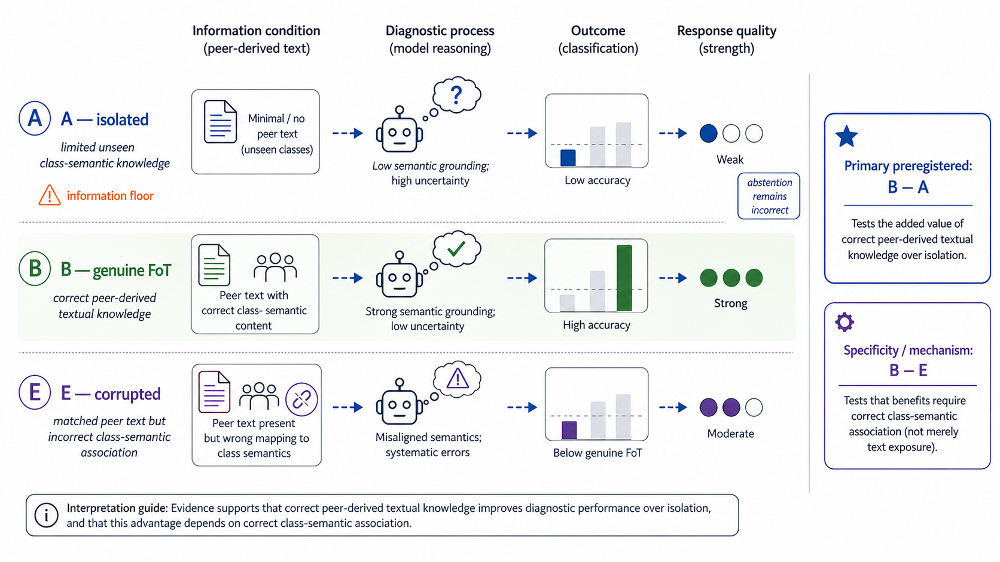

**Figura 6 — Gerarchia corretta dell'evidenza Phase B.**
A opera a un information floor sulle classi unseen e l'abstention resta
incorrect. B−A è la primary pre-registrata; B−E è il contrasto pre-registrato
di specificità e meccanismo, non una seconda primary.

**Da ricordare:** La magnitudine e il meccanismo sono due domande diverse.

### Collegamento con l'obiettivo finale

Per PV serviranno baseline non a floor e casi in cui A sia talvolta corretta per
valutare davvero negative transfer, oltre a controlli di specificità analoghi a E.

### Domande e risposte

**D: Il caveat sul floor annulla la primary?**  
R: No. Ne caratterizza la magnitudine: B−A resta la metrica pre-registrata e il
floor va sempre dichiarato nel contesto.

**D: Perché B−E è “più diagnostico” ma non primary?**  
R: Isola meglio la correttezza dell'informazione perché B/E hanno stesso volume;
il suo ruolo era però predefinito come specificity contrast, non come endpoint
primario.

**D: Harmed=0 dimostra sicurezza?**  
R: No. È aritmeticamente favorito da A=0/36 sull'unseen. Serve un disegno con
baseline sopra zero e più domini per una claim di no-negative-transfer.

---

<a id="s32"></a>
# 32. Cosa il PoC dimostra o supporta

### Introduzione

Una claim utile deve essere abbastanza forte da cogliere il contributo e
abbastanza delimitata da restare vera.

### Obiettivo della fase

Definire il nucleo positivo verificabile del proof-of-concept.

### Come è stato raggiunto

Nel design frozen, su 12 fault-run fisici TEP e quattro agenti non-IID:

- il layer numeri→testo neutrale è implementato, congelato e auditato fuori
  development;
- insight locali possono essere generati senza prototype library umana ex ante;
- FoT peer-only corretta porta B a 31/36 sui casi unseen contro 0/36 di A;
- il controllo E, uguale a B salvo pseudolabel, scende a 3/36;
- gli esiti local-seen e Normal restano 12/12 in tutte le condizioni osservate;
- freeze, hash, leakage guard e offline evaluation rendono la catena
  riproducibile dagli artefatti versionati.

Più precisamente, il proving ground TEP ha **de-risked**:

1. la fattibilità della conversione `time series → neutral text`;
2. la fattibilità del reasoning LLM sul neutral text;
3. la generazione locale degli insight;
4. il trasferimento testuale peer-only;
5. una valutazione resistente al leakage;
6. la pseudonimizzazione contro la prior knowledge esplicita;
7. la disciplina held-out e dei freeze;
8. il corrupted specificity control;
9. ripetizione stocastica e aggregazione;
10. statistiche consapevoli dei cluster fisici;
11. il failure mode di una baseline a floor;
12. la sottospecifica dell'execution schedule;
13. il prediction freeze prima della ground-truth evaluation.

Non ha invece de-risked il rumore reale PV, il comportamento nominale
non-stazionario, la qualità del ground truth PV, la separabilità delle classi
PV, l'eterogeneità sito/inverter o la generalizzazione empirica cross-domain.

### Problemi incontrati e decisioni

Il verbo più appropriato per il meccanismo è “supporta fortemente
l'interpretazione”, non “prova causalità universale”. Il controllo E è forte
entro il protocollo, ma firma riconoscibile e singolo modello restano threats.

### Risultato ottenuto

Il PoC fornisce evidenza positiva, delimitata e meccanicisticamente specifica
che testo con associazione corretta trasferisce conoscenza diagnostica utile in
questa topologia. Il risultato supera un feasibility gate metodologico; non è
una validazione del dominio fotovoltaico.

### Collegamento con l'obiettivo finale

È una base metodologica sufficiente per progettare il passo PV, non per saltare
la validazione PV.

### Domande e risposte

**D: Il progetto dimostra che gli insight sono migliori dei dati raw?**  
R: No. Non esiste un confronto centralizzato/raw-data nel protocollo.

**D: Dimostra che la neutralità è necessaria?**  
R: Mostra una pipeline funzionante e metodologicamente controllata; non confronta
sistematicamente renderer neutrale contro renderer interpretativo.

**D: Il risultato è solo software engineering?**  
R: No. Include un contrasto sperimentale pre-frozen e metriche su held-out; la
disciplina software è ciò che ne rende credibile l'interpretazione scientifica.

---

<a id="s33"></a>
# 33. Cosa il PoC non dimostra

### Introduzione

Esplicitare i non-risultati impedisce che una percentuale venga separata dal suo
denominatore e dal suo design.

### Obiettivo della fase

Delimitare generalizzazione, comparatori e sicurezza non testati.

### Come è stato raggiunto

Il PoC **non** dimostra:

- “accuracy generale 91,67%”: è overall secondaria e mescola subset;
- “+86 punti di beneficio generale”: +0.8611 è unseen e A è a floor;
- superiorità rispetto a modello centralizzato o federated learning classico;
- assenza generale di negative transfer;
- validità su dati PV reali;
- copertura generale dei 21 fault TEP, altri mode o processi;
- generalizzazione multi-LLM o multi-provider;
- privacy formale degli insight;
- causalità fisica delle feature verbalizzate;
- riproducibilità bitwise dei nuovi run simulatori.

I 12 physical fault run, un simulatore, un mode, quattro fault e un solo LLM
sono limiti reali della validità empirica del PoC, non dettagli irrilevanti. Il
ruolo assegnato a TEP era però il de-risking metodologico, non la dimostrazione
di generalizzazione cross-domain: questi limiti circoscrivono correttamente ciò
che il gate può sostenere.

### Problemi incontrati e decisioni

La tentazione di presentare B overall come performance generale o B−E come
primary fu corretta nella sintesi canonica. I limiti sono mantenuti come parte
del risultato, non relegati a nota marginale.

### Risultato ottenuto

La claim finale resta un proof-of-concept a piccola scala, un simulatore, un
mode, quattro fault, un modello LLM e 12 cluster fault fisici.

### Collegamento con l'obiettivo finale

Ogni punto non dimostrato suggerisce un asse futuro: PV, più siti/eventi,
baseline competente, più modelli, comparatori e privacy.

### Domande e risposte

**D: Posso confrontare 91,67% B con un paper TEP esterno?**  
R: Non direttamente: task, classi, topologia non-IID, pseudolabel, subset e unità
sono specifici. Servirebbe un protocollo comparabile.

**D: Perché quattro fault non bastano per “TEP fault diagnosis”?**  
R: TEP ha più fault e dinamiche; il subset fu scelto per il PoC iniziale. La
claim deve nominare F1/F8/F10/F13 o “quattro fault target”.

**D: L'assenza di leakage scanner findings prova privacy?**  
R: No. Lo scanner cerca leakage di label/protocollo definito, non misura
information leakage dai testi o attacchi di privacy.

---

<a id="s34"></a>
# 34. Problemi metodologici incontrati e lezioni apprese

### Introduzione

La qualità del progetto dipende dalle correzioni apportate prima dei risultati,
non dall'illusione di un percorso lineare.

### Obiettivo della fase

Trasformare incidenti e review in regole generali utili a chi progetta eval con
LLM e serie temporali.

### Come è stato raggiunto

| Problema | Rischio | Scoperta/decisione | Lezione generale |
|---|---|---|---|
| Prototipi V1 hard-coded | “trasferimento” regalato nel prompt | 5/5 declassato a sanity check; V2 label-blind | separare knowledge source da evaluator |
| Normal tautologico | baseline trattata come risposta ovvia | Normal diventa classe con evidenze locali possibili | non definire l'esito nella rappresentazione |
| std chiamata varianza/oscillazione | semantica numerica falsa | feature separate e vocabolario factual-first | una statistica non è un meccanismo |
| Threshold sui fault | overfit alle target class | solo N1–N5 LOO e freeze | calibrare prima del test |
| Post-onset consolidato | transiente scambiato per regime | otto finestre e fasi initial/late | preservare il tempo |
| Historical test già visto | test non untouched | nuovo held-out simulato | conoscenza del test è leakage anche senza tuning esplicito |
| Setpoint incompatibile | generazione non comparabile | audit parent `a0413e...` | ispezionare sorgente/commit, non working tree |
| Randomizzazione non registrata | replay bitwise impossibile | limite dichiarato; file bytes congelati | distinguere provenance da rigenerabilità |
| `xlswrite` macOS | CSV mascherato da XLSX | `writecell`+`writematrix`, ZIP check | verificare formato reale, non estensione |
| Prior knowledge TEP | LLM usa F1/F8 enciclopedici | pseudolabel opache evaluator-side | nascondere label, dichiarare firma residua |
| B/E non invarianti | effetto volume confondente | stessi ID/order/text, solo label deranged | costruire placebo meccanicistico |
| JSON Schema provider | schema strict rifiutato | derivazione separata, validator locale forte | non lasciare al provider l'unica semantica |
| Schedule sottospecificato | time/order confounding | stop a 0/540, counterbalancing frozen | correggere prima di osservare output |
| Floor A | delta grande sovrainterpretato | analisi 14 abstain, 22 committed, 0 correct | caratterizzare baseline senza cambiare primary |
| Abstention | ripunteggio post-hoc | resta incorrect | separare scoring da lettura epistemica |

### Problemi incontrati e decisioni

Una correzione è scientificamente legittima quando avviene prima della
boundary rilevante o viene dichiarata come post-hoc senza cambiare scoring. Lo
schedule amendment è il primo caso; la descrizione del floor A è il secondo.

### Risultato ottenuto

Il processo ha prodotto non solo un numero, ma una checklist: audit del dato,
neutralità, freeze, placebo specifico, unità fisica, prediction freeze e
ground-truth offline.

### Collegamento con l'obiettivo finale

Il trasferimento a PV deve iniziare da queste lezioni, non dalle soglie TEP.

### Domande e risposte

**D: Ammettere gli errori indebolisce il progetto?**  
R: No. Mostrare quando e come furono corretti rende verificabile che il risultato
non fu ottenuto nascondendo decisioni retrospettive.

**D: Qual è l'errore più pericoloso per un dottorando?**  
R: Lasciare che test o output influenzino in modo invisibile prompt, soglie o
unità statistiche; spesso appare come “piccola correzione tecnica”.

**D: Tutti i problemi sono risolti?**  
R: No. Alcuni sono mitigati (prior knowledge), altri documentati come limiti
(RNG, piccolo campione, singolo LLM). Risolvere non significa cancellare.

---

<a id="s35"></a>
# 35. Evoluzione della claim scientifica

### Introduzione

La claim è passata da una dimostrazione informale di classificazione a un
contrasto pre-frozen molto più circoscritto.

### Obiettivo della fase

Rendere esplicito come critica e freeze hanno cambiato ciò che era lecito dire.

### Come è stato raggiunto

| Stato storico | Interpretazione iniziale | Correzione | Stato canonico |
|---|---|---|---|
| V1 5/5 | il verbalizer/LLM riconosce i fault | prototipi già nel prompt | sanity check, non FoT validation |
| std elevata | oscillazione/varianza | step e drift la gonfiano | dispersione; feature separate |
| batch 8–10 | held-out disponibile | già ispezionato in Phase A | historical test, non final Phase B |
| A vs B | beneficio FoT | A a floor e volume diverso | B−A primary con caveat; E per specificità |
| harmed=0 | nessun negative transfer | A=0 non offre casi peggiorabili | criterio PASS, non safety proof |
| B−E forte | “vera primary” | ruolo pre-registrato distinto | specificity/mechanistic contrast, non primary |

### Problemi incontrati e decisioni

La sintesi fu corretta testualmente per usare “supporta fortemente
l'interpretazione” invece di “dimostra” e “supporta che il beneficio dipenda”
invece di “stabilisce”. I numeri e la gerarchia non cambiarono.

### Risultato ottenuto

Claim finale: in questo PoC, B−A primaria mostra trasferimento utile sulle
unseen; B−E pre-registrata supporta che l'utilità dipenda dall'informazione
correttamente associata, non dal volume.

### Collegamento con l'obiettivo finale

La roadmap PV dovrà preregistrare claim e comparatori senza assumere che la
stessa magnitudine o lo stesso floor si ripetano.

### Domande e risposte

**D: Cambiare una parola dopo i risultati è p-hacking?**  
R: Qui le correzioni delimitano l'interpretazione senza cambiare numeri,
scoring o endpoint; sono documentazione post-results, non tuning.

**D: Perché conservare documenti superseded?**  
R: Mostrano la cronologia e permettono di verificare che le decisioni finali non
fossero retrodatate.

**D: Qual è la frase canonica più importante?**  
R: B−A è primary preregistrata; B−E è specificity/mechanistic contrast
preregistrato e non primary.

---

<a id="s36"></a>
# 36. Repository map

### Introduzione

Questa è una sezione referenziale per orientarsi senza leggere file storici
nell'ordine sbagliato.

### Obiettivo della fase

Associare ogni artefatto a funzione, fase, stato e momento di lettura.

### Come è stato raggiunto

| Path | Funzione | Fase/stato | Quando leggerlo |
|---|---|---|---|
| `FOT_TEP_POC_FINAL_SYNTHESIS.md` | claim finale canonica | post-results | primo per interpretare risultati |
| `PROJECT_UNDERSTANDING.md` | contesto/visione | storico | per origine e lessico |
| `code/tep_characterize.py`, `code/tep_verbalize.py` | prototipo V1 | superseded | per capire gli errori iniziali |
| `code/tep_features.py` | feature numeriche | Phase A frozen | prima del verbalizer |
| `code/verbalizer_config_v2.json` | soglie e tempi | Phase A frozen | con il codice V2 |
| `code/tep_verbalize_v2.py` | JSON + neutral renderer | Phase A frozen | pipeline numeri→testo |
| `code/evaluate_verbalizer_v2.py` | firma 697-dim | Phase A frozen | stabilità/separabilità |
| `VERBALIZER_V2_FREEZE.md` | protocollo Phase A | frozen | definizioni e hash |
| `tep_validation_v2/validation_report.md` | validation 6–7 | completed | generalizzazione descrittiva |
| `tep_test_v2/test_report.md` | historical test 8–10 | completed | closure Phase A |
| `PHASE_A_STATUS.md` | lifecycle e caveat | canonical status | stato Phase A |
| `INJECTION_TIME_VERIFICATION.md` | t=10 h | source+empirical | audit injection |
| `phase_b/heldout/SIMULATOR_PARENT_AUDIT.md` | comparabilità simulatore | frozen provenance | prima del manifest |
| `phase_b/heldout/phase_b_heldout_manifest.csv` | identità 15 casi | held-out frozen | integrity/provenance |
| `phase_b/PHASE_B_PROTOCOL_FREEZE.md` | protocollo leggibile | frozen | fonte normativa Phase B |
| `phase_b/config/phase_b_protocol_frozen.json` | protocollo machine-readable | frozen | verifiche automatiche |
| `phase_b/PHASE_B_PROTOCOL_AMENDMENT_001.md` | ordine/statelessness | frozen amendment | prima dei run |
| `phase_b/insights/FINAL_INSIGHT_GENERATION_REPORT.md` | generazione strutturale | frozen | provenance insight |
| `phase_b/reports/LLM_CAPABILITY_PROBE.md` | capability provider | pre-freeze verified | schema/token support |
| `phase_b/final_evaluation/inference/execution_metadata.json` | 540 call | inference frozen | audit esecuzione |
| `phase_b/final_evaluation/inference/aggregate_records.jsonl` | 180 prediction | inference frozen | input evaluator |
| `phase_b/final_evaluation/evaluation_results.json` | numeri completi | results frozen | fonte numerica |
| `phase_b/final_evaluation/EVALUATION_REPORT.md` | report leggibile | results frozen | risultati e CI |

### Problemi incontrati e decisioni

`PHASE_B_EXPERIMENT_DESIGN_V2.md` è utile ma storico: contiene discussioni e
opzioni che il freeze successivo risolve. Non va trattato come canonical quando
confligge con protocol/config frozen.

### Risultato ottenuto

Un umano o LLM può partire dalla sintesi, verificare regole nel freeze, numeri
negli artifact e infine consultare la storia.

### Collegamento con l'obiettivo finale

La stessa mappa dovrà essere mantenuta per gli artefatti PV, separando design,
protocol e result.

### Domande e risposte

Sezione referenziale: le istruzioni operative per futuri LLM sono nel §39.

---

<a id="s37"></a>
# 37. Cronologia Git e freeze reference

### Introduzione

Commit e tag forniscono la prova temporale delle boundary.

### Obiettivo della fase

Offrire una tabella unica di eventi verificati via Git.

### Come è stato raggiunto

| Evento | Commit completo | Tag | Significato |
|---|---|---|---|
| Freeze V2 pre-validation | `3fd960a192bafacbaabce9471e3c3614d6b2d2db` | `verbalizer-v2-pre-validation` | feature/soglie/renderer/evaluator |
| Validation V2 | `1d9c1617b56c19d2bc71dfef7b7902df0670b537` | `verbalizer-v2-validation-complete` | batch 6–7 |
| Preserve development artifacts | `b1130465ae9157664dc40d336fc5ef39db14af6a` | — | analisi development versionata |
| Test/closure Phase A | `0a45817fd783513e23d58a35c55489404c95feec` | `verbalizer-v2-test-complete`, `phase-a-verbalizer-v2-complete` | batch 8–10 |
| Caveat reproducibility | `145b6b79c59c352e06028166185bad3c9fb49607` | `phase-a-reproducibility-complete` | closure documentale Phase A |
| Held-out Phase B | `86baaa65e72cea22ecb89dd0e7b213aea5a1284b` | `phase-b-heldout-frozen` | manifest 15 nuovi run |
| Framework Phase B | `585e6290d75d0c2e5efa596e05733b45c82b8bf2` | — | implementazione iniziale |
| Hardening | `70a736e0f7a0b18fc6c28a92fd789a73d1d25c22` | — | invariance/guard/schema |
| LLM execution layer | `c431cd87ee0ef563ad77cc6b0b330e6b61bf9735` | — | capability e dry-run |
| Protocol freeze | `3d86f64d43e14e7e0de520cb047ca1043bf9c1c0` | `phase-b-protocol-frozen` | regole prima held-out diagnosis |
| Verbalizzazioni held-out | `32f0856040614870d3784a4811e76cee0eee77e3` | — | testo frozen |
| Schedule amendment | `eef0bc58e5ab14fb0cd2aece180fb5b1b5a7962b` | `phase-b-execution-schedule-frozen` | ordine a 0/540 |
| Inference freeze | `11c34358e28e875cd5c7249061ac2b89ffcd42f4` | `phase-b-inference-frozen` | prediction prima del ground truth |
| Results freeze | `45ec4eed65b263a5803ced7d01064c4672e81e86` | `phase-b-results-frozen` | evaluation offline |
| Sintesi finale | `a422af31fbf0dc2a84720e5d489fcb94396c034d` | — | documento post-results |

### Problemi incontrati e decisioni

I tag annotati hanno un object SHA diverso dal commit puntato; la verifica
corretta usa il peel `tag^{}`. Nessun tag precedente è stato spostato da commit
documentali successivi.

### Risultato ottenuto

La cronologia dimostra l'ordine data→protocol→schedule→prediction→result.

### Collegamento con l'obiettivo finale

Un progetto PV dovrebbe adottare la stessa semantica dei tag e non riutilizzare
un nome di freeze per una versione modificata.

### Domande e risposte

Sezione referenziale: per l'interpretazione dei tag si veda §25 e per l'uso da
parte di LLM §39.

---

<a id="s38"></a>
# 38. Glossario

### Introduzione

Riferimento rapido dei termini usati nel repository.

### Obiettivo della fase

Ridurre ambiguità terminologiche per lettori umani e automatici.

### Come è stato raggiunto

| Termine | Definizione nel progetto |
|---|---|
| FoT | Federation over Text: condivisione di insight testuali fra agenti |
| PV | fotovoltaico, dominio applicativo futuro |
| TEP | Tennessee Eastman Process, proxy simulato del PoC |
| XMEAS/XMV | 41 misure / 12 variabili manipolate TEP |
| Fault | disturbo controllato con classe nota offline |
| Run/batch | replica fisica simulata |
| Window | segmento temporale di 5 h, non replica fisica |
| Baseline | statistiche Normal development di riferimento |
| Feature | descrittore numerico threshold-free o thresholded |
| Verbalizer | trasformazione deterministica serie→JSON→testo neutrale |
| Neutral text | descrizione factual-first senza label/diagnosi causale |
| Insight | conoscenza testuale generata localmente con provenance |
| Pseudolabel | token opaco che sostituisce un fault ID nel prompt |
| Non-IID | agenti con classi locali diverse |
| Local-seen/unseen | classe presente/assente negli esempi locali dell'agente |
| Leakage | informazione proibita che attraversa una boundary |
| Held-out | dati non usati per design/tuning prima del freeze |
| Freeze | commit/tag che rende immutabile un artefatto scientifico |
| Structured Output | JSON vincolato da schema provider e validator locale |
| Abstention | nessuna label aggregata; incorrect nella primary |
| R=3 | tre repetition LLM per identico input |
| Physical cluster | un singolo run condiviso da tre righe-agent unseen |
| Bootstrap clusterizzato | ricampionamento per run, non per singola riga-agent |
| Primary | B−A unseen pre-registrata |
| Specificity contrast | B−E pre-registrata, non primary |
| Post-hoc | analisi definita dopo i risultati, solo descrittiva |

### Problemi incontrati e decisioni

Parole quotidiane come “indipendente”, “varianza” e “dimostra” furono usate con
prudenza perché hanno significati statistici forti.

### Risultato ottenuto

Il glossario fissa il significato locale senza pretendere di definire tutta la
letteratura.

### Collegamento con l'obiettivo finale

Il lessico PV dovrà aggiungere irradiance, curtailment, inverter state ed eventi
meteo, mantenendo la distinzione evidenza/diagnosi.

### Domande e risposte

Sezione puramente referenziale; le FAQ concettuali sono distribuite nelle
sezioni precedenti.

---

<a id="s39"></a>
# 39. Come interrogare il progetto con un LLM

### Introduzione

Un LLM può riassumere rapidamente il repository, ma rischia di fondere design
storico e protocollo finale o di sovrainterpretare numeri.

### Obiettivo della fase

Fornire una procedura esplicita per risposte repository-grounded.

### Come è stato raggiunto

#### Instructions for future LLMs

1. Leggi prima `FOT_TEP_POC_FINAL_SYNTHESIS.md` per la claim canonica.
2. Verifica regole in `phase_b/PHASE_B_PROTOCOL_FREEZE.md` e
   `phase_b/config/phase_b_protocol_frozen.json`.
3. Leggi l'amendment schedule separatamente: non fingere che fosse nel freeze
   originale.
4. Prendi numeri da `phase_b/final_evaluation/evaluation_results.json` o
   `EVALUATION_REPORT.md`, non dalla memoria.
5. Mantieni: B−A primary; B−E specificity/mechanistic contrast; B−E non primary.
6. Mantieni: abstention incorrect; floor A post-hoc descriptive; harmed=0 non
   prova no-negative-transfer.
7. Per Phase A leggi `VERBALIZER_V2_FREEZE.md`, poi validation e test; non
   chiamare l'evaluator un classifier.
8. Tratta `PHASE_B_EXPERIMENT_DESIGN*.md` come storico quando confligge con il
   freeze.
9. Verifica tag con Git e hash con SHA-256 prima di dichiarare immutabilità.
10. Non inventare dettagli PV: marcarli FUTURE WORK.

### Problemi incontrati e decisioni

I nomi “A/B/E” e i prototipi V1 “A/B/C/D” possono confondersi: i primi sono
condizioni sperimentali Phase B, i secondi prototipi diagnostici storici V1.

### Risultato ottenuto

Un LLM può ricostruire provenienza, regole e claim senza la conversazione che ha
generato il progetto.

### Collegamento con l'obiettivo finale

La stessa disciplina servirà quando artefatti TEP e PV coesisteranno: ogni
risposta dovrà dichiarare dominio, freeze e versione.

### Domande e risposte

**D: Quale file leggere per primo sui risultati?**  
R: La sintesi canonica per il significato; poi `evaluation_results.json` per i
valori esatti e il protocol freeze per le regole.

**D: Posso inferire una nuova claim dai reasoning summary?**  
R: Non come risultato confermativo frozen. Eventuali letture del reasoning sono
post-hoc e non devono ripunteggiare o sostituire le metriche.

**D: Come distinguo storico e canonical?**  
R: Controlla commit/tag e cerca esplicitamente “frozen”. Un design con opzioni o
“recommended” precede una config frozen che le risolve.

---

<a id="s40"></a>
# 40. Dal TEP al fotovoltaico

### Introduzione

TEP è stato un passaggio per testare il meccanismo FoT in condizioni
controllate. Portarlo al PV richiede conservare metodo e ridisegnare dominio.

### Obiettivo della fase

Separare ciò che è riutilizzabile da ciò che sarebbe scientificamente scorretto
copiare.

### Come è stato raggiunto

| Trasferibile/riutilizzabile come architettura | Domain-specific: da riprogettare o rivalidare nel PV |
|---|---|
| separazione representation→reasoning | feature del verbalizer |
| modello di conoscenza locale non-IID | baseline Normal/reference |
| generazione locale degli insight | soglie |
| provenance di esempi e insight | finestre temporali |
| federazione testuale peer-only | tassonomia di fault/eventi |
| pseudonimizzazione e logica anti-prior-knowledge | stagionalità e ora del giorno |
| filosofia del specificity control | irradianza |
| disciplina dei freeze | dipendenza dalla temperatura |
| disciplina held-out | eterogeneità fra inverter e siti |
| separazione replica fisica / repetition LLM | missing data |
| filosofia di evaluation cluster-aware | sensor drift |
| prediction freeze prima della ground-truth evaluation | regimi operativi e ground truth |

La seconda colonna non elenca semplici dettagli d'implementazione: sono vere
research challenge della fase PV. In particolare, il Normal TEP è molto più
controllato del comportamento nominale fotovoltaico, che dipende da irradianza,
temperatura, stagione, ora del giorno e regime operativo di sito/inverter.
Perciò “shift rispetto alla baseline” non può essere trasferito automaticamente.
Una **operating-condition-conditioned baseline** è una possibile direzione da
studiare, non un design già deciso né un protocollo frozen.

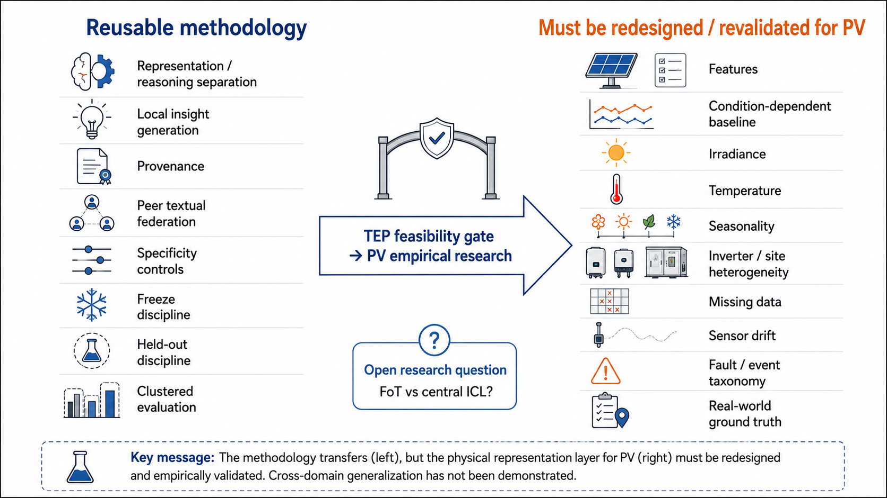

**Figura 7 — Dal feasibility gate TEP alla fase empirica PV.**
La separazione representation–reasoning, la provenance, i controlli e la
disciplina dei freeze sono riutilizzabili come metodo. Feature, baseline,
variabili fisiche e ground truth devono invece essere adattati e rivalidati nel
PV; FoT versus central ICL resta una domanda futura.

**Da ricordare:** Si trasferisce il metodo; non si copia ciecamente il verbalizzatore TEP.

Roadmap concettuale, non protocollo già deciso:

1. definire eventi e ground truth PV verificabili;
2. auditare siti, sensori, sampling, meteo e missingness;
3. progettare feature neutralizzate per giorno/stagione/regime;
4. congelare un verbalizer PV su development;
5. costruire nodi non-IID realistici e insight locali;
6. preregistrare condizioni, comparator e unità statistica;
7. riservare siti/periodi/eventi untouched;
8. congelare prediction prima del join ground truth;
9. testare empiricamente la trasferibilità nel dominio PV su maggiore scala
   fisica e con ground truth reale;
10. affrontare il confronto FoT-vs-central-ICL.

Una open research question esplicita è: **cosa distingue il beneficio di
Federation over Text dal semplice in-context learning (ICL) con conoscenza
fornita centralmente?** Il PoC TEP ha verificato insight generati localmente,
provenance, conoscenza non-IID e trasferimento peer-only; non ha però isolato
sperimentalmente il vantaggio della provenienza distribuita rispetto a una
knowledge base centrale di contenuto informativo equivalente. Questo non
invalida il PoC: è una domanda di ricerca emersa dal suo esito.

**FUTURE DESIGN CANDIDATE — NOT FROZEN.** Un possibile controllo PV potrebbe
confrontare insight FoT genuinamente derivati dai peer con conoscenza ICL
fornita centralmente e di contenuto informativo comparabile. La domanda sarebbe
se il valore derivi soltanto dal ricevere una descrizione diagnostica oppure
dalla conoscenza prodotta da siti locali eterogenei. Questa ipotesi di design
non appartiene al protocollo TEP e non è ancora un protocollo PV.

### Problemi incontrati e decisioni

Non esiste nel repository un dataset PV definitivo, una tassonomia congelata o
un protocollo PV. Specificarli qui sarebbe invenzione e leakage nel futuro
design; sono marcati **FUTURE WORK**. Restano inoltre non completamente
verificabili lo stato RNG MATLAB iniziale e la procedura esatta di replay dei
run per cui non furono conservati script separati F1-run11 e Normal-run14.
Questi gap non vengono colmati per inferenza.

### Risultato ottenuto

È pronta un'architettura metodologica e una checklist di rischio. Non sono
pronte soglie o feature PV “plug-and-play”, e non esiste ancora evidenza
empirica cross-domain.

### Collegamento con l'obiettivo finale

Questo è il collegamento diretto: il PoC riduce l'incertezza sul meccanismo di
federazione testuale e supera il preliminary feasibility gate, lasciando aperta
la validità esterna sul dominio target principale del PhD.

### Domande e risposte

**D: Possiamo riutilizzare `shift_sigma` nel PV?**  
R: Forse come candidato, ma solo dopo aver definito una baseline condizionata a
meteo e regime. Non è frozen per PV.

**D: Quale dovrebbe essere l'unità fisica PV?**  
R: Non è ancora documentato. Potrebbe essere sito, inverter, giorno-evento o
episodio; va scelto in base al processo generativo e prima dell'analisi.

**D: Il prossimo esperimento deve replicare A/B/E?**  
R: Il principio di isolated/genuine/corrupted è riutilizzabile, ma condizioni e
comparatori vanno motivati nuovamente per il contesto PV.

**D: Il PoC distingue già FoT dal central ICL?**  
R: No. Dimostra trasferimento peer-derived nel design TEP, ma non contiene una
knowledge base centrale equivalente come comparatore; è una domanda aperta per
la fase PV, non una falla che ripunteggia il PoC concluso.

---

<a id="s41"></a>
# 41. Conclusione generale

### Introduzione

Il progetto è un esempio di come una prima demo promettente diventi un
proof-of-concept credibile attraverso critica, separazione dei layer e freeze.
La chiusura del PoC TEP non è la conclusione del PhD: è il gate che consente di
entrare nella fase empirica principale sul fotovoltaico con una metodologia più
matura.

### Obiettivo della fase

Riassumere cosa è stato imparato e quale ponte concreto esiste verso PV.

### Come è stato raggiunto

La V1 ha esposto il rischio di confondere dispersione con oscillazione e di
regalare prototipi al modello. Phase A V2 ha costruito evidenza temporale
neutrale, calibrata solo su Normal development e congelata prima di validation e
test. Un audit del simulatore ha consentito un nuovo held-out indipendente. La
Phase B ha isolato quattro agenti non-IID, generato insight localmente, costruito
A/B/E invarianti, bilanciato 540 call stateless, congelato le prediction e unito
ground truth solo offline.

### Problemi incontrati e decisioni

Il risultato non è reso più forte nascondendo F8, il piccolo campione, il floor
A o il singolo LLM. È reso più credibile dal fatto che questi limiti non hanno
prodotto tuning retrospettivo e sono integrati nella claim.

### Risultato ottenuto

Sul primary unseen: A=0/36, B=31/36, E=3/36. B−A=+0.8611 è la primary
pre-registrata; B−E=+0.7778 è il contrasto pre-registrato di specificità e non
la primary. In questo PoC, i risultati supportano fortemente l'interpretazione
che insight peer corretti trasferiscano informazione diagnostica utile e che il
beneficio dipenda dalla correttezza dell'associazione testuale.

### Collegamento con l'obiettivo finale

TEP ha validato preliminarmente un meccanismo e una disciplina, non il dominio
PV e non la generalizzazione cross-domain. La fase PV principale dovrà adattare
e rivalidare indipendentemente il representation layer, testare empiricamente
la trasferibilità, aumentare la scala fisica, affrontare ground truth reale e
confrontare FoT con central ICL. Dovrà farlo con feature, baseline, tassonomia e
finestre proprie, conservando neutralità, provenance, controlli e freeze.

### Domande e risposte

**D: Il PoC è concluso?**  
R: Sì per FoT–TEP ai tag frozen indicati; no per il programma di PhD, il cui
dominio finale è il PV reale. Nuovi esperimenti richiedono nuove versioni e non
devono spostare i freeze esistenti.

**D: Qual è il contributo principale: il numero o il metodo?**  
R: Sono inseparabili: il contrasto B−A/B−E è informativo perché held-out,
protocollo, ordine, prediction e scoring furono congelati in sequenza.

**D: Cosa resta da validare?**  
R: Validità su PV reale, più repliche e fault/eventi, più modelli/provider,
baseline non a floor, negative transfer, privacy e comparatori centralizzati o
federati classici.

---

## Nota finale sulla provenance

Questo documento non modifica né sostituisce alcun artefatto frozen. Commit,
tag, hash e numeri citati sono verificabili nei path indicati. La gerarchia
scientifica definitiva resta quella di `FOT_TEP_POC_FINAL_SYNTHESIS.md`:
**B−A primary pre-registrata; B−E contrasto di specificità/meccanicistico
pre-registrato e non primary; abstention incorrect; floor A post-hoc
descrittivo; harmed=0 non prova assenza generale di negative transfer.**
