3516011 

IEEE TRANSACTIONS ON INSTRUMENTATION AND MEASUREMENT, VOL. 71, 2022 

# A Novel Feature Extraction Approach for Mechanical Fault Diagnosis Based on ESAX and BoW Model 

Dongfang Zhao , Shulin Liu , Zhonghua Miao , Hongli Zhang , Yuan Wei , and Shungen Xiao 

**_Abstract_ —Condition monitoring and fault diagnosis are of great significance to the development of modern industry, for they enable enterprises to avoid unexpected interruptions or severe accidents, and extracting the fault-related features from vibration signals is a critical step to achieve accurate diagnosis. Among diverse of feature extraction approaches, symbolic aggregate approximation (SAX) is a promising one that has been introduced into fault diagnosis recently. Nevertheless, when dealing with the sampled vibration signals, the SAX ignores the change of signal frequency characteristics, which eventually leads to information aliasing and cannot ensure the information validity. In this work, the information aliasing is analyzed from the perspective of signal processing, and the extremum symbolic aggregate approximation (ESAX) is developed as a substitution on the premise of maintaining the validity of the information. Subsequently, to convert the symbol strings generated by the ESAX into usable digital feature vectors, the bag-of-words (BoW) model in natural language processing (NLP) is employed to perform the counting statistics of the fault-related words, and the Laplacian score (LS) algorithm is then utilized to rerank the statistical results, thereby realizing the extraction of mechanical fault feature. The superiority of the developed method is verified by experiments.** 

**_Index Terms_ —Bag-of-words (BoW), fault diagnosis, feature extraction, Laplacian score (LS), symbolic aggregate approximation (SAX).** 

## I. INTRODUCTION 

HILE satisfying the ever-increasing production **W** demands of human society, the flourishing modern industry has also put forward higher requirements for the fault-free operation of the equipment [1]–[3]. Accurate fault diagnosis of the core components of the equipment contributes to implement flexible production scheme and prevent casualty 

Manuscript received 27 April 2022; revised 3 June 2022; accepted 10 June 2022. Date of publication 23 June 2022; date of current version 5 July 2022. This work was supported in part by the National Natural Science Foundation of China under Grant 52075310, Grant 11802168, and Grant 61603238; in part by the Natural Science Foundation of Fujian Province under Grant 2020J01432; in part by the Scientific Research and Innovation Team of Ningde Normal University under Grant 2020T02; and in part by the Special Project of Ningde Normal University under Grant 2019ZX403. The Associate Editor coordinating the review process was Dr. Ming Zhang. _(Corresponding authors: Shulin Liu; Shungen Xiao.)_ 

Dongfang Zhao, Shulin Liu, Zhonghua Miao, Hongli Zhang, and Yuan Wei are with the School of Mechatronic Engineering and Automation, Shanghai University, Shanghai 200072, China (e-mail: zhaodf2019@ qq.com; lsl346@126.com; zhhmiao@shu.edu.cn; zhang40941@126.com; weiyuan0315@sina.com). 

Shungen Xiao is with the School of Information, Mechanical and Electrical Engineering, Ningde Normal University, Ningde 352100, China (e-mail: xiaoshungen022@163.com). 

Digital Object Identifier 10.1109/TIM.2022.3185658 

accidents [4]–[6]. Therefore, it is indispensable to develop advanced and valid fault diagnosis technologies [7], [8]. 

The kernel of accurate and efficient fault diagnosis is to extract the fault-related features from the collected signals [9]–[11], and to this end, scholars have made certain efforts in time domain [12], [13], frequency domain (time– frequency domain) [14]–[19], entropy [20]–[25], and so on. Although the above methods have achieved certain achievements, there are still some limitations. For example, timedomain analysis can only roughly reflect the equipment state but cannot reveal more detailed fault information from frequency domain [26]. Meanwhile, frequency-domain (time– frequency domain) analysis methods are not only restricted by fault mechanism but also affected by the nonstationary characteristics of the signal [27], resulting in limited practical effect. For entropy analysis approaches, they overcome the influence of signal nonstationary characteristics to a certain extent but often do not have advantages in computational efficiency [28]. 

Recently, a time series symbolic dimension reduction method named symbolic aggregate approximation (SAX) has attracted the attention of scholars. Compared with the aforementioned traditional approaches, SAX is less constrained by the nonstationary characteristics of the signal and can better reflect the overall characteristics of the data through less computation. The SAX is first introduced into rolling bearing fault diagnosis by Georgoulas _et al._ [29], and by converting the vibration signal into the intelligent icon, the SAX-based diagnosis method achieved relatively satisfactory results. However, the above method replaces each symbol with a corresponding number in the conversion process, which has certain subjectivity. Besides, the fault feature in the icon format is also not conducive to the processing of classical classifiers. Zhang _et al._ [30] extended the SAX to the frequency domain and time–frequency domain in the fault diagnosis of rolling bearing and reciprocating compressor gas valve, which makes the obtained features more comprehensive, but the amount of computation also increases compared with the original version. Yin _et al._ [31] improved the coding accuracy and computational efficiency of Lempel–Ziv (LZ) indicator utilizing SAX and obtained relatively satisfactory results in rolling bearing fault diagnosis. Nevertheless, although utilizing LZ indicator to further process the symbolic result of SAX is more objective than direct assignment, its essence is still the LZ indicator, which is a single feature and has certain 

1557-9662 © 2022 IEEE. Personal use is permitted, but republication/redistribution requires IEEE permission. See https://www.ieee.org/publications/rights/index.html for more information. 

Authorized licensed use limited to: Universita degli Studi di Napoli Federico II. Downloaded on September 02,2026 at 14:33:10 UTC from IEEE Xplore.  Restrictions apply. 

3516011 

IEEE TRANSACTIONS ON INSTRUMENTATION AND MEASUREMENT, VOL. 71, 2022 

one-sidedness. Besides, the performance of the LZ indicator is greatly affected by data length [32], which also limits its further promotion and application. 

On the whole, in the process of introducing and applying the SAX to fault diagnosis, scholars have made certain efforts and achieved considerable results. However, there still exist some major defects in the SAX approach. First, when the time series to be symbolized is a sampled signal, the piecewise aggregate approximation (PAA) process in the SAX can be equivalent to a signal downsampling process, and the existing SAX algorithm ignores the change of signal frequency-domain characteristics, which may lead to information aliasing and make the final result unable to maintain information validity. Second, after the SAX processing, the raw time series is transformed into symbol series, which is difficult to be directly used as digital feature vector. 

Motivated by the aforementioned limitations, this work first analyzes the change of signal frequency-domain characteristics in SAX from the perspective of signal processing, and a novel time series symbolization approach named extremum symbolic aggregate approximation (ESAX) is developed. By utilizing the absolute extreme value of the data to represent the information in a specific region, the proposed ESAX can realize the symbolization of the time series on the premise of maintaining the validity of the information. In addition, to transform the obtained symbolic string into digital feature vector that can be processed by computer objectively, an ESAX-based feature extraction scheme is presented. In the suggested feature extraction scheme, the bag-of-words (BoW) model in natural language processing (NLP) is employed to perform the counting statistics of the fault-related words, and the Laplacian score (LS) algorithm is then utilized to rerank the statistical results, thereby realizing the extraction of mechanical fault features. 

The main contributions of this article are summarized as follows. 

- 1) The adverse information aliasing phenomenon in the classical SAX method is analyzed from the perspective of signal processing, and a novel improved version named ESAX is developed. 

- 2) By setting antialiasing filter and using absolute extreme value operation to replace mean operation, the proposed ESAX can ensure the correctness of the information during the calculation process and approximately extract the downsampled envelope of the raw data. 

- 3) To convert the symbol string obtained by ESAX into digital feature vector, the BoW model is employed to perform counting statistics of fault-related words, and the LS algorithm is then utilized to rerank the statistical results. The superiority of the developed method is verified by experiments. 

The remainder of this article is organized as follows. The SAX method and its limitations are presented in Section II. The proposed ESAX and the developed feature extraction scheme combined with the BoW model are given in Section III. The simulation and experimental results are pre- 

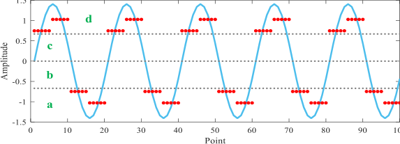

Fig. 1. Schematic of the SAX. 

sented in Sections IV and V, respectively. The conclusions and the future work are drawn in Section VI. 

## II. SAX METHOD AND ITS LIMITATIONS 

## _A. Theoretical Background of the SAX_ 

SAX is an effective time series symbolic dimension reduction method and has been verified to be a powerful tool for the processing of mechanical vibration signal. Based on the PAA, the SAX can convert a time series of length _n_ into a symbol string of length _m_ ( _m < n)_ . For a given time series _X_ = { _x_ 1 _, x_ 2 _, . . . , xn_ }, the calculation process of the SAX can be summarized in the following steps [33]. 

_1) Standardization:_ The raw time series _X_ is standardized into a new series _Y_ = { _y_ 1 _, y_ 2 _, . . . , yn_ } with mean value 0 and variance 1 according to the following equation: 

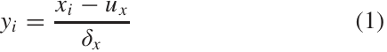

where _xi_ is the _i_ th value in raw series _X_ , _u x_ is the average value of all the values in series _X_ , and _δx_ is the standard deviation of all the values in series _X_ . 

_2) PAA Dimension Reduction:_ In this step, the standardized series will be divided into [ _n/τ_ ] subseries with length _τ_ utilizing the PAA approach, and then, the mean value of each subseries is calculated to obtain a new series _Z_ = { _z_ 1 _, z_ 2 _, . . . , z_ [ _n/τ_ ]}. In this way, the overall characteristics of the data can be well preserved while reducing the dimension, and the calculation is relatively simple 

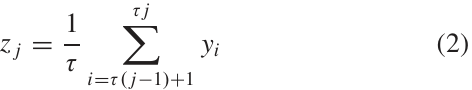

where _z j_ is the _j_ th value in new series _Z_ , _j_ = 1 _,_ 2 _, . . . ,_ [ _n/τ_ ], and [ ] represents the rounding down operation. 

_3) Symbolization:_ Since the standardized series obeys the Gaussian distribution, the probability distribution corresponding to the new series can be divided into several regions with equal area, and then, each value in series _Z_ can be coded with a symbol. The breakpoints for dividing the equal area regions can be found in [33]. 

Fig. 1 presents a schematic of the SAX method. As observed in Fig. 1, the raw series with length 100 is first divided into 20 subseries with length 5 by PAA, and then, the mean value of each subseries is calculated. Finally, the mean values are symbolically encoded according to the symbol regions defined by the breakpoints. In Fig. 1, the number of the symbol set is 4, and the breakpoints are _B_ 1 = −0.67, _B_ 2 = 0, and 

Authorized licensed use limited to: Universita degli Studi di Napoli Federico II. Downloaded on September 02,2026 at 14:33:10 UTC from IEEE Xplore.  Restrictions apply. 

3516011 

ZHAO _et al._ : NOVEL FEATURE EXTRACTION APPROACH FOR MECHANICAL FAULT DIAGNOSIS 

_B_ 3 = 0.67. Through the above breakpoints, the vertical axis is divided into four equal area regions (region codes are _a_ , _b_ , _c_ , and _d_ , respectively). After the SAX processing, the raw “ series is expressed as _s_ = _ddaaddaaddaaddaaddaa_ .” 

## _B. Equivalence of the PAA Procedure in SAX_ 

Although the performance of the SAX has been verified in previous studies, there are still some issues should be considered when the time series is a sampled signal. According to the descriptions in Section II-A, the SAX method mainly consists of three steps, including standardization, PAA dimension reduction, and symbolization. In the PAA procedure, the time series is divided into several sections with equal size and the mean value of each section is calculated. Then, the dimension reduction is achieved by substituting each section with its mean value. Unfortunately, when the object being processed is a sampled signal, the above PAA procedure will inevitably cause the distortion of signal frequency characteristics. In essence, the PAA procedure can be interpreted as a downsampling operation by the following equivalence steps. 

_Step 1:_ Considering time series _X_ = { _x_ 1 _, x_ 2 _, . . . , xn_ }, when the length of the equal-sized section is determined as _τ_ , the first step is to decompose the raw series into _τ_ intermediate series according to the following equation: 

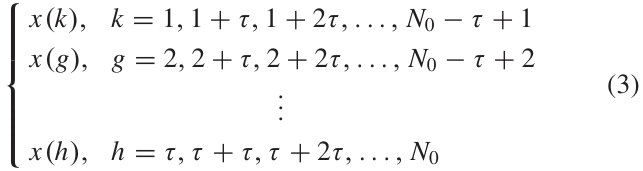

where _N_ 0 is the largest integer that is smaller than or equal to _N_ and is divisible by _τ_ . 

_Step 2:_ The second step is to create a matrix presented as formula (4) utilizing the intermediate series obtained by (3), and then, the column sum of the above matrix can be calculated. After dividing the column sum by _τ_ , the newly obtained series is the same as the one directly calculated by the PAA approach. 

Through Step 1, the raw time sequence with length _N_ 0 is decomposed into _τ_ intermediate sequence with length _N_ 0 _/τ_ . It is worth noting that the time interval between the adjacent data points in the intermediate sequence is _τ/ f_ s when the raw time sequence is a sampled signal (the sampling rate is _f_ s _)_ . Therefore, the intermediate sequence can be treated as a sequence whose sampling rate is _f_ s _/τ_ 

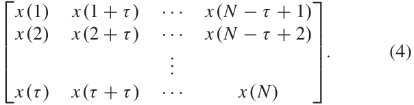

In Step 2, it actually calculates the mean value sequence of those intermediate sequences. On the whole, the calculation procedure of Step 2 is similar to that of the time-domain synchronization average algorithm to some extent [34]. The time-domain synchronous average algorithm can eliminate random noise and enhance the interested components but have no influence on sampling rate. Therefore, the sampling rate of 

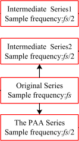

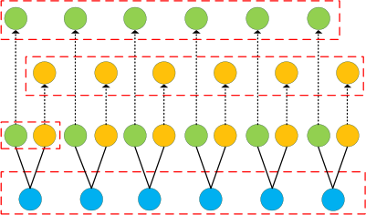

Fig. 2. Schematic of the equivalence (the length of the subseries for PAA is 2). 

the series obtained through Steps 1 and 2 is equal to _f_ s _/τ_ , and the sampling rate of the series directly generated by PAA is also _f_ s _/τ_ . It indicates that when the series being analyzed is a sampled signal, the PAA procedure is actually a downsampling process, and the downsampling rate is _τ_ . Fig. 2 shows the schematic of the above equivalent transformation. 

As shown in Fig. 2, for the raw signal with sampling frequency _f_ s, when the length of the subseries for PAA is determined as 2, the PAA series can be directly obtained by calculating the average of every two adjacent data points in the raw signal. Meanwhile, the above PAA series can also be obtained in another way in which the two intermediate series are obtained first, and then, the average of the two intermediate series is calculated as the final PAA series. Obviously, the calculation results of the above two methods are the same. Moreover, since the sampling rate of the intermediate sequence is _f_ s _/_ 2 in the calculation process, the sampling rate of the final PAA sequence is also _f_ s _/_ 2. 

## _C. Frequency-Domain Characteristics of the PAA Procedure_ 

In fault diagnosis, the analysis of signal frequency component is of great significance, and the specific frequency component is usually an important index to judge whether the fault occurs or not. Even for the method that does not take a specific frequency component as an indicator, it is also necessary to maintain the validity of the information in the process of calculation because it is the basis of all the processing and analysis. Based on the above consideration of ensuring the correctness of information, this section mainly analyzes the change of the signal frequency characteristics in the PAA procedure. 

As illustrated in Section II-B, the PAA procedure can be equivalent to a downsampling process in which the raw sampling frequency _fs_ will be reduced to _fs/τ_ in the case the length of the equal-sized section is determined as _τ_ . Besides, in the equivalence process, _τ_ intermediate series with sampling frequency _fs /τ_ will be generated. Generally, the conversion of analog signal to digital signal needs to follow the sampling theorem, which means that the sampling frequency is not less than two times the highest frequency of the signal. Actually, to maintain information validity, the resampling (downsampling) of digital signal should also follow the sampling theorem. Nevertheless, for the PAA procedure, because the change of the frequency-domain characteristics is ignored during the calculation process, the information distortion that 

Authorized licensed use limited to: Universita degli Studi di Napoli Federico II. Downloaded on September 02,2026 at 14:33:10 UTC from IEEE Xplore.  Restrictions apply. 

3516011 

IEEE TRANSACTIONS ON INSTRUMENTATION AND MEASUREMENT, VOL. 71, 2022 

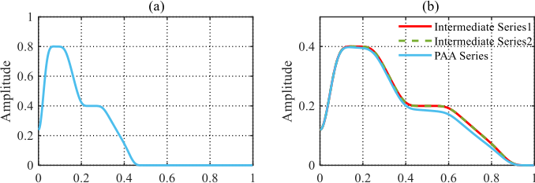

Fig. 3. Frequency characteristics of different series ( _τ_ = 2, the highest frequency _< π/_ 2 _)_ . (a) Original. (b) After PAA. 

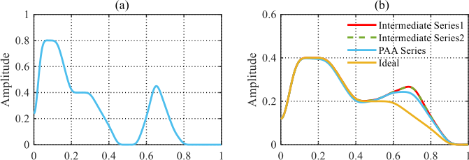

Fig. 4. Frequency characteristics of different series ( _τ_ = 2, the highest frequency _> π/_ 2 _)_ . (a) Original. (b) After PAA. 

will lead to the unreliability of the subsequent calculation results is extremely easy to occur. 

As shown in Fig. 3, when the highest frequency component of the raw data is smaller than _fs /(_ 2 ∗ _τ)_ , both the frequency spectrum of the intermediate sequence and the PAA sequence can hold all the components correctly. Concretely, the spectrum of the intermediate sequence is more consistent with that of the raw signal, while there exists some slight amplitude attenuation in the spectrum of the PAA series. The amplitude attenuation may be caused by the averaging operation of the PAA procedure, for it can impair the impulse characteristics of the data to a certain degree. On the whole, in this situation, although the spectrum of PAA sequence is slightly distorted (amplitude attenuation), the correctness of the original information can still be maintained basically. 

Nevertheless, as shown in Fig. 4, once the highest frequency of the raw signal is greater than _fs /(_ 2 ∗ _τ)_ because the intermediate series and the PAA series are obtained by downsampling the raw signal, the bandwidth of their spectrum is reduced to _fs /(_ 2 ∗ _τ)_ , and the original information in the range of _fs /(_ 2 ∗ _τ)_ to _fs /_ 2 will no longer be accommodated by the spectrum of the downsampled series. As a result, the information in the range of _fs/(_ 2 ∗ _τ)_ to _fs /_ 2 will be aliased into the current spectrum in some unexpected forms and bring relatively serious distortion. Thus, in this case, the calculation process of the PAA cannot maintain the validity of the information 

## III. PROPOSED ESAX AND THE RELATED FEATURE EXTRACTION SCHEME 

## _A. Extremum SAX_ 

As mentioned in Section II, in the SAX procedure, the reduction of sampling frequency will lead to information aliasing and reduce the reliability of the calculation process. 

In view of the above issue, with the purpose of maintaining the authenticity of the information, the ESAX is developed as an alternative in this section. In the proposed ESAX, the absolute extremum of segment data is used to represent the information of the corresponding segment, and a link that can suppress the information aliasing is implanted into the calculation process. Specifically, the calculation of the developed ESAX includes three steps, and the schematic diagram is presented in Fig. 5. 

- 1) For a given time series _X_ = { _x_ 1 _, x_ 2 _, . . . , xn_ }, the raw time series _X_ is first fed into an antialiasing filter to generate the filtered series _P_ = { _p_ 1 _, p_ 2 _, . . . , pn_ }; then, the absolute value series of the filtered series _P_ will be divided into [ _n/τ_ ] subseries with length _τ_ ; and finally, the maximum of each subseries is used to form a new series _M_ = { _m_ 1 _, m_ 2 _, . . . , m_ [ _n/τ_ ]} 

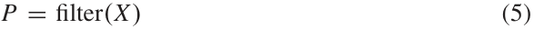

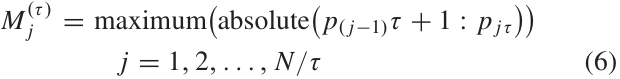

where _τ_ = 1 _,_ 2 _, . . . , N_ is the length of the subseries that will be symbolized as a character and filter ( _c)_ is the antialiasing procedure of _c_ , which is a Butterworth low-pass filter with cutoff frequency _fs/τ_ in this work. 

2) In this step, the series _M_ is standardized into a new series _Y_ = { _y_ 1 _, y_ 2 _, . . . , yn_ } with mean value of 0 and variance of 1 according to (1), and this step is the same as 1) in the original SAX algorithm. 

3) During this step, each value in the standardized series _Y_ will be coded with a symbol, and the breakpoints for dividing the equal area regions are the same as that of the original SAX algorithm. 

In the proposed ESAX algorithm, the purpose of the antialiasing procedure is to wipe off the components that may lead to aliasing before the downsampling operation. Besides, in the process of downsampling, the absolute extremum is utilized to replace the original average value, which is actually to extract the approximate envelope of the signal in the process of downsampling. 

## _B. Feature Extraction Utilizing the Developed ESAX_ 

The original SAX aims to represent the raw data as a symbol string in the dimension reduction process and so is the ESAX proposed in this work. Nevertheless, the obtained symbol string cannot be directly processed by computer. Therefore, to achieve effective mechanical fault feature extraction, the BoW model in NLP is employed to perform counting statistics of fault-related words, and then, the LS algorithm is utilized to rerank the statistical results. In this way, the symbol string extracted by ESAX can be transformed into available digital feature vector. Fig. 6 presents the flowchart of the developed feature extraction scheme. 

_1) Fault Words String Vectorization Using the BoW Model:_ In order to convert the symbol string obtained by the ESAX into digital feature vector, this section introduces the BoW model into the feature extraction scheme for count vectorization. The BoW model is actually an NLP model that ignores 

Authorized licensed use limited to: Universita degli Studi di Napoli Federico II. Downloaded on September 02,2026 at 14:33:10 UTC from IEEE Xplore.  Restrictions apply. 

3516011 

ZHAO _et al._ : NOVEL FEATURE EXTRACTION APPROACH FOR MECHANICAL FAULT DIAGNOSIS 

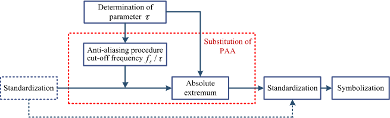

Fig. 5. Schematic of the proposed ESAX. 

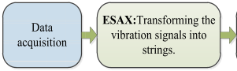

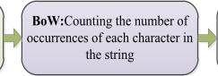

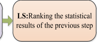

Fig. 6. Flowchart of the developed feature extraction scheme. 

sentence structure and word position. In the BoW model, each document is treated as a package of words, and it focuses on what words are included in the document and how many of them there are, but does not pay much attention to the order of each word. Generally, the classical BoW model includes two different strategies [35]: the count vectorization and the term frequency-inverse document frequency (TF-IDF). 

In this work, due to the small number of character categories and the high probability that all characters are contained in each state, the TF-IDF strategy may produce several meaningless feature vectors. Therefore, the count vectorization is mainly considered. 

When the word set is available, the count vectorization will create a vector, in which each element represents a word in the corpus. Once a word appears one or more times, the count vectorization will count the number of occurrences of words and place the value in the position representing the word. 

_2) Feature Reconstitution Using LS Algorithm:_ After the ESAX and the BoW processing, the obtained feature vector will contain several features. However, in practice, it is often difficult to ensure that all features have a positive contribution to the classification task. Therefore, in this article, the LS [36] algorithm is employed for further feature ranking and screening. As a feature-ranking approach, the LS algorithm scores a feature by measuring its fluctuation between similar data and the fluctuation between heterogeneous data. A relatively low score means that the feature holds more excellent stability and identification ability, and it is believed to be a reliable feature. 

Suppose that _m_ data samples are available and each sample has _n_ features. _Lr_ represents the LS of the _r_ th ( _r_ = 1 _, . . . , n)_ feature in the feature space and _fri_ represents the _i_ th sample of the _r_ th feature ( _i_ = 1 _,_ 2 _, . . . , m)_ . The main calculation process of the LS algorithm can be summarized as follows. 

- 1) The first step is to construct the nearest neighbor graph _G_ with the _m_ nodes, and the _i_ th node corresponds to the _i_ th data point _xi_ . If _xi_ and _x j_ are “close,” an edge will be put between nodes _i_ and _j_ , which is defined as _xi_ among _k_ nearest neighbors of _x j_ . Meanwhile, _x j_ is also among _k_ nearest neighbors of _xi_ (in this work, _k_ is set to 5). Under the condition that the label information can be obtained, an edge can be put between two nodes sharing the same label. 

2) Defining the weight matrix _Si j_ as follows: 

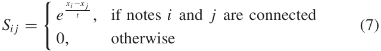

where _t_ is a suitable constant. 

The weight matrix _S_ of the graph models the local structure of the data space. The weighted matrix _S_ is called the similarity matrix of graph _G_ , which is used to measure the similarity between two sample points and describe the intrinsic local geometric structure of the data space. The greater the elements in _S_ are, the more similar the two samples are, and the more likely to belong to the same class; otherwise, the more likely to belong to different classes. 

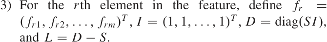

Here, _I_ is the unit vector with dimension _m_ and _L_ is known as the Laplacian matrix of graph _G_ . 

To eliminate the influence of the possible magnitude differences among certain dimensions of the data on the complete neighbor graph, the average processing is conducted on the features 

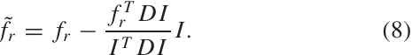

- 4) The LS of the _r_ th feature can be defined as follows: 

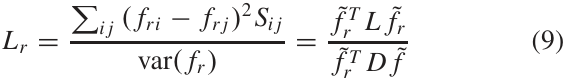

where var( _fr )_ represents the estimated variance of the _r_ th feature. 

## IV. SIMULATION ANALYSIS OF THE SERIES CHARACTERISTICS OF THE PROPOSED ESAX 

To verify the frequency-domain characteristics of the proposed ESAX algorithm, a rolling bearing fault signal is set as (10) and (11) according to the stochastic model of rolling bearing fault signal developed in the literature [37] 

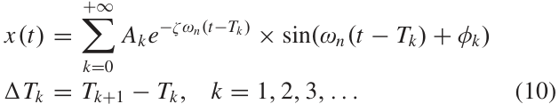

where _Tk_ represents the arrival time of the _k_ th transient response, _Tk_ is the time interval between the _k_ th and the ( _k_ + 1)th transient response, _Ak_ is the amplitude of the _k_ th impulse, _φk_ is the initial phase of the system, and _ζ_ and _ωn_ represent the relative damping ratio and the system angular frequency, respectively. Besides, _ωn_ = 2 _π fn_ , where _fn_ is the resonance frequency. 

In this work, the relative damping ratio is _ζ_ = 0 _._ 1 _,_ the resonance frequency is _fn_ = 3500 Hz, the sampling rate is _f_ s = 12000 Hz, and the data length is _N_ = 12000. Besides, this work sets _Ak_ ∼ _N(μ A_ = 5 _, σA_ = 0 _._ 01 _)_ to simulate the fluctuation of amplitude and _Tk_ ∼ _N(μ T_ = 0 _._ 01 _,_ 

Authorized licensed use limited to: Universita degli Studi di Napoli Federico II. Downloaded on September 02,2026 at 14:33:10 UTC from IEEE Xplore.  Restrictions apply. 

3516011 

IEEE TRANSACTIONS ON INSTRUMENTATION AND MEASUREMENT, VOL. 71, 2022 

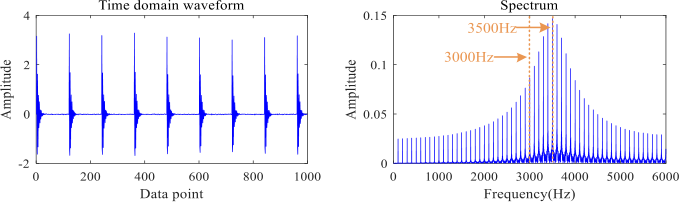

Fig. 7. Time-domain waveform and spectrum of the simulated signal. 

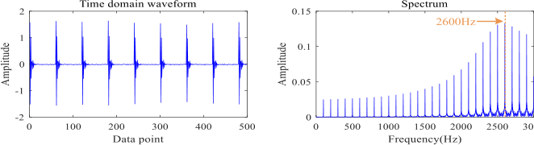

Fig. 8. Time-domain waveform and spectrum of the signal after the SAX (PAA) processing. 

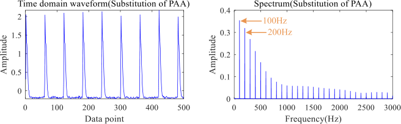

Fig. 9. Time-domain waveform and spectrum of the signal after the downsampling processing (ESAX). 

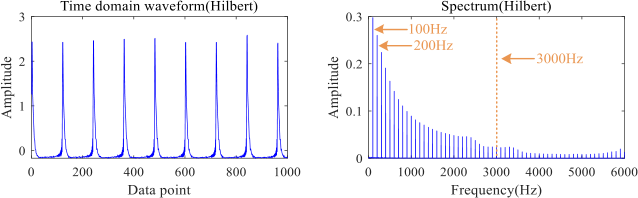

Fig. 10. Envelope and envelope spectrum of the original signal obtained by the Hilbert transform. 

_σ T_ = 0 _._ 01%∗ _μ T )_ to simulate the fluctuation of the arrival time of the transients. The time-domain waveform and the spectrum of the simulated signal are presented in Fig. 7. 

As shown in Fig. 7, for the simulated signal, its time-domain waveform shows obvious impact characteristics. Meanwhile, in its spectrum, the spectrum line with the highest energy appears at 3500 Hz, corresponding to the response frequency. On both sides of 3500 Hz, the sideband frequency gradually decays in the step size of 100 Hz (corresponding to the modulation frequency of 100 Hz). Besides, it is worth noting that in the range of 0–3000 Hz, the amplitude of the spectral line presents a smooth upward trend. 

Fig. 8 presents the time-domain waveform and spectrum of the signal after the SAX (PAA) processing. As shown in Fig. 8, after the PAA processing, the number of data points becomes half of the original one, and the time-domain waveform has a certain degree of distortion, but the overall difference is not significant. In addition, due to the downsampling effect of the PAA, the bandwidth of the spectrum is reduced to 3000 Hz. More importantly, the spectral line with the highest energy appears at 2600 Hz, and the amplitude of the spectral line first increases and then decreases in the whole bandwidth, which is extremely different from the frequency structure of the original signal in the range of 0–3000 Hz. It indicates that the PAA procedure in the original SAX cannot guarantee the reliability of the information during the calculation process, and the reason may be that the information of the high-frequency band is mixed into the low-frequency band during the bandwidth reduction process (downsampling process). 

Fig. 9 presents the time-domain waveform and spectrum of the signal after the downsampling processing (substitution of PAA) of the proposed ESAX. Fig. 10 presents the envelope and the envelope spectrum of the original signal obtained by the Hilbert transform, and Fig. 11 presents the downsampled results of Fig. 10. As shown in Figs. 9–11, after the downsampling processing of the developed ESAX, the number of data points becomes half of the original. Besides, the obtained data are no longer the original time-domain 

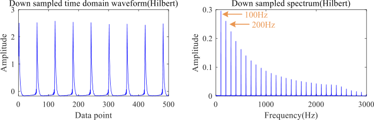

Fig. 11. Downsampled envelope and envelope spectrum of the original signal obtained by the Hilbert transform. 

waveform, but the downsampled envelope is approximately extracted. More importantly, the obtained results, including the time-domain waveform and its spectrum, are extremely similar to the downsampled Hilbert transform results. Both of them can demodulate the envelope signal and reveal the modulation frequency (100 Hz) and the frequency doubling. It indicates that the substitution of the PAA in the proposed ESAX can approximately extract the downsampled envelope of the raw signal, which can maintain the validity of the information during the calculation process. 

## V. EXPERIMENTAL VERIFICATION AND DISCUSSION 

## _A. Case 1_ 

_1) Experimental Setup:_ To verify the superiority of the proposed method, the bearing data of Case Western Reserve University [38] are employed in this section. During the experiment, the vibration signal of the driving end is used. There are totally four bearing health states, including the normal state (NOR), the outer ring fault (ORF), the inner ring fault (IRF), and the ball fault (BF). Besides, the fault diameter includes two cases of 0.1778 and 0.5334 mm. Therefore, there are actually seven states in the final dataset. 

_2) Characteristics Analysis of the ESAX Procedure:_ In this section, the frequency-domain characteristics of the sequence obtained by the PAA procedure of the original SAX and the series obtained by the developed ESAX approach are verified 

Authorized licensed use limited to: Universita degli Studi di Napoli Federico II. Downloaded on September 02,2026 at 14:33:10 UTC from IEEE Xplore.  Restrictions apply. 

3516011 

ZHAO _et al._ : NOVEL FEATURE EXTRACTION APPROACH FOR MECHANICAL FAULT DIAGNOSIS 

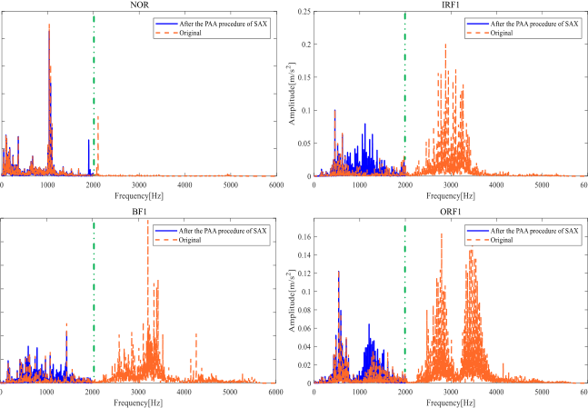

Fig. 12. Spectrum of the original signal and the signal obtained in the SAX procedure. 

(taking NOR, IRF1, BF1, and ORF1 as examples). During the experiment, the length of the raw data is 8192, and the PAA parameter _τ_ is set to 3. 

Fig. 12 presents the spectrum of the raw signal and the signal obtained by the SAX algorithm. As shown in Fig. 12, after the PAA processing in the original SAX algorithm, the bandwidth of the spectrum is reduced to 2000 Hz due to the downsampling effect, while the bandwidth of the spectrum of the raw data is 6000 Hz. More importantly, in the range of 0–2000 Hz, in comparison with the frequency spectrum of the raw data, the spectrum of the PAA series also shows an obvious difference. Specifically, for the NOR state, at the position of 1900 Hz, there appear obvious spectral lines, but there is no such component in the spectrum of the raw signal. For the IRF1 state, the energy in the range of 1000–2000 Hz increases significantly, but the energy of the spectrum of the raw signal in the above range is relatively low. Meanwhile, in the range of 1000–1500 Hz in the spectrum of the BF1 and the ORF1 state, there are also different degrees of distortion. It indicates that, in the PAA process (i.e., the downsampling process), there will inevitably be less information, which is easy to understand as the number of data points is decreased. Unfortunately, after the PAA procedure, the reserved information is also distorted, which will lead to the unreliability of subsequent calculations. 

Fig. 13 presents the spectrum (in the range of 0–500 Hz) of the downsampled Hilbert envelope and the series obtained by the developed method. As shown in Fig. 13, both the downsampled Hilbert envelope spectrum and the spectrum of the series obtained by the developed method can reveal the characteristic frequency, including the rotating frequency and the fault characteristic frequency. Although the spectrum of the two methods is slightly different in detail, the overall similarity is relatively high, which does not affect the identification of characteristic frequency. It indicates that the developed method can approximately extract the downsampled envelope of the signal and can guarantee the correctness and reliability of the information during the downsampling process. 

_3) Fault Feature Extraction:_ In the feature extraction process, to improve the diversity and resolution of the fault- 

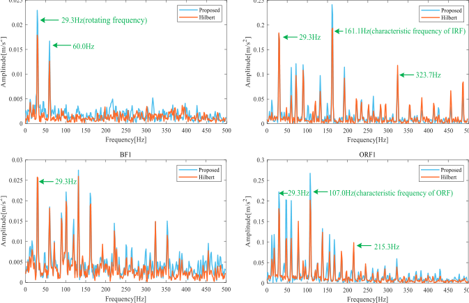

Fig. 13. Spectrum of the Hilbert envelope (downsampled) and the series obtained in the developed ESAX procedure. 

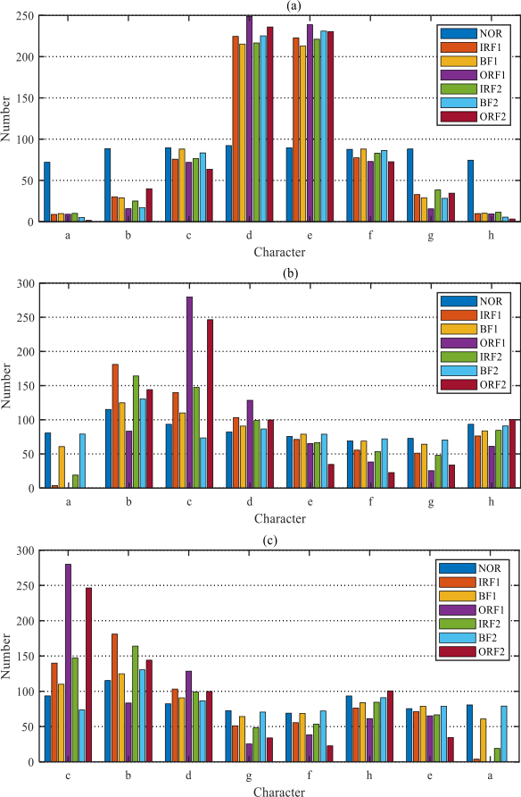

Fig. 14. Number of the fault-related words obtained by different methods. (a) Number of the fault-related words obtained by SAX. (b) Number of the fault-related words obtained by ESAX. (c) Ranking result of the fault-related words obtained by LS. 

related words, the _y_ -axis is divided into eight regions, and each region is represented by the characters _a_ – _h_ from bottom to top. After converting the vibration signal into character string, the BoW model is employed to conduct count statistics of the number of fault-related words in the string. Fig. 14 presents the statistical results of different methods. 

Authorized licensed use limited to: Universita degli Studi di Napoli Federico II. Downloaded on September 02,2026 at 14:33:10 UTC from IEEE Xplore.  Restrictions apply. 

3516011 

IEEE TRANSACTIONS ON INSTRUMENTATION AND MEASUREMENT, VOL. 71, 2022 

TABLE I 

AVERAGE DIAGNOSTIC ACCURACY OF DIFFERENT METHODS (%) 

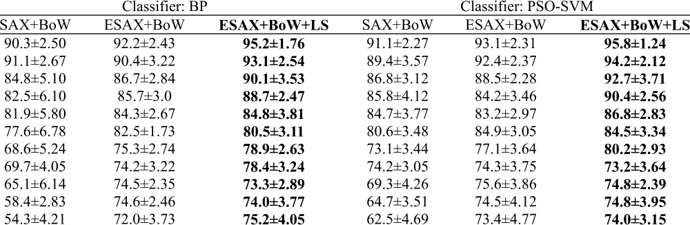

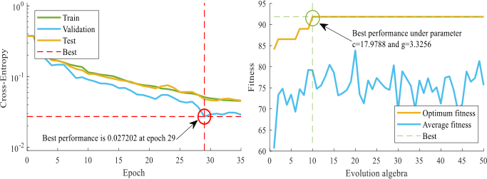

TABLE II 

COMPARISON WITH COMMON FEATURES AND DEEP LEARNING METHODS 

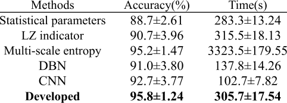

Fig. 15. (a) Training process of the BP network. (b) Fitness curve of the PSO-SVM 

_4) Comparison of Classification Accuracy:_ In this section, setting the length of the sample as 2048, a total of 350 samples are obtained (50 samples for each category, seven categories). To verify the ability of different methods as feature vectors, two types of classical classifiers, including backpropagation (BP) network and support vector machine (SVM), are considered. During the BP-based experiment, 60% of the data are used for network training, 10% of the data are used for validation, and the remaining 30% are used for testing. The BP network used in this section only contains a single hidden layer with ten neurons, and the increase of the crossentropy loss of the verification set is regarded as a sign of stopping of network generalization. During the SVM-based experiment, 70% of the data are used for network training, and the remaining 30% are used for testing. Meanwhile, to make a reasonable parameter configuration, the particle swarm optimization (PSO) algorithm is utilized to optimize the SVM parameters _c_ and _g_ . It is worth noting that in order to evaluate the diagnostic performance more reasonably, all the algorithms are trained and tested ten times, and the average diagnostic accuracy of the test set is set as the evaluation index. Fig. 15 presents the training process of the BP network and the fitness curve of the PSO-SVM classifier in one of the experiments. Table I presents the diagnostic accuracy of different methods. 

To further highlight the advantages of the proposed methods, some common feature extraction methods and deep learning classification methods are taken into comparison. For feature extractions, time-domain statistical parameters (kurtosis, margin, peak-to-peak value, and pulse factor), LZ indi- 

cator, and multiscale entropy (the maximum scale factor is set to 15) are calculated. For deep learning methods, the classical DBN (three RBMs, 100 hidden units in each RBM) and CNN (the number of kernels is 32, the kernel size is 4, the stride is 2 in the convolutional layer, the pool size and stride are both 2 in maximum pooling layer, and there are 64 hidden units in the penultimate fully connected layer) are considered. In addition, for the contrast feature extractions and the developed ESAX, SVM is utilized as the classifier for further processing. The average accuracy and computing time in ten trials of different methods are shown in Table II. 

It can be seen from Table II that among all the comparison methods, the method of this article achieves the highest accuracy, followed by the multiscale entropy. The reason why the deep learning methods do not achieve the best results may be the small sample attribute of the data in this work. In addition, the reason for the mediocre performance of the LZ indicator may be that the data length is insufficient and the feature vector contains only a single value. The mediocre performance of LZ index may be due to the insufficient data length and few eigenvalues in feature vectors do not achieve the best results, which may be the small sample attribute of the data in this work. In terms of calculation time, multiscale entropy is much greater than others. Although the method of this article does not enjoy obvious advantages, it is also basically at an acceptable level, and this is also affected by the level of program optimization to a certain extent. 

## _B. Case 2_ 

_1) Experimental Setup:_ The experiment is implemented on the equipment of the compressor station in a natural gas enterprise, and the reciprocating compressor experimental 

Authorized licensed use limited to: Universita degli Studi di Napoli Federico II. Downloaded on September 02,2026 at 14:33:10 UTC from IEEE Xplore.  Restrictions apply. 

3516011 

ZHAO _et al._ : NOVEL FEATURE EXTRACTION APPROACH FOR MECHANICAL FAULT DIAGNOSIS 

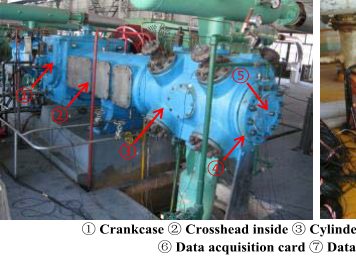

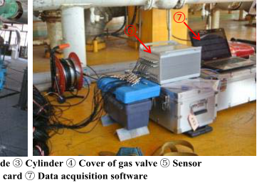

Fig. 16. Reciprocating compressor experimental system. 

### TABLE III 

AVERAGE DIAGNOSTIC ACCURACY OF DIFFERENT METHODS (%) 

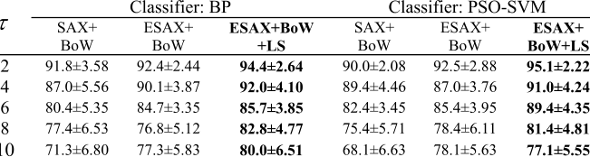

system is mainly composed of the cylinder, the crankcase, the cross head, and the motor. During the operation of the system, the gas velocity is 3611 m3 /h, the pressures of the second-stage cylinder are 1040 kPa (outlet) and 310 kPa (inlet), while the temperatures are 104◦ C (outlet) and 32◦ C (inlet), respectively. Vibration acceleration signals of four different states of the gas valve of the second-stage cylinder, including the NOR, the valve plate fracture (VPF), the valve plate gap (VPG), and the spring deficiency (SD), are collected under the sampling frequency of 20 kHz. Fig. 16 presents the reciprocating compressor experimental system. Besides, the length of a single sample is 2048, and a total of 152 samples are obtained (38 samples for each category) in this section. 

_2) Fault Feature Extraction and Diagnosis Results:_ It can be seen from Fig. 17 and Table III that the fault-related words obtained by the proposed ESAX method hold more obvious identification degree compared with the SAX-based method. Besides, after the reranking of the LS algorithm, the new order of these fault-related words is _c_ − _a_ − _b_ − _d_ − _g_ − _f_ − _h_ − _e_ , and the words with higher discrimination are moved to the front of the feature vector. In terms of the diagnostic results, whether the classifier is BP or PSO-SVM, the ESAX (LS)based feature vector achieves the most excellent performance. It indicates that the proposed ESAX enjoys more advantages in characterizing the running state of the equipment compared with the original SAX, and the developed feature extraction approach can obtain more outstanding result than the single ESAX-based method. 

Table IV presents the comparison results of the ESAX with other common feature extractions and classical deep learning classifiers. As shown in Table IV, in the experiment of reciprocating compressor valve data, the ESAX (LS)-based approach can still maintain certain advantages, which verifies the effectiveness of the method of this work again. 

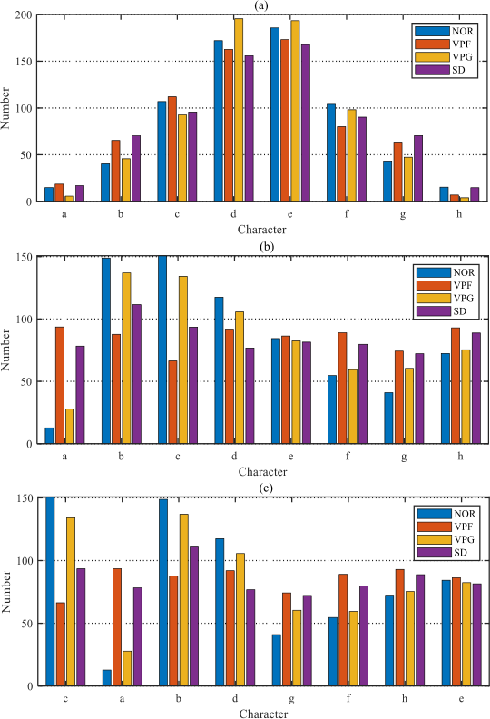

Fig. 17. Number of the fault-related words obtained by different methods. (a) Number of the fault-related words obtained by SAX. (b) Number of the fault-related words obtained by ESAX. (c) Ranking result of the fault-related words obtained by LS. 

TABLE IV 

COMPARISON WITH COMMON FEATURES AND DEEP LEARNING METHODS 

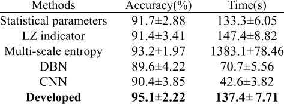

## VI. CONCLUSION 

In this work, the frequency-domain characteristics in the SAX is analyzed from the perspective of signal processing, and the ESAX is developed as a substitution to ensure the information reliability during the calculation process. Subsequently, the BoW model in NLP is employed to perform the counting statistics of the fault-related words, and the LS algorithm is then utilized to rerank the statistical results. The proposed ESAX can restrain the adverse information aliasing phenomenon to a certain degree, and the developed feature extraction technique combining with the BoW model and the LS algorithm can convert the fault-related words into feature vectors effectively. The CWRU rolling bearing dataset and a reciprocating compressor gas valve dataset are employed to verify the effectiveness and superiority of the developed method. The experimental results show that, compared with the original version, the method of this article can provide high-quality feature vector for classifier and thereby achieve more outstanding diagnosis performance. 

Authorized licensed use limited to: Universita degli Studi di Napoli Federico II. Downloaded on September 02,2026 at 14:33:10 UTC from IEEE Xplore.  Restrictions apply. 

3516011 

IEEE TRANSACTIONS ON INSTRUMENTATION AND MEASUREMENT, VOL. 71, 2022 

During the calculation process of the developed ESAX, the _y_ -axis is divided into eight regions and then represented by characters _a_ − _h_ . However, the resolution of the current partition is still relatively low, and a more precise partition of the _y_ -axis may contribute to a more excellent diagnosis accuracy, which is also the focus of future research. 

## REFERENCES 

- [1] M. Kordestani, M. Saif, M. E. Orchard, R. Razavi-Far, and K. Khorasani, “Failure prognosis and applications—A survey of recent literature,” _IEEE Trans. Rel._ , vol. 70, no. 2, pp. 728–748, Jun. 2021. 

- [2] M. Rezamand, M. Kordestani, R. Carriveau, D. S.-K. Ting, M. E. Orchard, and M. Saif, “Critical wind turbine components prognostics: A comprehensive review,” _IEEE Trans. Instrum. Meas._ , vol. 69, no. 12, pp. 9306–9328, Dec. 2020. 

- [3] Z. Zhao, J. Wu, T. Li, C. Sun, R. Yan, and X. Chen, “Challenges and opportunities of AI-enabled monitoring, diagnosis prognosis: A review,” _Chin. J. Mech. Eng._ , vol. 34, no. 1, pp. 34–56, Dec. 2021, doi: 10.1186/s10033-021-00570-7. 

- [4] D. Zhao, H. Zhang, S. Liu, Y. Wei, and S. Xiao, “Deep rational attention network with threshold strategy embedded for mechanical fault diagnosis,” _IEEE Trans. Instrum. Meas._ , vol. 70, pp. 1–15, 2021, doi: 10.1109/TIM.2021.3085951. 

- [5] T. Li, Z. Zhao, C. Sun, R. Yan, and X. Chen, “Multireceptive field graph convolutional networks for machine fault diagnosis,” _IEEE Trans. Ind. Electron._ , vol. 68, no. 12, pp. 12739–12749, Dec. 2021, doi: 10.1109/TIE.2020.3040669. 

- [6] T. Li _et al._ , “WaveletKernelNet: An interpretable deep neural network for industrial intelligent diagnosis,” _IEEE Trans. Syst., Man, Cybern. Syst._ , vol. 52, no. 4, pp. 2302–2312, Apr. 2022, doi: 10.1109/TSMC.2020.3048950. 

- [7] S. Wang, I. Selesnick, G. Cai, Y. Feng, X. Sui, and X. Chen, “Nonconvex sparse regularization and convex optimization for bearing fault diagnosis,” _IEEE Trans. Ind. Electron._ , vol. 65, no. 9, pp. 7332–7342, Sep. 2018. 

- [8] D. F. Zhao _et al._ , “Improved multi-scale entropy and its application in rolling bearing fault feature extraction,” _Measurement_ , vol. 152, Feb. 2020, Art. no. 107361. 

- [9] L. Wen, L. Gao, X. Li, and B. Zeng, “Convolutional neural network with automatic learning rate scheduler for fault classification,” _IEEE Trans. Instrum. Meas._ , vol. 70, pp. 1–12, 2021. 

- [10] D. Zhao _et al._ , “Enhanced data-driven fault diagnosis for machines with small and unbalanced data based on variational auto-encoder,” _Meas. Sci. Technol._ , vol. 31, no. 3, Mar. 2020, Art. no. 035004. 

- [11] J. Li, X. Wang, and H. Wu, “Rolling bearing fault detection based on improved piecewise unsaturated bistable stochastic resonance method,” _IEEE Trans. Instrum. Meas._ , vol. 70, pp. 1–9, 2021. 

- [12] Z. Li, T. Zheng, Y. Wang, Z. Cao, Z. Guo, and H. Fu, “A novel method for imbalanced fault diagnosis of rotating machinery based on generative adversarial networks,” _IEEE Trans. Instrum. Meas._ , vol. 70, pp. 1–17, 2021. 

- [13] Y. Lei, Z. He, Y. Zi, and Q. Hu, “Fault diagnosis of rotating machinery based on multiple ANFIS combination with GAs,” _Mech. Syst. Signal Process._ , vol. 21, no. 5, pp. 2280–2294, Jul. 2007. 

- [14] N. Saravanan and K. I. Ramachandran, “Incipient gear box fault diagnosis using discrete wavelet transform (DWT) for feature extraction and classification using artificial neural network (ANN),” _Expert Syst. Appl._ , vol. 37, no. 6, pp. 4168–4181, Jun. 2010. 

   - [19] X. Li, J. Ma, X. Wang, J. Wu, and Z. Li, “An improved local mean decomposition method based on improved composite interpolation envelope and its application in bearing fault feature extraction,” _ISA Trans._ , vol. 97, pp. 365–383, Feb. 2020. 

   - [20] J. S. Richman and J. R. Moorman, “Physiological time-series analysis using approximate entropy and sample entropy,” _Amer. J. Physiol.-Heart Circulatory Physiol._ , vol. 278, no. 6, pp. H2039–H2049, Jun. 2000. 

   - [21] M. Han and J. Pan, “A fault diagnosis method combined with LMD, sample entropy and energy ratio for roller bearings,” _Measurement_ , vol. 76, pp. 7–19, Dec. 2015. 

   - [22] C. Bandt and B. Pompe, “Permutation entropy: A natural complexity measure for time series,” _Phys. Rev. Lett._ , vol. 88, no. 17, Apr. 2002, Art. no. 174102. 

   - [23] Y. Tian, Z. Wang, and C. Lu, “Self-adaptive bearing fault diagnosis based on permutation entropy and manifold-based dynamic time warping,” _Mech. Syst. Signal Process._ , vol. 114, pp. 658–673, Jan. 2019. 

   - [24] M. Rostaghi and H. Azami, “Dispersion entropy: A measure for timeseries analysis,” _IEEE Signal Process. Lett._ , vol. 23, no. 5, pp. 610–614, May 2016. 

   - [25] H. Azami _et al._ , “Refined composite multi-scale dispersion entropy and its application to biomedical signals,” _IEEE Trans. Biomed. Eng._ , vol. 64, no. 12, pp. 2872–2879, Dec. 2017. 

   - [26] M. H. Zhao, S. S. Zhong, X. Y. Fu, B. P. Tang, and P. Michael, “Deep residual shrinkage networks,” _IEEE Trans. Ind. Informat._ , vol. 16, no. 7, pp. 4681–4690, Jun. 2020. 

   - [27] Z. Meng, G. Shi, and F. Wang, “Vibration response and fault characteristics analysis of gear based on time-varying mesh stiffness,” _Mechanism Mach. Theory_ , vol. 148, Jun. 2020, Art. no. 103786. 

   - [28] D. Zhao _et al._ , “Parallel multi-scale entropy and it’s application in rolling bearing fault diagnosis,” _Measurement_ , vol. 168, Jan. 2021, Art. no. 108333. 

   - [29] G. Georgoulas, P. Karvelis, T. Loutas, and C. D. Stylios, “Rolling element bearings diagnostics using the symbolic aggregate approXimation,” _Mech. Syst. Signal Process._ , vols. 60–61, pp. 229–242, Aug. 2015. 

   - [30] Y. Zhang, L. Duan, and M. Duan, “A new feature extraction approach using improved symbolic aggregate approximation for machinery intelligent diagnosis,” _Measurement_ , vol. 133, pp. 468–478, Feb. 2019. 

   - [31] J. Yin, M. Xu, and H. Zheng, “Fault diagnosis of bearing based on symbolic aggregate approXimation and Lempel–Ziv,” _Measurement_ , vol. 138, pp. 206–216, May 2019. 

   - [32] H. Hong and M. Liang, “Fault severity assessment for rolling element bearings using the Lempel–Ziv complexity and continuous wavelet transform,” _J. Sound Vibrat._ , vol. 320, nos. 1–2, pp. 452–468, Feb. 2009. 

   - [33] Y. Zhang, Y. Zhou, M. Duan, L. Duan, X. Zhang, and L. Jiang, “A novel feature extraction algorithm for bearing fault diagnosis based on enhanced symbolic aggregate approximation,” _J. Intell. Fuzzy Syst._ , vol. 36, no. 6, pp. 5369–5381, Jun. 2019. 

   - [34] S. Braun, “The synchronous (time domain) average revisited,” _Mech. Syst. Signal Process_ , vol. 25, no. 4, pp. 1087–1102, 2011. 

   - [35] B. Mike, _Deep Learning Quick Reference: Useful Hacks for Training and Optimizing Deep Neural Networks With TensorFlow and Keras_ . Birmingham, U.K.: Packt Publishing, 2018. 

   - [36] H. Herlufsen, S. Gade, H. Konstantin-Hansen, and H. Vold, “Characteristics of the Vold-Kalman order tracking filter,” in _Proc. IEEE Int. Conf. Acoust., Speech, Signal Process._ , Jun. 2000, pp. 3895–3898. 

   - [37] J. Antoni and R. B. Randall, “Differential diagnosis of gear and bearing faults,” _J. Vib. Acoust._ , vol. 124, no. 2, p. 165–171, Mar. 2002. 

   - [38] W. A. Smith and R. B. Randall, “Rolling element bearing diagnostics using the case western reserve university data: A benchmark study,” _Mech. Syst. Signal Process_ , vols.64–65, no. 12, pp. 100–131, 2015. 

- [15] M. H. Zhao, M. Kang, B. Tang, and M. Pecht, “Multiple wavelet coefficients fusion in deep residual networks for fault diagnosis,” _IEEE Trans. Ind. Electron._ , vol. 66, no. 6, pp. 4696–4706, Jun. 2019. 

- [16] Q. Gao, C. Duan, H. Fan, and Q. Meng, “Rotating machine fault diagnosis using empirical mode decomposition,” _Mech. Syst. Signal Process._ , vol. 22, no. 5, pp. 1072–1081, 2008. 

- [17] Y. Li, M. Xu, Y. Wei, and W. Huang, “An improvement EMD method based on the optimized rational Hermite interpolation approach and its application to gear fault diagnosis,” _Measurement_ , vol. 63, pp. 330–345, Mar. 2015. 

- [18] Z. Haiyang, W. Jindong, J. Lee, and L. Ying, “A compound interpolation envelope local mean decomposition and its application for fault diagnosis of reciprocating compressors,” _Mech. Syst. Signal Process._ , vol. 110, pp. 273–295, Sep. 2018. 

**Dongfang Zhao** received the Ph.D. degree in mechanical engineering from Shanghai University, Shanghai, China, in 2021. 

He is currently engaged in post-doctoral research at Shanghai University. His research interests include signal processing, machine learning, and mechanical fault diagnosis. 

Authorized licensed use limited to: Universita degli Studi di Napoli Federico II. Downloaded on September 02,2026 at 14:33:10 UTC from IEEE Xplore.  Restrictions apply. 

3516011 

ZHAO _et al._ : NOVEL FEATURE EXTRACTION APPROACH FOR MECHANICAL FAULT DIAGNOSIS 

**Shulin Liu** received the Ph.D. degree in mechanics from the Harbin Institute of Technology, Harbin, Heilongjiang, China, in 2003. His research interests include nonlinear dynamics, fault diagnosis, and vibration and control. 

**Zhonghua Miao** received the Ph.D. degree in mechatronic engineering from Shanghai Jiao Tong University, Shanghai, China, in 2010. 

His research interests include measurement and control, fault diagnosis, and agricultural machinery equipment. 

**Hongli Zhang** received the Ph.D. degree in mechanical engineering from Shanghai University, Shanghai, China, in 2014. 

His research interests include intelligent fault diagnosis, pattern recognition, and signal processing. 

**Yuan Wei** received the Ph.D. degree in mechanical design and theory from the Harbin Institute of Technology, Harbin, Heilongjiang, China, in 2017. His research interests include rotor dynamics, fault diagnosis, and vibration and control. 

**Shungen Xiao** received the Ph.D. degree in mechanical engineering from Shanghai University, Shanghai, China, in 2019. 

His research interests include nonlinear dynamics, deep learning, and mechanical fault diagnosis. 

Authorized licensed use limited to: Universita degli Studi di Napoli Federico II. Downloaded on September 02,2026 at 14:33:10 UTC from IEEE Xplore.  Restrictions apply. 

