Expert Systems With Applications 332 (2027) 133478 

|Contents lists available at ScienceDirect|
|---|

# Expert Systems With Applications 

journal homepage: www.elsevier.com/locate/eswa 

## Bridging time series and large language models via symbolic representation for human activity recognition 

Lamprini Pappa a, Petros Karvelis a,∗, Chrysostomos Stylios a,b 

a _Department of Informatics and Telecommunications, University of Ioannina, Arta, 47150, Greece_ b _Industrial Systems Institute, Athena RC, Patras, 26504, Greece_ 

|a r t i c l e i n f o|a b s t r a c t|
|---|---|
|_Keywords:_ |Time-series classifcation with Large Language Models (LLMs) remains challenging because raw continuous sig-|
|Symbolic time-series representation Symbolic aggregate approximation (SAX) Large language model (LLM) Human activity recognition (HAR) Interpretability|nals lack the discrete sequential structure that language models are designed to process. We observe that Symbolic Aggregate approXimation (SAX) naturally produces ordered token sequences structurally compatible with LLM inputs, making the symbolic-LLM connection principled rather than ad hoc. Building on this observation, we pro- pose SAX_HAR-LLM, a dual-stream framework that encodes inertial sensor data as symbolic sequences augmented with lightweight kinematics-informed descriptors, processed jointly by a fne-tuned causal language model for human activity recognition. The framework is evaluated on two benchmark inertial HAR datasets — WISDM and MotionSense — under a subject-independent protocol against symbolic, deep learning, and kernel-based base- lines. Ablation experiments provide direct empirical evidence for the central theoretical claim: the fne-tuned LLM benefts from pre-trained sequential priors when processing symbolic time-series representations. Dynamic activities are discriminated from symbolic sequences alone, while kinematics-informed descriptors function as a targeted auxiliary mechanism for classes becomimg symbolically indistinguishable under z-normalization. SAX_HAR-LLM outperforms all symbolic baselines and most deep learning architectures, remaining competitive with state-of-the-art kernel-based approaches. Unlike competing methods that sacrifce transparency for accu- racy, SAX_HAR-LLM’s predictions are fully auditable: an attention-based interpretability analysis reveals that the model’s predictive focus aligns with physically meaningful sensor axes and class-specifc symbolic motifs, enabling decisions to be traced and validated in domain terms. These fndings establish symbolic time-series representations as an interpretable and efective interface to LLMs — one where competitive performance and decision transparency are achieved simultaneously, at a modest but measurable cost in accuracy and inference overhead relative to purely numerical approaches.|

### **1. Introduction** 

Time-series data arise naturally in domains such as healthcare, finance, and manufacturing (Liu et al., 2023; Mohammadi Foumani et al., 2024; Wang et al., 2022). Extracting actionable information from such data is central to Time-Series Classification (TSC), where the goal is to assign discrete labels to ordered sequences of observations (Middlehurst et al., 2024). Unlike conventional classification, TSC must account for high dimensionality, temporal dependencies, and the complex interplay between local patterns and long-range structures (Katrompas et al., 2022; Lee et al., 2024). 

While modern TSC progress is driven by complex numerical representations—such as convolutional kernels and deep ensembles (Dempster et al., 2020, 2021; Tan et al., 2022), these models often pri- 

oritize accuracy over interpretability. This trade-off creates significant hurdles in safety-critical and regulated domains where Explainable Artificial Intelligence (XAI) is a requirement (Arrieta et al., 2020; Baldán & Benítez, 2021). Conversely, symbolic representations like Symbolic Aggregate approXimation (SAX) offer a transparent alternative by discretizing continuous signals into sequences of symbols (Lin et al., 2003, 2007). Although SAX enables dimensionality reduction and scalable analysis, symbolic methods often rely on heuristic parameters Pappa et al. (2026) and simple classifiers that struggle to capture the complex sequential dependencies present in modern datasets (Middlehurst et al., 2024). 

This limitation invites a synergy with Large Language Models (LLMs), which excel at modeling sequential dependencies over discrete token sequences (Pan et al., 2023; Wei et al., 2022). However, LLMs are 

> ∗ Corresponding author. 

_E-mail address:_ pkarvelis@uoi.gr (P. Karvelis). 

https://doi.org/10.1016/j.eswa.2026.133478 

Received 10 January 2026; Received in revised form 2 June 2026; Accepted 28 June 2026 Available online 2 July 2026 

0957-4174/© 2026 The Author(s). Published by Elsevier Ltd. This is an open access article under the CC BY license ( http://creativecommons.org/licenses/by/4.0/ ). 

_Expert Systems With Applications 332 (2027) 133478_ 

_L. Pappa et al._ 

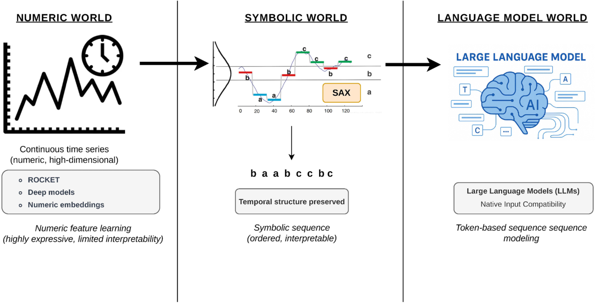

**Fig. 1.** Symbolic time-series representations convert numeric signals into ordered token sequences, aligning temporal data with the native input structure of language 

models. 

fundamentally mismatched with raw, continuous signals due to a lack of inductive biases for physical dynamics (Bellos et al., 2025; Boix-Adsera et al., 2024). Current attempts to bridge this gap—ranging from textreprogramming to multimodal fusion—often discard essential physical semantics or rely on ad hoc encodings that obscure the underlying decision logic (Abdullahi et al., 2025; Li et al., 2025; Zheng et al., 2025). 

We observe that symbolic time-series representations naturally produce ordered token sequences, aligning naturally with the sequential token-based input structure of LLMs (Chen et al., 2026). This observation motivates our proposed framework, SAX_HAR-LLM: a symbolic, kinematics-enriched approach for TSC. By transforming continuous signals into symbolic streams augmented with kinematics-derived descriptors, we represent temporal data into a structured symbolic form compatible with LLM-based sequence modeling. As illustrated in Fig. 1, this alignment allows LLMs to leverage their pre-trained sequential modeling priors without architecture-specific retraining. 

In summary, this paper contributions are threefold: 

- We investigate the relationship between symbolic time-series representations and language-model-based sequence processing, positioning SAX as a structured symbolic interface for temporal data. 

- We introduce a hybrid symbolic–physical representation that preserves interpretability while mitigating information loss inherent in symbolic discretization. 

- We demonstrate that treating TSC as symbolic temporal inference enables competitive performance while maintaining transparency. 

The remainder of this paper is organized as follows: Section 2 reviews the background; Section 3 introduces the dataset; Section 4 presents the SAX_HAR-LLM methodology; and Sections 5–8 cover experimental results, discussion, and conclusions. 

### **2. Background** 

To contextualize the SAX_HAR-LLM framework, it is necessary to examine the evolution of time-series representation and its transition from numeric to symbolic abstractions. Time-series representation transforms high-dimensional data into compact forms suitable for classification, clustering, and anomaly detection (Esling & Agon, 2012; Pappa 

et al., 2024). These methods generally follow a taxonomy of modelbased, data-dictated, or data-adaptive strategies (Pappa et al., 2024). 

Within this taxonomy, SAX represents a critical data-adaptive technique. It reduces dimensionality via Piecewise Aggregate Approximation (PAA) before discretizing segments into a data-driven alphabet (Lin et al., 2003). Critically, SAX maintains a tight lower bound, ensuring symbolic distances approximate Euclidean distances in the original domain (Lin et al., 2007). This property provides the mathematical foundation for converting complex signals into the structured, sequence-like format required for advanced sequence modeling. 

### _2.1. Time series classification (TSC)_ 

TSC algorithms can be broadly categorized according to how they encode temporal information. Distance-based methods operate directly on raw sequences using similarity measures such as Dynamic Time Warping (DTW), avoiding explicit feature construction but suffering from high computational cost and limited interpretability (Liu et al., 2023; Senin & Malinchik, 2013a). Feature-based approaches summarize time series (TS) through statistical or spectral descriptors (e.g., TSFresh (Time Series Feature Extraction based on Scalable Hypothesis tests) (Christ et al., 2018)), improving transparency at the expense of fine-grained temporal structure (Middlehurst et al., 2024). Kernel-based and convolutional methods, including ROCKET (RandOm Convolutional KErnel Transform)-style models (Dempster et al., 2020, 2021; Tan et al., 2022), generate large numerical feature sets through randomized transformations, achieving strong performance but offering little insight into how temporal patterns influence predictions. 

While deep learning and ensemble methods dominate benchmark accuracy (Lee et al., 2024; Lines et al., 2016; Middlehurst et al., 2021), their high computational cost and lack of transparency remain significant hurdles. Convolutional approaches, such as ResNet (Residual Network), utilize residual connections to capture hierarchical temporal patterns (He et al., 2016), while InceptionTime further improves on this by ensembling multi-scale kernels to achieve state-of-the-art performance (Ismail Fawaz et al., 2020). To bridge the gap between spatial features and long-range temporal context, DeepConvLSTM integrates convolutional layers with LSTMs (Ordóñez & Roggen, 2016). As a departure 

2 

_Expert Systems With Applications 332 (2027) 133478_ 

##### _L. Pappa et al._ 

from these recurrent and convolutional designs, the Vanilla Transformer (Vaswani et al., 2017) introduced a purely attention-based framework, providing a robust baseline for evaluating how modern sequence modeling compares to traditional TSC architectures. 

In contrast, symbolic representations occupy a distinct position between numeric abstraction and semantic interpretability. By discretizing continuous signals into symbolic sequences, these methods preserve temporal structure in a compact, human-interpretable form. SAX is foundational in this space, converting TS into symbolic words (Lima et al., 2021). Dictionary-based classifiers built on SAX, such as BOP (Bag-of-Patterns) (Lin et al., 2012), laid the groundwork for frequencybased classification. This paradigm was subsequently extended to highdimensional data by MBOP (Multivariate Bag-of-Patterns) (Ordonez et al., 2011; Pappa et al., 2020), which aggregates symbolic distributions across multiple synchronized channels to capture inter-variable correlations. 

Further refinements include SAX-VSM (Symbolic Aggregate approXimation-Vector Space Model) (Senin & Malinchik, 2013b), and SAA-SAX (Slopewise Aggregate Approximation-SAX) (Pappa et al., 2021, 2022), encode temporal behavior as frequency-based representations that remain computationally efficient and semantically traceable. Extensions such as SFA (Symbolic Fourier Approximation) (Schäfer & Högqvist, 2012) and BOSS (Bag-of-SFA-Symbols) (Schäfer, 2015) improve discriminability through frequency-domain discretization, though often at the cost of temporal interpretability and memory efficiency. Similar discretization techniques have been explored in recent literature, such as constraining the continuous input space into predefined numerical symbol subsets to elicit a model’s pattern-reasoning skills (Guo et al., 2025). 

Importantly, symbolic representations also offer a conceptual bridge between time-series analysis and sequence-based learning. Unlike highdimensional numerical embeddings, symbolic sequences explicitly encode temporal structure as ordered tokens, making them naturally compatible with models designed for sequential reasoning. 

### _2.2. Symbolic sequences as inputs to sequence-based models_ 

Building on this compatibility, symbolic sequences have been effectively processed across domains using models that operate on discrete tokens. In natural language processing, symbols are mapped to distributed embeddings to enable compositional reasoning, often at the cost of obscuring original symbol identities (Ferrone & Zanzotto, 2020). Beyond natural language processing, symbolic sequences are interpreted through structured operators: for example, GNN-QE (Graph Neural Network Query Executor) executes First-Order Logic queries expressed as symbolic sequences (Zhu et al., 2022), neuro-symbolic temporal reasoners verify execution traces against Linear Temporal Logic specifications (Lorello et al., 2025), and planning-based models treat sequences as action traces with preconditions and effects (Asai & Muise, 2020). 

These examples highlight a common principle: transforming numeric data into symbolic tokens enables direct use of sequence reasoning models. In this view, symbolic time-series representations are structured sequences analogous to text, aligning with symbolic approaches in human activity understanding where discrete actions and rules support interpretable reasoning (Wu et al., 2023). 

However, purely symbolic representations have limitations. Discretization and normalization can remove essential physical information, such as absolute magnitude or gravity, leading to ambiguity in real-world settings (Nawaz et al., 2025; Wu et al., 2023). Conversely, neural-only models offer robustness but obscure symbolic structure and decision logic. Recent neuro-symbolic approaches aim to balance these trade-offs, yet symbolic time-series representations are still rarely treated as first-class token sequences for modern sequence models (Nawaz et al., 2025; Yu et al., 2023). 

This gap highlights the need for representations that preserve physical semantics while remaining compatible with sequence-based models. 

For instance, Onchis and Hogea (2025) demonstrate a one-dimensional Transformer augmented with logical constraints for fault diagnosis, achieving higher F1-scores than a transformer alone while yielding interpretable classifications. Complementing this, Zhang et al. (2026) address the modality gap in industrial systems by introducing a Neural Frequency Tokenizer (NFT) that discretizes vibration signals into quantized frequency tokens. By treating these spectral features as a symbolic language, their RMD-LLM (Retrieval-augmented MotionDiffuseLLM) framework enables a frozen LLM to interpret physical fault patterns through semantic instruction alignment, achieving state-of-the-art generalization across heterogeneous machinery. 

### _2.3. LLMs for sequential modeling_ 

Recent advances in LLMs show that these architectures possess emergent capabilities for sequential and symbolic reasoning, extending beyond surface-level language generation (Miao et al., 2024; Wei et al., 2022). A central mechanism enabling this behavior is Chain-of-Thought (CoT) prompting, which encourages models to generate intermediate reasoning steps, allowing them to decompose complex problems into structured sequences of symbolic operations (Qi et al., 2025; Wei et al., 2022). This paradigm has proven effective across arithmetic reasoning, logic puzzles, program execution, and other tasks requiring consistency over long token sequences (Pan et al., 2023). 

Beyond prompting, LLM reasoning capabilities are further strengthened through instruction tuning, distillation, and neuro-symbolic integration. For example, temporal relational reasoning can be transferred from large teacher models to smaller students via knowledge distillation, improving event sequencing and narrative coherence (Song et al., 2025). Neuro-symbolic frameworks such as Logic-LM explicitly decouple language understanding from formal inference by translating text into symbolic representations—e.g., First-Order Logic or constraints—that are executed by deterministic solvers, reducing hallucinations and improving logical faithfulness (Pan et al., 2023). Similarly, ProverGen separates symbolic proof construction from linguistic realization, demonstrating improved robustness on out-of-distribution reasoning tasks (Qi et al., 2025). Collectively, these works establish that LLMs function effectively as processors of structured symbolic token sequences, particularly when temporal or logical dependencies are explicit. 

Despite these strengths, LLMs are poorly suited to ingest raw continuous time-series signals. Directly feeding continuous TS into LLMs presents a fundamental challenge because raw sequences inherently lack semantic units and clear discrete structures (Chen et al., 2025). To address this mismatch, recent work has explored transforming temporal data into abstract symbolic forms before applying LLM-based sequence modeling. Since a single numerical time step lacks specific semantics (Wu et al., 2025), constraining continuous inputs into predefined symbolic or discrete subsets bridges this modality gap and actively unlocks the latent pattern-matching capacities embedded in pretrained sequence models (Guo et al., 2025). Theoretical analysis show that Transformers can perform relational reasoning when inputs are encoded as symbolic strings, effectively operating over template-like structures (Boix-Adsera et al., 2024). Decomposition-based frameworks such as TEMPO further demonstrate that introducing symbolic structure— e.g., trend and seasonality components—helps align LLMs with timeseries distributions (Cao et al., 2024). 

### _2.4. LLMs used on time series_ 

The adaptation of LLMs for time-series analysis has evolved into a distinct research domain, primarily categorized into four methodological paradigms (Zhang et al., 2024). The first approach, Prompting, treats numerical data as raw text or digits, framing tasks as next-token prediction to leverage the LLM’s inherent sequential modeling (Abdullahi et al., 2025; Gruver et al., 2023). This is exemplified by PromptCast 

3 

_Expert Systems With Applications 332 (2027) 133478_ 

_L. Pappa et al._ 

(Xue & Salim, 2023), which transforms numerical data into sentenceto-sentence templates, and LLMTime (Gruver et al., 2023), which utilizes digit-level tokenization to ensure the consistent representation of temporal values. The second paradigm, Time Series Quantization, discretizes continuous signals into symbolic tokens that the LLM can natively process. A notable example is LLM-ABBA (LLM-Adaptive Brownian Bridge-based symbolic Aggregation) (Chen et al., 2026), which employs adaptive symbolic aggregation to match state-of-the-art benchmarks. Similarly, Numerical Greedy Tokenization constrains the input space to predefined numerical symbol subsets to unlock latent reasoning while avoiding natural language interference (Guo et al., 2025). By transforming continuous values into abstract symbolic or discrete units, these methods translate the intrinsic syntax of TS into token sequences that the LLM can natively process (Liu et al., 2026). 

Third, Aligning utilizes neural encoders to map continuous temporal embeddings into the semantic space of the language model. This is exemplified by reprogramming frameworks like Time-LLM (Jin et al., 2024) and TEST (Sun et al., 2024), which align signal patches with textual prototypes (Pan et al., 2024), and fine-tuning strategies like GPT4TS that adapt pre-trained attention patterns to temporal data (Zhou et al., 2023). Fourth, Vision as a Bridge utilizes visual or spatial representations as an intermediate modality. For example, IMUGPT synthesizes 3D human motion sequences from textual descriptions to derive virtual Inertial Measurement Unit (IMU) sensor signals through the principles of motion kinematics (Leng et al., 2023). 

Beyond these categorical mappings, another emerging trend focuses on the granular enrichment of temporal features. To deepen this multimodal fusion, recent frameworks employ feature-aware processing to augment numerical patches with explicit semantic descriptions and mathematical statistics tailored to each specific variable’s domain context (Wu et al., 2025). Other advanced architectures utilize hierarchical text summarization combined with bidirectional co-attention mechanisms, ensuring that textual semantics and temporal dynamics mutually reinforce each other without losing their respective structural integrity (Zhang et al., 2025). 

### _2.5. Current challenges and the SAX_HAR-LLM proposal_ 

Despite these advancements, the efficacy of applying LLMs to TS remains a subject of rigorous debate. While LLMs demonstrate strong zero-shot generalization in data-scarce scenarios, comprehensive ablation studies reveal that simple linear models or basic attention layers often achieve comparable or superior performance with significantly lower computational costs (Abdullahi et al., 2025; Tan et al., 2024). Furthermore, recent analyses suggest that reprogramming techniques may result in pseudo-alignment, where the model transfers the centroid of time-series data without genuinely aligning the data manifold with the language space, thereby failing to fully utilize the LLM’s reasoning capabilities (Zheng et al., 2025). Critical challenges also persist regarding the fundamental mismatch between continuous signals and discrete text tokens (Bellos et al., 2025), as well as tokenization inefficiencies that hinder the modeling of high-precision numerical dependencies (Li et al., 2025). Recent work on Unified Temporal Tokenization proposes a hybrid semantic–numeric encoding that preserves cyclical temporal information in token form Hettiarachchi (2025), reinforcing the importance of domain-specific tokenization for time-aware LLMs. 

Although the above subsections discuss multiple challenges across symbolic, neural, and LLM-based time-series methods, Table 1 consolidates the key limitations that motivate the proposed framework. To address the limitations of existing approaches, we propose a principled alignment strategy that bridges the continuous–discrete gap while preserving semantic integrity. To this end, we leverage SAX to discretize continuous signals into symbolic tokens, establishing a direct structural alignment between sensor data and the text-based interface of LLMs. To compensate for the information removed by discretization and normalization, we inject lightweight kinematics-informed descriptors into the 

model input. This design builds on a simple but powerful observation: SAX already produces ordered symbolic sequences, precisely the type of input over which language models excel. Consequently, LLMs are not applied arbitrarily to time-series data; rather, symbolic time-series representations naturally inhabit the same discrete, sequential space as linguistic data. By augmenting symbolic sequences with complementary physical descriptors, the proposed framework preserves model transparency while grounding symbolic analysis in real-world constraints. 

### **3. Dataset** 

We have examined and tested the proposed methodology in a wellknown dataset, which permitted to polish, adapt and justify our approach. We conduct our experiments on the WISDM Smartphone and Smartwatch Activity and Biometrics Dataset (Weiss, 2019), a widely used benchmark for human activity recognition collected from 51 subjects performing daily activities. More specifically, we focus on a subset of the dataset consisting of five core activities: _Walking_ , _Jogging_ , _Stairs_ , _Sitting_ , and _Standing_ . These activities capture fundamental locomotion and posture-related motions and are commonly used in smartphonebased activity recognition. 

We use sensor data exclusively from the smartphone, which was carried in the subject’s pocket, and consider both the accelerometer and gyroscope modalities. Each sensor provides triaxial measurements along the _𝑥_ , _𝑦_ , and _𝑧_ axes. Each activity recording in the selected subset has duration of 180 seconds, sampled at approximately 20 Hz, yielding about 3600 samples per axis. Data from smartwatch and hand-oriented activities are excluded from our analysis. The selected activities are approximately class-balanced in the original dataset, with each activity accounting for roughly 5–6% of the total recordings. All sensor readings are annotated with activity labels and subject identifiers, enabling subject-independent evaluation protocols. 

To further validate generalizability, we also evaluate on the MotionSense dataset (Malekzadeh et al., 2018), a benchmark for smartphonebased human activity recognition collected from 24 subjects performing six activities. Specifically, we use the standard subset comprising _Downstairs_ , _Upstairs_ , _Walking_ , _Jogging_ , _Standing_ , and _Sitting_ , which captures both locomotion and posture dynamics. Sensor data includes both accelerometer and gyroscope modalities from an iPhone 6s carried in the front pocket, providing triaxial measurements along the _𝑥_ , _𝑦_ , and _𝑧_ axes at 50 Hz sampling rate. 

### **4. Methodology** 

We propose SAX_HAR-LLM, a supervised approach, in which a pretrained LLM is adapted and fine-tuned to the activity recognition task using structured prompt–completion pairs derived from symbolic and kinematics-informed representations of sensor TS. This design is motivated by the observation that symbolic representations effectively capture temporal structure but often discard absolute physical information due to normalization, while physical descriptors retain magnituderelated cues but lack expressive temporal abstraction. Fig. 2 illustrates the proposed dual-stream pipeline, highlighting the separation between symbolic encoding based on globally normalized signals and kinematicsinformed feature extraction. In more detail, raw sensor signals first undergo signal conditioning and preprocessing. The conditioned signal is then processed through two parallel streams: a symbolic stream, where global z-normalization is applied once to the full signal prior to windowing and SAX transformation, and a kinematics-informed stream, where window-level statistical descriptors are extracted from the conditioned but non-normalized signal to preserve absolute physical information. The resulting symbolic strings and physical context are fused during prompt construction and processed by an LLM for sequence-level inference and activity classification. 

4 

_Expert Systems With Applications 332 (2027) 133478_ 

_L. Pappa et al._ 

**Table 1** 

Summary of major methodological families for time-series classification and analysis, highlighting their key strengths and the principal limitations identified in the literature reviewed in 2. 

|**Methodological** **Family**|**Key** **Strengths**|**Limitations** **Identifed** **in** **Literature**|
|---|---|---|
|Distance-based TSC (e.g., DTW)|No feature engineering, strong align- ment|High computational cost; poor scalabil- ity; limited interpretability|
|Feature-based TSC (e.g., TSFresh)|Interpretable features|Loss of temporal ordering; weak long- range dependency modeling|
|Convolutional / Kernel methods (ROCKET, etc.)|High accuracy; efcient training|Large opaque feature spaces; limited ex- plainability|
|Deep learning ensembles|State-of-the-art accuracy|Computationally expensive; black-box behavior|
|Symbolic TS (SAX, SFA, BOSS)|Interpretability; efciency; lower- bounding|Loss of physical magnitude; ambiguity after normalization|
|LLM-based TS (numeric or text-reprogrammed)|Zero-shot capability; long-range depen- dency modeling|Continuous–discrete mismatch; inef- cient tokenization; pseudo-alignment|

### _4.1. Problem definition_ 

We consider the problem of multivariate time-series classification in the context of human activity recognition. Let 

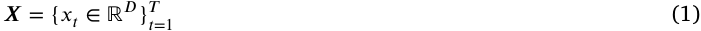

denote a multivariate TS of length _𝑇_ with _𝐷_ sensor channels, where each observation corresponds to synchronized measurements from multiple inertial sensors (e.g., tri-axial accelerometer and gyroscope). Each TS **_𝑿_** is associated with a discrete activity label _𝑦_ ∈ , where  denotes a finite set of activity classes. 

The objective is to learn a function 

_𝑓_ ∶  →  (2) 

that maps a TS **_𝑿_** to its corresponding activity label _𝑦_ . In contrast to approaches that operate directly on continuous numeric representations, we focus on classification based on symbolic and physically informed representations derived from **_𝑿_** . Specifically, the TS is transformed into (i) an ordered symbolic sequence capturing temporal structure and (ii) complementary physical descriptors that preserve absolute magnitude information. These representations are jointly used to support sequencelevel inference and activity classification. 

### _4.2. Signal conditioning and preprocessing_ 

Raw inertial sensor signals are affected by noise and sampling irregularities which can hinder representation learning. To ensure robustness, signal conditioning is tailored to the native characteristics of each dataset. For the WISDM dataset, tri-axial accelerometer and gyroscope signals are resampled to a uniform frequency of 20 Hz. In contrast, MotionSense observations are retained at their native 50 Hz sampling frequency. Both datasets are subsequently denoised using a median filter (window size 3) followed by a second-order Butterworth low-pass filter with a 5 Hz cutoff frequency. This cutoff is widely utilized in HAR to isolate the low-frequency components of human motion from highfrequency noise (Lara & Labrador, 2012; Long et al., 2009). Furthermore, a 20 Hz sampling rate is sufficient for capturing human kinematics, as 99% of signal energy associated with body motion is concentrated below 15 Hz (Anguita et al., 2013). 

Temporal artifacts related to device handling are addressed through dataset-specific cropping. For WISDM, which features 180-second recordings, we remove the first 15 seconds to exclude initial transient artifacts. For MotionSense, we apply a symmetric 3-second crop to both the beginning and end of each trial to exclude artifacts from pocketing and unpocketing the device. 

Device orientation variability is addressed using the alignment protocol of rWISDM (Heydarian & Doyle, 2023), where the gravitational 

vector is used to standardize the reference frame. While this vector is estimated from the accelerometer mean for WISDM, the MotionSense pipeline leverages pre-computed device-motion attributes to directly extract the gravitational component. In both cases, axis polarity is corrected to enforce a consistent gravity direction, and axes are permuted to align the dominant gravity component with the vertical Y-axis. 

Finally, z-normalization is applied per channel over the full signal to mitigate the influence of varying signal magnitudes across subjects (Proakis & Manolakis, 2007). For each sensor channel _𝑋_ = { _𝑥_ 1 _,_ … _, 𝑥𝑛_ }, the normalized value _𝑧𝑖_ is computed as: _𝑧𝑖_ =_𝑥𝑖_−_𝜇_ (3) _𝜎_ where _𝜇_ and _𝜎_ represent the mean and standard deviation of the signal, respectively. 

A parallel non-normalized version of the conditioned signal is retained for extracting kinematics-informed descriptors. These two aligned representations form the input to the proposed dual-stream pipeline. 

### _4.3. Dual-stream representation construction_ 

After signal conditioning and preprocessing, each activity instance is represented through a dual-stream construction that separates symbolic temporal abstraction from physical magnitude preservation (Figure 2). We maintain two aligned signal representations that are processed in parallel and later fused during prompt construction. 

### _4.3.1. Symbolic stream: SAX-based temporal encoding_ 

The symbolic stream aims to encode the temporal structure of sensor signals in a discrete, structured form suitable for sequencelevel modeling. To this end, global z-normalization is applied per full signal and per channel prior to segmentation. Following normalization, the TS is segmented into overlapping sliding windows of fixed duration. Each window is then transformed using SAX. 

The SAX transfomration is permormed as follows. First, Piecewise Aggregate Approximation (PAA) is applied to reduce a window of length _𝑛_ into a _𝑤_ -dimensional vector _̄𝑋_ = { _̄𝑥_ 1 _,_ … _,̄ 𝑥𝑤_ }. Each element _̄𝑥𝑖_ is calculated as the mean value of the signal within the _𝑖_ -th segment: 

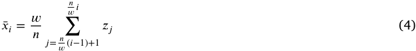

where _𝑛_ is the original window length and _𝑤_ is the number of segments. Subsequently, these PAA coefficients are discretized into symbols from a finite alphabet of size _𝑎_ . This is achieved by mapping each 

5 

_Expert Systems With Applications 332 (2027) 133478_ 

_L. Pappa et al._ 

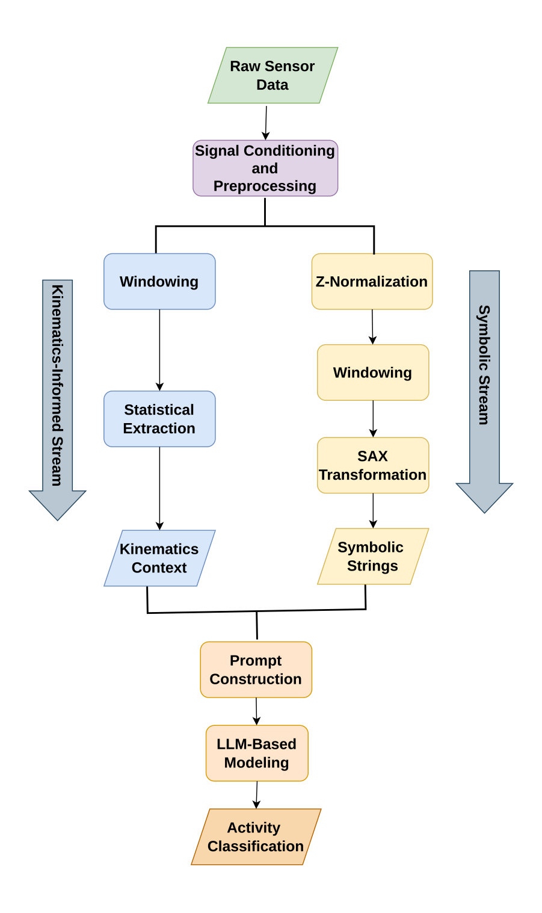

**Fig. 2.** The pipeline of the proposed dual-stream methodology. 

_𝑥𝑖_ to a symbol based on a set of breakpoints _𝐵_ = { _𝛽_ 1 _,_ … _, 𝛽𝑎_ −1}. These breakpoints are determined such that they produce equal-sized areas under a standard Gaussian curve (Lin et al., 2003). A coefficient _̄𝑥𝑖_ is mapped to the symbol _𝛼𝑗_ if _𝛽𝑗_ −1 ≤ _̄ 𝑥𝑖 < 𝛽𝑗_ .This process produces symbolic token sequences for each sensor channel, preserving the coarse temporal shape and ordering while substantially reducing dimensionality. Importantly, by operating on globally normalized signals, the resulting symbolic sequences are comparable across windows, subjects, and activities, enabling consistent downstream modeling. 

Fig. 3 provides a conceptual illustration of the SAX pipeline, highlighting how continuous signals are mapped to compact symbolic representations. In Lin et al. (2003, 2007), Pappa et al. (2020, 2021, 2025, 2024) the reader may find detailed description of the method’s implementation steps. 

_Trend-Aware Symbolic Quantization._ While standard SAX effectively discretizes the amplitude of sensor signals, the segment-wise averaging inherent in its construction results in lossy compression by removing intra-segment temporal detail. Consequently, local peaks, valleys, and 

6 

_Expert Systems With Applications 332 (2027) 133478_ 

_L. Pappa et al._ 

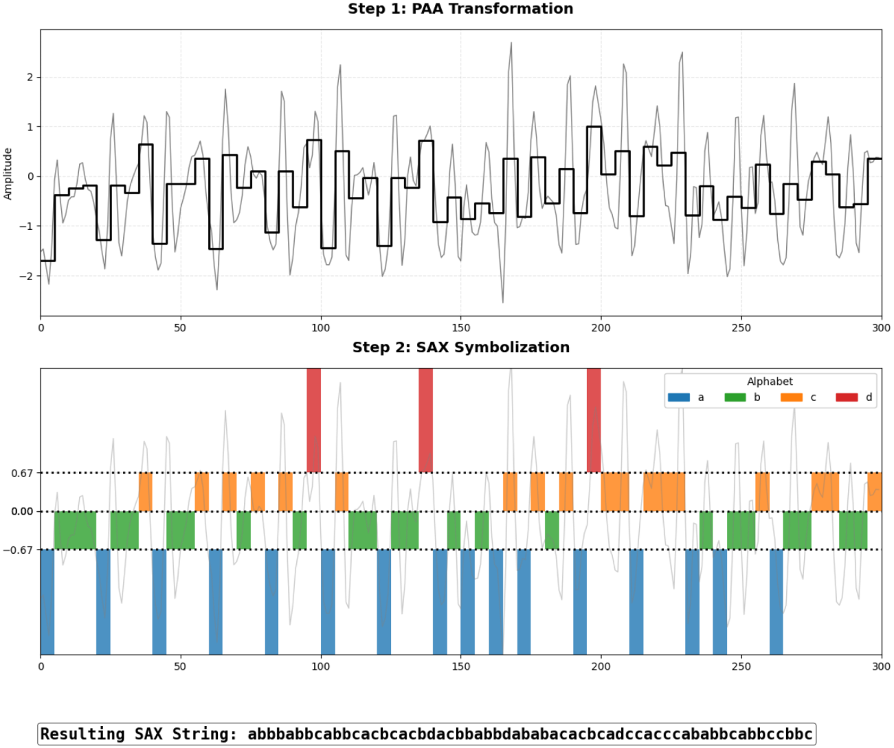

**Fig. 3.** Overview of the SAX-based symbolic representation process. A continuous TS (gray) is dimensionality-reduced via PAA (black step function). These PAA segments are then mapped to discrete symbols (e.g., ’a’–’d’) using Gaussian distribution breakpoints. The generated SAX string is ’abbbabbcabbcacbcacbdacbbabbdababacacbcadccacccababbcabbccbbc’. 

rapid changes are lost, a limitation extensively discussed in the relevant review by Pappa et al. (2024). In the context of human activity recognition, however, the direction of change in the signal is often as informative as its magnitude. 

To recover the local temporal dynamics lost during the aggregation process, we introduce here the augmentation of the standard SAX representation with a trend-encoding mechanism. While the PAA step captures the average magnitude of a segment, it discards the direction of change (the signal derivative), which is critical for distinguishing kinematic phases such as sharp upward slopes or gradual signal leveling. 

We address this by calculating the slope _𝑚𝑖_ of the raw data points within each PAA segment using first-order linear regression (Montgomery et al., 2012). This slope represents the instantaneous trajectory of the sensor signal. To filter out minor sensor noise and isolate significant movements, we define a trend threshold _𝜀_ = 0 _._ 05, which corresponds to an angle of about 3◦ from the horizontal axis and thus represents a very gentle trend. By choosing such a small value for _𝜀_ , we treat flatter trends as effectively flat and require at least this level of inclination to classify a segment as up or down. More precisely, _𝜀_ serves as a tolerance band around zero slope: if the fitted slope _𝑚𝑖_ satisfies | _𝑚𝑖_ | ≤ _𝜖_ then the segment is treated as flat because its trend is too weak to confidently call up or down. The classification rule is therefore specified as 

follows: 

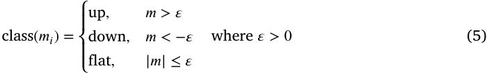

where _𝜖_ is the minimum slope magnitude needed to count as a meaningful trend. 

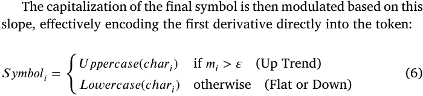

Fig. 4 demonstrates the resulting Trend-Aware SAX transformation, highlighting how slope information is visually encoded through color intensity and symbolically encoded through character case. By mapping the signal’s derivative to the character’s case, we double the semantic density of our vocabulary without increasing the sequence length. This allows the model to differentiate between "high-energy rising" states and "high-energy falling" states purely through symbolic context. 

7 

_Expert Systems With Applications 332 (2027) 133478_ 

_L. Pappa et al._ 

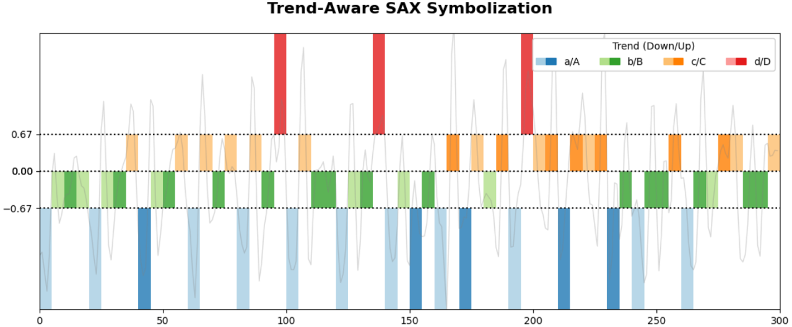

**Fig. 4.** Visualization of the Trend-Aware SAX Transformation. Unlike standard SAX, our approach encodes local temporal dynamics into the symbol’s case: segments with a positive slope (increasing trend) are mapped to uppercase letters and depicted in darker color tones, while segments with a negative or neutral slope are mapped to lowercase letters and lighter color tones. The generated SAX string is ’abBbabBcAbBcacBcacBDacBBabBDabABaCAcbCaDcCACcCABaBBCaBbCcBBc’. 

### _4.3.2. Kinematics-informed stream_ 

In parallel with the SAX-based symbolic stream, we introduce a kinematics-informed stream that provides complementary low-level descriptors from the raw sensor data. As detailed in Section 4.2, the data have undergone an orientation normalization step following the rWISDM protocol (Heydarian & Doyle, 2023). This procedure aligns the accelerometer and gyroscope axes with a consistent physical reference frame, ensuring that the Y-axis consistently captures the vertical gravitational component while preserving the Z-axis signature required for posture differentiation. 

To preserve the physical context lost during symbolic discretization, we extract three statistical descriptors (Kwapisz et al., 2011) per analysis window directly from the accelerometer signal. From the gravityaligned vertical axis (Y-axis), we compute the mean acceleration ( _𝜇𝑦_ ) and standard deviation ( _𝜎𝑦_ ). Additionally, we extract the mean Z-axis acceleration ( _𝜇𝑧_ ) to capture device inclination. This selection is physically grounded: _𝜇𝑦_ quantifies the primary gravitational component, establishing the device’s vertical orientation. The standard deviation ( _𝜎𝑦_ ) serves as a robust proxy for motion intensity, where high variability distinguishes dynamic activities (e.g., _Jogging_ ) from static states (Kwapisz et al., 2011). Crucially, the inclusion of the Z-axis mean ( _𝜇𝑧_ ) assists in resolving the ambiguity between _Standing_ and _Sitting_ ; while both are static (low _𝜎𝑦_ ), _Sitting_ induces a distinct gravitational shift to the Z-axis due to the horizontal orientation of the thigh. This triad of descriptors provides the necessary physical constraints to validate the symbolic classifications. 

It is important to emphasize that we compute these statistics per window on the raw oriented signal, prior to the global standardization applied for the symbolic stream. While the SAX stream utilizes data standardized over the full TS, the kinematics-informed descriptors are derived from the raw orientation-normalized values. This ensures that the absolute gravitational offset and motion magnitude are preserved in the kinematics-informed stream, explicitly compensating for the amplitude information lost during the symbolic discretization process. 

as a semantic narrative, encouraging the model to hierarchically process over physical constraints before interpreting symbolic signal patterns. 

Each prompt corresponds to a fixed-length sensor window and is composed of three elements. First, a concise instruction explicitly defines the task as activity classification. Second, window-level physical descriptors derived from the kinematics-informed stream summarize the global physical state of the motion and provide physically meaningful priors. Third, the local temporal dynamics are represented through symbolic sequences generated by the proposed trend-aware SAX representation for each accelerometer and gyroscope axis. This symbolic encoding preserves temporal structure and directional trends while substantially reducing dimensionality. 

All components are presented in a structured and consistent textual format, with explicit labels for each sensor modality and axis. This unified representation allows the LLM to jointly integrate over heterogeneous information sources, numerical summaries and symbolic temporal patterns, within a single linguistic framework, effectively bridging continuous sensor data and symbolic modeling. During fine-tuning, the activity label is provided exclusively as the target completion, while the prompt terminates with the class delimiter, ensuring a clean separation between conditioning context and supervision. 

An example of a constructed prompt is shown below: 

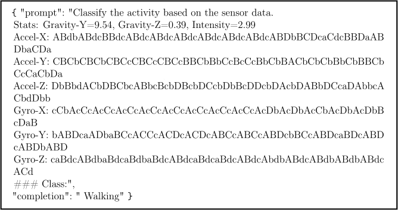

### _4.4. Prompt construction_ 

### _4.5. LLM fine-tuning and inference_ 

To enable the LLM to operate as a structured sequence-modeling framework for activity recognition, we design a structured prompt (Sun et al., 2025) that integrates global physical context with local temporal dynamics. Unlike conventional time-series models that ingest raw numerical tensors, our approach reformulates multivariate sensor windows 

This section presents the formulation of the LLM-based activity recognition framework, including the rationale for the promptcompletion design. We then describe the fine-tuning procedure and inference pipeline. 

8 

_Expert Systems With Applications 332 (2027) 133478_ 

_L. Pappa et al._ 

### _4.5.1. LLM formulation and prompt design_ 

We fine-tune a Mistral-7B causal language model (Jiang et al., 2023) using supervised instruction tuning on structured prompt–completion pairs derived from symbolic and kinematics-informed representations of sensor TS. We selected Mistral-7B as the backbone due to its architectural optimizations for efficiency and long-context modeling. Specifically, it employs Sliding Window Attention (SWA) to effectively handle sequences of arbitrary length with reduced inference cost. Furthermore, it leverages Grouped-Query Attention (GQA) for accelerated inference and has been demonstrated to outperform larger counterparts, such as Llama 2 13B, across all evaluated performance benchmarks (Jiang et al., 2023). Fine-tuning is performed using parameter-efficient adaptation to preserve the general linguistic and sequential modeling capabilities of the base model while specializing it for activity recognition (see Fig. 5). Each training example consists of a prompt terminating with a class delimiter and a completion containing the ground-truth activity label. During training, the prompt and completion are concatenated into a single sequence, and the model is optimized to maximize the likelihood of the completion tokens conditioned on the prompt. This formulation casts activity recognition as a conditional next-token prediction task (Gruver et al., 2023), eliminating the need for a task-specific classifier head. 

We opt for a causal autoregressive architecture over encoder-only models because activity recognition is formulated here as prompt completion rather than standard classification. This formulation is natively aligned with next-token prediction models, which are trained to generate coherent continuations of structured sequential inputs, which is precisely the role the symbolic SAX prompt plays in our framework. 

It is worth noting that the trend-aware SAX encoding introduces uppercase and lowercase variants of the same symbolic level to represent directional changes in the signal. Under the Mistral-7B tokenizer, these symbols are treated as distinct discrete tokens with independent embeddings rather than as explicitly related uppercase/lowercase pairs. Consequently, the intended relationship between symbols such as "A" and "a" is not structurally encoded in the tokenizer itself. However, because these token distinctions are applied consistently throughout fine-tuning, the model can still learn statistical associations between case-based token variants and trend direction during adaptation. We acknowledge that the case relationship is therefore implicitly learned rather than explicitly preserved, and that designing tokenization strategies which structurally encode such relationships remains an open direction for future work. 

### _4.5.2. Fine-tuning and inference_ 

We employ QLoRA (Dettmers et al., 2023), combining 4-bit NormalFloat (NF4) quantization with double quantization and bfloat16 computation to minimize memory overhead while maintaining numerical fidelity. Low-Rank Adaptation (LoRA) modules (Hu et al., 2022) are injected into all attention and feed-forward projection layers with rank _𝑟_ = 32, scaling factor _𝛼_ = 16, and dropout of 0.1, while biases remain frozen. Fine-tuning is executed via the TRL SFTTrainer (von Werra et al., 2020) over 12 epochs for WISDM (8 for MotionSense) with a maximum sequence length of 1024 tokens. The optimal number of training epochs was determined empirically by monitoring classification accuracy on a held-out validation set (20% of training windows). Training was performed for up to 15 epochs with checkpoints saved at each epoch boundary. Validation accuracy peaked at epoch 12 (95.68%) for WISDM and at epoch 8 for MotionSense, after which performance degraded consistently, confirming these as the optimal stopping points (see Fig. 6). The final model was retrained on the complete training set for exactly 12 epochs (8 epochs for MotionSense). 

We utilize the paged AdamW optimizer (Dettmers et al., 2023) to manage memory spikes, with a learning rate of 2 × 10−4 , weight decay of 0.001, and a warm-up ratio of 0.03. Throughout this process, only the adapter parameters are updated, preserving the pre-trained knowledge of the quantized base and ensuring that its general sequential modeling and linguistic capabilities remain intact. The full configuration of hyperparameters is detailed in Table 2. All the experiments were conducted on 

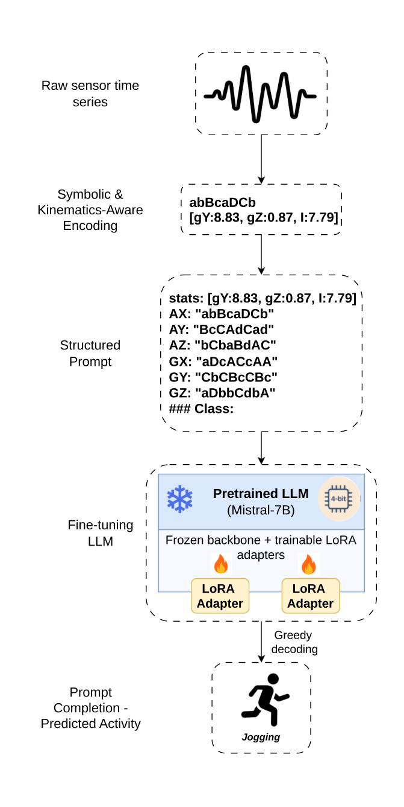

**Fig. 5.** Overview of the proposed framework. Raw inertial signals are transformed into dual-stream symbolic (SAX) and physical descriptors to construct structured prompts. These inputs guide a frozen, 4-bit quantized LLM, which is adapted via trainable LoRA adapters to predict activity labels. 

a workstation equipped with an AMD Ryzen Threadripper PRO 7975WX processor (32 physical cores, 64 threads), 512 GB of system RAM, and an NVIDIA RTX 6000 Ada Generation GPU with 48 GB of VRAM. 

This fine-tuning strategy allows the LLM to learn the structural regularities of symbolic SAX sequences and their association with physical context, while retaining the strong sequence modeling and contextual abstraction of the pretrained model. 

At inference time, activity recognition is performed through deterministic prompt completion using the fine-tuned LoRA-adapted LLM. For each unseen sensor window, a prompt is constructed using the same structured format as during training, including symbolic SAX sequences and kinematics-informed descriptors, and terminating with the class delimiter. No activity label is included in the prompt. The base Mistral- 

9 

_Expert Systems With Applications 332 (2027) 133478_ 

_L. Pappa et al._ 

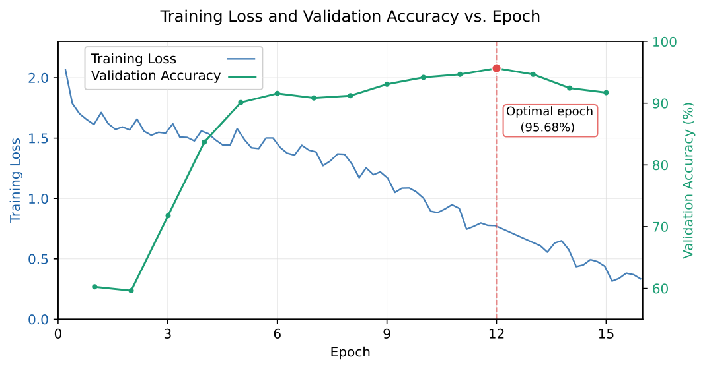

**Fig. 6.** Training loss and validation accuracy during model optimization on the WISDM dataset. The model was trained for 15 epochs with validation accuracy evaluated at each checkpoint. Validation accuracy peaks at epoch 12 (95.68%) followed by consistent degradation, providing empirical evidence against overfitting and justifying the optimal epoch selection. 

**Table 2** 

Hyperparameter configuration for Supervised Instruction Tuning (SFT) using QLoRA. The number of epochs refers to the WISDM dataset. 

|**Hyperparameter**|**Value**|
|---|---|
|_Optimization_ _Strategy_||
|Method|QLoRA (4-bit NF4)|
|Optimizer|Paged AdamW (32-bit)|
|Precision|bfoat16|
|_LoRA_ _Confguration_||
|Rank|32|
|Scaling Factor|16|
|Target Modules|Attention + Feed-Forward|
|Dropout|0.1|
|_Training_ _Schedule_||
|Learning Rate|2 × 10−4|
|Scheduler|Constant|
|Epochs|12|
|Batch Size|64|
|Warm-up Ratio|0.03|
|Gradient Clipping|0.3|

7B model is loaded in 4-bit quantized form and combined with the finetuned LoRA adapter weights. Given a prompt, the model generates a short continuation corresponding to the predicted activity label. Generation is performed using greedy decoding (do_sample = False) with a maximum of 10 newly generated tokens, which is sufficient to cover all activity names. 

The full generated text is decoded, and the prediction is extracted by isolating the text following the delimiter. To ensure robustness against occasional formatting artifacts or hallucinated continuations, only the first generated line is considered. As a result, inference establishes a direct one-to-one mapping between each symbolic–physical prompt and a single activity label, making the procedure functionally equivalent to standard multi-class classification while operating entirely within a language-model-based generation framework. 

### _4.6. Attention-based interpretability analysis_ 

Since activity recognition is formulated as prompt completion, attention patterns can be examined at inference time to reveal which symbolic motifs and physical descriptors contribute most to label predic- 

tion, without modifying the model or introducing auxiliary explanation mechanisms. This analysis is explicitly framed as descriptive and exploratory: it characterizes the model’s predictive focus rather than establishing causal importance of individual tokens. 

Attention scores are extracted from the final transformer layer, as deeper layers aggregate the high-level semantic information required for classification. Scores are averaged across all attention heads to obtain a stable, noise-robust measure of feature focus per token. 

We define two complementary analysis stages. Stage 1 examines attention from the final prompt token, which in a causal language model aggregates contextual information from the entire input sequence and directly conditions next-token prediction — it is the computational bottleneck through which all input information must pass prior to label generation. Stage 2 examines attention from the first generated label token back to all prompt tokens, directly reflecting which input tokens were referenced when the model committed to the predicted activity class. 

To enable interpretable comparison, all attention scores are interpreted relative to a uniform baseline of 1∕ _𝐿_ , where _𝐿_ is the prompt length in tokens. Under uniform attention, every token receives exactly 1∕ _𝐿_ . A token receiving _𝑘_ × (1∕ _𝐿_ ) attention is therefore _𝑘_ times more focused than expected by chance, making relative importance directly comparable across samples and classes regardless of prompt length variation. 

At the token-group level, prompt tokens are partitioned into two groups: kinematics-informed descriptors (numeric values) and symbolic SAX tokens (alphabetic characters), which encode sensor dynamics as relative deviations from a series-wide baseline, capturing stability, transitions, and oscillatory patterns. Mean attention density per group is computed and normalized to quantify the relative contribution of physical context versus symbolic dynamics at each stage. 

At the motif level, axis-specific symbolic motifs are identified from Stage 2 attention. For each sensor axis within a given activity class, the three most-attended SAX tokens within the axis span are identified, and motifs of fixed length _𝑚_ = 5 symbols are extracted. Motifs are characterized by two independent measures: their Stage 2 attention expressed as a ×baseline multiplier, reflecting attention strength, and their frequency of occurrence across samples, reflecting stability. This dual reporting preserves transparency by keeping the two dimensions independently visible rather than collapsing them into a composite score. 

10 

_Expert Systems With Applications 332 (2027) 133478_ 

_L. Pappa et al._ 

**Table 3** 

Preprocessing and segmentation parameters. 

|**Parameter**|**WISDM**  **MotionSense**|
|---|---|
|Sampling Frequency|20 Hz  50 Hz|
|Conditioning Crop|15 s (Start only)  3 s (Symmetric)|
|Low-pass Filter|Butterworth 2nd-order (5 Hz Cutof)|
|_Windowing_ _Protocol_||
|Window Size (Samples)|300 samples|
|Window Duration (Time)|15 seconds  6 seconds|
|Stride / Overlap|150 samples / 50%|
|_Dataset_ _Statistics_ _after_ _Segmentation_||
|Training Windows|3,243  5,340|
|Validation Windows|810  1,334|
|Test Windows|1,155  1,809|
|Total Windows|5,208  8,483|
|Training Subjects|40  19|
|Test Subjects|11  5|
|_Feature_ _Extraction_||
|PAA Segments|60 segments (20% of window)|
|Alphabet Size|4 (efective 8 with trend encoding)|
|Trend Threshold|0.05|
|Normalization|Z-normalization over full signal (symbolic stream only)|
|Kinematics-informed descriptors|Extracted from non-normalized signal|

### **5. Experimental setup** 

Following the datasets descriptions provided in Section 3, our experimental pipeline transforms the raw sensor recordings into a unified format for sequence modeling. We employ a unified segmentation protocol using sliding windows of 300 samples with a 50% overlap (150-sample stride). This results in fixed-length windows with varying temporal durations: 15 seconds for WISDM and 6 seconds for MotionSense. Each 300-sample window is subsequently compressed into 60 PAA segments (representing 20% of the window length). This ensures that the resulting symbolic strings fed into our model maintain a consistent length and vocabulary across both datasets, regardless of the original sampling frequency. A summary of these technical parameters is provided in Table 3. 

To assess generalization to unseen users, we enable a subjectindependent evaluation protocol; subjects are randomly partitioned into disjoint training and test sets using an 80/20 split. All samples from a given subject appear exclusively in either the training or test set, and this split is fixed across all experiments to ensure reproducibility and prevent subject-specific motion patterns from leaking into evaluation. Performance is measured at the window level, where each window yields a single activity prediction. We report overall classification accuracy as the primary metric, complemented by per-class precision, recall, F1score, and confusion matrices (Theodoridis & Koutroumbas, 2008) to analyze systematic confusions between activities with similar motion characteristics. 

We compare the proposed framework against BOP baselines that rely on the same SAX-based abstraction, ResNet, InceptionTime, MultiROCKET, DeepConvLSTM, Vanilla Transformer and LLM-ABBA (adapted). Additionally, we include a RoBERTa model fine-tuned with a sequence classification head on inputs identical to SAX_HAR-LLM to isolate the contribution of the autoregressive architecture from large-scale pre-training. For both BOP and its multichannel variant MBOP, time-series windows are discretized using SAX with a word length of 3 and an alphabet size of 4. This parameter selection strikes a necessary balance between structural granularity and feature sparsity. Increasing word length or alphabet size would exponentially inflate the dimensionality of the pattern histograms, degrading classifier performance due to the curse of dimensionality (Lin et al., 2012); yet, this selection is met in various published works Pappa et al. (2020, 2021, 2025, 2022). Since lowercase and uppercase symbols are used to encode directional trend information, the effective symbolic vocabulary consists of 8 distinct symbols. Sym- 

bolic words are aggregated into frequency histograms and classified using a Random Forest classifier (Breiman, 2001) with 100 trees, trained on the training subjects and evaluated on the held-out test subjects. 

The proposed method is evaluated using the identical subjectindependent partition employed for baseline experiments, preprocessing, and windowing strategy. For each test window, a structured prompt encoding trend-aware symbolic SAX sequences and kinematics-informed descriptors is provided to a fine-tuned LLM, and the predicted activity label is obtained via prompt completion following a dedicated class delimiter. Each prompt produces exactly one activity prediction, enabling a direct comparison with the symbolic baselines under identical evaluation conditions. 

In particular, the Vanilla Transformer baseline was trained from scratch on inputs identical to SAX_HAR-LLM with all training hyperparameters deliberately aligned with the SAX_HAR-LLM configuration to ensure a controlled comparison where the only variable is the presence or absence of pre-trained weights. The full specification of the Vanilla Transformer is reported in Table 4. 

We evaluate the fine-tuned Mistral-7B model (described in Section 4.5) using greedy decoding to ensure deterministic, reproducible predictions. For each test instance, the model completes the structured prompt, and the text immediately following the class delimiter is mapped directly to the valid activity label set. Details of the experimental setup, model configuration and evaluation protocol are reported in Table 5. 

### **6. Results and analysis** 

In this section, we evaluate the performance of the proposed SAX_HAR-LLM framework against symbolic baselines (BOP, MBOP), deep learning architectures (ResNet, InceptionTime, DeepConvLSTM), a kernel-based classifier (MultiROCKET), and two sequence modeling references sharing the same backbone or input representation (Vanilla Transformer, RoBERTa), alongside LLM-ABBA as the closest published symbolic-LLM method. All comparisons are conducted on both WISDM and MotionSense under a subject-independent protocol. The section covers main quantitative results, a paired statistical comparison, an ablation study, attention and motif analysis, and a computational cost comparison. Despite the inherent stochasticity of adapter training, performance variance is minimal as the pre-trained backbone remains frozen and inference utilizes deterministic greedy decoding. 

11 

_Expert Systems With Applications 332 (2027) 133478_ 

_L. Pappa et al._ 

**Table 4** 

Hyperparameter configuration for the Vanilla Transformer baseline. The number of epochs refers to the WISDM dataset. 

|**Hyperparameter**|**Value**|
|---|---|
|_Model_ _Architecture_||
|Number of Layers|3|
|Attention Heads|4|
|Embedding Dimension|128|
|FFN Dimension|256|
|Dropout|0.1|
|Trainable Parameters|563,845|
|_Optimization_ _Strategy_||
|Optimizer|AdamW|
|Precision|bfoat16|
|_Training_ _Schedule_||
|Learning Rate|2 × 10−4|
|Scheduler|Constant|
|Epochs|12|
|Batch Size|64|
|Warm-up Ratio|0.03|
|Gradient Clipping|0.3|
|Weight Decay|0.001|

Table 6 and Table 7 present the class-wise Precision (P), Recall (R), and F1-score (F1) for SAX_HAR-LLM alongside all baselines, together with overall classification accuracy for WISDM and MotionSense datasets, respectively. 

On the WISDM dataset, SAX_HAR-LLM achieved an overall accuracy of 92.29%, representing a significant performance gain over the baseline symbolic methods, BOP (83.72%) and MBOP (86.67%). This improvement suggests that the integration of an LLM effectively addresses the limitations of traditional bag-of-patterns approaches by capturing more complex temporal dependencies within the discretized symbolic sequences. SAX_HAR-LLM consistently outperformed ResNet (86.49%), InceptionTime (85.97%), DeepConvLSTM (83.55%), the Vanilla Transformer (78.01%), LLM-ABBA (61.04%), and RoBERTa (90.82%). However, MultiROCKET maintains the highest performance on this dataset with an accuracy of 95.50%. Class-specific metrics reveal that SAX_HARLLM is particularly robust in recognizing rhythmic activities such as _Jogging, Walking, and Stairs_ , with F1-scores ranging from 0.96 to 0.97. Conversely, its performance was slightly lower for static postures— _Sitting_ (F1: 0.86) and _Standing_ (F1: 0.87)—indicating a known challenge in distinguishing activities with low signal variance via symbolic representation. This difficulty is explicitly captured in the confusion matrix (Fig. 7a), which reveals significant reciprocal misclassification between these two categories. Notably, this overlap persists despite the inclusion of kinematic descriptors designed to provide orientation-specific context. 

Results on the MotionSense dataset further demonstrate the robustness of the proposed framework, which achieved an accuracy of 91.71%. This significantly exceeds the performance of symbolic baselines (BOP at 78.28% and MBOP at 80.93%), the ResNet architecture (86.07%), the Vanilla Transformer (83.58%), and RoBERTa (90.22%) which received identical inputs. Notably, SAX_HAR-LLM showed exceptional proficiency in classifying rhythmic movements, achieving F1-scores of 1.00 for Walking and 0.99 for Jogging. A specific point of interest is the _Upstairs_ class, where SAX_HAR-LLM achieved an F1-score of 0.98, outperforming the state-of-the-art MultiROCKET (F1: 0.90) and matching or exceeding other deep learning baselines. This suggests that the proposed method is highly effective at identifying the distinct patterns associated with vertical movement. However, the model encountered significant difficulty with the _Downstairs_ class (F1: 0.64), trailing behind InceptionTime (0.82) and MultiROCKET (0.84). This performance gap suggests a significant confusion between the descending movement 

and static postures. Specifically, the confusion matrix (Fig. 7b) reveals that while the model identifies a majority of actual descent instances, it suffers from a high false-positive rate due to static activities; 81 instances of _Sitting_ and 32 instances of _Standing_ were erroneously classified as _Downstairs_ . Furthermore, a portion of actual _Downstairs_ samples was misidentified as _Standing_ . The LLM-ABBA adaptation achieved only 29.30% on MotionSense — a substantial drop from 61.04% on WISDM — likely attributable to the greater class complexity (6 vs 5 activities) and the class imbalance. 

### _6.1. Statistical comparison_ 

To assess whether the performance differences reported in Tables 6 and 7 are statistically meaningful, we conduct a paired statistical analysis between SAX_HAR-LLM and three selected baselines — MultiROCKET, InceptionTime, and RoBERTa — on each dataset. Three complementary tests are employed. At the window level, a McNemar test (McNemar, 1947) is applied to the contingency table of per-window prediction outcomes between each pair of models. However, because the test windows are overlapping (50% stride) and clustered by subject, the independence assumption underlying McNemar is violated — the effective sample size is substantially smaller than the nominal window count, making the test anticonservative and its _𝑝_ -values indicative rather than definitive. To address this dependence structure, we complement the window-level analysis with two subject-level tests that treat subjects rather than windows as the unit of observation. The first is a paired permutation test: for each subject in the test set, we compute the per-subject accuracy of each model and take the difference. The observed mean difference across subjects serves as the test statistic, and its significance is assessed by randomly flipping the sign of each subject’s difference across 10,000 permutations under the null hypothesis of no systematic difference. The second is a subject-level bootstrap confidence interval: subjects are resampled with replacement across 10,000 iterations, and a 95% percentile CI is constructed from the resulting distribution of mean differences. While the permutation test assesses whether the observed difference could arise by chance given the specific test subjects, the bootstrap CI estimates how stable that difference would be across different hypothetical draws of test subjects from the same population — directly quantifying subject-level variability. We acknowledge that with 11 test subjects on WISDM and 5 on MotionSense, both subject-level tests operate under limited statistical power. Non-significant permutation results should be interpreted as inconclusive rather than as evidence of equivalence. Bootstrap CIs on MotionSense are additionally affected by the small subject pool: with resampling with replacement from only 5 subjects, individual subjects exert disproportionate influence on the CI estimates and results should be interpreted with caution. The full results are reported in Table 8. 

The results of Table 8 reveal a consistent pattern across both datasets. On WISDM, subject-level permutation tests do not reach significance, reflecting limited power with 11 test subjects rather than the absence of a real effect. The bootstrap CI provides additional resolution: the CI excludes zero in favour of SAX_HAR-LLM against InceptionTime ([+1 _._ 13 _,_ +13 _._ 25] pp), while the near-zero upper bound against MultiROCKET ([−7 _._ 27 _,_ +0 _._ 43] pp) confirms a consistent, stable advantage for MultiROCKET. Against RoBERTa, both the permutation test ( _𝑝_ = _._ 373) and the bootstrap CI ([−1 _._ 65 _,_ +4 _._ 24] pp) are consistent with statistical equivalence. On MotionSense, all permutation _𝑝_ -values exceed 0.05, but the coarse resolution of 25 = 32 sign assignments limits sensitivity. The bootstrap CIs suggest genuine advantages for MultiROCKET ([−11 _._ 85 _,_ −0 _._ 78] pp) and InceptionTime ([−6 _._ 94 _,_ −0 _._ 05] pp), driven primarily by the Downstairs failure mode (F1 = 0 _._ 64). Against RoBERTa, the CI ([−0 _._ 57 _,_ +3 _._ 11] pp) with the smallest bootstrap standard deviation across all comparisons confirms stable near-equivalence on both datasets. Overall, SAX_HAR-LLM achieves performance competitive with strong numerical baselines and 

12 

_Expert Systems With Applications 332 (2027) 133478_ 

_L. Pappa et al._ 

#### **Table 5** 

Experimental setup, model configuration, and evaluation protocol. 

|**Component**|**Confguration**|
|---|---|
|_Dataset_ _Specifcations_||
|Subject Count|WISDM: 51 | MotionSense: 24|
|Sensor Modalities|Smartphone Accelerometer & Gyroscope (Tri-axial)|
|Activities (WISDM)|Walking, Jogging, Stairs, Sitting, Standing|
|Activities (MotionSense)|Walking, Jogging, Upstairs, Downstairs, Sitting, Standing|
|_Evaluation_ _Protocol_||
|Evaluation Level|Window-level classifcation|
|Split Strategy|Subject-independent (80% train / 20% test)|
|Metrics|Accuracy, Precision, Recall, Macro-F1|
|_Model_ _&_ _Fine-Tuning_||
|LLM Backbone|Mistral-7B-v0.1|
|Training Method|QLoRA (4-bit quantization, LoRA adapters)|
|Baselines|BOP, MBOP, ResNet, InceptionTime, MultiROCKET, DeepConvLSTM, Vanilla Transformer, LLM-ABBA, RoBERTa|
|Inference|Prompt completion with greedy decoding|

#### **Table 6** 

Per-class Precision (P), Recall (R), and F1-score (F1), together with overall accuracy (%) on the WISDM dataset for SAX_HAR-LLM and all baseline methods. 

|**Model**|**Jogging**|**Sitting**|**Stairs**|**Standing**|**Walking**|**Accuracy** **(%)**|
|---|---|---|---|---|---|---|
|**SAX_HAR-LLM**|P: 1.00|P: 0.89|P: 0.92|P: 0.84|P: 0.98||
||R: 0.94|R: 0.83|R: 1.00|R: 0.90|R: 0.95|92.29|
||F1: 0.97|F1: 0.86|F1: 0.96|F1: 0.87|F1: 0.96||
|**BOP**|P: 0.97|P: 0.71|P: 0.87|P: 0.66|P: 0.99||
||R: 0.99|R: 0.61|R: 0.96|R: 0.73|R: 0.90|83.72|
||F1: 0.98|F1: 0.66|F1: 0.91|F1: 0.69|F1: 0.94||
|**MBOP**|P: 0.95|P: 0.82|P: 0.87|P: 0.72|P: 1.00||
||R: 0.99|R: 0.69|R: 0.96|R: 0.83|R: 0.90|86.67|
||F1: 0.97|F1: 0.73|F1: 0.91|F1: 0.77|F1: 0.95||
|**ResNet**|P: 1.00|P: 0.82|P: 0.80|P: 0.76|P: 1.00||
||R: 0.92|R: 0.72|R: 1.00|R: 0.84|R: 0.84|86.49|
||F1: 0.96|F1: 0.77|F1: 0.89|F1: 0.80|F1: 0.92||
|**InceptionTime**|P: 1.00|P: 0.80|P: 0.82|P: 0.75|P: 0.96||
||R: 0.99|R: 0.72|R: 0.97|R: 0.82|R: 0.81|85.97|
||F1: 0.99|F1: 0.76|F1: 0.89|F1: 0.78|F1: 0.88||
|**MultiROCKET**|P: 1.00|P: 0.89|P: 0.97|P: 0.93|P: 1.00||
||R: 0.98|R: 0.93|R: 1.00|R: 0.88|R: 0.98|**95.50**|
||F1: 0.99|F1: 0.91|F1: 0.98|F1: 0.90|F1: 0.99||
|**DeepConvLSTM**|P: 0.87|P: 0.87|P: 0.82|P: 0.75|P: 0.90||
||R: 0.99|R: 0.69|R: 0.91|R: 0.91|R: 0.68|83.55|
||F1: 0.93|F1: 0.77|F1: 0.86|F1: 0.82|F1: 0.77||
|**VanillaTransformer**|P: 0.99|P: 0.86|P: 0.63|P: 0.80|P: 0.66||
||R: 0.92|R: 0.78|R: 0.70|R: 0.87|R: 0.64|78.01|
||F1: 0.95|F1: 0.82|F1: 0.66|F1: 0.83|F1: 0.65||
|**LLM-ABBA**|P: 0.76|P: 0.50|P: 0.96|P: 0.50|P: 0.53||
||R: 0.96|R: 0.02|R: 0.39|R: 0.98|R: 0.71|61.04|
||F1: 0.85|F1: 0.03|F1: 0.55|F1: 0.66|F1: 0.60||
|**RoBERTa**|P: 1.00|P: 0.84|P: 0.93|P: 0.81|P: 0.99||
||R: 0.97|R: 0.82|R: 0.96|R: 0.87|R: 0.93|90.82|
||F1: 0.98|F1: 0.83|F1: 0.94|F1: 0.84|F1: 0.96||

is statistically indistinguishable from RoBERTa, while maintaining full representational transparency that purely numerical approaches cannot offer. 

tion study comparing the proposed model (SAX_HAR-LLM) against two ablation variants: 

- Ablation_1 **(Symbolic Only)** : The model relies solely on SAX token sequences without kinematics-informed statistics. 

### _6.2. Ablation study_ 

The proposed SAX_HAR-LLM method (for details see Section 4.3) consists of (i) a symbolic stream that encodes discretized temporal patterns via trend-aware symbolic quantization, and (ii) a kinematicsinformed stream that captures axis-specific kinematic descriptors, whose outputs are jointly processed by the LLM. To validate the contribution of each component in our framework, we conducted a stepwise abla- 

- Ablation_2 **(No Trend-Aware)** : The model receives SAX sequences without case-based slope encoding (see Section 4.3.1) along with the kinematics-derived descriptors. 

All models are evaluated under the same experimental protocol using identical data splits and metrics to ensure a fair comparison. Table 9 and Fig. 8 report the quantitative results and the corresponding confusionmatrices for the ablation variants based on the WISDM dataset. The SAX_HAR-LLM model achieves an accuracy of 92.29%, whereas Abla- 

13 

_Expert Systems With Applications 332 (2027) 133478_ 

_L. Pappa et al._ 

**Table 7** 

Per-class Precision (P), Recall (R), and F1-score (F1), together with overall accuracy (%) on the MotionSense dataset for SAX_HAR-LLM and all baseline methods. 

|**Model**|**Downstairs**|**Upstairs**|**Walking**|**Jogging**|**Standing**|**Sitting**|**Accuracy** **(%)**|
|---|---|---|---|---|---|---|---|
|**SAX_HAR-LLM**|P: 0.51|P: 0.99|P: 1.00|P: 0.98|P: 0.87|P: 1.00||
||R: 0.87|R: 0.97|R: 1.00|R: 1.00|R: 0.79|R: 0.79|91.71|
||F1: 0.64|F1: 0.98|F1: 1.00|F1: 0.99|F1: 0.83|F1: 0.88||
|**BOP**|P: 0.52|P: 0.91|P: 0.84|P: 0.92|P: 0.70|P: 0.86||
||R: 0.70|R: 0.61|R: 0.85|R: 0.94|R: 0.85|R: 0.71|78.28|
||F1: 0.59|F1: 0.73|F1: 0.84|F1: 0.93|F1: 0.77|F1: 0.78||
|**MBOP**|P: 0.52|P: 0.91|P: 0.83|P: 0.94|P: 0.74|P: 0.92||
||R: 0.71|R: 0.60|R: 0.85|R: 0.92|R: 0.92|R: 0.76|80.93|
||F1: 0.60|F1: 0.72|F1: 0.84|F1: 0.93|F1: 0.82|F1: 0.83||
|**ResNet**|P: 0.45|P: 0.64|P: 0.93|P: 1.00|P: 0.99|P: 1.00||
||R: 0.80|R: 0.86|R: 0.63|R: 0.74|R: 1.00|R: 1.00|86.07|
||F1: 0.58|F1: 0.73|F1: 0.75|F1: 0.85|F1: 1.00|F1: 1.00||
|**InceptionTime**|P: 0.82|P: 0.89|P: 1.00|P: 0.97|P: 0.90|P: 1.00||
||R: 0.82|R: 0.75|R: 0.96|R: 0.98|R: 1.00|R: 1.00|94.91|
||F1: 0.82|F1: 0.82|F1: 0.98|F1: 0.98|F1: 0.95|F1: 1.00||
|**MultiROCKET**|P: 0.84|P: 0.89|P: 0.99|P: 1.00|P: 1.00|P: 1.00||
||R: 0.84|R: 0.92|R: 0.99|R: 0.96|R: 1.00|R: 1.00|**97.40**|
||F1: 0.84|F1: 0.90|F1: 0.99|F1: 0.98|F1: 1.00|F1: 1.00||
|**DeepConvLSTM**|P: 0.48|P: 0.85|P: 0.90|P: 0.78|P: 1.00|P: 1.00||
||R: 0.67|R: 0.81|R: 0.76|R: 0.88|R: 1.00|R: 1.00|88.78|
||F1: 0.56|F1: 0.83|F1: 0.82|F1: 0.83|F1: 1.00|F1: 1.00||
|**VanillaTransformer**|P: 0.61|P: 0.49|P: 0.68|P: 0.95|P: 0.98|P: 1.00||
||R: 0.44|R: 0.37|R: 0.85|R: 0.94|R: 0.97|R: 0.96|83.58|
||F1: 0.51|F1: 0.42|F1: 0.76|F1: 0.95|F1: 0.98|F1: 0.98||
|**LLM-ABBA**|P: 0.29|P: 0.84|P: 0.13|P: 0.46|P: 0.78|P: 0.00||
||R: 0.69|R: 0.27|R: 0.30|R: 0.98|R: 0.25|R: 0.00|29.30|
||F1: 0.41|F1: 0.41|F1: 0.18|F1: 0.63|F1: 0.38|F1: 0.00||
|**RoBERTa**|P: 0.62|P: 0.91|P: 0.97|P: 0.67|P: 1.00|P: 1.00||
||R: 0.89|R: 0.76|R: 0.78|R: 0.96|R: 0.99|R: 0.97|90.22|
||F1: 0.73|F1: 0.83|F1: 0.86|F1: 0.79|F1: 0.99|F1: 0.98||

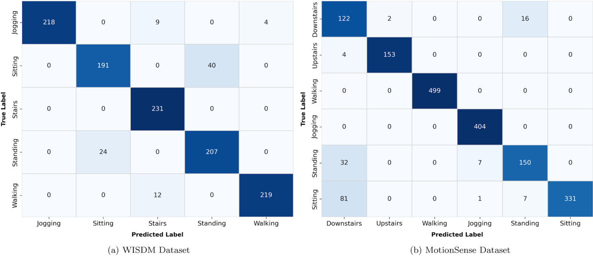

**Fig. 7.** Confusion matrices for the SAX_HAR-LLM model across the two benchmark datasets. 

tion_1 and Ablation_2 obtain 77.23% and 91.34%, respectively. The substantial drop in Ablation_1 highlights the critical role of kinematic descriptors, while the smaller degradation in Ablation_2 indicates a more refined contribution of trend-aware encoding. 

Ablation_1 exposes the fundamental limitation of applying LLMs to SAX data without physical grounding. While the model effectively captures rhythmic, high-energy gait patterns (correctly classifying nearly all _Jogging_ (228/231) and _Walking_ (231/231) instances), it fails to dis- 

tinguish static postures. The most severe degradation occurs in _Standing_ , where recall drops to 20.8% (48/231), with 176 samples misclassified as _Sitting_ . This behavior is a direct consequence of z-normalization in SAX: by removing absolute amplitude, both postures produce lowvariance symbolic sequences that are structurally indistinguishable in the symbolic domain. Without gravitational context to separate them, the model concentrates predictions on _Sitting_ as the more frequently reinforced static class. These results confirm that amplitude-invariant 

14 

_Expert Systems With Applications 332 (2027) 133478_ 

_L. Pappa et al._ 

**Table 8** 

Statistical comparison between SAX_HAR-LLM and selected baselines on WISDM (11 test subjects, 1,155 windows) and MotionSense (5 test subjects, 1,809 windows). McNemar _𝑝_ -values are indicative only due to overlapping windows and subject clustering. The subject-level permutation test and bootstrap 95% CI treat subjects as the unit of observation. A positive mean difference indicates SAX_HAR-LLM performs better. Statistical significance is assessed at _𝛼_ = 0 _._ 05. 

|**Dataset**|**Baseline**|**Mean** **Dif** **(pp)**|**McNemar** _𝑝_**-value**|**Permutation** _𝑝_**-value**|**Bootstrap** **95%** **CI** **(pp)**|
|---|---|---|---|---|---|
||MultiROCKET|−3_._20|_<_0_._001|0_._159|[−7_._27_,_ +0_._43]|
|WISDM|InceptionTime|+6_._32|_<_0_._001|0_._057|[+1_._13_,_ +13_._25]|
||RoBERTa|+1_._47|0_._075|0_._373|[−1_._65_,_ +4_._24]|
||MultiROCKET|−4_._99|_<_0_._001|0_._061†|[−11_._85_,_ −0_._78]|
|MotionSense|InceptionTime|−2_._82|_<_0_._001|0_._189†|[−6_._94_,_ −0_._05]|
||RoBERTa|+1_._27|0_._004|0_._375†|[−0_._57_,_ +3_._11]|

> † MotionSense has only 5 test subjects, yielding 25 = 32 distinct sign assignments; permutation _𝑝_ -value resolution is limited to multiples of 1∕32 ≈0 _._ 031 and should be interpreted with caution. 

**Table 9** 

Ablation study results in terms of per-class Precision (P), Recall (R), and F1-score (F1), together with overall accuracy (%). 

|**Model**|**Jogging**|**Sitting**|**Stairs**|**Standing**|**Walking**|**Accuracy** **(%)**|
|---|---|---|---|---|---|---|
|**Ablation_1**|P: 0.96|P: 0.54|P: 0.97|P: 0.87|P: 0.80||
||R: 0.99|R: 0.94|R: 0.73|R: 0.21|R: 1.00|77.23|
||F1: 0.97|F1: 0.69|F1: 0.83|F1: 0.34|F1: 0.89||
|**Ablation_2**|P: 1.00|P: 0.88|P: 0.92|P: 0.78|P: 1.00||
||R: 0.95|R: 0.75|R: 1.00|R: 0.90|R: 0.97|91.34|
||F1: 0.97|F1: 0.81|F1: 0.96|F1: 0.84|F1: 0.98||
|**SAX_HAR-LLM**|P: 1.00|P: 0.89|P: 0.92|P: 0.84|P: 0.98||
||R: 0.94|R: 0.83|R: 1.00|R: 0.90|R: 0.95|**92.29**|
||F1: 0.97|F1: 0.86|F1: 0.96|F1: 0.87|F1: 0.96||

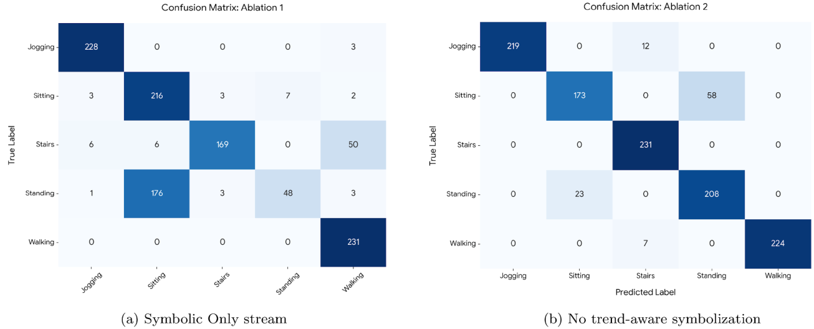

**Fig. 8.** Confusion matrices for the ablation variants across the WISDM dataset. 

symbolic representations faithfully capture temporal structure but discard physical properties such as motion magnitude and orientation — information that is essential for disambiguating static postures. 

The integration of kinematics-informed descriptors preserves rather than compromises dynamic activity recognition. Performance on _Jogging_ and _Walking_ remains consistently high in SAX_HAR-LLM, with F1-scores of 0.97 and 0.96 respectively. This demonstrates that the kinematics-informed stream resolves static ambiguities without degrading the model’s capacity to exploit strong temporal patterns in periodic motion — a property that validates the dual-stream design as complementary rather than redundant. 

Ablation_2 reveals a more targeted effect. The absence of trendaware encoding produces a modest but consistent overall accuracy decrease, concentrated specifically on the discrimination between _Sitting_ and _Standing_ . This indicates that slope-based encoding captures subtle 

local directional changes that are informative for separating quasi-static activities whose amplitude profiles are similar. Dynamic activities such as _Walking_ , _Jogging_ , and _Stairs_ remain largely unaffected, confirming that trend-aware encoding addresses a specific representational gap rather than providing a general performance boost. 

### _6.3. Attention distribution and motif analysis_ 

The proposed framework supports post-hoc interpretability through the two-stage attention inspection described in Section 4.6. All findings are descriptive and exploratory: they characterize patterns of predictive focus in the fine-tuned model rather than establishing causal feature importance. 

Table 10 reports normalized attention densities assigned to kinematics-informed and symbolic tokens at both stages. At Stage 1, 

15 

_Expert Systems With Applications 332 (2027) 133478_ 

_L. Pappa et al._ 

**Table 10** 

Two-stage attention density analysis. Mean normalized attention densities assigned to kinematics-informed and symbolic tokens at Stage 1 (input contextualization) and Stage 2 (label generation). 

|Class|Samples|Stag|e 1|Stag|e 2|
|---|---|---|---|---|---|
|||Kinematics|Symbolic|Kinematics|Symbolic|
|Overall|1155|0.403|0.597|0.356|0.644|
|Jogging|231|0.410|0.590|0.330|0.670|
|Sitting|231|0.416|0.584|0.417|0.583|
|Stairs|231|0.364|0.636|0.319|0.681|
|Standing|231|0.421|0.579|0.357|0.643|
|Walking|231|0.400|0.600|0.351|0.649|

attention is relatively balanced across token types for all activities, with SAX tokens receiving approximately 58–64% and kinematics-informed descriptors approximately 36–42%, suggesting joint integration of both information sources during input contextualization. At Stage 2, attention consistently shifts toward symbolic tokens across all classes (overall: 64.4% SAX vs. 35.6% kinematics), a pattern consistent with symbolic dynamics playing a primary role at label generation time. Per-class values at Stage 2 range from 58.3% ( _Sitting_ ) to 68.1% ( _Stairs_ ) for symbolic tokens, indicating that the relative reliance on symbolic versus physical information varies across activity types, though symbolic attention remains dominant in all cases. 

Fig. 9 reports the peak attention × baseline for each sensor axis and activity class at Stage 2. A consistent pattern emerges: the Gyro-Z axis receives substantially higher peak attention than any other axis across all five activity classes. For dynamic activities, peak attention on Gyro-Z reaches 8 _._ 18× baseline for _Stairs_ , 6 _._ 76× for _Walking_ , and 4 _._ 28× for _Jogging_ , well above all remaining axes which stay below 3 _._ 5×. For static activities, Gyro-Z again leads, though at considerably lower levels ( _Sitting_ : 1 _._ 45×, _Standing_ : 1 _._ 61×). This pattern is consistent with the physical role of the gyroscope Z-axis under the rWISDM orientation protocol, which aligns the Y-axis with gravity and leaves Gyro-Z as the primary carrier of rotational dynamics associated with body motion during locomotion. 

The contrast between dynamic and static activities is visible in Fig. 9. For dynamic activities, specific local peaks substantially above baseline emerge on Gyro-Z, suggesting the model’s focus concentrates on particular symbolic transitions within the axis sequence. For static activities, peak attention on all axes—including Gyro-Z—remains near or below baseline. This pattern is consistent with the expected symbolic structure of static postures: under global _𝑧_ -normalization, both _Sitting_ and _Standing_ produce predominantly uniform symbolic sequences where no single transition is more salient than another. In this case, the absence of a dominant local peak may itself be informative, suggesting the model reads global sequence uniformity as the distinguishing characteristic rather than any specific symbolic motif. 

Table 11 reports the top-3 Gyro-Z motifs per activity class, ranked by jointly considering attention strength and motif frequency. This dual criterion is necessary because attention strength alone favours rare but highly attended patterns, while frequency alone favours recurring but weakly attended ones; only their combination identifies motifs that are both discriminative and stable. The table reveals a clear contrast between static and dynamic activity classes. For _Sitting_ and _Standing_ , the top motifs are characterised by high frequency and near-baseline attention — `ccccb` (count = 5, 1 _._ 45×) and `bbbBb` (count = 4, 1 _._ 61×) respectively — reflecting distributed focus over uniform, low-variance symbolic sequences. The trend-aware encoding confirms this reading: both motifs consist predominantly of lowercase letters indicating flat or falling trends, with minimal amplitude variation, consistent with the stable gravitational orientation of static postures. 

For dynamic activities, the pattern is different. _Jogging_ produces three motifs all with count = 2 and moderate-to-high attention (3 _._ 11–4 _._ 28× baseline), suggesting the model distributes focus across sev- 

**Table 11** 

Top-3 symbolic motifs on the **Gyro-Z** axis per activity class (Stage 2 attention), ranked by jointly considering attention strength and motif frequency. Gyro-Z is selected as the reporting axis because it consistently receives the highest peak attention across all five activity classes as established in Fig. 9. Peak attention is reported as a multiple of the uniform baseline (1∕ _𝐿_ ). Count indicates motif frequency across test samples. 

|**Class**|**Motif**|**Peak** × **Baseline**|**Count**|
|---|---|---|---|
||`dbAdb`|4.28|2|
|Jogging|`AdcAd`|4.08|2|
||`dbBda`|3.11|2|
||`ccccb`|1.45|5|
|Sitting|`Dcbcb`|3.90|1|
||`bCbCb`|2.47|2|
||`ACcDd`|8.18|1|
|Stairs|`CcABc`|7.07|1|
||`aCdcb`|4.29|2|
||`bbbBb`|1.61|4|
|Standing|`aACCb`|3.51|1|
||`BaAbc`|3.47|1|
||`bAcCc`|6.76|1|
|Walking|`dbbbC`|5.44|1|
||`dcbaD`|4.05|1|

eral similar transition-rich patterns rather than locking onto a single dominant one. _Stairs_ is dominated by high-attention, low-frequency motifs — `ACcDd` (8 _._ 18×, count = 1), `CcABc` (7 _._ 07×, count = 1), and `aCdcb` (4 _._ 29×, count = 2) — indicating that the model identifies highly specific symbolic transitions when they occur, even if no single pattern recurs stably across samples. The highest-attended _Stairs_ motif `ACcDd` can be read as a low-amplitude rising segment transitioning to a sustained high-amplitude region, consistent with the rotational dynamics of weight transfer during stair climbing. _Walking_ similarly produces only low-frequency motifs across all three positions (count = 1 each), suggesting that walking-related rotational dynamics on Gyro-Z are highly subject-specific and do not converge to a single recurring symbolic pattern. These readings are illustrative rather than definitive, as they rely on attention as a proxy for model focus rather than a verified causal mechanism. 

Taken together, these findings suggest a physically plausible and internally consistent pattern of predictive focus: symbolic dynamics appear to dominate label generation across all activities, with Gyro-Z consistently attracting the strongest attention, static activities characterised by distributed attention over recurring uniform motifs, and dynamic activities characterised by concentrated attention on specific high-energy transitions that may vary across subjects. This pattern is consistent with the overall design rationale of the proposed dual-stream framework, in which symbolic sequences capture temporal structure and kinematicsinformed descriptors provide complementary physical grounding. 

We opt to investigate whether the head-averaged Gyro-Z signal for _Stairs_ reflects a broadly distributed pattern or concentration in a small number of specialised heads; we conduct a per-head analysis across all 231 _Stairs_ test samples. For each sample, we extract the per-head attention matrix from the last transformer layer without averaging and compute the peak attention on the Gyro-Z token span for each of Mistral-7B’s 32 heads individually (Stage 2 query position). As shown in Fig. 10, the signal is strongly concentrated: head 24 alone reaches 46.07× baseline, accounting for approximately 38% of total cross-head attention on this axis. A secondary cluster of four heads (h00, h02, h11, h19) contributes consistently at 5–10×, while the remaining 27 heads are largely at or below baseline. When head 24 is excluded, the cross-head mean drops to 2.38×, confirming that it is the primary carrier of the 

16 

_Expert Systems With Applications 332 (2027) 133478_ 

_L. Pappa et al._ 

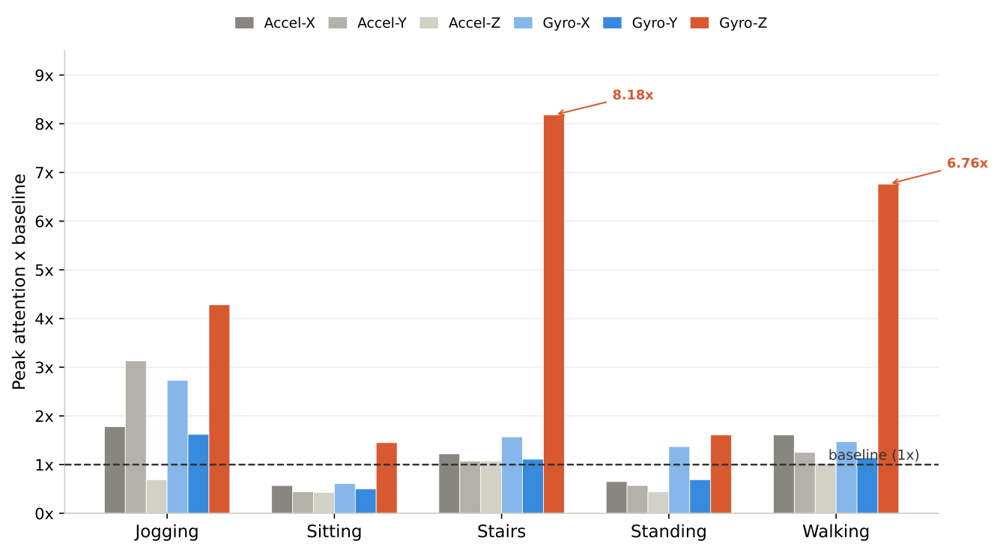

**Fig. 9.** Peak attention × baseline per sensor axis and activity class (Stage 2). The dashed line marks the uniform attention baseline (1∕ _𝐿_ ). Gyro-Z consistently receives the highest attention across all activity classes, with dynamic activities ( _Stairs_ : 8 _._ 18×, _Walking_ : 6 _._ 76×, _Jogging_ : 4 _._ 28×) exhibiting substantially stronger local focus than static activities ( _Sitting_ : 1 _._ 45×, _Standing_ : 1 _._ 61×), which show near-baseline distributed attention consistent with uniformly flat symbolic sequences. 

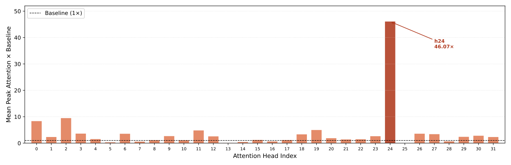

**Fig. 10.** Per-head mean peak attention × baseline on the Gyro-Z axis (Stage 2, last transformer layer) for the Stairs class (n = 231). Each bar represents the mean peak attention of one of Mistral-7B’s 32 attention heads over the Gyro-Z token span, normalised by the uniform baseline (1/L). The dashed line marks the baseline (1×). Head 24 (dark red) dominates at 46.07×, accounting for 38% of total cross-head attention. A secondary cluster is visible at heads 0, 2, 11, and 19 (5–10×); the remaining heads are near or below baseline. 

Gyro-Z signal. This pattern suggests that the model has allocated a functionally specialised head for rotational dynamics during stair climbing, and that the head-averaged 8.18× reported in Fig. 9, while not misrepresentative of the direction, masks a sharper underlying concentration. These findings remain descriptive and do not reflect causal verification. 

To assess whether the attention concentration on Gyro-Z reflects genuine predictive dependence rather than merely descriptive focus, we conduct a perturbation experiment at inference time. For each test window, the Gyro-Z token sequence is replaced with randomly drawn symbols from the trend-aware alphabet {a,b,c,d,A,B,C,D}, preserving sequence length, while all other prompt content remains identical. Perclass accuracy (recall) under this perturbation is compared against the original predictions in Table 12. 

The overall accuracy drop of 1.04 pp confirms substantial robustness to Gyro-Z corruption, with the remaining axes and kinematics descriptors providing sufficient complementary information to absorb the loss. Per-class accuracy (recall) results reveal a partial but interpretable concordance with both the attention weights reported in Fig. 9 and the motif patterns in Table 11. _Jogging_ exhibits the largest drop (+3 _._ 90 pp), consistent with its distributed attention across three similar recurring motifs (count = 2 each) — suggesting genuine systematic reliance on Gyro-Z transitions. _Walking_ shows a moderate drop (+2 _._ 16 pp) with monotonically decreasing attention across three non-recurring motifs, reflecting strongly attended but subject-specific transitions. _Stairs_ — the highestattended class (8 _._ 18×) — shows no drop despite count = 1 motifs, indicating that these highly specific transitions are not systematically relied upon and other streams compensate. Both static activities show minimal 

17 

_Expert Systems With Applications 332 (2027) 133478_ 

_L. Pappa et al._ 

**Table 12** 

Per-class accuracy (recall) before and after Gyro-Z token randomization at inference time. Drop is reported in percentage points (pp); a negative value indicates accuracy improvement after perturbation. 

|**Class**|**Original** **(%)**|**Perturbed** **(%)**|**Drop** **(pp)**|
|---|---|---|---|
|Jogging|94.37|90.48|+3.90|
|Sitting|82.68|84.42|-1.73|
|Stairs|100.00|100.00|+0.00|
|Standing|89.61|88.74|+0.87|
|Walking|94.81|92.64|+2.16|

**Table 13** 

Computational cost comparison across all methods on MotionSense. Inference latency is measured per window. SAX_HARLLM and LLM-ABBA fine-tuning times reflect QLoRA fine-tuning for 8 epochs with batch size 64 on the NVIDIA RTX 6000 Ada Generation GPU (48 GB VRAM). All other methods were measured on an Intel Core i9-14900K workstation (128 GB RAM, CPU only). Absolute times are therefore not directly comparable across LLM-based and non-LLM methods; however, the orderof-magnitude differences remain informative. As a hardware requirement, SAX_HAR-LLM requires a minimum of 4 _,_ 567 MB (≈4 _._ 5 GB) of GPU VRAM at inference time. 

|**Method**|**Fine-tuning** **Time**|**Inference** **Latency** **per** **Window** **(ms)**|
|---|---|---|
|BOP|0_._13 s|0_._011|
|MBOP|0_._15 s|0_._011|
|ResNet|8_._89 s|0_._022|
|DeepConvLSTM|10_._80 s|0_._027|
|InceptionTime|18_._5 ± 5_._2 s|0_._029 ± 0_._001|
|Vanilla Transformer|5_._28 s|0_._073|
|MultiROCKET|82_._4 ± 4_._3 s|0_._055 ± 0_._008|
|RoBERTa|184_._0 ± 3_._1 s|0_._818 ± 0_._007|
|LLM-ABBA|1_._99 h|561_._5|
|SAX_HAR-LLM|3_._42 ± 0_._07 h|573_._6 ± 2_._6|

drops consistent with near-baseline attention, with their most frequent motifs receiving the lowest attention — confirming that the model reads global sequence uniformity as the class signature rather than any specific local transition. These results reinforce the descriptive framing of the attention analysis and demonstrate the robustness of the dual-stream design. 

### _6.4. Computational cost_ 

Table 13 reports fine-tuning time and inference latency per window for all methods on the MotionSense dataset. Symbolic and deep learning baselines require training times from fractions of a second to approximately 82 seconds, with inference latencies below 0.1 ms per window. RoBERTa remains accessible at 184 seconds of fine-tuning and 0.818 ms per window due to its compact 125M-parameter architecture. Causal LLM-based methods incur substantially higher costs: LLMABBA requires approximately 2 hours and SAX_HAR-LLM 3.42 hours of fine-tuning, with both methods sharing an inference latency of approximately 560–574 ms per window — a ∼10 _,_ 000× increase relative to MultiROCKET (0.055 ms). This gap reflects the fundamental difference between kernel-based feature extraction and autoregressive token generation at inference time. SAX_HAR-LLM is therefore not positioned as a computationally efficient solution; its value lies in the interpretability afforded by the symbolic representation and the attention-based analysis it enables, which lightweight numerical methods cannot offer. 

### **7. Discussion** 

### _7.1. Performance analysis across datasets_ 

SAX_HAR-LLM achieves an average rank of 2.5 across both benchmark datasets, placing second on WISDM and third on MotionSense among all evaluated methods. This consistent positioning establishes that a fully symbolic, interpretable framework can compete with stateof-the-art numerical and kernel-based approaches across datasets with different sampling frequencies, sensor configurations, and activity sets. 

The most significant finding is not the absolute accuracy achieved, but the margin by which SAX_HAR-LLM surpasses its natural symbolic predecessors. On WISDM it improves over MBOP by 5.62%, and on MotionSense by 10.78%. These gains represent a qualitative shift in what symbolic representations can achieve when paired with a pre-trained language model backbone. Traditional bag-of-patterns classifiers aggregate symbolic distributions into frequency histograms, discarding sequential order and temporal dependencies. The LLM, by contrast, processes the full ordered token sequence, exploiting positional structure, local transitions, and long-range symbolic patterns that histogram-based methods are structurally incapable of capturing. The consistency of this improvement validates the core premise of the proposed framework: that symbolic time-series representations constitute a meaningful and productive interface to large language models. 

Among numerical baselines, SAX_HAR-LLM outperforms ResNet, DeepConvLSTM, and the Vanilla Transformer on both datasets, and surpasses InceptionTime on WISDM. The only method that consistently ranks above it is MultiROCKET, with margins of 3.21% on WISDM and 5.69% on MotionSense. This gap reflects a deliberate architectural tradeoff: MultiROCKET generates thousands of random convolutional features with no interpretable connection to the underlying sensor dynamics, while SAX_HAR-LLM operates entirely within a transparent symbolic space where predictions are traceable to specific token patterns and physical descriptors. The accuracy gap is therefore the measured cost of full transparency — a cost that is modest, consistent, and justified in deployment contexts where decision auditability is a requirement alongside predictive performance. 

This interpretability advantage does carry a computational cost. SAX_HAR-LLM requires substantially longer inference latency and GPU memory compared to all numerical baselines, reflecting the overhead of a 7B-parameter backbone. For latency-sensitive or resource-constrained deployments, this trade-off must be weighed against the transparency gains. In contexts where decision auditability is a hard requirement (such as clinical monitoring or safety-critical wearable systems) this overhead is likely acceptable; in real-time embedded applications it represents a genuine limitation. 

A consistent pattern across both datasets warrants interpretive attention: dynamic activities are classified with uniformly high F1scores, while static postures present greater difficulty. This reflects a structural property of amplitude-invariant symbolic representations (znormalization preserves temporal shape while discarding gravitational orientation) whose implications for the framework’s design are examined in detail in Section 7.2. 

The Downstairs result (F1: 0.64) on the MotionSense dataset (Table 7) represents the most significant failure mode of the proposed framework. Notably, this difficulty is not isolated to SAX_HAR-LLM: a cross-method inspection reveals a near-universal collapse on this class, with most baselines also struggling (BOP: 0.59, MBOP: 0.60, ResNet: 0.58, DeepConvLSTM: 0.56, VanillaTransformer: 0.51), and only the highest-capacity convolutional models achieving acceptable performance (InceptionTime: 0.82, MultiROCKET: 0.84). This pattern points to a dataset-level challenge: the weak periodicity, variable speed, and ambiguous amplitude profile of controlled descent appear intrinsically difficult to separate from other classes regardless of the representational choice. Within this context, the specific confusion pattern of our framework — where 81 Sitting and 32 Standing samples are over- 

18 

_Expert Systems With Applications 332 (2027) 133478_ 

_L. Pappa et al._ 

predicted as Downstairs — suggests two compounding factors. First, the braking, flat-slope accelerations of descent map to lowercase symbols structurally similar to the low-variance sequences of static postures, whereas ascending stairs generates propulsive rising slopes that produce clearly distinct uppercase-rich sequences, explaining the asymmetry with Upstairs (F1: 0.98). Second, the kinematics descriptors _𝜇𝑦_ , _𝜎𝑦_ and _𝜇𝑧_ were designed to resolve gravity-based Sitting/Standing ambiguity rather than locomotion directionality, leaving the symbolic stream without adequate physical grounding for this class. Future work should explore descriptors sensitive to step periodicity or vertical impulse asymmetry to address this failure mode. 

### _7.2. The role of symbolic representation and the pre-trained LLM backbone_ 

The ablation study provides empirical support for the central theoretical claim of this work: that a fine-tuned LLM benefits from pre-trained sequential priors when processing symbolic time-series representations, and that physical grounding is an auxiliary mechanism required only when normalization renders activity classes symbolically indistinguishable. 

The evidence converges from three independent observations. First, the symbolic-only variant (Ablation_1) correctly classifies nearly all instances of dynamic activities without any kinematics-informed context — _Walking_ , _Jogging_ , and _Stairs_ are identified with high precision and recall from SAX token sequences alone. The model receives no numerical signal, no physical descriptor, no magnitude information, only an ordered sequence of alphabetic tokens encoding the coarse temporal shape of inertial sensor measurements. That this is sufficient for dynamic activity discrimination suggests that SAX strings preserve discriminative temporal structure that the LLM is capable of exploiting. 

Second, the Vanilla Transformer trained from scratch on identical inputs achieves only 78.01% accuracy, falling below even BOP and MBOP. Since the input representation is identical, this gap isolates the pre-trained backbone as the decisive contributor to performance. A randomly initialized model cannot exploit the sequential dependencies encoded in SAX strings with limited training data. The pre-trained Mistral7B provides strong sequential modeling priors about ordered token sequences, sensitivity to repetitive and rhythmic structures — precisely the signature of periodic activities in SAX form — and awareness of case distinctions introduced by the trend-aware encoding. Whether these capacities transfer due to structural alignment between SAX strings and natural language, or deeper sequential modeling biases, remains an open question. What the data establish is that pre-training on language provides a substantial and measurable advantage on structured symbolic temporal inputs. 

Third, Ablation_1 and the Vanilla Transformer achieve similar overall accuracy (77.23% and 78.01% respectively), but through entirely different failure modes. Ablation_1 has the pre-trained backbone but lacks physical grounding, collapsing on static postures because z- normalization renders _Sitting_ and _Standing_ symbolically indistinguishable. The Vanilla Transformer has the same physical grounding as the full model but lacks pre-trained sequential priors, failing to exploit symbolic structure with limited supervised data. Despite their similar accuracy levels, these represent two independent pathways to comparable performance, each exposing a different necessary condition for success: physical grounding and pre-trained sequential modeling are both required, and neither alone is sufficient to achieve the robustness of the full SAX_HAR-LLM framework. This pattern is consistent across both datasets: the same ablation hierarchy is observed on MotionSense, confirming that these are structural properties of the framework rather than dataset-specific artefacts. 

This triangulation clarifies the role of the dual-stream architecture. The kinematics descriptors are not a compensatory mechanism for symbolic inadequacy — they are a targeted auxiliary tool resolving one specific problem: the ambiguity between classes whose discriminative signature lies in spatial orientation rather than temporal dynamics, and 

which converge in symbolic space after amplitude-invariant normalization. The symbolic stream carries the temporal language of motion. The kinematics stream speaks only when that language is silent. 

### _7.3. Interpretability and the accuracy–interpretability trade-off_ 

The empirical evidence established in Section 7.2 has a direct interpretability implication: because the LLM operates on ordered symbolic sequences rather than raw numerical signals, every prediction is grounded in token patterns that a domain expert can read and audit. This transparency is not incidental — it is structurally guaranteed by the representational choice, and it extends to the model’s internal predictive focus through attention analysis. 

The attention analysis presented in Section 6.3 reveals a pattern of predictive focus that is statistically consistent across samples and classes and physically meaningful in terms of human kinematics. The GyroZ axis receives dominant attention across all five activity classes — a finding consistent with its physical role under the rWISDM orientation protocol as the primary carrier of rotational dynamics associated with body motion during locomotion. This structure was not provided explicitly; it emerged from fine-tuning on symbolic sequences derived from physically oriented sensor data, suggesting that the model’s predictive focus aligns with the physical structure of the data. 

The contrast between dynamic and static activities reinforces this interpretation. Dynamic activities are associated with high-attention, transition-rich symbolic motifs on the Gyro-Z axis — `ACcDd` for _Stairs_ at 8.18 times the uniform baseline, `bAcCc` for _Walking_ at 6.76 times, and `dbAdb` for _Jogging_ at 4.28 times. Static postures produce near-baseline distributed attention across all axes, consistent with their uniform lowvariance symbolic structure under z-normalization. This distributed attention pattern is not a failure to identify discriminative features; it is the expected response to the symbolic structure of static activities, where global sequence uniformity rather than local transitions carries the discriminative signal. 

These attention patterns are interpreted as correlational rather than causal: they indicate where the model concentrates predictive weight, not necessarily which features are mechanistically responsible for the decision. 

The ability to trace a prediction to a specific symbolic motif on a specific sensor axis is a qualitative advantage that accuracy metrics do not capture. It comes at a measurable cost in accuracy and inference latency — a trade-off that is acceptable in safety-critical or regulated applications where auditability is a hard requirement, but less so in latencysensitive embedded systems. 

### _7.4. Future research directions_ 

The computational requirements of fine-tuning and deploying a 7-billion parameter model are substantially higher than those of lightweight symbolic baselines or even MultiROCKET. The hardware configuration used in this work (NVIDIA RTX 6000 Ada with 48GB VRAM) reflects the current practical constraints of LLM-based approaches. As model distillation techniques mature and smaller backbone models demonstrate comparable sequential modeling capacity, this cost is expected to decrease significantly, making the symbolicLLM paradigm increasingly accessible for resource-constrained deployment settings. On the evaluation side, the single 80/20 subject split may carry non-trivial variance; a subject-level k-fold evaluation would provide a more robust generalization estimate and is deferred to future work, where it can be conducted alongside a broader investigation of subject-level generalization across multiple datasets and activity recognition frameworks. 

**Generalization to other sensing domains.** In the near term, the framework extends naturally to new domains by replacing the kinematics-informed stream with descriptors appropriate to the target domain. The symbolic-LLM interface itself is applicable across domains: 

19 

_Expert Systems With Applications 332 (2027) 133478_ 

_L. Pappa et al._ 

SAX applies to any continuous time-series and the LLM requires only a discrete ordered token sequence. The design question in a new domain reduces to identifying which classes become symbolically indistinguishable after normalization and selecting descriptors that restore the lost discriminative information, which is a substantially more tractable problem than redesigning the representational pipeline from scratch. Fault diagnosis in rotating machinery and EEG-based brain-computer interfaces represent natural candidate domains, and the framework’s architectural principle is relevant wherever competitive accuracy and transparent decision logic are simultaneously required. Broader applicability across sensing domains beyond inertial HAR is explicitly deferred to future work. 

**Hybrid symbolic-numerical tokenization.** In the longer term, a more fundamental solution would eliminate domain-specific descriptors entirely. The kinematics-informed stream compensates for magnitude information discarded during SAX normalization, but this requires prior knowledge of which physical quantities are discriminative for the target domain. Integrating symbolic tokens with numerical tokenization strategies that preserve magnitude information directly within the token sequence would address the root cause of normalization-induced ambiguity at the representational level, potentially rendering the dualstream architecture unnecessary across domains. A related open direction concerns the case-based trend encoding: the case relationship between uppercase and lowercase symbol variants is implicitly learned through fine-tuning rather than structurally preserved at the tokenization level, and designing tokenization strategies that explicitly encode such relationships remains a natural next step. A systematic sensitivity analysis of the trend threshold _𝜀_ is similarly deferred to future work. 

**Zero-shot transfer and continual adaptation.** The current framework requires labeled data from known subjects and activities. Two extensions challenge this dependency. First, whether symbolic prompts augmented with natural language descriptions of expected motion signatures could enable zero-shot classification of unseen activity classes — a model that exploits structured regularities in SAX token sequences should in principle recognize a described motion’s symbolic signature without labeled examples. Second, whether LoRA adapters can be updated incrementally for new subjects or activities without full retraining — a property that would make the framework practical for longitudinal monitoring settings where data accumulates continuously. More broadly, the mechanism by which pre-trained sequential priors transfer to symbolic SAX inputs — whether through structural alignment between SAX strings and natural language, or through deeper sequential modeling biases — remains an open question that future interpretability work should address. 

### **8. Conclusion** 

This work demonstrates that symbolic time-series representations can provide an effective interface between temporal sensor data and LLMs. By encoding continuous signals as ordered SAX token sequences and processing them through a fine-tuned language model backbone, the proposed SAX_HAR-LLM framework achieves competitive activity recognition performance while maintaining transparency — every prediction traceable to specific symbolic motifs on specific sensor axes — without numerical tokenization, continuous signal encoders, or architecture-specific adaptation layers. This transparency comes at a cost: SAX_HAR-LLM trails the highest-performing numerical baseline in accuracy and carries substantially higher inference overhead, consisting a trade-off justified where auditability is a hard requirement, but worth weighing carefully in latency-sensitive settings. 

The central contribution is the empirical evidence that a fine-tuned LLM benefits from pre-trained sequential priors when processing symbolic time-series representations. Symbolic abstraction alone is sufficient for discriminating activities whose kinematic signatures survive normalization; kinematics-informed descriptors intervene only where z- normalization renders classes symbolically indistinguishable, function- 

ing as a targeted auxiliary mechanism rather than a foundational requirement. The controlled comparison against a Vanilla Transformer trained on identical inputs isolates the pre-trained backbone as the decisive contributor, and the attention analysis suggests that fine-tuning on symbolic sensor data guides the model toward physically meaningful predictive representations. Together these findings clarify the role of the dual-stream architecture: not as a patch for symbolic inadequacy, but as an elegant separation between what symbolic sequences can express and what they cannot, a boundary that is now empirically defined. 

The framework is fully reproducible from the documented implementation, relying exclusively on public datasets, open-weight models, and standard fine-tuning libraries. Beyond the specific context of human activity recognition, the symbolic-LLM paradigm positions LLMs as sequence modeling frameworks for structured symbolic temporal data over discretized signals, a principle that may extend to other sensing domains where discriminative temporal structure can be captured in ordered symbolic form, though the precise mechanism by which language model pre-training transfers to symbolic sensor data remains an open question. 

### **CRediT authorship contribution statement** 

**Lamprini Pappa:** Conceptualization, Methodology, Software, Formal analysis, Investigation, Data Curation, Writing – Original Draft, Writing – Review & Editing; **Petros Karvelis:** Supervision, Methodology, Validation, Writing – Original Draft, Writing – Review & Editing; **Chrysostomos Stylios:** Resources, Supervision, Writing – Original Draft, Writing – Review & Editing. 

### **Declaration of competing interest** 

The authors declare that they have no known competing financial interests or personal relationships that could have appeared to influence the work reported in this paper. 

### **Acknowledgment** 

This research has been financed by the European Union: Next Generation EU through the Program Greece 2.0 National Recovery and Resilience Plan, under the call: SUB1.1: Clusters of Research Excellence (CREs), Project name: +NOMOS "Intelligent Legislation Management System using Machine Learning and Natural Language Processing Methods" Project code: ΥΠ3A-0561468. 

### **Data availability** 

The datasets used in this study are publicly available. The code has been deposited on the Open Science Framework and is available at https: //doi.org/10.17605/OSF.IO/YZXE6. 

### **References** 

Abdullahi, S., Usman Danyaro, K., Zakari, A., Abdul Aziz, I., Amila Wan Abdullah Zawawi, N., & Adamu, S. (2025). Time-series large language models: A systematic review of state-of-the-art. _IEEE Access_ , _13_ , 30235–30261. https://doi.org/10.1109/ACCESS. 2025.3535782 

Anguita, D., Ghio, A., Oneto, L., Parra, X., Reyes-Ortiz, J. L. et al. (2013). A public domain dataset for human activity recognition using smartphones. In _ESANN_ (pp. 3–4). ( _vol. 3_ ). Arrieta, A. B., Díaz-Rodríguez, N., Del Ser, J., Bennetot, A., Tabik, S., Barbado, A., García, S., Gil-López, S., Molina, D., Benjamins, R. et al. (2020). Explainable artificial intelligence (XAI): Concepts, taxonomies, opportunities and challenges toward responsible AI. _Information Fusion_ , _58_ , 82–115. https://doi.org/10.1016/j.inffus.2019.12.012 Asai, M., & Muise, C. (2020). Discrete word embedding for logical natural language understanding: Extended abstract. In _Proceedings of the workshop on knowledge engineering for planning and scheduling (KEPS 2020)_ . AAAI. Submission 9 https://icaps20subpages. icaps-conference.org/wp-content/uploads/2020/10/KEPS-2020_paper_9.pdf. Baldán, F. J., & Benítez, J. M. (2021). Multivariate times series classification through an interpretable representation. _Information Sciences_ , _569_ , 596–614. https://doi.org/10. 1016/j.ins.2021.05.024 

20 

_Expert Systems With Applications 332 (2027) 133478_ 

##### _L. Pappa et al._ 

Bellos, F., Nguyen, N. H., & Corso, J. J. (2025). VITRO: Vocabulary inversion for timeseries representation optimization. In _ICASSP 2025 - 2025 IEEE International conference on acoustics, speech and signal processing (ICASSP)_ (pp. 1–5). ISSN: 2379-190X. https: //doi.org/10.1109/ICASSP49660.2025.10889449 

- Boix-Adsera, E., Saremi, O., Abbe, E., Bengio, S., Littwin, E., & Susskind, J. (2024). When can transformers reason with abstract symbols? https://doi.org/10.48550/arXiv.2310. 09753 

- Breiman, L. (2001). Random forests. _Machine Learning_ , _45_ (1), 5–32. 

- Cao, D., Jia, F., Arik, S. O., Pfister, T., Zheng, Y., Ye, W., & Liu, Y. (2024). TEMPO: Promptbased generative pre-trained transformer for time series forecasting. In _The twelfth international conference on learning representations_ . https://openreview.net/forum?id= YH5w12OUuU. 

- Chen, T., Ma, X., Xu, Y., Xu, Y., Qian, S., & Cui, L. (2025). RTS-LLM: Restoring time structure for time series forecasting with llms. _Expert Systems with Applications_ , (p. 130402). https://doi.org/10.1016/j.eswa.2025.130402 

- Chen, X., Carson, E., & Kang, C. (2026). LLM-ABBA: Understanding time series via symbolic approximation. _IEEE Transactions on Signal Processing_ , (pp. 1–14). https://doi. org/10.1109/TSP.2026.3662011 

- Christ, M., Braun, N., Neuffer, J., & Kempa-Liehr, A. W. (2018). Time series feature extraction on basis of scalable hypothesis tests (tsfresh–a Python package). _Neurocomputing_ , _307_ , 72–77. https://doi.org/10.1016/j.neucom.2018.03.067 

- Dempster, A., Petitjean, F., & Webb, G. I. (2020). ROCKET: Exceptionally fast and accurate time series classification using random convolutional kernels. _Data Mining and Knowledge Discovery_ , _34_ (5), 1454–1495. https://doi.org/10.1007/s10618-020-00701-z 

- Dempster, A., Schmidt, D. F., & Webb, G. I. (2021). MINIROCKET: A very fast (almost) deterministic transform for time series classification. In _Proceedings of the 27th ACM SIGKDD conference on knowledge discovery & data mining_ (pp. 248–257). https://doi. org/10.1145/3447548.3467231 

- Dettmers, T., Pagnoni, A., Holtzman, A., & Zettlemoyer, L. (2023). QLoRA: Efficient finetuning of quantized llms. In _Proceedings of the 37th international conference on neural information processing systems_ NIPS ’23. Red Hook, NY, USA: Curran Associates Inc. https://doi.org/10.5555/3666122.3666563 

- Esling, P., & Agon, C. (2012). Time-series data mining. _ACM Computing Surveys (CSUR)_ , _45_ (1), 1–34. https://doi.org/10.1145/2379776.2379788 

- Ferrone, L., & Zanzotto, F. M. (2020). Symbolic, distributed, and distributional representations for natural language processing in the era of deep learning: A survey. _Frontiers in Robotics and AI_ , _6_ . Publisher: Frontiers. https://doi.org/10.3389/frobt.2019.00153 

- Gruver, N., Finzi, M., Qiu, S., & Wilson, A. G. (2023). Large language models are zeroshot time series forecasters. In _Proceedings of the 37th international conference on neural information processing systems_ NIPS ’23 (pp. 19622–19635). Red Hook, NY, USA: Curran Associates Inc. 

- Guo, H., Kwok, P. Y., Guo, Y., Zhao, J., & Gu, D. (2025). FinLSPM: Large stock predict model via numerical prior knowledge from LLM. _Expert Systems with Applications_ , (p. 130294). https://doi.org/10.1016/j.eswa.2025.130294 

- He, K., Zhang, X., Ren, S., & Sun, J. (2016). Deep residual learning for image recognition. In _Proceedings of the IEEE conference on computer vision and pattern recognition_ (pp. 770–778). 

- Hettiarachchi, I. (2025). Unified temporal tokenization: A hybrid semantic and numeric mapping for time-aware large language models. _Frontiers in Computer Science and Artificial Intelligence_ , _4_ (4), 25–42. https://doi.org/10.32996/fcsai.2025.4.4.3 

- Heydarian, M., & Doyle, T. E. (2023). rWISDM: Repaired WISDM, a public dataset for human activity recognition. https://doi.org/10.48550/arXiv.2305.10222 

- Hu, E. J., Shen, Y., Wallis, P., Allen-Zhu, Z., Li, Y., Wang, S., Wang, L., Chen, W. et al. (2022). LoRA: Low-rank adaptation of large language models. _Iclr_ , _1_ (2), 3. 

- Ismail Fawaz, H., Lucas, B., Forestier, G., Pelletier, C., Schmidt, D. F., Weber, J., Webb, G. I., Idoumghar, L., Muller, P.-A., & Petitjean, F. (2020). InceptionTime: Finding alexnet for time series classification. _Data Mining and Knowledge Discovery_ , _34_ (6), 1936–1962. 

- Jiang, A. Q., Sablayrolles, A., Mensch, A., Bamford, C., Chaplot, D. S., de las, C. D., Bressand, F., Lengyel, G., Lample, G., Saulnier, L., Lavaud, L. R., Lachaux, M.-A., Stock, P., Scao, T. L., Lavril, T., Wang, T., Lacroix, T., & Sayed, W. E. (2023). Mistral 7B. https://doi.org/10.48550/arXiv.2310.06825 

- Jin, M., Wang, S., Ma, L., Chu, Z., Zhang, J. Y., Shi, X., Chen, P.-Y., Liang, Y., Li, Y.-F., Pan, S., & Wen, Q. (2024). Time-LLM: Time series forecasting by reprogramming large language models. In _The twelfth international conference on learning representations_ . 

- Katrompas, A., Ntakouris, T., & Metsis, V. (2022). Recurrence and self-attention vs the transformer for time-series classification: A comparative study. In _Artificial intelligence in medicine_ , Lecture notes in computer science (pp. 99–109). Cham: Springer International Publishing ( _vol. 13263_ ). https://doi.org/10.1007/978-3-031-09342-5-10 

- Kwapisz, J. R., Weiss, G. M., & Moore, S. A. (2011). Activity recognition using cell phone accelerometers. _SIGKDD Explorations Newsletter_ , _12_ (2), 74–82. https://doi.org/ 10.1145/1964897.1964918 

- Lara, O. D., & Labrador, M. A. (2012). A survey on human activity recognition using wearable sensors. _IEEE Communications Surveys & Tutorials_ , _15_ (3), 1192–1209. 

- Lee, Z., Lindgren, T., & Papapetrou, P. (2024). Z-Time: Efficient and effective interpretable multivariate time series classification. _Data Mining and Knowledge Discovery_ , _38_ (1), 206–236. https://doi.org/10.1007/s10618-023-00969-x 

- Leng, Z., Kwon, H., & Plötz, T. (2023). Generating virtual on-body accelerometer data from virtual textual descriptions for human activity recognition. In _Proceedings of the 2023 ACM international symposium on wearable computers_ (pp. 39–43). https://doi.org/ 10.1145/3594738.3611361 

- Li, Z., Deldari, S., Chen, L., Xue, H., & Salim, F. D. (2025). SensorLLM: Aligning large language models with motion sensors for human activity recognition. In _Proceedings of the 2025 conference on empirical methods in natural language processing_ (pp. 354–379). Suzhou, China: Association for Computational Linguistics. https://doi.org/10.18653/ v1/2025.emnlp-main.19 

- Lima, W. S., Bragança, H. L. S., & Souto, E. J. P. (2021). Nohar-novelty discrete data stream for human activity recognition based on smartphones with inertial sensors. _Expert Systems with Applications_ , _166_ , 114093. https://doi.org/10.1016/j.eswa.2020. 114093 

- Lin, J., Keogh, E., Lonardi, S., & Chiu, B. (2003). A symbolic representation of time series, with implications for streaming algorithms. In _Proceedings of the 8th ACM SIGMOD workshop on research issues in data mining and knowledge discovery - DMKD ’03_ (p. 2). San Diego, California: ACM Press. https://doi.org/10.1145/882082.882086 

- Lin, J., Keogh, E., Wei, L., & Lonardi, S. (2007). Experiencing SAX: A novel symbolic representation of time series. _Data Mining and Knowledge Discovery_ , _15_ (2), 107–144. https://doi.org/10.1007/s10618-007-0064-z 

- Lin, J., Khade, R., & Li, Y. (2012). Rotation-invariant similarity in time series using bagof-patterns representation. _Journal of Intelligent Information Systems_ , _39_ (2), 287–315. https://doi.org/10.1007/s10844-012-0196-5 

- Lines, J., Taylor, S., & Bagnall, A. (2016). HIVE-COTE: The hierarchical vote collective of transformation-based ensembles for time series classification. In _2016 IEEE 16th international conference on data mining (ICDM)_ (pp. 1041–1046). IEEE. https://doi.org/ 10.1109/ICDM.2016.0133 

- Liu, C., Zhen, J., & Shan, W. (2023). Time series classification based on convolutional network with a gated linear units kernel. _Engineering Applications of Artificial Intelligence_ , _123_ , 106296. https://doi.org/10.1016/j.engappai.2023.106296 

- Liu, X., Zhou, F., Xiao, H., Li, Z., Liu, S., & Qian, L. (2026). A survey on large language models for medical time series. _Expert Systems with Applications_ , (p. 131364). https: //doi.org/10.1016/j.eswa.2026.131364 

- Long, X., Yin, B., & Aarts, R. M. (2009). Single-accelerometer-based daily physical activity classification. In _2009 Annual international conference of the IEEE engineering in medicine and biology society_ (pp. 6107–6110). IEEE. 

- Lorello, L. S., Lippi, M., & Melacci, S. (2025). A neuro-symbolic framework for sequence classification with relational and temporal knowledge. (pp. 5833–5841). ( _vol. 1_ ). ISSN: 1045-0823. https://doi.org/10.24963/ijcai.2025/649 

- Malekzadeh, M., Clegg, R. G., Cavallaro, A., & Haddadi, H. (2018). Protecting sensory data against sensitive inferences. In _Proceedings of the 1st workshop on privacy by design in distributed systems_ (pp. 1–6). 

- McNemar, Q. (1947). Note on the sampling error of the difference between correlated proportions or percentages. _Psychometrika_ , _12_ (2), 153–157. 

- Miao, J., Thongprayoon, C., Suppadungsuk, S., Krisanapan, P., Radhakrishnan, Y., Cheungpasitporn, W., Miao, J., Thongprayoon, C., Suppadungsuk, S., Krisanapan, P., Radhakrishnan, Y., & Cheungpasitporn, W. (2024). Chain of thought utilization in large language models and application in nephrology. _Medicina_ , _60_ (1). https://doi.org/10. 3390/medicina60010148 

- Middlehurst, M., Large, J., Flynn, M., Lines, J., Bostrom, A., & Bagnall, A. (2021). HIVECOTE 2.0: A new meta ensemble for time series classification. _Machine Learning_ , _110_ (11), 3211–3243. https://doi.org/10.1007/s10994-021-06057-9 

- Middlehurst, M., Schäfer, P., & Bagnall, A., et al. (2024). Bake off redux: A review and experimental evaluation of recent time series classification algorithms. _Data Mining and Knowledge Discovery_ , _38_ (4), 1958–2031. https://doi.org/10.1007/ s10618-024-01022-1 

- Mohammadi Foumani, N., Miller, L., Tan, C. W., Webb, G. I., Forestier, G., & Salehi, M. (2024). Deep learning for time series classification and extrinsic regression: A current survey. _ACM Computing Surveys_ , _56_ (9), 217:1–217:45. https://doi.org/10.1145/ 3649448 

- Montgomery, D. C., Peck, E. A., & Vining, G. G. (2012). Introduction to linear regression analysis. John Wiley & Sons. Google-Books-ID: 0yR4KUL4VDkC. 

- Nawaz, U., Anees-ur Rahaman, M., & Saeed, Z. (2025). A review of neuro-symbolic AI integrating reasoning and learning for advanced cognitive systems. _Intelligent Systems with Applications_ , _26_ , 200541. https://doi.org/10.1016/j.iswa.2025.200541 

- Onchis, D. M., & Hogea, E.-F. (2025). Logic meets attention: A neuro-symbolic approach to vibration fault detection. In A. Agiollo, E. Bardhi, G. Ciatto, S. Dumancic, & G. Marra (Eds.), _Proceedings of the 1st international workshop on advanced neuro-symbolic applications (ANSya 2025) co-located with the 28th European conference on artificial intelligence (ECAI 2025)_ (pp. 21–24). Bologna, Italy: CEUR-WS.org ( _vol. 4125_ ). CEUR Workshop Proceedings. https://ceur-ws.org/Vol-4125/. 

- Ordóñez, F. J., & Roggen, D. (2016). Deep convolutional and LSTM recurrent neural networks for multimodal wearable activity recognition. _Sensors_ , _16_ (1), 115. 

- Ordonez, P., Armstrong, T., Oates, T., & Fackler, J. (2011). Using modified multivariate bag-of-words models to classify physiological data. In _2011 IEEE 11th international conference on data mining workshops_ (pp. 534–539). IEEE. https://doi.org/10.1109/ ICDMW.2011.174 

- Pan, L., Albalak, A., Wang, X., & Wang, W. (2023). Logic-LM: Empowering large language models with symbolic solvers for faithful logical reasoning. In _Findings of the association for computational linguistics: EMNLP 2023_ (pp. 3806–3824). Singapore: Association for Computational Linguistics. https://doi.org/10.18653/v1/2023.findings-emnlp.248 

- Pan, Z., Jiang, Y., Garg, S., Schneider, A., Nevmyvaka, Y., & Song, D. (2024). S2IP-LLM: Semantic space informed prompt learning with LLM for time series forecasting. In _Proceedings of the 41st international conference on machine learning_ ICML’24. JMLR.org. https://doi.org/10.5555/3692070.3693658 

- Pappa, L., Karvelis, P., Georgoulas, G., & Stylios, C. (2020). Multichannel symbolic aggregate approximation intelligent icons: Application for activity recognition. In _2020 IEEE Symposium series on computational intelligence (SSCI)_ (pp. 505–512). IEEE. https: //doi.org/10.1109/SSCI47803.2020.9308497 

- Pappa, L., Karvelis, P., Georgoulas, G., & Stylios, C. (2021). Slopewise aggregate approximation SAX: Keeping the trend of a time series. In _2021 IEEE Symposium series on computational intelligence (SSCI)_ (pp. 01–08). IEEE. https://doi.org/10.1109/SSCI50451. 2021.9660130 

- Pappa, L., Karvelis, P., Georgoulas, G., & Stylios, C. (2025). Sax-based gnn embeddings for time series. In _2025 25th international conference on digital signal processing (DSP)_ 

21 

_Expert Systems With Applications 332 (2027) 133478_ 

##### _L. Pappa et al._ 

- (pp. 1–5). IEEE. https://doi.org/10.1109/DSP65409.2025.11075189 

- Pappa, L., Karvelis, P., & Stylios, C. (2024). Exploring the diverse world of SAX-based methodologies. _Data Mining and Knowledge Discovery_ , _39_ (1), 4. https://doi.org/10. 1007/s10618-024-01075-2 

- Pappa, L., Karvelis, P., & Stylios, C. (2026). Optimized symbolic aggregate approximation methods for lightweight and interpretable multivariate time series classification. _Information Sciences_ , 123819. https://doi.org/10.1016/j.ins.2026.123819 

- Pappa, L. G., Karvelis, P., & Stylios, C. D. (2022). A comparative study on recognizing human activities by applying diverse machine learning approaches. In _2022 44th annual international conference of the IEEE engineering in medicine & biology society (EMBC)_ (pp. 3661–3664). IEEE. https://doi.org/10.1109/EMBC48229.2022.9871324 

- Proakis, J. G., & Manolakis, D. G. (2007). Digital signal processing. (4th ed.). Upper Saddle River, N.J: Pearson Prentice Hall. OCLC: ocm62804704. 

- Qi, C., Ma, R., Li, B., Du, H., Hui, B., Wu, J., Laili, Y., & He, C. (2025). Large language models meet symbolic provers for logical reasoning evaluation. In _The thirteenth international conference on learning representations_ . https://openreview.net/forum?id= C25SgeXWjE. 

- Schäfer, P. (2015). The BOSS is concerned with time series classification in the presence of noise. _Data Mining and Knowledge Discovery_ , _29_ (6), 1505–1530. https://doi.org/10. 1007/s10618-014-0377-7 

- Schäfer, P., & Högqvist, M. (2012). Sfa: A symbolic fourier approximation and index for similarity search in high dimensional datasets. In _Proceedings of the 15th international conference on extending database technology_ (pp. 516–527). https://doi.org/10.1145/ 2247596.2247656 

- Senin, P., & Malinchik, S. (2013a). SAX-VSM: Interpretable time series classification using sax and vector space model. In _2013 IEEE 13th international conference on data mining_ (pp. 1175–1180). IEEE. 

- Senin, P., & Malinchik, S. (2013b). SAX-VSM: Interpretable time series classification using SAX and vector space model. In _2013 IEEE 13th international conference on data mining_ (pp. 1175–1180). ISSN: 2374-8486. https://doi.org/10.1109/ICDM.2013.52 

- Song, J., Akhter, M. E., Atzil-Slonim, D., & Liakata, M. (2025). Temporal reasoning for timeline summarisation in social media. In _Proceedings of the 63rd annual meeting of the association for computational linguistics (volume 1: Long papers)_ (pp. 28085–28101). https://doi.org/10.18653/v1/2025.acl-long 

- Sun, C., Li, H., Li, Y., & Hong, S. (2024). TEST: Text prototype aligned embedding to activate LLM’s ability for time series. _International Conference on Learning Representations (ICLR)_ , 37854–37881. https://openreview.net/forum?id=Tuh4nZVb0g. 

- Sun, Y., Wang, X., Cao, G., & Mao, S. (2025). FDALLM: Traffic data prediction with functional data analysis and large language models. In _ICC 2025 - IEEE International conference on communications_ (pp. 1169–1174). ISSN: 1938-1883. https://doi.org/10.1109/ ICC52391.2025.11161166 

- Tan, C. W., Dempster, A., Bergmeir, C., & Webb, G. I. (2022). MultiRocket: Multiple pooling operators and transformations for fast and effective time series classification. _Data Mining and Knowledge Discovery_ , _36_ (5), 1623–1646. https://doi.org/10.1007/ s10618-022-00844-1 

- Tan, M., Merrill, M. A., Gupta, V., Althoff, T., & Hartvigsen, T. (2024). Are language models actually useful for time series forecasting? In _Proceedings of the 38th international conference on neural information processing systems_ NIPS ’24. Red Hook, NY, USA: Curran Associates Inc. https://doi.org/10.5555/3737916.3739838 

- Theodoridis, S., & Koutroumbas, K. (2008). Pattern recognition. (4th ed.). USA: Academic Press, Inc. 

- Vaswani, A., Shazeer, N., Parmar, N., Uszkoreit, J., Jones, L., Gomez, A. N., Kaiser, L., & Polosukhin, I. (2017). Attention is all you need. In _Advances in neural information pro-_ 

_cessing systems_ . Curran Associates, Inc. ( _vol. 30_ ). https://proceedings.neurips.cc/paper_ files/paper/2017/hash/3f5ee243547dee91fbd053c1c4a845aa-Abstract.{html}. 

- Wang, J., Li, S., Ji, W., Jiang, T., & Song, B. (2022). A T-CNN time series classification method based on gram matrix. _Scientific Reports_ , _12_ , 15731. https://doi.org/10.1038/ s41598-022-19758-5 

- Wei, J., Wang, X., Schuurmans, D., Bosma, M., Ichter, B., Xia, F., Chi, E. H., Le, Q. V., & Zhou, D. (2022). Chain-of-thought prompting elicits reasoning in large language models. In _Proceedings of the 36th international conference on neural information processing systems_ NIPS ’22 (pp. 24824–24837). Red Hook, NY, USA: Curran Associates Inc. 

- Weiss, G. (2019). WISDM Smartphone and Smartwatch Activity and Biometrics Dataset. https://doi.org/10.24432/C5HK59 

- Wu, S., Zhang, Y., Yang, Y., Li, Z., Yu, G., Chen, L., Xu, J., & Wulamu, A. (2025). LGTime: Leveraging llms with feature-aware processing and multi-granularity fusion for zeroshot time series forecasting. _Expert Systems with Applications_ , (p. 129483). https://doi. org/10.1016/j.eswa.2025.129483 

- Wu, X., Li, Y.-L., Sun, J., & Lu, C. (2023). Symbol-LLM: Leverage language models for symbolic system in visual human activity reasoning. In _Proceedings of the 37th international conference on neural information processing systems_ NIPS ’23 (pp. 29680–29691). Red Hook, NY, USA: Curran Associates Inc. 

- Xue, H., & Salim, F. D. (2023). PromptCast: A new prompt-based learning paradigm for time series forecasting. _IEEE Transactions on Knowledge and Data Engineering_ , _36_ (11), 6851–6864. https://doi.org/10.1109/TKDE.2023.3342137 

- Yu, D., Yang, B., Liu, D., Wang, H., & Pan, S. (2023). A survey on neural-symbolic learning systems. _Neural Networks_ , _166_ (C), 105–126. https://doi.org/10.1016/j.neunet.2023. 06.028 

- Zhang, C., Wang, Y., & You, X. (2026). Fault diagnosis in rotating machinery with discretized signal representation leveraging large language models. _Applied Soft Computing_ , _189_ , 114487. https://doi.org/10.1016/j.asoc.2025.114487 

- Zhang, X., Chowdhury, R. R., Gupta, R. K., & Shang, J. (2024). Large language models for time series: A survey. (pp. 8335–8343). ( _vol. 9_ ). ISSN: 1045-0823. https://doi.org/10. 24963/ijcai.2024/921 

- Zhang, Y., Dong, Z., & Xu, W. (2025). Integrative stock price trend prediction via hierarchical LLM text processing and patch-based transformer with co-attention. _Expert Systems with Applications_ , (p. 130441). https://doi.org/10.1016/j.eswa.2025. 130441 

- Zheng, L. N., Dong, C., Zhang, W. E., Yue, L., Xu, M., Maennel, O., & Chen, W. (2025). Understanding why large language models can be ineffective in time series analysis: The impact of modality alignment. In _Proceedings of the 31st ACM SIGKDD conference on knowledge discovery and data mining v.2_ KDD ’25 (p. 4026–4037). New York, NY, USA: Association for Computing Machinery. https://doi.org/10.1145/ 3711896.3737169 

- Zhou, T., Niu, P., Wang, X., Sun, L., & Jin, R. (2023). One fits all: Power general time series analysis by pretrained LM. In _Proceedings of the 37th international conference on neural information processing systems_ NIPS ’23. Red Hook, NY, USA: Curran Associates Inc. https://doi.org/10.5555/3666122.3667999 

- Zhu, Z., Galkin, M., Zhang, Z., & Tang, J. (2022). Neural-symbolic models for logical queries on knowledge graphs. In K. Chaudhuri, S. Jegelka, L. Song, C. Szepesvari, G. Niu, & S. Sabato (Eds.), _Proceedings of the 39th international conference on machine learning_ (pp. 27454–27478). PMLR ( _vol. 162_ ). Proceedings of Machine Learning Research. https://proceedings.mlr.press/v162/zhu22c.{html}. 

- von Werra, L., Belkada, Y., Tunstall, L., Beeching, E., Thrush, T., Lambert, N., Huang, S., Rasul, K., & Gallouédec, Q., (2020). TRL: Transformers reinforcement learning. https://github.com/huggingface/trl. 

22 

