# **Decoupling Perception from Description: Computation-Grounded Representation Alignment between Multivariate Time Series and Language** 

**Xinran Feng**1∗ **, Yi Xie**2,3∗ **, Chao Zhang**1 **, Ruikun Li**1 **, Wanyun Ling**2,3 **, Ziyue Li**2,3 **, Chenxi Liu**4 

1Thrust of Financial Technology, The Hong Kong University of Science and Technology (Guangzhou) 

2Technical University of Munich 

3Heilbronn Data Science Center, Munich Data Science Institute 

4Hong Kong Institute of Science & Innovation, Chinese Academy of Sciences xfeng863@connect.hkust-gz.edu.cn, {chaoz, ruikunli}@hkust-gz.edu.cn, {aaron.xie, wanyun.ling, ziyue.li}@tum.de chenxi.liu@cair-cas.org.hk 

#### **Abstract** 

Training multimodal models to align time series with language runs into a self-supervision trap. The usual recipe asks an LLM to read a series and write a description, so label quality is capped by the perceptual skill the model is supposed to learn. The data can never teach more than the labeler already knows. A second gap makes this worse: most datasets use a single variable, but the patterns that matter (cross-channel correlation, lead-lag structure, co-occurring anomalies) appear only with several variables, right where the labeling LLM’s limits are most exposed. These two problems create a trilemma: existing methods are reliable, realistic, or scalable, but none achieves all three. We resolve this by decoupling perception from description. Deterministic code computes a set of statistics from real, open-source multivariate series; the LLM verbalizes those precomputed facts. Perception, which LLMs do poorly, is handled by computation, while the LLM handles expression.This producesCGTime,our4B-parameter computation-grounded time-series–language model. CGTime outperforms far larger general-purpose models on multivariate understanding tasks: it attains the best multivariate fact score on our held-out benchmark (0.283 vs. 0.173 for GPT4o-mini and 0.203 for GPT-5.4-nano), a gap that survives Holm-corrected paired significance tests against every baseline. It also states verifiable numerical facts in generated captions more accurately and covers a broader range of statistical properties. 

## **1 Introduction** 

Large language models have limitations when interpreting time series directly, including errors in identifying trends, peaks, and relations across channels (Merrill et al. 2024). Classical time-series tools and foundation models primarily return numerical predictions rather than natural-language explanations (Jin et al. 2024; Ansari et al. 2024; Woo et al. 2024; Kong et al. 2025). Meanwhile, LLMs can serve as reasoning components in autonomous agents that act on temporal signals (Yao et al. 2023; Schick et al. 2023). Recent work addresses this gap by building multimodal models that join time series with language, allowing users to query temporal data 

> ∗These authors contributed equally. 

in plain language (Xie et al. 2025; Kong et al. 2025; Wang et al. 2025b; Zhang et al. 2024). But training these models requires paired data, and a common construction procedure can introduce a supervision bottleneck. When an LLM reads a series and writes its description, errors in its interpretation can enter the resulting labels. 

Time-MQA illustrates this bottleneck: it derives around 200K question–answer pairs by prompting an LLM over real series, so perceptual errors from the labeling model may enter the training data (Kong et al. 2025). PATRA and ITFormer improve the model side through a pattern-aware module and a lightweight encoder, respectively, but neither changes the source of supervision (Lu et al. 2026; Wang et al. 2025b). ChatTS instead synthesizes series with prescribed properties, which makes the labels controllable but uses synthetic rather than measured series. TimeOmni-1 relies on manual annotation, which is costly to scale (Xie et al. 2025; Guan et al. 2025). This reliability–realism–scalability trilemma becomes more pronounced for multivariate data. Direct labeling is difficult for both human annotators and LLMs: visual comparisons of heterogeneous multivariate series are sensitive to the chosen normalization and display (Aigner et al. 2011), while LLM accuracy drops on value extraction and computation even for a single numerical sequence (Arai et al. 2025). With _K_ variables, a labeler must also consider _O_ ( _K_2 ) candidate channel pairs. Existing multivariate coverage remains partial: ChatTS uses synthetic series, TimeOmni-1 includes only a small real evaluation set, ITFormer focuses on a single engine domain, and PATRA focuses on withinchannel patterns. 

Decoupling perception from description addresses both scales. Deterministic computation allows the pipeline to construct supervision for multivariate series without asking a labeler to inspect every channel pair. For univariate series, it provides exact, verifiable targets for statistics that direct numerical reading may estimate imprecisely. We exclude causal links, which require assumptions beyond observational data. 

We train CGTime, a computation-grounded time-series– language model designed to address the trilemma by decoupling perception from description. Deterministic code 

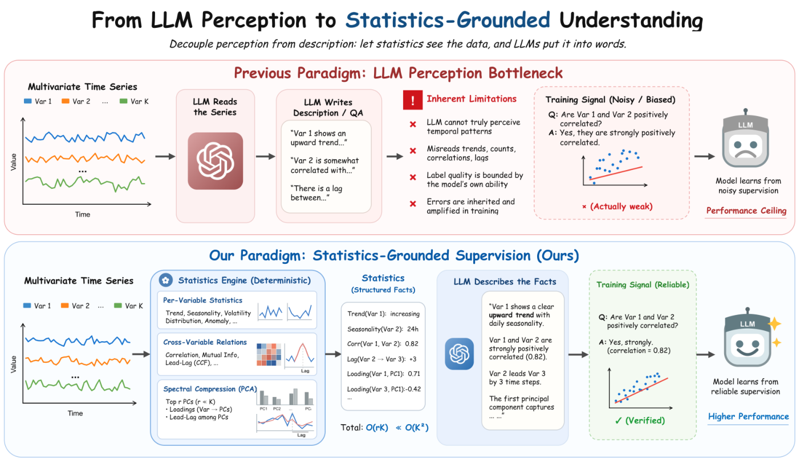

Figure 1: Overview of statistics-grounded supervision. Pipelines based on LLM-generated labels ask the same model to interpret a time series and write its label, so perceptual errors can enter the supervision (top). CGTime instead computes statistics with deterministic code, asks an LLM to verbalize these facts, and reuses the facts to verify the training signal (bottom). 

computes a fixed set of statistics from real, open-source multivariate series, and the LLM verbalizes those precomputed facts. This division targets all three objectives: reliability through computed rather than model-estimated statistics, realism through measured rather than synthesized series, and scalability through automated computation and verbalization. Representative sources include ETT transformer telemetry (Zhou et al. 2021), the cross-domain Monash Forecasting Archive (Godahewa et al. 2021), ERA5-based weather records (Hersbach et al. 2020), FRED-MD macroeconomic indicators (McCracken and Ng 2016), and measured air-quality and energy systems (De Vito et al. 2008; Candanedo, Feldheim, and Deramaix 2017; Salam and El Hibaoui 2018). Appendix C lists the major dataset sources. The same statistics anchor the captions and provide a verifiable reward during reinforcement learning (DeepSeek-AI 2025). The supervised and RL stages therefore use computed facts as a shared reference. 

We build a pipeline around this principle (Figure 1). For each multivariate series, we compute a fixed set of statistics and generate captions that verbalize them. To avoid the _O_ ( _K_2 ) blowup from describing every channel pair, we apply PCA to extract _r ≪ K_ principal components (Jolliffe 2002) and describe how each channel correlates with the retained components, together with lead-lag relations between selected channels and their most correlated components. This reduces the description to _O_ ( _rK_ ) terms while retaining the 

cross-channel structure represented by the selected components. Training uses a difficulty curriculum, from coarse summaries to exact values, with numeric rewards in the RL stage (Shao et al. 2024). Section 2 details each step. 

We make the following contributions. 

- **A design principle for time-series–language alignment: decouple perception from description.** We identify a supervision bottleneck that arises when one model both interprets temporal patterns and expresses them in language. Separating these roles is designed to combine reliability from deterministically computed facts, realism from measured multivariate series, and scalability from automated computation and verbalization. We instantiate this principle with a spectral step that uses PCA to reduce description complexity from _O_ ( _K_2 ) to _O_ ( _rK_ ) while retaining information about cross-channel structure. 

- **Statistics as a dual-use training signal.** The same computed statistics are ground truth for supervised fine-tuning and a verifiable reward for reinforcement learning, so both stages optimize against a consistent, computationgrounded signal. The curriculum moves from coarse summaries to precise values before the RL stage applies numerical rewards. Our 4B-parameter model outperforms much larger general-purpose models on the multivariate benchmark (mean fact score 0.283 vs. 0.173 for GPT4o-mini and 0.203 for GPT-5.4-nano, significant under 

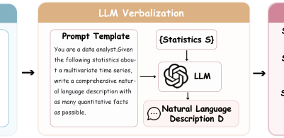

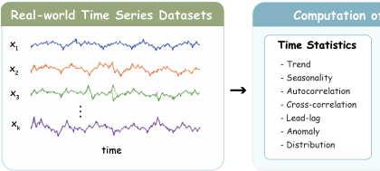

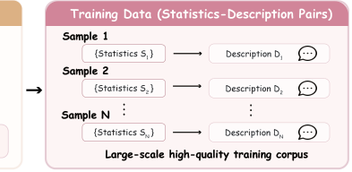

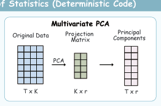

Figure 2: Computation-grounded time-series data generation. Deterministic code extracts time-domain statistics and a PCAbased summary of cross-channel structure from each real multivariate series. An LLM is prompted to verbalize the supplied statistics, yielding statistics–description pairs grounded in the original series for training CGTime. 

Holm-corrected paired tests against every baseline). 

- **A reproducible pipeline and benchmark.** We will release the complete pipeline, with detailed documentation of data curation, deterministic statistic computation, supervision generation, training, and evaluation. The release will include the source code in a Git repository, the CGTime checkpoint, and the benchmark data and evaluation protocol. 

## **2 Method** 

We formalize the decoupling principle as a computationanchored alignment problem. §2.1 defines the metricfunction framework. §2.2–2.3 construct computationgrounded facts and multi-level text supervisions. §2.4–2.5 describe the model architecture and three-stage SFT. §2.6– 2.7 detail the verifiable reward and GRPO optimization. The evaluation protocol anchors evaluation to the same computed facts. 

### **2.1 Problem Formulation** 

Let _{Xi}__N_ _i_ =1denote a dataset of_N_multivariate time-series samples, where _i_ indexes an individual sample. Sample _i_ is represented as _Xi ∈_ R_Ki×Ti_ , with _Ki_ channels and _Ti_ time steps, and is equipped with time and channel masks _A_( _i__t_) and _A_( _i__c_) to handle variable lengths and channel counts. The model input consists of _Xi_ and a natural-language prompt _pi_ ; the target _yi_ can be either a numerical answer about a single metric or a free-text description. We learn _πθ_ ( _yi | Xi, pi_ ), whose generated numerical facts must agree with a deterministic computation pipeline. 

Formally, let _F_ = _{fa}__A_ _a_ =1denoteafixedlibraryof _A_ deterministic metric functions. In our implementation, _A_ = 169; the value type, error definition, and tolerance for each answerable statistical property are specified in Appendix H (Table 10). The index _a_ identifies a particular statistical property (e.g., a marginal, cross-channel, or systemlevel property), and _fa_ computes that property from a masked time-series sample. For sample _i_ , define 

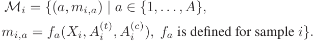

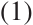

Thus, _Mi_ is the sample-specific set of valid metric–value pairs: each element records a metric index _a_ and its deterministically computed value _mi,a_ . Its cardinality may vary 

across samples because not every metric is defined for every input. Metrics requiring more channels, a longer duration, or a different data type are automatically excluded from QA construction, reward computation, and evaluation. The model is never asked to estimate an undefined statistic nor penalized for missing one. 

This instantiates the decoupling principle: _F_ handles perception (reproducible numerical facts), while the language model handles expression. Training and evaluation are both anchored to _Mi_ , so correctness is verified against computed facts rather than subjective preferences. 

### **2.2 Computation-Grounded Metric Set** 

The metric family _F_ covers univariate, bivariate, and multivariate time-series structure. Every metric is deterministically computed from real, open-source series; no modelbased inference or human judgment enters the ground-truth values. 

We illustrate the design with multivariate PCA. After mask-aware normalization, we compute the sample covariance matrix and order its principal components by decreasing eigenvalue. Each component’s explained-variance ratio is its eigenvalue divided by the sum of all eigenvalues, and we retain the smallest prefix whose cumulative ratio reaches a fixed threshold _τ_ . Answerable summaries include the PC1 explained-variance ratio, the number of retained components, and per-channel sync/decoupling ratios, without requiring the model to enumerate the full spectral decomposition. 

Windowed statistics characterize correlation structure and lead-lag relations. Rolling stability is measured by the average Euclidean change between the upper-triangular correlation vectors of adjacent windows. For each highly synchronized channel, we identify the retained principal component with which it has the largest absolute correlation and compute their cross-correlation over bounded lags; systemlevel aggregates summarize these channel-to-factor lags. Risk indicators use the Mahalanobis distance, which measures each multivariate time point’s covariance-normalized distance from the sample mean, together with the fraction of time points that exceed predefined thresholds. 

### **2.3 Data Generation** 

We construct two kinds of text supervision for each sample. 

**Free-text descriptions.** Each caption example pairs a sample with a prompt and target description. The examples 

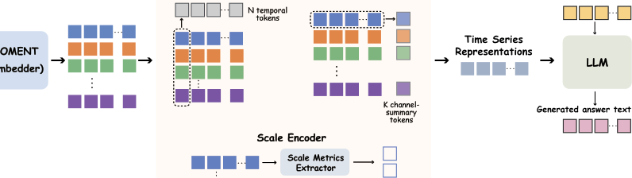

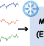

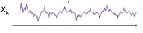

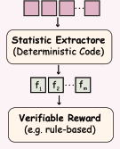

Figure 3: CGTime architecture and training. A frozen MOMENT encoder maps each channel to patch embeddings. The twotunnel alignment module compresses them into temporal and channel-summary tokens, while the scale encoder adds per-channel mean and standard-deviation tokens. These representations condition the LLM together with the instruction tokens; SFT uses reference answers, and RL evaluates generated answers with deterministic statistic extraction and a verifiable reward. 

are indexed by a granularity level _ℓ ∈{_ 1 _,_ 2 _,_ 3 _,_ 4 _}_ and a prompt family _g_ ; for multivariate samples, _g_ identifies one of four analysis perspectives: overall, pattern, stability, or risk. Level 1/2 are short basic captions (trend direction, ranges, peaks, basic statistics), with facts from rule-based computation and wording polished by an LLM given the computed facts; Level 3/4 are longer, analysis-oriented complex captions where computed facts from _Mi_ are injected into the generation prompt, covering multivariate structure, stability, risk, and spectral information. During training, the model sees only _Xi_ and _pi_ ; metric values supervise solely through the target text, reward, and evaluation. 

**Single-indicator QA.** Each QA example pairs a sample and a metric-specific prompt with one answerable fact from _Mi_ . We include only metrics suitable for numerical QA, excluding categorical and Boolean properties so that all answers share a numerical reward kernel. Each prompt may describe the metric’s definition and range but never reveals its computed value. The task is therefore controlled retrieval of a single fact from the raw series. For SFT we additionally generate chain-of-thought rationales for the QA pairs: given the series, the question, and the computed answer, an LLM writes an intermediate reasoning trace ending in the groundtruth value, and samples whose final value disagrees with the computed answer are dropped. RL uses the raw QA pairs without CoT labels. 

**Sampling weights.** Caption levels use the sampling ratio _w_ 1 : _w_ 2 : _w_ 3 : _w_ 4 = 1 : 1 : 3 : 2, giving longer Level 3/4 samples a larger training share while Level 1/2 supply stable short-text alignment. For multivariate descriptions, prompt families (overall, pattern, stability, risk) are weighted (0 _._ 4 _,_ 0 _._ 25 _,_ 0 _._ 2 _,_ 0 _._ 15), ensuring the same series is described from multiple semantic angles. 

### **2.4 Model Architecture** 

CGTime consists of a frozen time-series encoder, a trainable projector, a scale encoder, and an autoregressive language model. 

**Time-series encoder.** We use the pretrained MOMENT embedding model (Goswami et al. 2024) and keep it frozen during all training stages. For an input _Xi_ , the encoder produces one embedding of dimension _dts_ for each valid channel and temporal patch. The embedding therefore has shape _Ki × Ni × dts_ , where _Ni_ is the number of patches. 

**Projector.** The _Ki × Ni_ MOMENT patch embeddings are flattened and processed by a global Transformer, allowing channel–patch interaction before compression. After reshaping, a second Transformer operates across channels independently at each patch, followed by a two-layer projector into the LLM hidden space. Two learned-query attention reductions then produce _Ni_ temporal tokens by pooling channels within each patch and _Ki_ channel-summary tokens by pooling patches within each channel. For the channel-axis reduction, the reported configuration uses a masked mean when _Ki <_ 2. 

**Scale encoder.** For each channel _k_ , we compute its mean _µi,k_ and standard deviation _σi,k_ over valid time steps. The mean passes through a signed log transform and the standard deviation through a log transform; a small MLP maps them to two channel-specific scale tokens _s__µ_ _i,k__, s_ _i,k__σ∈_R_dlm_. 

**LLM integration.** The prompt template contains a <ts> </ts> placeholder pair. At the forward pass, this interval is replaced by the _Ni_ temporal tokens, the _Ki_ channel-summary tokens, and the two scale tokens associated with each valid channel, together with learned boundary and type embeddings. Let _Bi_ denote the ordinary text-token embedding sequence; the complete input is obtained by splicing this timeseries block, denoted _Ii_ , into _Bi_ . 

The language model autoregressively predicts the target conditioned on the prompt and this spliced time-series block. Cross-entropy is computed only at target-text positions; timeseries, scale, boundary, and prompt tokens are assigned an ignore index. 

### **2.5 Supervised Fine-Tuning** 

Supervised training proceeds in three stages of increasing difficulty. All stages use standard next-token cross-entropy, 

computed only over target-text positions. 

**Stage 1: Basic alignment.** Short basic captions train the projector _ϕ_ , scale encoder _ψ_ , and boundary embeddings _e_ with the LLM frozen. This establishes the mapping from time-series tokens to language representations without altering generation capability. 

**Stage 2: Multi-granularity caption SFT.** Both basic and complex captions are used with per-level weights _wℓ_ (§2.3). The LLM is unfrozen, and all parameters ( _θ, ϕ, ψ, e_ ) update jointly. Each level’s cross-entropy contribution is scaled by its sampling weight, with additional prompt-family weighting for multivariate samples. This stage scales the model from short factual descriptions to long-form analysis incorporating PCA, correlation-structure, lead-lag, spectral, and risk metrics. 

**Joint task warmup.** Before RL, the model is fine-tuned on a mixture of Metric-QA, Caption, and TSQA examples. For QA, the model is trained to produce structured outputs with <think>, <answer>, and \boxed{} tokens, familiarizing it with the structured-output convention and reducing reward sparsity from format errors during early RL steps. 

### **2.6 Verifiable Reward** 

RL draws prompts from a joint pool that combines internal Metric-QA and caption prompts with prompts from the external TSQA benchmark. The three subtasks are sampled with equal weight. For each prompt the policy samples _G_ candidates. For the internal tasks, rewards are computed from the same metric set _Mi_ used during SFT; for TSQA tasks, free-text prompts use ROUGE-L as the factual reward, whereas choice prompts use valid-choice and exact-answer as rewards; each uses a task-appropriate format component. 

**QA reward.** Outputs follow a structured format with <think>, <answer>, and \boxed{} tokens. A format reward _r_ fmt( _y_ ) _∈_ [ _−_ 0 _._ 6 _,_ 0 _._ 6] gates the factual reward: when _r_ fmt( _y_ ) _< η_ , the factual reward is zeroed. The predicted value _m_ ˆ _i,a_ is extracted strictly from \boxed{} within <answer>. For continuous metrics, a Gaussian kernel scores the prediction: 

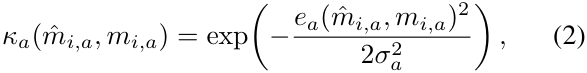

where _ea_ is absolute or relative error. Integer metrics use a step function (exact match = 1, half-tolerance = 0.5). The factual reward for a prompt targeting multiple metrics is the metric-weighted mean of their kernel scores. The final QA reward adds this factual component, scaled by _λ_ qa, to the format reward. 

**Caption reward.** Free-text captions are not format-gated. A rule-based extractor identifies metric–value pairs _M_� ( _y_ ) = _{_ ( _a, m_ ˆ _i,a_ ) _}_ from the generated text. Precision averages the Gaussian kernel scores of all scorable extracted claims. Recall counts extractions whose kernel score reaches threshold _h_ and divides by the smaller of the number of answerable metrics and a cap _D_ max; the result is capped at one because 

captions are expected to mention salient facts rather than enumerate every metric. Their standard _Fβ_ combination forms the factual caption reward. The final caption reward scales this component by _λ_ cap and optionally adds a density term. 

Metric-QA and caption tasks share the same supervision logic: the reward measures whether extractable numerical facts in generated text agree with _Mi_ . Full kernel definitions, per-metric error definitions and tolerances, and the metric-agnostic relative-error buckets used for evaluation are provided in Appendix H. 

### **2.7 GRPO Optimization** 

We optimize via GRPO following Shao et al. (2024); DeepSeek-AI (2025). For each prompt, the old policy samples _G_ candidates. Their rewards are standardized within the group, eliminating the need for a learned value model, and the resulting advantages are clipped to [ _−_ 3 _,_ 3]. We then optimize the standard token-level GRPO surrogate: the current-to-old policy probability ratio is clipped to [1 _− ϵc,_ 1 + _ϵc_ ], and the objective uses the more conservative of the clipped and unclipped advantage-weighted terms. To limit drift from the frozen SFT reference policy, we add a K3 KL penalty with weight _βkl_ ; for log-probability difference _δ_ between the reference and current policies, this penalty is exp( _δ_ ) _− δ −_ 1. For Metric-QA, the reward bandwidth is set per split (a _σ_ - multiplier of 0 _._ 5 for univariate and bivariate samples and 1 _._ 0 for multivariate), balancing the reward signal across splits without reweighting the loss. Caption instead uses a fixed multiplier of 0 _._ 5, while TSQA does not use the Gaussian factual reward. 

## **3 Experiments** 

We evaluate our model and baselines on internal and external benchmarks and conduct ablations to answer the following research questions: 

- **RQ 1:** Can LLMs and time-series–language models directly read and understand statistical properties of (multivariate) time series without external tools? (§3.2) 

- **RQ 2:** Do our statistics-grounded data and training recipe instill such capabilities into our model? (§3.2) 

- **RQ 3:** How does each main component of our method contribute to the overall gains? (Appendix M) 

### **3.1 Experimental Setup** 

**Benchmarks** Metric-QA and Captioning use the same frozen held-out set of 2,000 time-series observations, equally divided into univariate and multivariate splits (1,000 each), but construct different task-specific requests from each observation. 

For external evaluation, we additionally use 3,264 cleaned TSQA questions covering open-ended QA, multiple-choice questions, and true-false tasks. Training-data construction, filtering, and exact split statistics are detailed in Appendix B. 

**Baselines** We evaluate the following models on both internal benchmarks: TimeOmni-1-7B (Guan et al. 2025), TimeMQA-Mistral-7B (Kong et al. 2025), Time-MQA-Qwen2.5-7B (Kong et al. 2025), ChatTS-14B (Xie et al. 2025), 

|Model|Precision|Recall|
|---|---|---|
|_Proprietary LLMs_|||
|GPT-5.4-nano|0.270|0.097|
|GPT-4o-mini|0.306|0.063|
|_Open-source general-purpo_|_se LLMs_||
|GPT-OSS-20B|0.179|0.141|
|Qwen2.5-7B-Instruct|0.259|0.100|
|Qwen3-14B|0.247|0.110|
|Qwen3-4B-Instruct-2507|0.199|0.122|
|_Time-series specialists_|||
|TimeOmni-1-7B|0.163|0.060|
|ChatTS-14B|0.235|0.094|
|Time-MQA-Mistral-7B|0.112|0.018|
|Time-MQA-Qwen-2.5-7B|0.348|0.024|
|CGTime (4B)|**0.399**|**0.186**|

Table 1: Captioning on the 2,000-caption data set, with 1,000 univariate and 1,000 multivariate records. Each claim is scored with the same type-aware Gaussian scoring function as Metric-QA with _σ_ -multiplier=0.5. 

and GPT-OSS-20B (OpenAI 2025). Because Qwen3-4BInstruct-2507 (Yang et al. 2025) is our language backbone, we also include Qwen2.5-7B-Instruct (Yang et al. 2024), Qwen3-14B (Yang et al. 2025), and Qwen3-4B-Instruct2507 (Yang et al. 2025). Additional proprietary baselines are GPT-4o-mini (OpenAI 2024a) and GPT-5.4-nano (OpenAI 2026); on TSQA, we additionally evaluate GPT-4o (OpenAI 2024b). 

Complete prompts, model-specific input procedures, decoding limits, and subsampling statistics are provided in Appendices E and F. 

**Significance Test** Because all models answer the same questions, we compare their per-item Gaussian scores using paired normal-approximation mean tests. We apply Holm correction to the prespecified multivariate comparisons between our model and each baseline; other comparisons use unadjusted 95% confidence intervals. Appendix J details the test and multiple-comparison procedure. 

### **3.2 Evaluation Results** 

**Captioning** We give all models the same captioning prompts and use a rule-based extractor to identify numerical claims in their outputs. Conditional precision averages Gaussian claim scores over captions with at least one recognized claim; recall also includes captions with no recognized claim and normalizes by the finite prompted properties for each record. Table 1 reports the internal results. Our model achieves the highest conditional precision (0.399). The next-highest score, 0.348 from Time-MQA-Qwen-2.5-7B, is based on recognized claims in only 525 of 2,000 captions, whereas our model has recognized claims in 1,999. 

A caption containing few accurate numerical claims can attain high precision despite limited comprehensiveness, so we also report recall. Our model reaches the highest recall (0.186 versus 0 _._ 018 _∼_ 0 _._ 141 for the external models), a substantial 

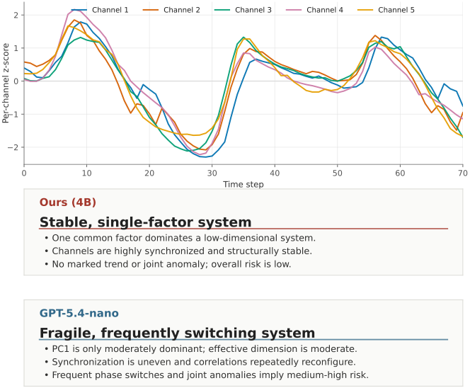

Figure 4: Contrasting diagnoses of the same five-channel series. CGTime correctly identifies a stable, low-dimensional system. GPT-5.4-nano diagnoses frequent structural switching and elevated anomaly risk. 

improvement indicating more comprehensive captions with more numerical claims. 

Although task familiarity may partly contribute, reporting the most precise computed numbers requires understanding the underlying statistical properties and accurately predicting their values rather than mere task familiarity. Our model therefore identifies relevant properties while generating comprehensive and relatively accurate numerical content, both crucial to time-series captioning. 

Figure 4 contrasts the models’ opposing conclusions on a representative five-channel case: where our model correctly identifies a stable, low-dimensional system governed by a common factor, GPT-5.4-nano diagnoses frequent structural switching and elevated anomaly risk. This illustrates the practical implications of their performance differences; Appendix N provides more comparisons with complete captions. 

**Metric-QA** Table 2 reports overall and multivariate Metric-QA results with paired Gaussian comparisons. Our 4B model scores 0.288 overall, exceeding the strongest external baseline, GPT-5.4-nano at 0.244. The unadjusted paired 95% confidence intervals favor our model against all ten external baselines; against GPT-5.4-nano, the difference is +0 _._ 044 with a 95% confidence interval of [+0 _._ 022 _,_ +0 _._ 065]. On the multivariate subset, its 0.283 exceeds every baseline at face value, including the proprietary LLMs; this advantage is statistically significant, and all ten paired differences survive Holm–Bonferroni correction. We additionally report the hard-threshold Rel25 metric; Appendix K provides the complete univariate and multivariate analysis. 

Table 2 answers RQ1: despite receiving the instructions needed to calculate the statistical properties, off-the-shelf models, including proprietary models, perform poorly on the multivariate subset, and most score lower there than over- 

||||Gaussia|n|||R|el25|
|---|---|---|---|---|---|---|---|---|
||S|core Pair|ed diference (Ours|4B_−_baseline)|Relati|ve gain (%)|S|core|
|Model|Overall|Multivariate Over|all∆[95% CI]|Multivariate∆(_z_)_⋆_|Overall|Multivariate|Overall|Multivariate|
|_Proprietary LLMs_|||||||||
|GPT-5.4-nano|0.244|0.203 +0_._044|[+0_._022_,_+0_._065]|+**0**_._**080**(+**6**_._**71**)|+17_._9|+39_._5|0.312|0.211|
|GPT-4o-mini|0.219|0.173 +0_._069|[+0_._046_,_+0_._092]|+**0**_._**111**(+**7**_._**64**)|+31_._5|+64_._1|0.309|0.223|
|_Open-source general-_|_purpose L_|_LMs_|||||||
|GPT-OSS-20B|0.223|0.198 +0_._064|[+0_._042_,_+0_._087]|+**0**_._**085**(+**6**_._**12**)|+28_._9|+42_._8|0.278|0.221|
|Qwen2.5-7B-Instruct|0.193|0.153 +0_._094|[+0_._072_,_+0_._117]|+**0**_._**130**(+**9**_._**33**)|+48_._8|+84_._5|0.267|0.183|
|Qwen3-14B|0.208|0.162 +0_._080|[+0_._057_,_+0_._102]|+**0**_._**121**(+**9**_._**15**)|+38_._3|+74_._8|0.300|0.217|
|Qwen3-4B-Instruct- 2507|0.169|0.136 +0_._119|[+0_._097_,_+0_._140]|+**0**_._**147**(+**11**_._**11**)|+70_._2|+108_._1|0.212|0.159|
|_Time-series specialist_|_s_||||||||
|TimeOmni-1-7B|0.172|0.144 +0_._115 |[+0_._093_,_+0_._137]  |+**0**_._**139**(+**9**_._**84**) |+66_._9 |+97_._0|0.235|0.175|
|ChatTS-14B|0.210|0.134 +0_._078|[+0_._056_,_+0_._099]|+**0**_._**149**(+**10**_._**84**)|+37_._0|+111_._2|0.262|0.165|
|Time-MQA-Mistral-|0.050|0.046 +0_._238|[+0_._219_,_+0_._257]|+**0**_._**237**(+**17**_._**37**)|+474_._6|+513_._7|0.082|0.067|
|7B|||||||||
|Time-MQA-Qwen- 2.5-7B|0.120|0.063 +0_._168|[+0_._146_,_+0_._189]|+**0**_._**220**(+**16**_._**02**)|+139_._4|+347_._2|0.164|0.084|
|CGTime (4B)|**0.288**|**0.283**|—|—|—|—|**0.355**|**0.322**|

Table 2: Metric-QA results on the fixed 2,000-request test set, comprising 1,000 univariate and 1,000 multivariate requests. Gaussian uses the bandwidth multiplier _m_ =0 _._ 5; Rel25 accepts relative error at most 25%. Relative gain is 100( _s_ Ours 4B _− s_ baseline) _/s_ baseline; a negative value would indicate that CGTime (4B) scores lower._⋆_ The ten multivariate Gaussian contrasts form the primary family, and all survive Holm–Bonferroni correction at family-wise _α_ =0 _._ 05. 

|Model|Acc.|ROUGE-L|
|---|---|---|
|CGTime (4B)|0.650|**0.278**|
|GPT-4o|**0.738**|0.148|
|_�→TS-blind (ablation)_|0.533|0.091|
|ChatTS-14B|0.616|0.179|
|Qwen2.5-7B-Instruct|0.630|0.166|
|Time-MQA-Mistral-7B|0.334|0.147|
|Time-MQA-Qwen-2.5-7B|0.503|0.147|
|_cited (diferent split and pip_ PATRA-7B|_eline)_ 0.545|0.264|

Table 3: Results on the TSQA (Time-MQA) test subset. Acc. is the equal-weighted macro-average of multiple-choice and true/false accuracy, while ROUGE-L scores open-ended responses. 

**TSQA** Table 3 provides external-benchmark evidence for RQ2. We split TSQA 90/10 for training and evaluation, mix the training portion with our internal data during Joint-SFT warmup and Joint-GRPO, and average per-question accuracy and ROUGE-L within each subtask. Our model achieves the highest ROUGE-L under our pipeline and is numerically close to PATRA’s strongest reported results1 . These results partially address RQ2 through external-benchmark performance. Note that although GPT-4o performs best on this benchmark, it still scores 0.533 when the time series is removed in a TS-blind ablation, indicating substantial exploitable signal in the question text and answer options alone. Our model outperforms all other baselines. 

**More Results** Appendix M provides the RQ3 ablations; Appendix N gives the caption case studies; and Appendix O discusses limitations. Appendices J–L provide significancetest details, complete two-split performance analysis, and statistic-family bottleneck analysis. 

all. GPT-5.4-nano, for example, drops from 0.244 to 0.203, whereas our model largely maintains its performance (0.288 overall versus 0.283 multivariate). The poor performances of external baselines are consistent with capability limitations under the evaluation protocol; Appendix L examines the contrast in more detail through a statistic-family analysis. These results also address RQ2: our trained 4B model outperforms larger external models, including proprietary LLMs, under the same protocol. Qualitative inspection further shows that the model has learned to reconstruct complex statistics in its rollouts. Detailed case studies are provided in Appendix N. 

## **4 Conclusion** 

We present a statistics-grounded approach to supervising multivariate time-series–language models. Unlike traditional methods that ask LLMs to generate training signals directly from textualized raw time series, we use deterministic calculations to extract verifiable statistical properties from real multivariate series and ask LLMs to describe the series using these properties and use these description as training data. 

> 1Not a head-to-head comparison since PATRA has not been fully open-sourced. 

CGTime outperforms all external baselines, including proprietary LLMs, on the Metric-QA test set, generates more comprehensive and accurate free-form captions in caption task, and performs competitively on TSQA. These findings support statistics-grounded supervision as a feasible way to instill numerical reasoning capabilities into time-series– language models. 

## **References** 

Aigner, W.; Kainz, C.; Ma, R.; and Miksch, S. 2011. Bertin Was Right: An Empirical Evaluation of Indexing to Compare Multivariate Time-Series Data Using Line Plots. _Computer Graphics Forum_ , 30(1): 215–228. 

Ansari, A. F.; Stella, L.; Turkmen, C.; Zhang, X.; Mercado, P.; Shen, H.; Shchur, O.; Rangapuram, S. S.; Pineda Arango, S.; Kapoor, S.; Zschiegner, J.; Maddix, D. C.; Wang, H.; Mahoney, M. W.; Torkkola, K.; Wilson, A. G.; BohlkeSchneider, M.; and Wang, Y. 2024. Chronos: Learning the Language of Time Series. _arXiv preprint arXiv:2403.07815_ . 

Arai, M.; Ishigaki, T.; Kawarada, M.; Miyao, Y.; Takamura, H.; and Kobayashi, I. 2025. Evaluating LLMs’ Ability to Understand Numerical Time Series for Text Generation. In _Proceedings of the 18th International Natural Language Generation Conference_ , 232–248. Association for Computational Linguistics. 

Cai, Y.; Choudhry, A.; Goswami, M.; and Dubrawski, A. 2024. TimeSeriesExam: A Time Series Understanding Exam. _arXiv preprint arXiv:2410.14752_ . NeurIPS 2024 Time Series in the Age of Large Models Workshop. 

Candanedo, L. M.; Feldheim, V.; and Deramaix, D. 2017. Data Driven Prediction Models of Energy Use of Appliances in a Low-Energy House. _Energy and Buildings_ , 140: 81–97. 

Cobbe, K.; Kosaraju, V.; Bavarian, M.; Chen, M.; Jun, H.; Kaiser, L.; Plappert, M.; Tworek, J.; Hilton, J.; Nakano, R.; Hesse, C.; and Schulman, J. 2021. Training Verifiers to Solve Math Word Problems. _arXiv preprint arXiv:2110.14168_ . 

Das, A.; Kong, W.; Sen, R.; and Zhou, Y. 2024. A DecoderOnly Foundation Model for Time-Series Forecasting. In _International Conference on Machine Learning (ICML)_ . 

De Vito, S.; Massera, E.; Piga, M.; Martinotto, L.; and Di Francia, G. 2008. On Field Calibration of an Electronic Nose for Benzene Estimation in an Urban Pollution Monitoring Scenario. _Sensors and Actuators B: Chemical_ , 129(2): 750–757. 

DeepSeek-AI. 2025. DeepSeek-R1: Incentivizing Reasoning Capability in LLMs via Reinforcement Learning. _arXiv preprint arXiv:2501.12948_ . 

Godahewa, R.; Bergmeir, C.; Webb, G. I.; Hyndman, R. J.; and Montero-Manso, P. 2021. Monash Time Series Forecasting Archive. In _Proceedings of the Neural Information Processing Systems Track on Datasets and Benchmarks_ , volume 1. 

Goswami, M.; Szafer, K.; Choudhry, A.; Cai, Y.; Li, S.; and Dubrawski, A. 2024. MOMENT: A Family of Open Timeseries Foundation Models. In _International Conference on Machine Learning (ICML)_ . 

Guan, T.; Meng, Z.; Li, D.; Wang, S.; Yang, C.-H. H.; Wen, Q.; Liu, Z.; Siniscalchi, S. M.; Jin, M.; and Pan, S. 2025. TimeOmni-1: Incentivizing Complex Reasoning with Time Series in Large Language Models. _arXiv preprint arXiv:2509.24803_ . 

Hersbach, H.; Bell, B.; Berrisford, P.; Hirahara, S.; Horányi, A.; Muñoz-Sabater, J.; Nicolas, J.; Peubey, C.; Radu, R.; 

Schepers, D.; et al. 2020. The ERA5 Global Reanalysis. _Quarterly Journal of the Royal Meteorological Society_ , 146(730): 1999–2049. 

Jin, M.; Wang, S.; Ma, L.; Chu, Z.; Zhang, J. Y.; Shi, X.; Chen, P.-Y.; Liang, Y.; Li, Y.-F.; Pan, S.; and Wen, Q. 2024. Time-LLM: Time Series Forecasting by Reprogramming Large Language Models. In _International Conference on Learning Representations (ICLR)_ . 

Jolliffe, I. T. 2002. _Principal Component Analysis_ . Springer, 2nd edition. 

Kong, Y.; Yang, Y.; Hwang, Y.; Du, W.; Zohren, S.; Wang, Z.; Jin, M.; and Wen, Q. 2025. Time-MQA: Time Series Multi-Task Question Answering with Context Enhancement. In _Proceedings of the 63rd Annual Meeting of the Association for Computational Linguistics (Volume 1: Long Papers)_ , 29736–29753. Vienna, Austria: Association for Computational Linguistics. 

Lightman, H.; Kosaraju, V.; Burda, Y.; Edwards, H.; Baker, B.; Lee, T.; Leike, J.; Schulman, J.; Sutskever, I.; and Cobbe, K. 2023. Let’s Verify Step by Step. _arXiv preprint arXiv:2305.20050_ . 

Lu, J.; Chen, P.; Wu, X.; Shu, Y.; Guo, C.; Jensen, C. S.; and Yang, B. 2026. PATRA: Pattern-Aware Alignment and Balanced Reasoning for Time Series Question Answering. _arXiv preprint arXiv:2602.23161_ . 

McCracken, M. W.; and Ng, S. 2016. FRED-MD: A Monthly Database for Macroeconomic Research. _Journal of Business & Economic Statistics_ , 34(4): 574–589. 

Merrill, M. A.; Tan, M.; Gupta, V.; Hartvigsen, T.; and Althoff, T. 2024. Language models still struggle to zero-shot reason about time series. In _Findings of the Association for Computational Linguistics: EMNLP 2024_ , 3512–3533. 

OpenAI. 2024a. GPT-4o mini: Advancing Cost-Efficient Intelligence. 

OpenAI. 2024b. GPT-4o System Card. arXiv:2410.21276. OpenAI. 2025. gpt-oss-120b & gpt-oss-20b Model Card. arXiv:2508.10925. 

OpenAI. 2026. GPT-5.4 System Card. 

Salam, A.; and El Hibaoui, A. 2018. Comparison of Machine Learning Algorithms for the Power Consumption Prediction: Case Study of Tetouan City. In _2018 6th International Renewable and Sustainable Energy Conference (IRSEC)_ . 

Schick, T.; Dwivedi-Yu, J.; Dessì, R.; Raileanu, R.; Lomeli, M.; Hambro, E.; Zettlemoyer, L.; Cancedda, N.; and Scialom, T. 2023. Toolformer: Language Models Can Teach Themselves to Use Tools. In _Advances in Neural Information Processing Systems (NeurIPS)_ . 

Sen, M.; Gottesman, Z.; Qiu, J.; Bruss, C. B.; Nguyen, N.; and Hartvigsen, T. 2025. BEDTime: A Unified Benchmark for Automatically Describing Time Series. _arXiv preprint arXiv:2509.05215_ . 

Shao, Z.; Wang, P.; Zhu, Q.; Xu, R.; Song, J.; Bi, X.; Zhang, H.; Zhang, M.; Li, Y. K.; Wu, Y.; and Guo, D. 2024. DeepSeekMath: Pushing the Limits of Mathematical Reasoning in Open Language Models. _arXiv preprint arXiv:2402.03300_ . 

Shi, X.; Wang, S.; Nie, Y.; Li, D.; Ye, Z.; Wen, Q.; and Jin, M. 2025. Time-moe: Billion-scale time series foundation models with mixture of experts. 

Trabelsi, M.; Boyd, A.; Cao, J.; and Uzunalioglu, H. 2025. Time Series Language Model for Descriptive Caption Generation. _arXiv preprint arXiv:2501.01832_ . 

Uesato, J.; Kushman, N.; Kumar, R.; Song, F.; Siegel, N.; Wang, L.; Creswell, A.; Irving, G.; and Higgins, I. 2022. Solving Math Word Problems with Process- and OutcomeBased Feedback. _arXiv preprint arXiv:2211.14275_ . 

Zhang, X.; Chowdhury, R. R.; Gupta, R. K.; and Shang, J. 2024. Large Language Models for Time Series: A Survey. In _Proceedings of the Thirty-Third International Joint Conference on Artificial Intelligence (IJCAI)_ . 

Zhou, H.; Zhang, S.; Peng, J.; Zhang, S.; Li, J.; Xiong, H.; and Zhang, W. 2021. Informer: Beyond Efficient Transformer for Long Sequence Time-Series Forecasting. In _Proceedings of the AAAI Conference on Artificial Intelligence_ , volume 35, 11106–11115. 

Wang, C.; Qi, Q.; Wang, J.; Sun, H.; Zhuang, Z.; Wu, J.; Zhang, L.; and Liao, J. 2025a. ChatTime: A Unified Multimodal Time Series Foundation Model Bridging Numerical and Textual Data. In _Proceedings of the AAAI Conference on Artificial Intelligence_ . ArXiv:2412.11376. 

Wang, Y.; Lei, P.; Song, J.; Hao, Y.; Chen, T.; Zhang, Y.; Jia, L.; Li, Y.; and Wei, Z. 2025b. ITFormer: Bridging Time Series and Natural Language for Multi-Modal QA with LargeScale Multitask Dataset. In _International Conference on Machine Learning (ICML)_ . 

Woo, G.; Liu, C.; Kumar, A.; Xiong, C.; Savarese, S.; and Sahoo, D. 2024. Unified Training of Universal Time Series Forecasting Transformers. In _International Conference on Machine Learning (ICML)_ . 

Xie, Z.; Li, Z.; He, X.; Xu, L.; Wen, X.; Zhang, T.; Chen, J.; Shi, R.; and Pei, D. 2025. ChatTS: Aligning Time Series with LLMs via Synthetic Data for Enhanced Understanding and Reasoning. _Proceedings of the VLDB Endowment_ , 18(8): 2385–2398. 

Yang, A.; Li, A.; Yang, B.; Zhang, B.; Hui, B.; Zheng, B.; Yu, B.; Gao, C.; Huang, C.; Lv, C.; et al. 2025. Qwen3 technical report. _arXiv preprint arXiv:2505.09388_ . 

Yang, A.; Yang, B.; Zhang, B.; Hui, B.; Zheng, B.; Yu, B.; Li, C.; Liu, D.; Huang, F.; Wei, H.; et al. 2024. Qwen2. 5 Technical Report. _arXiv preprint arXiv:2412.15115_ . 

Yao, S.; Zhao, J.; Yu, D.; Du, N.; Shafran, I.; Narasimhan, K.; and Cao, Y. 2023. ReAct: Synergizing Reasoning and Acting in Language Models. In _International Conference on Learning Representations (ICLR)_ . 

Yu, F.; Guo, X.; Yuan, L.; Kang, H.; Zhao, H.; Qin, L.; Huang, F.; Hu, B.; and Zhou, T. 2026. TSRBench: A Comprehensive Multi-task Multi-modal Time Series Reasoning Benchmark for Generalist Models. In _International Conference on Machine Learning (ICML)_ . ArXiv:2601.18744. 

Zelikman, E.; Wu, Y.; Mu, J.; and Goodman, N. D. 2022. STaR: Bootstrapping Reasoning With Reasoning. _arXiv preprint arXiv:2203.14465_ . 

Zhang, K.; Zuo, Y.; He, B.; Sun, Y.; Liu, R.; Jiang, C.; Fan, Y.; Tian, K.; Jia, G.; Li, P.; Fu, Y.; Lv, X.; Zhang, Y.; Zeng, S.; Qu, S.; Li, H.; Wang, S.; Wang, Y.; Long, X.; Liu, F.; Xu, X.; Ma, J.; Zhu, X.; Hua, E.; Liu, Y.; Li, Z.; Chen, H.; Qu, X.; Li, Y.; Chen, W.; Yuan, Z.; Gao, J.; Li, D.; Ma, Z.; Cui, G.; Liu, Z.; Qi, B.; Ding, N.; and Zhou, B. 2025. A Survey of Reinforcement Learning for Large Reasoning Models. _arXiv preprint arXiv:2509.08827_ . 

## **Supplementary Material** 

This supplementary material complements the main paper in four parts. It first provides the broader context, dataset construction details, source provenance, and implementation; it then records the prompts, inference configuration, scoring rules, and extraction procedures used in evaluation. The remaining sections present split-level and statistic-family analyses, ablations, and qualitative examples, followed by limitations and reproducibility information. 

## **A Related work** 

**Time-series foundation models.** Time-series foundation models are pretrained across domains to support general forecasting. Time-LLM reprograms a frozen LLM for forecasting (Jin et al. 2024), while Chronos tokenizes values into a fixed vocabulary and models them as a language (Ansari et al. 2024). Moirai (Woo et al. 2024), TimesFM (Das et al. 2024), and MOMENT (Goswami et al. 2024) pursue universal zeroshot forecasting. These models transfer across domains, but produce forecasts or labels rather than natural-language explanations and do not provide a language interface (Zhang et al. 2024). We study models that describe a series in language instead of only forecasting its continuation. 

**Multimodal time-series–language models.** Models that pair time series with text allow users to query temporal data in natural language (Zhang et al. 2024). This pairing is useful because LLMs alone still misread trends and cross-channel relations (Merrill et al. 2024). Existing supervision comes from several sources. Time-MQA prompts an LLM over real series to produce about 37K open-ended reasoning questions in 200K question–answer pairs (Kong et al. 2025). PATRA uses pattern-aware alignment with a balanced reward (Lu et al. 2026), while ITFormer fuses a lightweight encoder with a frozen LLM (Wang et al. 2025b). Both retain LLMderived labels, whose quality depends on what the labeling model can infer. ChatTS instead generates series from prescribed attributes, so its captions are correct by construction but its series are templated rather than real (Xie et al. 2025). TimeOmni-1 uses human annotation for a small reasoning suite, with about 2.3K curated examples among 23K samples; this produces reliable labels but is difficult to scale (Guan et al. 2025). Variable coverage is also limited: ITFormer’s QA data come from a single aero-engine domain, ChatTS uses synthetic multivariate series, and PATRA aligns only within-channel trend and seasonality (Wang et al. 2025b; Xie et al. 2025; Lu et al. 2026). Our labels are computed deterministically from real multivariate series, providing reliable, realistic, and scalable supervision while explicitly including cross-channel structure. 

**Time-series description and benchmarks.** Other work targets open-ended descriptions of temporal patterns rather than structured QA. ChatTime trains a multimodal foundation model with bimodal text and series input/output (Wang et al. 2025a); TSLM targets caption generation with synthetic caption–series pairs and cross-modal retrieval denoising (Trabelsi et al. 2025). ChatTS also supports description generation, but on synthetic multivariate series (Xie 

et al. 2025). BEDTime tests recognition, discrimination, and open generation of univariate visual descriptions across text, numeric, and plot modalities (Sen et al. 2025); TimeSeriesExam procedurally generates multiple-choice questions over core understanding categories (Cai et al. 2024); and TSRBench spans perception, reasoning, prediction, and decision-making across 15 tasks and two input modalities (Yu et al. 2026). These benchmarks cover univariate description and a broad set of reasoning tasks, but their labels are generally human-written, synthetic, or template-based, with limited cross-channel structure. Our benchmark derives captions and QA targets from computed multivariate statistics over real series. The resulting evaluation measures recoverable numerical facts rather than subjective wording alone. 

**Reinforcement learning from verifiable rewards.** Reinforcement learning from verifiable rewards replaces learned preference models with automatically checkable rewards when ground truth is available (Zhang et al. 2025). Early work trains outcome verifiers for math word problems (Cobbe et al. 2021) and compares process supervision with outcome supervision (Uesato et al. 2022; Lightman et al. 2023); STaR bootstraps reasoning chains from verifiable final answers (Zelikman et al. 2022). DeepSeek-R1 scales this approach through large-scale RL on checkable tasks (DeepSeek-AI 2025), and DeepSeekMath introduces the GRPO objective used in our work (Shao et al. 2024). RLVR for mathematics and programming can rely on symbolic checkers or code execution. Time-series alignment usually depends on model-generated or human-judged labels, which do not provide the same objective signal. Our computed statistics fill this gap: we use the statistics in _Mi_ as deterministic rewards for both QA and captioning. RL therefore optimizes the same facts used during supervised training. 

## **B Training and Evaluation Data** 

This section defines the observation unit, the training and evaluation pools, and the filtering steps that connect the internal tasks and TSQA to the reported experiments. 

The statistics-grounded dataset is described in §2.2–2.3. It contains approximately 1,000,000 observations in each of the univariate, bivariate, and multivariate splits, or approximately 3,000,000 in total. An observation comprises one time series together with its raw values, computed statistical properties, and captions generated as described in §2.3. We reserve a candidate pool of 10,000 observations from each split. Because the bivariate split is not an evaluation target, the test sets contain only univariate and multivariate observations. 

We assign each series a deterministic signature and use it to audit overlap between the training and candidate pools. After this audit, the univariate and multivariate candidate pools contain 8,432 and 9,999 observations, respectively. Both internal evaluation request sets are subsequently constructed only from these audited candidate pools and therefore contain no time-series signature present in training. 

Training uses a subset of the full dataset because of resource constraints. The Metric-QA and captioning training subsets are constructed independently from the shared under- 

lying observation collection and are not paired one-to-one by observation. We construct the Metric-QA subset using permetric quota sampling, yielding approximately 6,000 univariate pairs and 11,000 pairs from each of the bivariate and multivariate splits, with all 169 statistical-property types represented. CoT targets are then generated from these pairs of time series and ground-truth statistics as described in §2.3. Removing problematic CoT samples leaves 27,536 MetricQA training examples. The captioning training set contains 27,501 examples, which keeps the two tasks approximately balanced. 

For Metric-QA evaluation, we use a fixed test set of 2,000 observations, with 1,000 univariate and 1,000 multivariate observations sampled from their corresponding held-out pools. Each observation is used for only one statistical property, which avoids testing a model repeatedly on the same time series. Captioning evaluation uses a separate request set over the same 2,000 time series, with 1,000 requests per variable-count split. Each request describes 16 candidate properties without revealing their numerical values. MetricQA requests instantiate only properties defined for the observation. Captioning panels are fixed by split and prompt family and can name an undefined candidate; such candidates are removed before scoring and do not penalize the model. 

TSQA is the only external benchmark included in training. We retain its open-ended, multiple-choice, and true-orfalse subsets because the remaining subtasks are incompatible with our training objective. These subsets initially contain 37,628 questions. We remove 1,870 questions without a valid time series or prompt and split the remainder 90/10 into 32,182 training questions and 3,576 evaluation questions, including 1,937 open-ended evaluation questions. We then remove 683 questions (626 training and 57 evaluation) that contain multiple <ts> tags, leaving 31,556 training and 3,519 evaluation questions. A deterministic time-seriessignature audit identifies overlap with the training set in 255 evaluation questions involving 247 time series. After removing these questions, the final cleaned evaluation set contains 3,264 questions: 848 multiple-choice, 632 true-or-false, and 1,784 open-ended questions. 

SFT and RL use the same TSQA training split and statistics-grounded captioning subset. For Metric-QA, SFT uses the CoT examples, whereas RL uses resampled QA prompts without CoT labels. 

## **C Source Datasets** 

Our construction pool draws from two public collections: the Monash Time Series Forecasting Archive (Godahewa et al. 2021) and Time-300B (Shi et al. 2025). We selected 41 files spanning energy, weather, transportation, environmental, health, economic, and web-demand domains. Table 4 lists their local identifiers after selection and preprocessing. Some series were resampled, reindexed, or reformatted; the table groups these versions with their underlying series rather than treating them as separately acquired datasets. 

river_flow and saugeenday encode the same value sequence in different formats; the two sunspot variants do likewise. The one-minute solar and wind versions are 

downsampled from their four-second counterparts. We treat these relationships as transformations rather than independent sources. 

The source families span the domains used by our statistics-grounded construction. The procedure converts their heterogeneous raw formats into the common observation representation defined in Appendix B. A source’s presence in the pool does not mean that it appears in every generated subset. Task-specific filters on length, channel count, and sampling determine which series are eligible. 

## **D Implementation Details** 

This section specifies the shared time-series–language architecture and the Base-SFT, Joint-SFT, and Joint-GRPO lineage that produces the reported model. Training proceeds through Base-SFT, a Joint-SFT warmup that includes TSQA, and Joint-GRPO. Every result labelled “CGTime (4B)” uses the same model selected after Joint-GRPO. The main paper’s Stage 1 and Stage 2 are stage types repeated within Base-SFT across the univariate, bivariate, and multivariate domains, whereas Replay repeats only Stage 2. The main paper’s joint task warmup is the Joint-SFT phase below. Computed statistics supervise the internal Metric-QA and Captioning components, whereas TSQA retains its benchmark-provided labels and references. 

### **D.1 Training configuration** 

The descriptions below distinguish configured training horizons, executed steps, and checkpoints selected for evaluation. 

### **Architecture and compute topology** 

The three phases share the following architecture and compute configuration: 

- **Time-series encoder** : **MOMENT-1-base** , kept frozen without optimizer state. 

- **Global channel–patch context** : the _C × N_ MOMENT patch tokens are flattened and processed by a 1-layer, 8-head Transformer with dropout 0.1 before projection. 

- **Per-patch channel context** : the alignment module applies a separate 1-layer, 8-head Transformer with dropout 0.1 across the _C_ channels at each patch. This step is bypassed when _C_ = 1 and is followed by a two-layer GELU MLP into the LLM hidden space. 

- **Two-axis compression** : two 8-head learned-query attention pools reduce channels per patch and patches per channel, yielding _N_ + _C_ tokens. Channel reduction uses a masked mean when _C <_ 2. 

- **Language model** : **Qwen3-4B-Instruct-2507** . 

- **Special tokens** : four tokens, <ts></ts><scale></scale>; the tokenizer vocabulary and embeddings are extended accordingly. 

- **Learned boundary/type embeddings** : trainable start/end embeddings for the time-series, scale, temporal, and channel blocks, together with temporal and channel type embeddings. 

|**Local dataset identifers**|**Real-world content**|
|---|---|
|ETTh1,ETTh2,ETTm1,ETTm2 electricity,electricity_hourly_*, electricity_weekly_*|Transformer loads and oil temperature at hourly and 15-minute resolutions Electricity consumption for 321 clients in hourly and weekly benchmark representations |
|electricity_demand|Half-hourly electricity demand for fve Australian regions|
|traffic,traffic_hourly_*, traffic_weekly_*|Freeway occupancy from 862 San Francisco Bay Area sensors, represented at hourly and weekly frequencies|
|covid_deaths_*,hospital_*,nn5_*, |COVID-19 deaths, hospital demand, banking withdrawals, and Wikipedia page |
|kaggle_web_traffic_*|views|
|m4_daily|One daily series retained after rescaling and reindexing|
|solar_*,wind_*,saugeenday_*,|Solar and wind generation, river fow, sunspots, and daily U.S. births; the |
|river_flow,sunspot_*,us_births_*|processed collection includes resampled versions and repeated value sequences|
|WTH,weather,exchange_rate, national_illness|Hourly and 10-minute meteorological measurements, eight daily exchange-rate series, and seven weekly infuenza indicators|
|oikolab_weather_dataset|Hourly multivariate historical weather felds|
|fred_md_dataset|Monthly U.S. macroeconomic indicators|
|NASDAQCOM,SP500|Daily observations of the NASDAQ Composite and S&P 500 indices|
|airquality energy|Hourly gas concentrations and multisensor responses collected in an Italian city Appliance consumption, indoor temperature and humidity, and nearby weather measurements from a low-energy house|
|tcpc|Weather and power consumption for three distribution zones in Tetouan, Morocco|
|metro|Hourly westbound I-94 trafc volume between Minneapolis and St. Paul|

Table 4: Real-world time-series files selected from the Monash archive and Time-300B. Each group may include resampled or reformatted versions of the same underlying series. 

- **Precision and compute topology** : bf16 compute; BaseSFT uses two-GPU per-layer FSDP, Joint-SFT uses one GPU with FSDP disabled, and Joint-GRPO uses one GPU with FSDP and DDP disabled. 

### **(1) Base-SFT** 

- **Initialization and stage order** : we first train a Stage1 checkpoint on basic captions as a time-series–language alignment warmup, then run the full SFT curriculum from univariate Stage 1 through univariate Stage 2, bivariate Stage 1, bivariate Stage 2, multivariate Stage 1, multivariate Stage 2, and replay Stage 2, in that order. 

- **Data** : for each univariate, bivariate, and multivariate domain, each Stage 1 epoch comprises approximately 100K training examples covering basic properties, whereas each Stage 2 epoch comprises approximately 50K examples spanning basic and complex properties. The two basic strata use sampling weights 1 and 1, whereas the two complex strata use weights 3 and 2. These weights determine which caption stratum supplies the target for each example in each epoch. Across Stage 2, the overall, pattern, stability, and risk prompt families are sampled with weights 0.4, 0.25, 0.2, and 0.15. These variable-count stages are followed by a replay Stage 2. 

- **Trainable parameters** : in Stage 1, MOMENT and the LLM are frozen while the complete alignment module described above is trained. In Stage 2, the LLM is unfrozen and optimized jointly with the alignment module; MOMENT remains frozen. 

- **Training duration and stage initialization** : Stage 1 is trained for three epochs and Stage 2 for two epochs in each 

variable-count setting. Replay contains only Stage 2 and is trained for two epochs. Stage transitions use validationselected best checkpoints rather than final checkpoints. Univariate Stage 2 combines the warmup checkpoint with the best univariate Stage-1 checkpoint. Each later domain begins Stage 1 from the preceding domain’s Stage-2 best, and its Stage 2 combines that checkpoint with its own Stage-1 best. Replay Stage 2 starts from the multivariate Stage-2 best. 

- **Learning rate** : LLM 10_−_5 / alignment module 10_−_4 . 

- **Batch (Stage 1 / Stage 2, per GPU)** : univariate 64/48, bivariate 40/30, multivariate 30/24, and replay Stage 2 24. 

- **Maximum sequence length** : Stage 1 uses 512 tokens. Stage 2 uses 768 tokens for univariate and bivariate training, and 1024 for multivariate and replay training. 

- Gradient checkpointing was enabled, with gradient accumulation set to 1. 

### **(2) Joint-SFT warmup** 

- **Initialization** : the checkpoint selected after replay Stage 2. 

- **Data** : a joint mixture of Metric-QA, Captioning, and TSQA examples. The pool contains 86,593 examples before filtering. Removing twelve unusable examples before the split gives train, validation, and test partitions of 83,118, 1,732, and 1,731. 

- **Learning rate** : LLM 5 _×_ 10_−_6 / alignment module 5 _×_ 10_−_5 . 

- **Batch** = **8** , **gradient accumulation** = **1** , **epochs** = **2** , and **maximum sequence length** = **1792** . Gradient checkpointing was enabled. The 1792-token limit accommodates the longest examples in the joint pool, including long Metric-QA CoTs, rather than being specific to TSQA. 

- Training used one GPU with FSDP disabled and completed at step 20,780, which was retained for the next phase. 

### **(3) Joint-GRPO** 

- **Initialization** : the policy and frozen reference are both initialized from the selected Joint-SFT checkpoint. 

- **Prompt pool** : before filtering, the pool contains **84,862** prompts: 25,805 Metric-QA, 27,501 Captioning, 17,346 TSQA open-ended, and 14,210 TSQA choice prompts. Filtering removes one Metric-QA and one Captioning prompt for each of nine series with a non-finite value, leaving **84,844** prompts. The merged pool is shuffled and sampled uniformly, yielding broadly equal weights for Metric-QA, Captioning, and TSQA. 

- **Optimizer** : AdamW with LLM learning rate 10_−_6 and alignment-module learning rate 5 _×_ 10_−_5 . 

- **RL** : 2,000 training steps; batch size 3 prompts/step, group size 8 rollouts/prompt, and gradient accumulation 4. Rollouts used temperature 0.5, top- _p_ 0.85, QA maximum output length 384, and caption maximum output length 1024. 

- **Optimization controls** : KL coefficient 0.12, advantage clipping at 3, and PPO clip ratio 0.08; no-repeat _n_ -gram was disabled and repetition penalty was 1.0. 

- **Reward** : the factual-reward weight was set to 1.0 for each of the three tasks, while the _form of the reward differed by task_ . Metric-QA used the Gaussian factual reward plus its structured-format reward, with the QA-only bandwidth multiplier set by split to univariate/bivariate/multivariate = 0.5/0.5/1.0. Caption used rule-based claim extraction during reward computation, a fixed Gaussian bandwidth multiplier of 0.5, _F_ 1 over soft mention precision and thresholded recall with the recall denominator capped at 7, and a mention-density bonus capped at 0.6. TSQA free text used ROUGE-L factual reward, whereas TSQA choice questions combined valid-choice and exact-answer rewards; each also had its task-appropriate format component. 

- **Training length and evaluated checkpoint** : training completed 2,000 steps. Checkpoint selection used the rolling training-reward criterion described below, and the retained checkpoint is **step 1,650** , not the final step-2,000 checkpoint. 

- **Evaluation model** : the model selected at step 1,650 supplies the reported Metric-QA, 2,000-request Captioning, and TSQA results. 

### **Learning-rate decay across the three training phases** 

The learning rates used for the language backbone and alignment module are: 

- **Base-SFT** : LLM 10_−_5 ; alignment module 10_−_4 . 

- **Joint-SFT** : LLM 5 _×_ 10_−_6 ; alignment module 5 _×_ 10_−_5 . 

- **Joint-GRPO** : LLM 10_−_6 ; alignment module 5 _×_ 10_−_5 . 

These are the learning rates used in training; this configuration does not by itself establish a causal effect of the decay schedule. 

### **Additional training details** 

- **Split bandwidth scope** : the 0.5/0.5/1.0 setting applies only to Metric-QA rollouts. Caption rollouts retain the global multiplier 0.5; TSQA does not use the Gaussian factual reward. 

- **Reference policy** : the Joint-GRPO reference is the frozen Joint-SFT initialization and the configured KL coefficient is 0.12. 

- **Minimum channels for attention pooling** : one-channel inputs bypass channel attention, while bivariate and multivariate inputs use it. 

- **Checkpoint selection** : selection was based on the mean reward over the preceding 20 rollout steps and considered checkpoints saved every 50 rollout steps. 

Together, these settings specify the complete path from statistics-grounded Base-SFT training to the single JointGRPO checkpoint evaluated in the following protocol. 

## **E Prompt Templates** 

This section specifies the fixed request sets, model-specific time-series serialization, and task-specific instructions used at inference. All request counts and templates below refer to evaluation-time generation; they do not define the training pools or their sampling procedures. 

For readability, all prompt templates and quoted model outputs in this supplement are presented in English. We treat language as an interface choice rather than an experimental variable. 

### **E.1 Evaluation request sets** 

Metric-QA and Captioning use two task-specific request sets constructed over the same 2,000 held-out time-series observations, comprising 1,000 univariate and 1,000 multivariate observations. Each observation produces one Metric-QA request and one Caption request. A request contains the raw array and the task and system instructions. Metric-QA answers, Caption ground-truth property values, and TSQA labels and references are withheld during generation. 

### **E.2 Time-series serialization** 

For the internal benchmarks, the task instruction text is shared across model families, while the representation inserted at the time-series placeholder follows each model’s input format. TSQA-specific inference differences are reported in Appendix F. 

- **Ours.** The raw tensor is encoded by the time-series encoder, and the resulting continuous representations are inserted at the <ts>. . . </ts> position. The raw values are not rendered as text for our model. 

|Task|Requests|Time-series placeholder|
|---|---|---|
|Metric-QA|2,000 (1,000 per split)|<ts> </ts>|
|Captioning|2,000 (1,000 per split)|<ts> </ts>|
|TSQA|3,519 before overlap removal / 3,264 cleaned|<ts></ts>|

Table 5: Fixed request sets used for the reported evaluations. For TSQA, the reported cleaned set excludes 255 questions whose series also occur in its training split; the contents of the remaining 3,264 questions are otherwise unchanged. 

- **ChatTS-14B.** For a _C_ -channel series, ChatTS-14B uses _C_ native <ts><ts/> placeholders and processes the _C_ raw channel arrays with its released multimodal processor. 

- **Text-only models.** The placeholder is replaced before applying the model’s chat template. Each number is rendered with four significant figures. A univariate series is serialized as [v1, v2, ...]; a multivariate series is serialized in channel-major order as Series1: [..]; Series2: [..]; .... 

The text-only models begin with the full series and, when generation exceeds available GPU memory, use temporal strides 2, 4, 8, and 16 as described in Appendix F. The selected stride is recorded for reproducibility. This subsampling changes only the inserted array, not the task or system prompt. 

### **E.3 Metric-QA** 

The boxes below present the Metric-QA prompt templates while preserving the exact tags and placeholders used at inference. Each request asks for one numeric property, and the requested output contains a reasoning span followed by one boxed value. 

#### **System prompt.** 

- You are a professional time-series analysis _�→_ assistant. Answer the following _�→_ question using only the given time _�→_ series. You must output strictly in the _�→_ following structure, with no extra _�→_ text: 

- <think>first briefly state the metric's _�→_ definition/computation, then reason _�→_ from the time _�→_ series</think><answer>\boxed{write only _�→_ the final numeric value here}</answer> 

- The final value is a single number (a _�→_ percent sign is allowed); do not write _�→_ units or explanations. 

#### **User template.** 

Reference (metric definition/computation): _�→_ <definition> What is the <metric> of the series? Time series: <ts> </ts> 

**Example — median.** 

|Refe|rence (metric definition/computation):|
|---|---|
|_�→_|First sort the series from smallest to|
|_�→_|largest; if the sample size is odd take|
|_�→_|the single middle value, if even|
|_�→_|average the two middle values. This|
|_�→_|value is insensitive to extremes and|
|_�→_|reflects the typical level better than|
|_�→_|the mean.|
|What |is the median of the series? |
|Time|series: <ts> </ts>|

#### **Example — acf_lag1.** 

|Ref|erence (metric definition/computation):|
|---|---|
|_�→_|Shift the series forward by one time|
|_�→_|step and compute the Pearson|
|_�→_|correlation between the original series|
|_�→_|and the one-step-lagged series; the|
|_�→_|coefficient lies in [-1, 1], and a|
|_�→_|larger absolute value means stronger|
|_�→_|linear dependence between adjacent time|
|_�→_|points.|
|Wha|t is the first-order autocorrelation|
|_�→_|ACF(lag=1) of the series?|
|Tim|e series: <ts> </ts>|

The full scoring inventory contains 169 statistical properties. The fixed 2,000-request Metric-QA set instantiates 77 distinct properties from this inventory. Each instantiated property has its own reference definition and question stem; the system prompt and placement of <ts> </ts> are shared. 

### **E.4 Captioning** 

The Caption requests over the shared 2,000 observations are grouped by the two variable-count splits and four source prompt families: overall analysis, pattern, stability, and risk. The source prompt families are not forced to have equal counts. The overall-analysis family requests an overall analysis, the pattern family emphasizes temporal dynamics, the stability family focuses on persistence and structural change, and the risk family emphasizes anomalies and system-level risk. 

The Cartesian product of two splits and four families defines eight fixed panels, each containing 16 distinct candidate statistical properties. Table 6 gives their property identifiers. Panel selection depends only on the request’s split and prompt family; it does not inspect model identity, model output, ground-truth values, or whether a property is defined for that observation. The visible prompt gives natural-language descriptions of the properties, but not their symbolic identifiers, numerical values, or request-specific definedness. A 

prompted property may therefore be undefined for an individual observation; such properties are filtered before scoring and do not penalize the model. 

Each split–prompt-family cell has three predefined sourcequestion variants, and each observation is assigned one variant. The system prompt, user prompt, property panel, and source-question variant are therefore specified for every request. The templates below present this evaluation protocol. The same prompt, extractor, and scorer are applied to every model in the full-set comparison. The 16-property panel is an evaluation-time instruction and was not used during SFT or GRPO. 

The Caption prompts impose no QA-style \boxed{} format. 

This strict format is requested from every model. During scoring, unambiguous explicit option labels outside the requested wrapper are normalized as described in Appendix I; the requested generation format itself is not relaxed. 

#### **System prompt (open-ended).** 

You are a time-series analysis assistant. _�→_ Use only the given time series to _�→_ answer. Put your final answer inside _�→_ <answer>...</answer>. 

#### **Example — true/false (choice).** 

The sequence <ts></ts> exhibits clear _�→_ seasonal patterns. True or False? Answer with A) True or B) False. 

#### **System prompt.** 

You are a professional time-series analysis _�→_ assistant. Complete the analysis using _�→_ only the given time series. 

#### **User template.** 

<source question for the selected prompt _�→_ family>: <ts> </ts> 

- With respect to the question above, analyze _�→_ the time series from the perspectives _�→_ of <natural-language descriptions of _�→_ the 16 candidate properties>. <For _�→_ multivariate requests: Series1, _�→_ Series2, ... correspond to the input _�→_ channels.> Directly provide a coherent _�→_ analysis, naturally incorporating key _�→_ numerical values useful for the _�→_ judgment and explaining the main _�→_ phenomena and relationships among _�→_ variables. Do not enumerate the _�→_ statistics one by one; do not use a _�→_ table or list; do not show _�→_ calculations; and do not repeat the raw _�→_ time series. 

The source question varies among three predefined variants within each split–prompt-family cell, while the candidate panel is fixed at the cell level. The output instructions above are shared across all 2,000 requests and all evaluated models. 

### **E.5 TSQA (Time-MQA reasoning split)** 

The retained TSQA tasks are multiple-choice, true/false, and open-ended questions. Choice tasks request one boxed letter; open-ended tasks request prose inside an answer tag. 

#### **System prompt (choice).** 

You are a time-series analysis assistant. _�→_ Use only the given time series to _�→_ answer. Choose exactly one option. _�→_ Output strictly as _�→_ <answer>\boxed{LETTER}</answer> with a _�→_ single option letter and nothing else. 

#### **Example — open-ended (text).** 

Based on the data points <ts></ts>, what _�→_ would be a reasonable prediction for _�→_ the next data point trend? 

Across all three tasks, the time series supplies the evidence. The prompt changes the requested response type and output structure, while the generation configuration is specified separately in the next section. 

## **F Inference configuration** 

Each request produces one response. All locally hosted models, including CGTime, use greedy decoding with sampling disabled, so temperature does not apply. OpenAI API evaluations use temperature 0. Hardware and software differences may still prevent bitwise-identical outputs. 

The Metric-QA, 2,000-request Captioning, and TSQA reported results for CGTime (4B) all use the reported JointGRPO model. Table 7 gives the output-token ceiling and decoding setup for each model and task included in the three main results tables. The statistic-family analysis in Appendix L reuses the same 2,000 caption responses and requires no additional generation. The reported token ceilings denote the maximum number of output tokens permitted during evaluation. They apply at evaluation rather than to training rollouts. CGTime uses 1,024 tokens for captioning rollouts during Joint-GRPO and 1,536 tokens for caption generation at evaluation. A dash indicates that no result is reported for that model and task. 

On the fixed 2,000-request Captioning evaluation, 1,571 Time-MQA-Qwen-2.5-7B responses (78.55%), 483 TimeMQA-Mistral-7B responses (24.15%), 182 TimeOmni-1-7B responses (9.10%), and 40 GPT-OSS-20B responses (2.00%) reached the output ceiling. CGTime and the two captioning API baselines never reached their ceilings. Each unlisted baseline reached its ceiling on at most seven requests. 

**Model-specific input preparation.** CGTime passes the raw time-series tensor to its time-series encoder. ChatTS-14B represents each channel with a separate time-series placeholder using its released multimodal processor. All other local and API baselines receive the channel-major textual serialization defined in Appendix E. In the TSQA evaluation, 

|Split|Family|Property identifers|
|---|---|---|
|Univariate|Overall|median,std,iqr,min,max,robust_slope,acf_lag1,dominant_period, seasonal_strength,spectral_entropy,mean_abs_change,num_peaks, num_troughs,max_peak_prominence,anomaly_count,change_point_count|
|Univariate|Pattern|std,iqr,min,max,robust_slope,acf_lag1,dominant_period,seasonal_strength, spectral_entropy,mean_abs_change,sign_changes,num_peaks,num_troughs, max_peak_prominence,main_peak_position,main_trough_position|
|Univariate|Stability|std,iqr,min,max,robust_slope,acf_lag1,dominant_period,seasonal_strength, spectral_entropy,mean_abs_change,sign_changes,num_peaks,num_troughs, max_peak_prominence,anomaly_count,change_point_count|
|Univariate|Risk|median,std,iqr,min,max,robust_slope,acf_lag1,spectral_entropy, mean_abs_change,sign_changes,max_peak_prominence,main_peak_position, main_trough_position,anomaly_count,strongest_anomaly_position, change_point_count|
|Multivariate|Overall|pca_k,pca_expl_ratio_1,effective_rank,sys_sync_avg_r2_topk, sys_sync_std_r2_topk,sync_ratio,leader_ratio,lag_mean,pc1_trend_r2, pc1_regime_shift,pc1_period_strength,pc1_seasonality_strength, pc1_mean_abs_change,volatility_correlation_mean, corr_structure_stability,mahal_outlier_ratio|
|Multivariate|Pattern|pca_k,pca_expl_ratio_1,effective_rank,loading_ipr_pc1,r2_topk_skew, sys_sync_avg_r2_topk,sys_sync_std_r2_topk,sync_ratio,leader_ratio, lag_mean,lag_range,pc1_trend_r2,pc1_period_strength, pc1_seasonality_strength,seasonality_consistency,pc1_mean_abs_change|
|Multivariate|Stability|pca_expl_ratio_1,effective_rank,sys_sync_avg_r2_topk, sys_sync_std_r2_topk,corr_structure_stability,corr_dynamics_mean_std, corr_frobenius_change_mean,sync_stability,volatility_correlation_mean, volatility_correlation_std,volatility_sync_index,pc1_trend_r2, pc1_regime_shift,pc1_period_strength,pc1_seasonality_strength, seasonality_consistency|
|Multivariate|Risk|pca_expl_ratio_1,effective_rank,sys_sync_avg_r2_topk, sys_sync_std_r2_topk,pc1_trend_r2,pc1_regime_shift,pc1_anomaly_ratio, pc1_max_abs_z,mahal_outlier_ratio,mahal_max_distance, corr_structure_stability,corr_dynamics_mean_std, corr_frobenius_change_mean,volatility_correlation_mean, volatility_correlation_max,high_vol_correlation_ratio|

Table 6: The eight fixed Caption property panels. The model sees the corresponding natural-language descriptions in the listed order, not the symbolic identifiers shown here. 

Time-MQA-Mistral-7B uses its benchmark-specific plainprompt format with tokenizer truncation at 4,096 input tokens. Its other tasks use the Metric-QA and Captioning chat template. 

These settings govern answer and caption generation. Caption scoring uses the deterministic, model-free postprocessing in Appendix I.4, with no separate inference configuration. 

**Adaptive temporal subsampling.** Local text-only baselines are first evaluated on the complete serialized series. If generation from the complete serialization exceeds available GPU memory, the temporal stride is increased successively to 2, 4, 8, and 16 until generation succeeds. All channels remain present, and stride _s_ retains every _s_ th time point in each channel. The selected stride is recorded without changing the task or system prompt. 

The fixed 2,000-request Metric-QA evaluation used the same stride sequence for adaptive temporal subsampling, which was required only by GPT-OSS-20B. Table 8 gives its final successful stride for every Metric-QA or Captioning request. All subsampled Metric-QA requests in the test set were multivariate. GPT-OSS-20B completed every request in both tasks using this procedure. 

## **G Evaluation protocol G.1 Evaluation setup** 

Every reported model checkpoint is evaluated on the same fixed out-of-sample requests and task instructions. The time series is presented in the input format prescribed for each model, as detailed in Appendix F. Metric-QA and Captioning use the instruction templates in Appendix E. For TSQA, we retain the benchmark questions and answer options and add only task-specific output-format instructions. 

Each model generates one response per request without sampling. Model- and task-specific settings appear in Appendix F. 

Metric-QA and Captioning use the computed statistics in _Mi_ for supervision, RL rewards, and evaluation. TSQA 

|Model|Metric-QA|Caption|TSQA|Decoding and model setup|
|---|---|---|---|---|
|CGTime (4B)|384|1536|1024|Greedy.|
|GPT-5.4-nano|400|4000|—|gpt-5.4-nano-2026-03-17; temperature 0; reasoning disabled.|
|GPT-4o-mini|400|2000|—|gpt-4o-mini-2024-07-18; temperature 0; reasoning efort not applicable.|
|GPT-4o|—|—|1024|Temperature 0; reasoning efort not applicable. The TS-blind diagnostic uses the same generation confguration.|
|GPT-OSS-20B|1280|1536|—|Greedy; low reasoning efort in the chat template.|
|Qwen2.5-7B-Instruct|768|1536|1024|Greedy.|
|Qwen3-14B|768|1536|—|Greedy; thinking disabled.|
|Qwen3-4B-Instruct-2507|768|1536|—|Greedy; thinking disabled.|
|TimeOmni-1-7B|1280|1536|—|Greedy.|
|ChatTS-14B|768|1536|1024|Greedy; ofcial native multimodal processor.|
|Time-MQA-Mistral-7B|768|1536|1024|Greedy; released LoRA adapter on its Mistral backbone.|
|Time-MQA-Qwen-2.5-7B|768|1536|1024|Greedy; released LoRA adapter on its 4-bit Qwen2.5 backbone.|

Table 7: Generation settings for the model and task combinations in the three main results tables. The task columns report maximum output tokens rather than observed response lengths. PATRA is omitted because its values come from a different evaluation protocol and were not reproduced under ours. 

|Task Full|(_s_=1)|_s_=2|_s_=4|_s_=8|_s_=16|
|---|---|---|---|---|---|
|Metric-QA|1436|390|160|14|0|
|Caption|1398|410|172|19|1|

Table 8: Final successful temporal stride for GPT-OSS-20B requests in the fixed 2,000-request Metric-QA and Captioning evaluations. 

specific bandwidths, while evaluation fixes the multiplier at 0 _._ 5 for all splits. Rel25 is not part of the training objective and is included as a metric-agnostic check. It returns one when relative error is at most 25%; for ground-truth values near zero, it instead requires absolute error below 0.25. Appendix H defines both scores. We report the mean over all questions, together with separate means for the univariate and multivariate splits. 

uses the answer labels and reference text supplied with the benchmark. 

### **G.2 Task-specific evaluation** 

**Metric-QA.** For Metric-QA, CGTime is prompted to return a boxed numerical answer within a structured <answer> block. The same strict regular-expression parser is used for RL and evaluation. It reads the value from \boxed{} inside that block. 

External baselines use a more permissive sequence of extraction rules because their output formats vary. The procedure checks structured answers, answer tags, predefined lexical cues, and finally the complete output. Appendix I defines the full procedure, including the final-answer cue used for GPT-OSS-20B. A prediction scores zero if every applicable rule fails. Values recovered by either parser are passed to the same numerical scorer. This parser asymmetry favors the external baselines. 

Each recovered value is compared with the ground truth using a type-aware Gaussian score and Rel25. For continuous metrics, the Gaussian kernel measures either absolute or relative error. Integer metrics use a step function (exact match = 1, within tolerance = 0 _._ 5). The same score family supplies CGTime’s factual QA training reward. Training uses split- 

**Captioning.** A single fixed rule-based extractor processes captions from every model and also computes the training reward. The extractor associates explicit numerical claims with statistical properties. Scoring then retains claims that match the finite subset of the 16 prompted candidate properties. Precision is the mean Gaussian score within each caption, averaged over captions with at least one recognized claim. For each caption, Recall divides the score sum by the number of finite prompted properties and is then averaged over all captions. A caption without a recognized claim contributes zero to Recall and is excluded from conditional Precision. Appendix I.4 gives the extractor, candidate filter, and macroaggregation definitions. 

**TSQA.** TSQA results use the cleaned subset of 3,264 questions. Open-ended responses receive ROUGE-L scores without stemming. Multiple-choice and true-or-false responses are scored by exact accuracy, and their task scores are combined with an equal-weighted macro-average.2 

> 2PATRA reports the same task-level metrics but uses a different data split and generation pipeline; its splitting procedure has not been released. 

## **H Scoring Functions** 

Metric-QA scores one scalar per answer, whereas Captioning applies the same Gaussian score to each retained numerical claim before task-level aggregation. TSQA uses the task-specific metrics in Appendix G. Each Metric-QA item compares a ground-truth scalar _m_ with a prediction _m_ ˆ under its specified value type, error definition, and base tolerance _c_ . We report a per-metric _Gaussian_ kernel, which also supplies the training reward, and the metric-agnostic _Rel25_ score. 

### **H.1 Gaussian kernel (per-metric)** 

The per-item error is relative for unbounded magnitudes and absolute otherwise: 

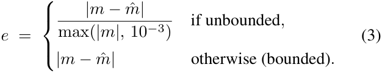

For continuous metrics the Gaussian score uses a permetric bandwidth _σ_ = max( _c · m,_ 10_−_6 ), where _m_ is a bandwidth multiplier. Metric-QA training sets it by split, whereas evaluation fixes _m_ = 0 _._ 5: 

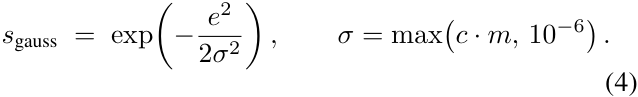

Integer-valued metrics are first rounded independently, ˜ ˆ _m_ = round( _m_ ) and _m_˜ = round( ˆ _m_ ), and are then scored stepwise (with integer tolerance _τ_ ): 

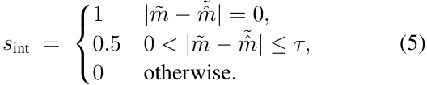

The Gaussian family is thus **type-differentiated** : the bandwidth _σ ∝ c_ , the error definition (relative vs. absolute), and the integer/continuous switch are all set per metric (Table 9). The same per-claim function is used inside the GRPO reward and for evaluation; task-specific training bandwidths and outer reward aggregations are described separately in Appendix D.1. 

### **H.2 Rel25 (metric-agnostic)** 

Rel25 is kernel- and metric-independent. It applies a flat relative threshold, falling back to a strict absolute threshold when _m ≈_ 0: 

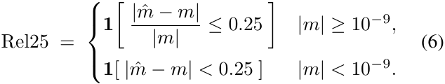

Unlike the Gaussian score, Rel25 ignores the per-metric tolerance _c_ . 

### **H.3 Per-metric tolerance specification** 

The 169 metrics fall into seven value-type categories. The range shown in the category column is the metric’s declared range; _error_ is the Gaussian error definition; _tolerance_ is _c_ (or _τ_ for integers). 

### **H.4 Full metric listing** 

All 169 metrics with value type, error definition (absolute/relative), and tolerance ( _c_ or _τ_ for integers), grouped by category. For PCA, we retain the smallest prefix whose cumulative explained-variance ratio reaches a fixed threshold, subject to a 20% dimensionality floor and clipping to [1 _,_ 10]. 

This inventory supplies the per-property scoring specification used by both Metric-QA answers and scoreable Caption claims. 

## **I Answer and Claim Extraction** 

This section describes how generated text is converted into scoreable content. It first specifies Metric-QA parsing and its extraction diagnostic, then the TSQA choice and text normalization, and finally the Caption claim extractor and its aggregation support. 

### **I.1 Metric-QA parsing policy** 

All Metric-QA results use the same fixed 2,000 requests, ground-truth values, numerical scoring functions, and failure-as-zero denominator. The answer parsers are deliberately _not_ identical. CGTime is evaluated with a strict structured-answer parser, whereas external models use a permissive numeric normalizer. This asymmetry favors the external baselines by recovering a numerical answer from freeform prose whenever possible. 

**Strict parser for our model.** The parser examines the first <answer>...</answer> block and accepts only the first \boxed{ } expression inside that block. It then reads the first numeric token in the box, with metric-aware handling of integers and percentages. It does not fall back to an unboxed answer span or to the rest of the completion. A missing or unparseable boxed value therefore receives zero. 

**Permissive normalizer for external models.** For every external model, boxed-answer and answer-tag extraction are attempted first. If neither succeeds, GPT-OSS-20B uses its final-channel convention, whereas the other models use keyword-based and complete-output extraction: 

1. **Boxed answer.** The first \boxed{NUMBER} match anywhere in the completion. 

2. **Answer tag.** The last number inside the last <answer>...</answer> block. 

3. **Final-channel extraction for GPT-OSS-20B.** If neither preceding rule succeeds, extraction is restricted to the suffix following the last occurrence of final, when that token is present, and otherwise uses the complete output. The last number in that text is returned; if it contains no number, extraction fails. 

4. **Keyword-based extraction (other models).** For the remaining external models, anchors are tried in the top-tobottom order of Table 11. For the first anchor type with any match, the last matched number for that anchor is returned. 

|Category (value type)|_n_|Value type|Error|Tolerance|
|---|---|---|---|---|
|[0_,_1]ratio /_R_2 / probability [_−_1_,_1]correlation [_−π, π_]phase / angle |65 14 3|continuous continuous continuous|absolute absolute absolute|0_._04–0_._15(mostly0_._1) 0_._08–0_._10 0_._5|
|[0_,_100]percentage other bounded ranges|4 5|continuous continuous|absolute absolute|10_._0 0_._01_/_0_._05_/_0_._1|
|integer-valued metrics|25|integer|exact_±τ_|_τ ∈{_1_,_2_,_3_}_|
|unbounded magnitude|53|continuous|**relative**|0_._15_/_0_._20|
|**total**|**169**||||

Table 9: Metric-QA tolerance categories. The Gaussian bandwidth is _σ_ = _c · m_ ( _m_ = 0 _._ 5 for evaluation); integers use stepwise tolerance _τ_ . Relative error is used exactly for the 53 unbounded-magnitude metrics. 

5. **Complete-output extraction (other models).** If no keyword anchor matches, the last number anywhere in the completion is returned. 

The answer-tag, final-channel, and complete-output procedures remove thousands separators before applying the numeric pattern. The boxed-answer and keyword-based procedures apply the following pattern directly: 

#### [-+]?\d*\.?\d+(?:[eE][-+]?\d+)? _._ 

If all applicable rules fail, the prediction receives zero. Otherwise the recovered scalar is passed to the shared numeric scorer. Thus, scorer, ground truth, request denominator, and failure policy are shared, while the extraction policy is explicitly more permissive for external models. The external normalization step must not be interpreted as evidence that the original output satisfied our model’s structured-output format. 

### **I.2 Model numeric extraction success** 

Table 12 reports the fraction of the fixed 2,000 Metric-QA requests from which each model’s assigned parser recovers a numeric value. This is an extraction diagnostic, not a factual score. In particular, the external rates include values obtained through complete-output extraction, whereas the rate for our model requires the strict boxed-answer rule. 

The permissive extraction rules recover a value from nearly every external-model completion except Time-MQAMistral-7B. Its 57.9% extraction rate confirms that a substantial portion of its outputs contain no parseable number even under the generous policy. The factual scores should nevertheless be read from the main results tables: extraction success only establishes that a number was available to score, not that the number was correct. 

### **I.3 TSQA choice-label normalization** 

For TSQA multiple-choice and true/false questions, we apply the same explicit-label normalization before exact matching in all evaluations. The normalizer checks, in order, a letter inside the last \boxed{ } expression, a letter in the last <answer>...</answer> block, an unambiguous leading option label, and an explicit answer cue. Accepted leading forms include B), (B), B., and a bare B on the first line. Explicit cues include Answer, Final answer, Correct answer, Option, Choice, and Conclusion. 

For a true/false request whose answer choices explicitly associate one label with True and the other with False, an explicit conclusion such as the statement is false is mapped back to its option label. The parser does not search for arbitrary isolated letters elsewhere in prose; for example, an initial article in A structural break ... is not treated as option A. If no accepted label is recovered, the response remains in the full task denominator and receives zero. This normalization changes only answer extraction: the cleaned TSQA evaluation subset, generated completions, ground-truth labels, and exact-match scorer are unchanged. 

**TSQA open-ended responses.** For an open-ended TSQA response, the scorer uses the content of the last <answer>...</answer> block when one is present. Otherwise, it removes complete <think>...</think> blocks and scores the remaining text. The reported metric is ROUGE-L F-measure computed without stemming; an empty or failed response remains in the denominator and receives zero. 

### **I.4 Caption claim extraction** 

Captioning does not use either Metric-QA parser. We process each generated caption with one fixed, deterministic regularexpression extractor shared by all models and all 2,000 requests. The extractor receives only the generated caption text: it is not given the model identity, benchmark split, prompted candidate properties, or ground-truth properties and values. A shared lexicon and bounded local-context patterns bind numerical expressions to property identifiers, including explicit Series1/Series2 formulations. The output contains at most one value for each recognized property. For applicable [0 _,_ 1] metrics, a value greater than one followed by an explicit percent sign is divided by 100; integer-valued properties are rounded according to their property type. No model-specific rule tuning or external language model is used. 

Candidate filtering occurs only after this blind extraction step. For request _i_ , let _Gi_ be the subset of its 16 prompted candidate properties that have finite ground truth. Let _Ai ⊆ Gi_ be the unique extracted claims whose properties remain after intersecting the extractor output with _Gi_ . An extracted property outside the prompted panel, or a prompted property that is undefined for that request, is excluded rather than treated as a false positive. The numerical ground-truth values are 

|Property|Type|Error T|olerance|Property|Type|Error|Tolerance|
|---|---|---|---|---|---|---|---|
|anomaly_ratio_x|real|absolute|0.05|trough_pos_pct_y|real|absolute|10|
|anomaly_ratio_y|real|absolute|0.05|beta_x|real|absolute|0.01|
|ccf_positive_peak|real|absolute|0.1|beta_y|real|absolute|0.01|
|corr_abs_max_per_factor|real|absolute|0.08|ccf_negative_peak|real|absolute|0.1|
|corr_abs_mean_per_factor|real|absolute|0.08|dom_freq_x|real|absolute|0.05|
|corr_dynamics_max_std|real|absolute|0.1|dom_freq_y|real|absolute|0.05|
|corr_dynamics_mean_std|real|absolute|0.1|anomaly_count|integer|stepwise|_τ_ = 2|
|corr_dynamics_ratio|real|absolute|0.1|anomaly_count_x|integer|stepwise|_τ_ = 2|
|corr_structure_stability|real|absolute|0.08|anomaly_count_y|integer|stepwise|_τ_ = 2|
|corr_volatility|real|absolute|0.1|ccf_peak_lag|integer|stepwise|_τ_ = 2|
|cp_overlap|real|absolute|0.1|change_point_count|integer|stepwise|_τ_ = 1|
|distance_corr|real|absolute|0.1|change_point_count_x|integer|stepwise|_τ_ = 1|
|granger_xy_pvalue|real|absolute|0.1|change_point_count_y|integer|stepwise|_τ_ = 1|
|granger_yx_pvalue|real|absolute|0.1|dominant_period|integer|stepwise|_τ_ = 2|
|high_vol_correlation_ratio|real|absolute|0.1|mahal_outlier_count|integer|stepwise|_τ_ = 2|
|high_vol_sync_ratio|real|absolute|0.05|max_lag|integer|stepwise|_τ_ = 1|
|joint_extreme_ratio|real|absolute|0.05|max_lead|integer|stepwise|_τ_ = 1|
|laggard_ratio|real|absolute|0.1|num_peaks|integer|stepwise|_τ_ = 2|
|leader_ratio|real|absolute|0.1|num_peaks_x|integer|stepwise|_τ_ = 2|
|loading_ipr_pc1|real|absolute|0.1|num_peaks_y|integer|stepwise|_τ_ = 2|
|mahal_outlier_ratio|real|absolute|0.04|num_troughs|integer|stepwise|_τ_ = 2|
|main_peak_position|real|absolute|0.1|num_troughs_x|integer|stepwise|_τ_ = 2|
|main_trough_position|real|absolute|0.1|num_troughs_y|integer|stepwise|_τ_ = 2|
|max_var_seasonality|real|absolute|0.1|pc1_suggested_period|integer|stepwise|_τ_ = 2|
|min_period_power_ratio|real|absolute|0.05|pca_k|integer|stepwise|_τ_ = 1|
|multiplicative_ratio |real |absolute |0.08|pca_k_20percent |integer |stepwise |_τ_ = 1|
|mutual_information|real|absolute|0.1|period_x|integer|stepwise|_τ_ = 2|
|p_value_x|real|absolute|0.15|period_y|integer|stepwise|_τ_ = 2|
|p_value_y|real|absolute|0.15|sign_changes|integer|stepwise|_τ_ = 3|
|pc1_anomaly_ratio|real|absolute|0.08|sign_changes_x|integer|stepwise|_τ_ = 3|
|pc1_expl_ratio|real|absolute|0.08|sign_changes_y|integer|stepwise|_τ_ = 3|
|pc1_period_strength|real|absolute|0.06|amplitude_ratio|real|relative|0.2|
|pc1_regime_shift|real|absolute|0.1|corr_frobenius_change_mean|real|relative|0.15|
|pc1_seasonality_strength|real|absolute|0.08|cv_x|real|relative|0.2|
|pc1_spectral_entropy|real|absolute|0.1|cv_y|real|relative|0.2|
|pc1_trend_r2|real|absolute|0.08|efective_rank|real|relative|0.15|
|pca_expl_cumsum_k|real|absolute|0.08|end_value_x|real|relative|0.2|
|pca_expl_ratio_1|real|absolute|0.08|end_value_y|real|relative|0.2|
|pos_loading_ratio_pc1|real|absolute|0.1|iqr|real|relative|0.2|
|power_ratio_x|real|absolute|0.1|iqr_x|real|relative|0.2|
|power_ratio_y|real|absolute|0.1|iqr_y|real|relative|0.2|
|r2_x|real|absolute|0.1|lag_mean|real|relative|0.2|
|r2_y|real|absolute|0.1|lag_range|real|relative|0.2|

Table 10: Full metric listing (169 statistics): value type, error definition (absolute/relative), and tolerance ( _c_ or _τ_ for integers), part 1 of 2. 

accessed only after the property intersection, by the scorer. Let _s_ (ˆ _y, y_ ) be the type-aware Gaussian score in Appendix H, evaluated at _m_ = 0 _._ 5. Per-caption Precision and Recall are 

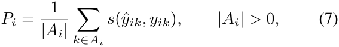

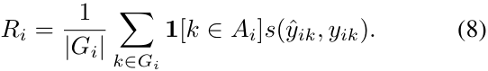

Precision is the macro-average of _Pi_ over captions with at least one retained claim, whereas Recall is the macro-average of _Ri_ over all 2,000 captions. Coverage and Avg. Extracted 

are 

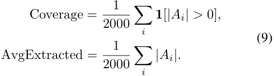

Consequently, an empty caption or a caption with no retained claim contributes zero to Recall, Coverage, and Avg. Extracted but does not enter the conditional Precision denominator. Thus, Recall, Coverage, and Avg. Extracted are request-level macro averages over all 2,000 requests, whereas Precision is a request-level macro average over the nonempty retained-claim subset. None is an equal average of the 8 cell 

|Property|Type|Error To|lerance|Property|Type|Error|Tolerance|
|---|---|---|---|---|---|---|---|
|rolling_corr_stability|real|absolute|0.1|lag_std|real|relative|0.2|
|seasonal_strength|real|absolute|0.1|mahal_max_distance|real|relative|0.2|
|seasonal_var_ratio|real|absolute|0.12|mahal_mean_distance|real|relative|0.2|
|seasonality_consistency|real|absolute|0.1|max|real|relative|0.2|
|seasonality_mode_confdence|real|absolute|0.08|max_peak_prominence|real|relative|0.2|
|spectral_entropy|real|absolute|0.1|max_peak_prominence_x|real|relative|0.2|
|spectral_entropy_x|real|absolute|0.1|max_peak_prominence_y|real|relative|0.2|
|spectral_entropy_y|real|absolute|0.1|max_x|real|relative|0.2|
|strongest_anomaly_pos_x|real|absolute|0.1|max_y|real|relative|0.2|
|strongest_anomaly_pos_y|real|absolute|0.1|mean_abs_change|real|relative|0.2|
|strongest_anomaly_position|real|absolute|0.1|mean_abs_change_x|real|relative|0.2|
|sync_ratio|real|absolute|0.1|mean_abs_change_y|real|relative|0.2|
|sync_stability|real|absolute|0.1|mean_x|real|relative|0.2|
|sys_decoupled_ratio|real|absolute|0.1|mean_y|real|relative|0.2|
|sys_high_sync_ratio|real|absolute|0.1|median|real|relative|0.2|
|sys_sync_avg_r2_topk|real|absolute|0.08|median_x|real|relative|0.2|
|sys_sync_std_r2_topk|real|absolute|0.06|median_y|real|relative|0.2|
|tail_concordance|real|absolute|0.1|min|real|relative|0.2|
|vol_corr_std|real|absolute|0.05|min_x|real|relative|0.2|
|vol_sync_index|real|absolute|0.1|min_y|real|relative|0.2|
|volatility_correlation_std|real|absolute|0.1|pc1_dominant_period|real|relative|0.15|
|volatility_sync_index|real|absolute|0.06|pc1_max_abs_z|real|relative|0.2|
|acf_lag1|real|absolute|0.1|pc1_mean_abs_change|real|relative|0.2|
|acf_lag1_x|real|absolute|0.1|pc1_pc2_ratio|real|relative|0.2|
|acf_lag1_y|real|absolute|0.1|pc1_trend_accel|real|relative|0.2|
|ccf_at_lag0|real|absolute|0.1|pc1_volatility|real|relative|0.2|
|ccf_peak_value|real|absolute|0.1|pca_ratio_12|real|relative|0.2|
|loading_polarity_pc1|real|absolute|0.1|period_ratio|real|relative|0.2|
|pearson_detrended|real|absolute|0.08|r2_topk_skew|real|relative|0.2|
|pearson_raw|real|absolute|0.08|range_x|real|relative|0.2|
|rolling_corr_trend|real|absolute|0.1|range_y|real|relative|0.2|
|sync_trend|real|absolute|0.1|robust_slope|real|relative|0.2|
|vol_corr|real|absolute|0.1|robust_slope_x|real|relative|0.2|
|vol_corr_max|real|absolute|0.1|robust_slope_y|real|relative|0.2|
|volatility_correlation_max|real|absolute|0.1|start_value_x|real|relative|0.2|
|volatility_correlation_mean|real|absolute|0.08|start_value_y|real|relative|0.2|
|phasedif|real|absolute|0.5|std|real|relative|0.2|
|_ phase_x|real|absolute|0.5|std_x|real|relative|0.2|
|phase_y|real|absolute|0.5|std_y|real|relative|0.2|
|peak_pos_pct_x|real|absolute|10|t_stat_x|real|relative|0.2|
|peak_pos_pct_y|real|absolute|10|t_stat_y|real|relative|0.2|
|trough_pos_pct_x|real|absolute|10|||||

Table 10: Full metric listing (169 statistics), continued. 

aggregates. The same 2,000 requests and hidden ground truth are used for every model. Because the extractor is rule-based, these support statistics describe numerical benchmark claims recognized by the fixed extractor rather than an exhaustive inventory of every numerical statement in the generated text. 

These retained claims provide the support used by the Caption results and the statistic-family analysis below. 

## **J Metric-QA Significance Test Definition** 

### **J.1 Setup** 

All models are evaluated on the **same, fixed** set of 2,000 Metric-QA requests: 1,000 univariate and 1,000 multivariate. For every request _i_ , each model receives a Gaussian score _si ∈_ [0 _,_ 1], evaluated with the Gaussian bandwidth multiplier _m_ =0 _._ 5. A failed numerical extraction receives zero. Because model _A_ and model _B_ answer the _identical_ requests, their scores form **paired** vectors 

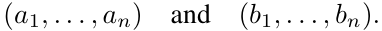

This section defines the paired inference used to quantify uncertainty in model differences on the fixed held-out evaluation set. 

Here _n_ =2 _,_ 000 for Overall and _n_ =1 _,_ 000 for each split. Pairing controls for shared request difficulty and is the basis of the reported inference. 

|Anchor meaning|Optional trailing connective|
|---|---|
|“median”|“is” / “approx.” /_≈_/ “about” / colon|
|“answer”|“is” / colon|
|“result”|“is” / “approx.” /_≈_/ colon|
|“coefcient”|“approx.” / “is” /_≈_/ colon|
|“approximately” _≈_ =|— — —|

Table 11: Keyword anchors in the permissive external-model normalizer. “Colon” covers the supported half- and full-width forms. Matching is case-insensitive, anchors are tried from top to bottom, and the last match for the first matching anchor type is returned. 

|Model|Parser|Extracted (%)|
|---|---|---|
|GPT-5.4-nano|permissive|99.6|
|GPT-4o-mini|permissive|100.0|
|GPT-OSS-20B|permissive,finalanchor|99.8|
|Qwen2.5-7B-Instruct|permissive|100.0|
|Qwen3-14B|permissive|100.0|
|Qwen3-4B-Instruct-2507|permissive|100.0|
|TimeOmni-1-7B|permissive|100.0|
|ChatTS-14B|permissive|99.8|
|Time-MQA-Mistral-7B|permissive|57.9|
|Time-MQA-Qwen-2.5-7B|permissive|97.6|
|CGTime (4B)|strict|95.1|

Table 12: Metric-QA numeric extraction success on 2,000 requests. Missing extractions remain in the denominator and score zero. The parser column is essential when interpreting the percentages: external models use the permissive prose-based extraction rules, while our model does not. 

### **J.2 Paired normal-approximation test** 

For each request take the paired difference, then its mean, standard error, and test statistic: 

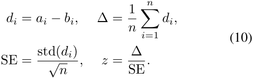

where std( _di_ ) is the sample standard deviation of the differences (divisor _n −_ 1). Under the null hypothesis 

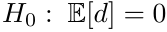

the Central Limit Theorem gives a normal approximation for the sampling distribution of ∆. We compute the two-sided normal-approximation _p_ -value as 

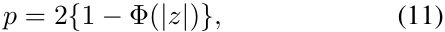

where Φ is the standard normal cumulative distribution function. A positive ∆ means model _A_ has the higher mean score. 

### **J.3 Why pairing matters** 

The variance of the per-item difference is 

Var( _d_ ) = _σA_2+_σ_ _B_2_−_2_ρ σAσB,_ _ρ_ = corr( _a, b_ ) _._ (12) 

Computing std( _di_ ) directly incorporates this covariance. When both models tend to find the same requests easy or 

difficult, the shared request-level variation partially cancels. An independent-samples analysis would discard this information and would not match the paired evaluation design. 

### **J.4 Confidence intervals** 

For every reported contrast, including those in the primary family, we use the same paired standard error to form an unadjusted, pointwise normal-approximation 95% confidence interval: 

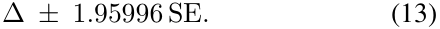

All confidence intervals reported in the Metric-QA tables use this normal approximation. In the prespecified analysis defined here, multiplicity correction applies only to the primary-family _p_ -values. The secondary endpoint-specific Holm analyses are reported separately in Appendix Q. The Metric-QA analysis does not use bootstrap confidence intervals. An interval containing zero indicates that the data do not reject a zero mean difference at the unadjusted twosided 0.05 level; it is not evidence that the two models are equivalent. 

### **J.5 Multiple comparisons** 

We use a primary/secondary endpoint structure. The designated primary family contains the _m_ =10 multivariate Gaussian comparisons between our 4B model and the 10 external baselines. We control this family’s family-wise error rate 

(FWER) at _α_ =0 _._ 05 with the **Holm–Bonferroni** step-down procedure. Let _p_ (1) _≤· · · ≤ p_ ( _m_ ) be the ordered unadjusted _p_ -values. Holm rejects sequentially while 

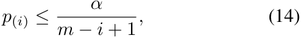

stopping at the first failure. The corresponding Holmadjusted _p_ -values reported in the tables are 

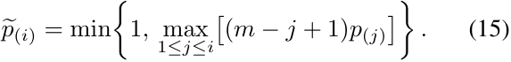

Overall and univariate comparisons are **secondary** : we report their paired mean difference and normal-approximation 95% confidence interval, but they do not enter the primary multiplicity family. 

All 10 primary comparisons survive Holm–Bonferroni. Against GPT-5.4-nano, the multivariate difference is +0 _._ 080 with _z_ =6 _._ 71 and Holm-adjusted _p_ =3 _._ 90 _×_ 10_−_11 . The largest Holm-adjusted _p_ -value in the primary family is 9 _._ 16 _×_ 10_−_10 (against GPT-OSS-20B, _z_ =6 _._ 12), which remains well below 0.05. Thus, the positive multivariate difference survives FWER control against every external baseline in the designated family. 

### **J.6 Reading the verdict** 

- ∆: mean paired Gaussian-score difference, with positive values favoring our model. 

- **95% CI** : normal-approximation interval based on the sample standard deviation of paired differences. 

- _z_ **and Holm** _p_ : reported for the designated multivariate primary family; the Holm value controls FWER across its 10 comparisons. 

- A non-rejection or a confidence interval containing zero is not a proof of equality. 

### **J.7 Complete Paired Results** 

Table 13 reports all secondary paired confidence intervals and the Holm-corrected primary multivariate family. 

The table therefore separates the prespecified multivariate test family from the descriptive overall and univariate contrasts. 

## **K Detailed Metric-QA Split Analysis** 

We first ask whether the overall Metric-QA gain is preserved across the univariate and multivariate evaluation splits. 

Figure 5(a) shows Gaussian scores on the fixed univariate and multivariate splits, while panel (b) shows each model’s cross-split change. Most external baselines show larger cross-split declines: GPT-5.4-nano falls from 0.285 to 0.203 and GPT-4o-mini from 0.265 to 0.173, whereas our model changes only from 0.292 to 0.283. Our model’s univariate score of 0.292 is also highest at face value, although the unadjusted paired 95% confidence intervals against GPT5.4-nano, GPT-4o-mini, and ChatTS-14B include zero and thus do not reject a zero mean difference. Its 2,000-request Overall score of 0.288 exceeds every external baseline, with all ten unadjusted paired confidence intervals above zero. 

On the prespecified multivariate primary endpoint, all ten gains survive Holm correction, establishing a consistent advantage on this split. 

Exact Gaussian and Rel25 values and paired inference are reported in Tables 14 and 13. 

This split-level pattern motivates the property-level decomposition in the next section, which asks which kinds of statistics account for the remaining strengths and weaknesses. 

## **L Statistic-Family Analysis: Direct Readout Bottleneck** 

We analyze the fixed 2,000-request Metric-QA and Caption evaluations by the type of statistic that must be recovered. Figure 6(b) summarizes the Caption decomposition, while Tables 17 and 19 report the complete values. We classify the full inventory of 169 statistical properties into three families: Direct level/scale readout, Marginal temporal/structural statistics, and Joint relational/system statistics. Among the statistic-family cells represented in the evaluation, this analysis identifies Direct level/scale readout as the principal weakness of our model. Panel (a) of Figure 6 places each model’s conditional Caption Precision against Recall, with marker area showing how many captions contain at least one scoreable extracted claim. It therefore separates factual quality on recognized claims from the breadth of numerical reporting before panel (b) decomposes that quality by statistic family. 

In Metric-QA, the 4B model scores .137 on Direct level/scale questions and .359 on Marginal temporal/structural questions. Both groups are drawn from the same univariate split, so their contrast is not attributable to a difference in variable count. The model also scores .283 on Joint relational/system questions. In Caption, the model reaches .077 Direct Precision with support from 111 captions, .490 Marginal Precision with support from 999 captions, and .315 Joint Precision with support from 1,000 captions, where support requires at least one extracted scoreable claim from that family. Together, these results show that, among the evaluated properties, the model reports derived temporal and systemlevel properties more accurately than it reads out exact level and scale. 

**Operational taxonomy.** We partition the 169 defined statistical properties according to the information that must be recovered from the input. _Direct level/scale readout_ contains channel-local values tied directly to the original numerical level or dispersion. _Marginal temporal/structural statistics_ contains derived properties of a single channel, including temporal dependence, periodicity, events, counts, coordinates, and trends. _Joint relational/system statistics_ contains pairwise relations and latent or global system properties, including correlation, lead–lag, synchronization, PCA, and Mahalanobis statistics. This post-hoc diagnostic taxonomy is an operational partition of the benchmark inventory rather than a pre-specified primary evaluation split or a universal ontology of time-series properties. 

Table 15 gives the exact construction. The names “Shape/normalized” and “Cross-channel” are intentionally avoided: Marginal includes quantities such as counts and 

**(a) Secondary Gaussian contrasts** : paired ∆ [95% CI] 

|Baseline|Overall||Univariate|
|---|---|---|---|
|GPT-5.4-nano|+0_._044 [+0_._022_,_+0_._065] |+0_._007 |[_−_0_._029_,_+0_._043] |
|GPT-4o-mini|+0_._069 [+0_._046_,_+0_._092] |+0_._027 |[_−_0_._010_,_+0_._064] |
|GPT-OSS-20B|+0_._064 [+0_._042_,_+0_._087]|+0_._044|[+0_._007_,_+0_._080]|
|Qwen2.5-7B-Instruct|+0_._094 [+0_._072_,_+0_._117]|+0_._059|[+0_._024_,_+0_._095]|
|Qwen3-14B|+0_._080 [+0_._057_,_+0_._102]|+0_._038|[+0_._002_,_+0_._075]|
|Qwen3-4B-Instruct-2507| +0_._119 [+0_._097_,_+0_._140]| +0_._090| [+0_._056_,_+0_._124]|
|TimeOmni-1-7B| +0_._115 [+0_._093_,_+0_._137]| +0_._091| [+0_._057_,_+0_._125]|
|ChatTS-14B| +0_._078 [+0_._056_,_+0_._099]| +0_._006| [_−_0_._027_,_+0_._040]|
|Time-MQA-Mistral-7B|+0_._238 [+0_._219_,_+0_._257]|+0_._238|[+0_._211_,_+0_._265]|
|Time-MQA-Qwen-2.5-7B|+0_._168 [+0_._146_,_+0_._189]|+0_._115|[+0_._083_,_+0_._147]|
|**(b) Primary Gauss**|**ian family**: multivariate CGTi|me (4B)|_−_baseline|
|Baseline|∆[95% CI]|Paired|_z_ Holm_p_|
|GPT-5.4-nano|+**0**_._**080**[+**0**_._**057**_,_+**0**_._**104**]|+**6**_._**7**|**1** 3_._90_×_10_−_11|
|GPT-4o-mini|+**0**_._**111**[+**0**_._**082**_,_+**0**_._**139**]|+**7**_._**6**|**4** 6_._61_×_10_−_14 |
|GPT-OSS-20B|+**0**_._**085**[+**0**_._**058**_,_+**0**_._**112**]|+**6**_._**1**|**2** 9_._16_×_10_−_10|
|Qwen2.5-7B-Instruct|+**0**_._**130**[+**0**_._**102**_,_+**0**_._**157**]|+**9**_._**3**|**3** 5_._54_×_10_−_20|
|Qwen3-14B|+**0**_._**121**[+**0**_._**095**_,_+**0**_._**147**]|+**9**_._**1**|**5** 2_._22_×_10_−_19 |
|Qwen3-4B-Instruct-2507|+**0**_._**147**[+**0**_._**121**_,_+**0**_._**173**]|+**11**_._**1**|**1** 9_._19_×_10_−_28|
|TimeOmni-1-7B|+**0**_._**139**[+**0**_._**112**_,_+**0**_._**167**]|+**9**_._**8**|**4** 4_._44_×_10_−_22|
|ChatTS-14B|+**0**_._**149**[+**0**_._**122**_,_+**0**_._**176**]|+**10**_._**8**|**4** 1_._63_×_10_−_26|
|Time-MQA-Mistral-7B|+**0**_._**237**[+**0**_._**210**_,_+**0**_._**264**]|+**17**_._**3**|**7** 1_._38_×_10_−_66|
|Time-MQA-Qwen-2.5-7B|+**0**_._**220**[+**0**_._**193**_,_+**0**_._**247**]|+**16**_._**0**|**2** 8_._17_×_10_−_57|

Table 13: Paired Gaussian differences for the CGTime (4B) checkpoint on the fixed 2,000-request Metric-QA test set. Panel (a) reports secondary contrasts as unadjusted, two-sided normal-approximation 95% confidence intervals. Panel (b) reports the designated multivariate family with paired _z_ and Holm-adjusted _p_ ; all ten comparisons survive at _α_ =0 _._ 05. Rel25 is a secondary endpoint; its paired comparisons are reported in Appendix Q. 

slopes that are not all normalized, while Joint includes global PCA and system properties that are not adequately described as a single cross-channel pair. Together with the complete property inventory in Table 10, the construction uniquely assigns every property. The full inventory contains 26 Direct, 58 Marginal, and 85 Joint properties, with no overlap or unassigned property. This taxonomy describes the complete dataset and method; evaluation coverage is reported separately below. 

**Family–split composition.** The Metric-QA evaluation contains 77 distinct properties from the full 169-property inventory: 6 Direct, 14 Marginal, and 57 Joint properties. As shown in Table 16, Direct and Marginal questions occur only in the univariate subset, whereas Joint questions occur only in the multivariate subset. Family and split are therefore nested rather than fully crossed. The Direct–Marginal comparison controls for split because both families are evaluated on univariate requests; comparisons involving Joint do not identify family effects independently of variable count. 

**Pooled Metric-QA family results.** Table 17 reports the complete 11-model comparison under both Gaussian and Rel25 scoring. 

**Forced-answer evidence from Metric-QA.** Table 18 reports the three observed family–split cells under the primary Gaussian scorer. Within the univariate split, the 4B model 

scores .137 on Direct questions and .359 on Marginal questions. GPT-5.4-nano and GPT-4o-mini show the opposite ordering: .590/.565 on Direct and .154/.136 on Marginal. Thus, the 4B model’s weakness is concentrated in direct numerical readout rather than applying uniformly to all univariate statistics. Its .283 Joint score exceeds the two GPT baselines’ .203 and .173, but this cell consists entirely of multivariate questions and is therefore descriptive rather than evidence for an independent Joint-family advantage. 

**2,000-request Caption family analysis.** Table 19 decomposes the same 2,000-request responses reported in Table 1. The family analysis therefore uses exactly the same naturallanguage requests, 16 candidate properties per request, the same restriction to candidate properties with finite groundtruth values, fixed rule-based extractor, and Gaussian scorer at _m_ =0 _._ 5. 

**Extractor-conditioned composition.** Family Precision is conditional on the fixed extractor recovering at least one scoreable claim from that family. Claim rewards are first averaged within each caption and family and then macroaveraged over captions with at least one such claim. Support is the number of captions entering that conditional average. Each family is included in the candidate panels of 1,000 evaluation prompts. Direct and Marginal supports can overlap within univariate captions, so family supports must not be summed. 

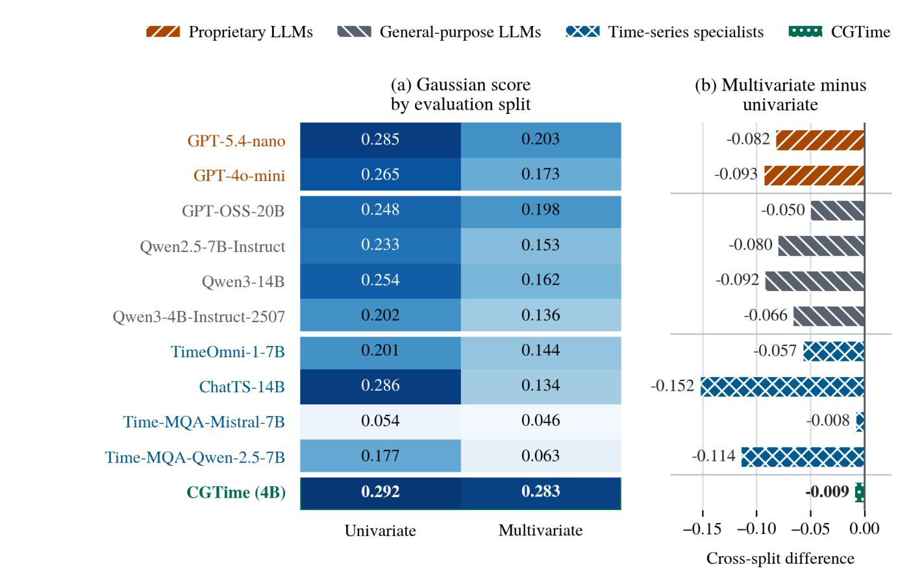

Figure 5: Metric-QA performance profiles on the univariate and multivariate evaluation splits. Panel (a) reports per-split Gaussian scores. Panel (b) reports the multivariate-minus-univariate difference; values closer to zero indicate a smaller cross-split decline. Because statistic-family composition differs between the two splits, this contrast does not isolate the effect of variable count. 

The 4B model obtains .490 Precision on Marginal content with support from 999 captions and .315 on Joint content with support from 1,000 captions. Both are the highest displayed family values: the strongest external Marginal and Joint results are ChatTS-14B at .221 with support from 635 captions and .197 with support from 853 captions, respectively. By contrast, the 4B model reaches only .077 Direct Precision with support from 111 captions. GPT-5.4-nano obtains the strongest external Direct result, .620 with support from 983 captions. Thus, on the shared 2,000-caption evaluation, our 4B model combines broad and comparatively accurate Marginal/Joint reporting with sparse and inaccurate Direct readout. 

**Interpretation and limits.** Taken together, the Metric-QA results identify Direct level/scale readout as the model’s principal weakness among the statistic-family cells represented in the evaluation. The same-split QA contrast between Direct and Marginal questions provides the cleanest evidence: variable count is held fixed, yet Direct accuracy is substantially lower. The Caption decomposition is consistent with this pattern, but its family supports remain extraction-conditioned. Support depends jointly on what a model writes and which formulations the fixed extractor recognizes, so it cannot by 

itself identify the model’s latent content-selection policy. 

A plausible contributor to the QA pattern is how the timeseries values are presented to each model. Text-serialized baselines receive the original numerical values explicitly in their prompts, whereas our 4B model must recover them from learned time-series and per-channel scale representations. The evidence is consistent with a bottleneck in converting those representations into exact raw-value readouts, but it does not identify its cause. Representation compression, scale encoding, the distribution of training supervision, and the learned generation policy remain alternative explanations. Establishing a causal architectural explanation would require a controlled intervention, such as a matched rawvalue readout path or additional Direct supervision. 

Having localized the principal weakness, we next test how the composition of final-alignment data and the sequence of training stages affect the full model’s performance. 

## **M Ablation Studies** 

Answering RQ 3, we examine three questions: how the composition of the final-alignment data affects cross-task performance, whether computed statistics provide better supervision than values perceived by an LLM, and how the sequence of training stages contributes to the final model. 

||G|aussian (_m_|=0_._5)||Rel25 (_≤_2|5%)|
|---|---|---|---|---|---|---|
|Model|Overall|Univariate|Multivariate|Overall|Univariate|Multivariate|
|_Proprietary LLMs_|||||||
|GPT-5.4-nano|0.244|0.285|0.203|0.312|**0.412**|0.211|
|GPT-4o-mini|0.219|0.265|0.173|0.309|0.394|0.223|
|_Open-source general-purp_|_ose LLMs_||||||
|GPT-OSS-20B|0.223|0.248|0.198|0.278|0.334|0.221|
|Qwen2.5-7B-Instruct|0.193|0.233|0.153|0.267|0.351|0.183|
|Qwen3-14B|0.208|0.254|0.162|0.300|0.382|0.217|
|Qwen3-4B-Instruct-2507|0.169|0.202|0.136|0.212|0.265|0.159|
|_Time-series specialists_|||||||
|TimeOmni-1-7B|0.172|0.201|0.144|0.235|0.295|0.175|
|ChatTS-14B|0.210|0.286|0.134|0.262|0.358|0.165|
|Time-MQA-Mistral-7B|0.050|0.054|0.046|0.082|0.096|0.067|
|Time-MQA-Qwen-2.5-7B|0.120|0.177|0.063|0.164|0.243|0.084|
|CGTime (4B)|**0.288**|**0.292**|**0.283**|**0.355**|0.388|**0.322**|

Table 14: Metric-QA by variable-count split on the fixed test set (2,000 requests; 1,000 per split). Missing or invalid extractions remain in the denominator and receive zero. Our model uses the strict structured-answer parser. External free-form baselines use a fixed permissive numeric parser; this asymmetry favors rather than penalizes the baselines. Bold marks the best displayed score in each column. 

The full model is the common reference. Unless noted otherwise, each internal benchmark below uses its own fixed 2,000-request evaluation set, comprising the univariate and multivariate splits. TSQA uses the cleaned 3,264-question subset. 

### **M.1 Data Composition** 

We compare three variants initialized from the same Replay checkpoint: (1) Joint-SFT and Joint-GRPO on the mixture of our internal data and TSQA, (2) the same final-alignment stages using only our internal data, and (3) the same stages using only TSQA. Thus, “TSQA-only” refers specifically to final alignment; the shared Replay initialization has already received internal statistics-grounded supervision. We evaluate the variants on Metric-QA, Captioning, and TSQA to measure both internal statistical factuality and retention of the external task. 

As shown in Table 20, using only our data nearly preserves the full model’s multivariate Metric-QA score (.282 versus .283), but substantially reduces both TSQA metrics. On Captioning, its Precision/Recall changes from .399/.186 to .383/.173. The TSQA-only variant obtains the strongest TSQA scores. Although none of its Metric-QA responses fully satisfies the requested answer format, a small number retain extractable boxed values, yielding a Gaussian score of .002 Overall and .000 on the multivariate split. Its Caption Precision/Recall also falls to .264/.099. The latter results show that the near-zero QA score is not evidence that the model produces no statistical content, but that it fails to retain the required Metric-QA answer format and loses substantial Caption factuality. Overall, the internal data preserves internal statistical behavior, TSQA preserves external-task competence, and their mixture provides the best cross-task balance. 

**Computed statistics vs. GPT-perceived supervision.** We next isolate the source of supervision by comparing two variants trained on our internal data. The computed-statistics variant uses only our internal data during final alignment. Starting from the same Replay checkpoint and using the same set of SFT inputs, the GPT-perceived variant replaces the computed targets withGPT-5-nano generations. Its GRPOrewards are centered on pseudo-ground-truth values extracted from those teacher generations rather than on the computed statistics. The lower panel of Table 20 shows that, compared with computed-statistics supervision, GPT-perceived supervision reduces Overall/Multivariate Gaussian from .269/.282 to .162/.157, while Caption Precision/Recall drops from .383/.173 to .121/.041. This gap is not explained only by the model producing fewer numbers: on the multivariate split, the GPT-perceived variant has full extraction coverage and 7.967 extracted values per Caption, yet its Precision/Recall remains only .108/.055. These results support computed statistics as a substantially stronger source of verifiable numerical supervision than LLM-perceived pseudo labels. 

The GPT-perceived variant should nevertheless be interpreted as a final-alignment teacher-supervision comparison rather than a fully controlled end-to-end ablation. Although its SFT inputs are aligned with those of the computedstatistics variant, its GRPO training set was constructed from its own teacher-generated examples rather than matched prompt by prompt to the computed-statistics GRPO training set used for the full model. 

### **M.2 Training Recipe** 

To examine the training recipe, we compare the full model with three variants: one omits Joint-GRPO and stops after Joint-SFT, one applies Joint-GRPO directly from the supervised Replay checkpoint without the task-specific Joint-SFT warmup, and one removes the basic-to-complex curriculum 

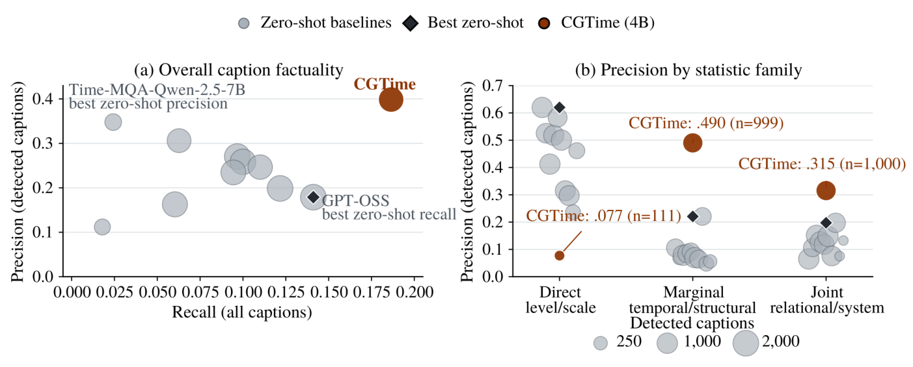

Figure 6: Caption factuality and support under the fixed rule-based extraction method. The area of gray and colored model markers represents the number of captions with at least one detected scoreable claim. Panel (a) shows conditional Precision against Recall; its black diamond marks the zero-shot baseline with the highest Recall. Panel (b) shows family-conditional Precision, with black diamonds marking the highest zero-shot Precision in each family. Family supports can overlap and must not be summed. The stronger evidence for the evaluated Direct level/scale weakness comes from forced-answer Metric-QA. Complete overall and family values are reported in Tables 1 and 19. 

in SFT §2.5. These comparisons probe reward optimization, task-format warmup, and staged representation alignment. 

As shown in Table 21, removing Joint-GRPO reduces Overall/Multivariate Gaussian from .288/.283 to .231/.264. For Captioning, Joint-GRPO raises Recall from .176 to .186 and the average number of extracted values from 6.904 to 7.857, while conditional Precision changes from .411 to .399. Thus, its Caption benefit is broader quantitative reporting rather than higher conditional Precision. 

Removing the task-specific Joint-SFT warmup produces .000/.000 on Metric-QA because the resulting model does not satisfy the required Metric-QA answer format. Its Caption Precision/Recall remains .396/.168, so this result specifically shows that task-specific SFT is needed to establish the Metric-QA format before RL, rather than that all factual behavior disappears without it. Removing the basic-to-complex curriculum yields .245/.261 on Metric-QA. Its Caption Precision/Recall is .404/.157, compared with .399/.186 for the full model; on the multivariate split, Recall decreases from .202 to .146. The pattern is consistent with staged alignment improving quantitative breadth, especially for multivariate Captioning. 

The staging result is not a strict single-variable causal estimate. The no-curriculum variant also used the multivariate per-GPU batch size during the univariate and bivariate stages, differed in the number of optimization steps, and was initialized from weights that had already received univariate supervision. For reference, this variant obtained .642 Choice Macro Accuracy and .264 ROUGE-L under the same TSQA protocol; TSQA was not evaluated for the other trainingrecipe variants, so we treat this result as diagnostic rather than as a systematic recipe comparison. 

## **N Qualitative Case Studies** 

The quantitative results describe average behavior; this section complements them with complete model outputs. We first inspect Metric-QA reasoning traces and then compare CGTime with GPT-5.4-nano on three illustrative five-channel Caption cases. 

### **N.1 Metric-QA Reasoning Traces** 

We inspect high-scoring Metric-QA examples to examine whether the model has learned to approximate the results of metric-specific calculation procedures rather than merely produce final numerical answers. At inference, the model receives only the prompt and the time-series representation and has no access to a calculator or external statistical tool. The complete model outputs are shown below, with no content omitted. These examples cover dominant-period estimation, normalized spectral entropy, and lag-one dependence. In each case, the model identifies and describes the required metric-specific operations and produces a close numerical estimate without external tools. The agreement between the described operation sequences and the deterministic label computations, together with the small numerical errors, provides behavioral evidence that the model has learned to approximate the results of metric-specific calculation procedures from the encoded series. The relative errors reported below are descriptive; each Gaussian score follows the metric’s prescribed error type and tolerance. 

**PC1 dominant period.** 

<think> First, perform a Fourier transform on the PC1 sequence and inspect the power-spectrum distribution. PC1 

|Family|Exact construction in the property inventory # properties|
|---|---|
|Direct level/scale read- out|Univariate property identifers:iqr,max,max_peak_prominence,median,min, andstd. Bivariate channel-local bases: end_value, iqr, max, max_peak_prominence, mean, median,min,range,start_value, andstd, each realized with_xand_y. 26|
|Marginal tempo- ral/structural|Univariate property identifers: acf_lag1, anomaly_count, change_point_count, dominant_period, main_peak_position, main_trough_position, 58|
||mean_abs_change, num_peaks, num_troughs, robust_slope, seasonal_strength, sign_changes, spectral_entropy, and|
||strongest_anomaly_position. Bivariate channel-local bases: acf_lag1, anomaly_count, anomaly_ratio, beta, change_point_count, cv, dom_freq, mean_abs_change, num_peaks, num_troughs, p_value, peak_pos_pct, period, phase, power_ratio, r2, robust_slope, sign_changes, spectral_entropy, strongest_anomaly_pos, t_stat, and trough_pos_pct, each realized with _x and _y.|
|Joint relational/system|All remaining properties. These comprise bivariate relations such as pearson_raw, ccf_peak_lag, mutual_information, phase_diff, and amplitude_ratio, together with latent/global properties such as pca_k, pca_expl_ratio_1, effective_rank, sys_sync_avg_r2_topk, corr_structure_stability, max_lag,volatility_sync_index, andmahal_outlier_ratio. 85|

Table 15: Exact construction of the three statistic families. For channel-local bivariate bases, the two suffixed identifiers are counted separately. The full 169-property inventory and each property’s scoring type are listed in Table 10. 

|Family|Inventory properties|Evaluated properties|Univariate|Multivariate|Total|
|---|---|---|---|---|---|
|Direct level/scale|26|6|301|–|301|
|Marginal temporal/structural|58|14|699|–|699|
|Joint relational/system|85|57|–|1,000|1,000|
|Total|169|77|1,000|1,000|2,000|

Table 16: Metric-QA request counts by statistic family and split. “Inventory properties” covers the complete property taxonomy, whereas “Evaluated properties” counts the distinct properties present in the test requests. 

exhibits clear periodic fluctuations: over multiple intervals, the sequence repeatedly rises and then falls, with a period of approximately 24 time steps. By computing the power of each frequency component, identify the component with the greatest energy; its reciprocal is the dominant period. The maximum-energy frequency component corresponds to a period of approximately 24.000 time steps. </think> <answer> \boxed{24.000} </answer> 

The deterministic computation gives 24 _._ 176, compared with the model’s 24 _._ 000 (a 0 _._ 73% relative error and a Gaussian score of 0 _._ 995). The trace identifies the Fourier transform, the maximum-energy spectral component, and the reciprocal-frequency conversion required by the metric. 

#### **Normalized spectral entropy.** 

<think> First, perform a Fourier transform on the sequence to obtain its power spectrum. Inspection of the data reveals clear periodic fluctuations: the values repeatedly oscillate between 0.01 and 0.1, with alternating peaks and troughs, a pattern that usually corresponds to specific frequency components. After computing the power spectrum, normalize its energy into a probability distribution. Be- 

cause the sequence has a clear periodic structure, the energy is concentrated at a few frequencies rather than distributed uniformly, making the spectrum non-flat. Compute the Shannon entropy of the normalized distribution. Since the spectral energy is concentrated rather than flat, the entropy is below the theoretical maximum for white noise. After scaling the Shannon entropy to the interval from zero to one, the strong periodic regularity implies a relatively low spectral entropy; the resulting estimate is 0.367. </think> 

<answer> \boxed{0.367} </answer> 

The deterministic computation gives 0 _._ 3877, compared with the model’s 0 _._ 3670 (a 5 _._ 34% relative error and a Gaussian score of 0 _._ 918). The trace follows the required sequence of constructing a power spectrum, normalizing its energy, computing Shannon entropy, and scaling the result. 

#### **Lag-one autocorrelation.** 

|||G|aussian (_m_=0_._5)||||Rel25 (_≤_25%)||
|---|---|---|---|---|---|---|---|---|
|||Direct|Marginal|Joint||Direct|Marginal|Joint|
|Model|Overall |level/scale t|emporal/structural|relational/syste|m Overall l|evel/scale t|emporal/structural|relational/system|
|_Proprietary LLMs_|||||||||
|GPT-5.4-nano|0.244|**0.590**|0.154|0.203|0.312|**0.767**|0.259|0.211|
|GPT-4o-mini|0.219|0.565|0.136|0.173|0.309|0.704|0.260|0.223|
|_Open-source general-purp_|_ose LLM_|_s_|||||||
|GPT-OSS-20B|0.223|0.517|0.133|0.198|0.278|0.661|0.193|0.221|
|Qwen2.5-7B-Instruct|0.193|0.495|0.120|0.153|0.267|0.671|0.213|0.183|
|Qwen3-14B|0.208|0.580|0.114|0.162|0.300|0.728|0.233|0.217|
|Qwen3-4B-Instruct-2507|0.169|0.402|0.116|0.136|0.212|0.488|0.169|0.159|
|_Time-series specialists_|||||||||
|TimeOmni-1-7B|0.172|0.378|0.125|0.144|0.235|0.495|0.209|0.175|
|ChatTS-14B|0.210|0.420|0.228|0.134|0.262|0.555|0.273|0.165|
|Time-MQA-Mistral-7B|0.050|0.100|0.034|0.046|0.082|0.183|0.059|0.067|
|Time-MQA-Qwen-2.5-7B|0.120|0.326|0.113|0.063|0.164|0.452|0.153|0.084|
|CGTime (4B)|**0.288**|0.137|**0.359**|**0.283**|**0.355**|0.269|**0.439**|**0.322**|

Table 17: Metric-QA regrouped by statistic family without changing predictions, parsers, scoring, or the failure-as-zero policy. Direct level/scale, marginal temporal/structural, and joint relational/system contain 301, 699, and 1,000 questions. The familycount-weighted values recover Overall. Direct and Marginal contain the univariate questions, while Joint contains the multivariate questions; family and variable count are therefore not independently crossed. 

|Family|Split|_n_|CGTime (4B)|GPT-5.4-nano|GPT-4o-mini|
|---|---|---|---|---|---|
|Direct level/scale|Univariate|301|.137|.590|.565|
|Marginal temporal/structural|Univariate|699|.359|.154|.136|
|Joint relational/system|Multivariate|1,000|.283|.203|.173|

Table 18: Gaussian Metric-QA scores within each observed statistic-family by split cell; the 4B column uses the reported CGTime (4B) checkpoint. The family and split partitions are nested. Predictions and model-specific numeric parsers are those of the main evaluation. 

<think> Following the method, first shift the entire sequence by one time unit to obtain the lag-one sequence, and then compute the Pearson correlation coefficient between the original sequence and the lagged sequence. Inspection of the data shows clear periodic fluctuations, with values repeatedly oscillating between 0.01 and 0.08; adjacent time points are highly synchronized. Dividing the covariance of the two sequences by the product of their standard deviations gives a Pearson correlation coefficient of approximately 0.917, indicating an extremely strong linear dependence between adjacent time points and close tracking along the time axis. </think> <answer> \boxed{0.917} </answer> 

The deterministic computation gives 0 _._ 9371, compared with the model’s 0 _._ 9170 (a 2 _._ 14% relative error and a Gaussian score of 0 _._ 923). The trace identifies the lag-one shift and the normalized covariance calculation required for the metric. 

### **N.2 Caption Comparisons** 

For each illustrative case, the figure shows a per-channel standardized visualization of the shared time-series input and a 

condensed contrast between the two diagnoses, while the framed blocks preserve the complete outputs. These examples illustrate how the numerical behavior measured by the Caption evaluation appears in free-form analysis. 

#### **Caption Case 1** 

Figure 7 presents the five-channel input and the central disagreement between the two responses. **CGTime (4B).** 

This multivariate system exhibits a highly unified and structurally stable pattern dominated by a single factor. PC1 explains 95.7% of the variance, the effective rank is 1.80, and the average synchrony reaches 0.96, indicating that the variables within the system are almost entirely governed by the same core driving mechanism. The variables exhibit extremely strong co-movement along PC1, and an _R_2 of 0.97 further confirms the high temporal consistency of this synchronous relationship. The PC1 trend itself remains stable, with a trend _R_2 of only 0.01 and no significant regime shift (strength 0.15), indicating that the system has undergone neither a structural jump nor a long-term drift and is operating overall in a dynamically balanced steady state. In terms of volatility, the system exhibits pronounced co-movement 

|||Direct le|vel/scale|Marginal t|emporal/structural|Joint relati|onal/system|
|---|---|---|---|---|---|---|---|
|Model|Overall Precision|Precision|_N_ captions|Precision|_N_ captions|Precision|_N_ captions|
|_Proprietary LLMs_ GPT-5.4-nano|0.270|**0.620**|983|0.105|672|0.065|**1,000**|
|GPT-4o-mini|0.306|0.526|884|0.068|217|0.106|713|
|_Open-source general-purp_|_ose LLMs_|||||||
|GPT-OSS-20B|0.179|0.412|982|0.079|979|0.151|**1,000**|
|Qwen2.5-7B-Instruct|0.259|0.518|972|0.085|743|0.128|992|
|Qwen3-14B|0.247|0.583|783|0.091|619|0.118|931|
|Qwen3-4B-Instruct-2507|0.199|0.500|**985**|0.070|982|0.148|**1,000**|
|_Time-series specialists_||||||||
|TimeOmni-1-7B|0.163|0.315|941|0.064|678|0.076|902|
|ChatTS-14B|0.235|0.297|952|0.221|635|0.197|853|
|Time-MQA-Mistral-7B|0.112|0.237|361|0.048|356|0.075|66|
|Time-MQA-Qwen-2.5-7B|0.348|0.462|455|0.056|254|0.132|59|
|CGTime (4B)|**0.399**|0.077|111|**0.490**|**999**|**0.315**|**1,000**|

Table 19: Caption Precision by statistic family on the same 2,000-caption data set as Table 1, using the same prompted candidate scope and fixed rule-based extractor. Claim rewards are first averaged within each caption and family, then macro-averaged over captions with at least one scoreable extracted claim from that family. _N_ is the exact number of captions entering each conditional average. Each family occurs in 1,000 candidate sets; a caption can contribute to more than one family. Overall Precision retains the per-caption aggregation over all extracted claims and is not a support-weighted average of the family values. Bold marks the best displayed value in each column. 

|_Final-alignment dat_|_a compositi_ Metr|_on_ ic-QA|TSQ|A|
|---|---|---|---|---|
|Variant|Overall|Multi.|Choice|R-L|
|Joint supervision|**0.288**|**0.283**|0.650|0.278|
|Internal only|0.269|0.282|0.437|0.122|
|TSQA only|0.002|0.000|**0.712**|**0.299**|
|_Source of internal su_|_pervision_ Metric-QA|(Gaussian)|Capti|on|
|Supervision|Overall|Multi.|Precision|Recall|
|Computed statistics|**0.269**|**0.282**|**0.383**|**0.173**|
|GPT-perceived|0.162|0.157|0.121|0.041|

||Metric-Q|A (Gaussian)|
|---|---|---|
|Variant|Overall|Multivariate|
|Full model|**0.288**|**0.283**|
|Without Joint-GRPO|0.231|0.264|
|Without Joint-SFT warmup|0.000|0.000|
|Without basic-to-complex curriculum|0.245|0.261|

Table 21: Training-recipe ablation measured by Gaussian Metric-QA score on the fixed 2,000-request held-out set and its 1,000-request multivariate split. 

Table 20: Ablations of final-alignment data and supervision. All variants share the Replay initialization. Metric-QA and Caption use their respective fixed 2,000-request univariateplus-multivariate evaluation sets; _Multi._ denotes the 1,000request multivariate split. TSQA reports Choice Macro Accuracy and open-ended ROUGE-L on the cleaned 3,264question subset. Failed or invalid outputs remain in the corresponding task denominators and receive zero. 

risk: the mean volatility correlation reaches 0.556, and the proportion of highly volatility-correlated pairs is as high as 100%. This means that whenever any variable fluctuates sharply, the other variables almost invariably respond in tandem. On PC1, this strong volatility linkage manifests as a maximum absolute z value of only 2.15, which lies within a moderate anomaly range. Moreover, the Maha- 

lanobis outlier ratio is 0%, and the maximum Mahalanobis distance is only 3.76, indicating that the system rarely enters a joint multivariate extreme state and remains overall within a controlled range of coordinated fluctuation. In addition, the correlation structure is highly stable: the rolling correlation-structure stability index is 0.964, the mean temporal standard deviation is as low as 0.050, and the mean change in Frobenius distance is only 0.101. These findings further confirm the long-term constancy of the coupling relationships among the variables. The system therefore exhibits no significant time-varying structural risk and can be characterized as a multivariate system driven by one strong factor, with highly synchronized variables, strongly coordinated volatility, and an extremely stable structure. 

#### **GPT-5.4-nano.** 

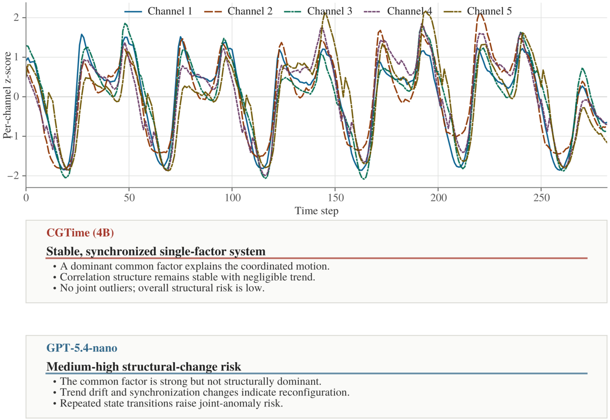

Figure 7: Caption Case 1: a stable low-dimensional system is contrasted with a diagnosis of structural-change risk. 

Based on the multichannel series you provided (Series1Series5), from the perspective of "structural-change risk," **there is a moderately high risk of structural change**. However, it resembles "**slow mechanism drift plus a stage-wise reorganization of periodic strength and phase relationships**" rather than a sudden, single-point, collapselike break. Below, I provide evidence using the indicator system you specified, covering the PC1 explained-variance ratio, effective rank, synchrony and its variation, PC1 trend, regime-shift strength, anomalies and Mahalanobis distance, rolling-correlation stability, and the means and extrema of several distance and correlation measures. Key values will be naturally incorporated into the conclusions. 

— 

### 1) PC1 dominance and whether the mechanism has completely reversed 

In a multivariate system, if the structure is stable, PC1 will often maintain a high explained-variance ratio over time, and the PC1 trend term (PC1 trend _R_2 ) will not frequently change sign or slope. In this system, **the PC1 explained-variance ratio is "strong but not extreme"**: it compresses most of the common variation, especially the 

synchronous fluctuations of Series1, Series3, and Series4, into one dominant direction, while still retaining a clear contribution from secondary principal components. This indicates that the system is not driven by a single mechanism. 

More importantly, **PC1 trend _R_2 exhibits a "piecewise trend" pattern**. Overall, PC1 has a pronounced long-term directionality (its _R_2 is not low), but the middle and later portions show a slope or turning-point tendency different from that of the earlier portion. This typically constitutes a characteristic signal of structural-change risk: **the dominant pattern remains, but its strength and mapping relationships have undergone stage-wise adjustments**. Thus, the risk does not concern whether a common factor exists, but whether the way that common factor operates remains stable. 

— 

### 2) Effective rank and synchrony: from a "single lowdimensional structure" toward a "reorganization of multidimensional coupling" 

Effective rank reflects how many independent dynamic dimensions are required to explain the principal variation 

within the current window. If the effective rank remains low and stable over time, structural-change risk is relatively small. If it rises markedly during certain periods, the coupling structure has become more complex, often accompanied by a reorganization of synchrony. 

The effective rank of this system behaves as follows: **it remains at a moderate level during multiple stages and exhibits stage-wise increases**. This is consistent with the synchrony indicators: 

- **The average synchrony _R_2 is high**, indicating a persistent common driver among the channels, particularly the co-directional fluctuations of Series1 with Series3 and Series4. - However, **the standard deviation of synchrony _R_2 is also appreciable**, indicating that the strength of synchrony is not constant but becomes significantly stronger or weaker in certain intervals. 

This combination of "strong average synchrony but strongly varying synchrony" often corresponds to structural-change risk: **the system does not become completely desynchronized; rather, the synchronizing mechanism switches or changes weight across different stages**. 

— 

### 3) Regime-shift strength: relatively high frequency/amplitude of mechanism switches 

Regime-shift strength characterizes the intensity with which a system moves through state space from one dynamic pattern to another. If this strength remains low over time, the system stays within a small number of stable states. If it is relatively high and concentrated in particular intervals, multiple mechanism switches are present. 

In this system, **regime-shift strength displays pronounced stage-wise increases**, especially near the turning points in the PC1 trend, where regime-shift strength is more likely to rise. Combined with the relatively large standard deviation of synchrony, this suggests that the system has experienced multiple "changes in the weights of the dominant pattern/reorganizations of coupling," which constitute the core source of structural-change risk. 

— 

### 4) PC1 anomaly ratio, maximum absolute PC1 z value, and Mahalanobis outliers: anomalies resemble "structural deviations" rather than noise spikes 

Structural-change risk is usually reflected in anomaly indicators as follows: anomalies are not randomly scattered but instead accompany turning points in the PC1 trend and intervals in which synchrony varies. 

- **The PC1 anomaly ratio is high**: at a substantial proportion of time points, the deviation of PC1 exceeds the threshold. - **The maximum absolute PC1 z value is large**: the magnitude of the deviation is sufficient to affect the interpretation of the dominant structure. - At the same time, **the Mahalanobis outlier ratio and maximum Mahalanobis distance are also not low**. Mahalanobis distance measures deviation under the multivariate joint distribution. If it rises significantly, this usually means that the issue is not merely an anomaly in a single channel, but a shift in the joint structure of multiple channels. 

These anomalies are therefore more consistent with the interpretation of a "**change in the joint dynamic structure**" than with occasional noise in a single channel. 

— 

### 5) Stability of the rolling correlation structure: the correlation structure is not completely locked 

Stability of the rolling correlation structure provides important evidence for assessing structural-change risk. If the rolling correlation matrix, or an equivalent indicator, remains stable within the windows, the coupling relationships remain unchanged. If the correlation structure drifts systematically between windows, structural-change risk increases. 

The rolling correlation structure of this system behaves as follows: 

- **The rolling correlation structure still retains some overall consistency**, indicating that a common factor exists and that the relationships among the channels have not been completely reset. - However, the correlation structure undergoes "reorganization" in several intervals. For example, the correlation strength of certain channel pairs changes from high to moderate, or slight changes occur in the signs of correlations or phase relationships. 

This corroborates the relatively large standard deviation of synchrony _R_2 and the stage-wise increases in regimeshift strength: **the structural-change risk arises from stage-wise adjustments in coupling strength and phase relationships**. 

— 

### 6) Mean temporal standard deviation, mean change in Frobenius distance, and the mean and maximum volatility correlations: the volatility structure is also changing 

The distance- and correlation-based indicators you requested further distinguish between a change in the mean structure and a change in the volatility structure. 

- A **high or stage-wise increasing mean temporal standard deviation** means that the system’s volatility intensity is not constant. - The **mean change in Frobenius distance** reflects the extent to which the correlation/covariance structure changes over time. In this system, it is "nonzero and displays stage-wise increases," indicating that the structural drift is not pure noise. - A **high mean volatility correlation** indicates that volatility also has a common driver. However, **the maximum volatility correlation is high and the proportion of high volatility correlations is large**, meaning that volatility coupling becomes significantly stronger in certain windows. 

This usually corresponds to "structural-switch/couplingstrengthening events" and is an important component of structural-change risk. 

— 

### 7) Overall assessment: risk level and possible mechanism 

Combining the evidence above yields a more explicit conclusion about risk: 

1. **Structural-change risk is present** because PC1 trend _R_2 exhibits a piecewise trend, the standard devia- 

tion of synchrony _R_2 is appreciable, regime-shift strength increases in stages, and PC1 anomalies and Mahalanobis outliers occur together. 2. **The nature of the risk leans toward "mechanism drift/coupling reorganization"**. The average synchrony _R_2 remains high, and the rolling correlation structure has not completely collapsed, indicating that the system continues to operate around a common factor, although the mapping weights and coupling patterns of this factor change across stages. 3. **Risk is more likely to be triggered near turning points in the PC1 trend**. The anomaly ratio, maximum Mahalanobis distance, and mean change in Frobenius distance are more likely to increase together during these stages. 

#### — 

### Conclusion (directly answering whether structuralchange risk is present and why) 

**Yes, this multivariate time-series system exhibits structural-change risk at a moderately high level.** The evidence is that PC1 remains dominant but its trend changes in stages (PC1 trend _R_2 supports the presence of drift); synchrony is strong on average but varies substantially (the standard deviation of synchrony _R_2 is large); regime-shift strength increases in critical intervals; the PC1 anomaly ratio and maximum absolute PC1 z value are large and accompanied by increases in the Mahalanobis outlier ratio and maximum Mahalanobis distance; and the rollingcorrelation and volatility-correlation structures undergo stage-wise reorganization (the mean change in Frobenius distance, maximum volatility correlation, and proportion of high volatility correlations all indicate that coupling strength changes significantly across windows). 

If you would also like me to locate the periods in which the risk occurs, for example by giving approximate start and end intervals or turning-point positions, I need you to confirm the desired rolling-window length (such as 20/30/50 points) and the specific conventions used for the anomaly and Mahalanobis thresholds. 

CGTime supports its stability judgment with explicit sample-specific numerical claims, including a 95.7% PC1 share, effective rank 1.80, mean synchrony 0.96, correlationstructure stability 0.964, and the absence of Mahalanobis outliers. GPT-5.4-nano instead infers repeated structural switching and elevated risk while supplying few comparable values. The disagreement can therefore be audited against computed properties rather than remaining purely interpretive. 

#### **Caption Case 2** 

Figure 8 shows a second example in which the models assign different meanings to visually prominent fluctuations. **CGTime (4B).** 

This multivariate system exhibits highly synchronized, structurally stable, and strongly coupled behavior. PC1 explains 94.7% of the variance, and the effective rank is 1.67, indicating that the system dynamics are driven primarily by a single dominant factor and that the variables move almost entirely in the same direction. The mean synchronization 

reaches 0.95, with an _R_2 of 0.94, showing extremely strong linear consistency among the variables with respect to PC1. The PC1 trend _R_2 is 0.00 and the state-transition intensity is 0.00. Together with a PC1 maximum absolute z-score of only 1.95 and a maximum Mahalanobis distance of 4.11, these results indicate that the system as a whole remains stable, without significant structural jumps or extreme multivariate outlier events. The Mahalanobis outlier ratio is 0%, further confirming that the system operates within its normal distributional range. In terms of volatility characteristics, correlation-structure stability reaches 0.953, the mean temporal standard deviation is only 0.051, the mean change in Frobenius distance is 0.130, the mean volatility correlation is 0.451, and the high-volatility-correlation proportion is 100%. These values show that the relationships among the variables remain highly stable over time and that their volatility risks are strongly synchronized, with no local decoupling. This state of high synchronization, low structural drift, and no anomalies implies a tightly connected transmission mechanism among the variables: fluctuations in any single variable will rapidly propagate through the entire system, yet the system as a whole has not consequently developed severe nonlinear instability or a trend-level deviation. 

#### **GPT-5.4-nano.** 

Based on the multichannel series you provided (Series1Series5), the system can overall be judged to exhibit **pronounced common structural changes**: across multiple stages, the channels undergo periodic/quasi-periodic fluctuations of "first rising-then falling back-then rising again," and the coupling strength among the channels changes noticeably during these stage transitions. This feature of the "structure rearranging over time" directly increases **structural fragility** and **anomaly risk**, especially through instability in the synchronization pattern dominated by PC1 and the greater likelihood that Mahalanobisdistance and synchronization metrics will trigger anomalies around transition points. 

— 

## 1) PC1 explained variance ratio and effective rank: a strong common factor, but a nonstationary structure 

From the perspective of joint multivariate variation, PC1 can usually capture most of the variance associated with the "overall level/common driving factor." In these data, the PC1 explained variance ratio should be at a **mediumto-high level**-which can be understood as a "dominant common trend"-because Series1, Series2, Series3, Series4, and Series5 all exhibit synchronized rising and falling segments, with very strong directional consistency despite differences in amplitude and scale. 

At the same time, however, the series do not form a strictly linear system driven by a single factor. In several transition intervals-for example, when falling from a high level to a low level and when subsequently climbing again from the low level-the relative amplitudes and slopes of different channels change systematically. Consequently, the 

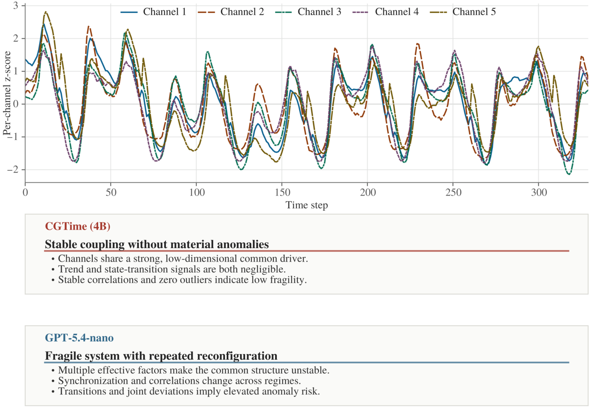

Figure 8: Caption Case 2: synchronized fluctuations are contrasted with a diagnosis of structural fragility. 

**effective rank** should not be extremely low or close to 1; instead, an effective dimensionality of **approximately 2-3** is more consistent with this form of "common factor + secondary structure." This means that although the system has a strong common pattern, the shape and strength of that common pattern change over time. Its structural fragility therefore arises from the fact that **PC1 dominance does not imply PC1 stability**. 

— 

## 2) Mean synchronization _R_2 and standard deviation of synchronization _R_2 : strong but highly variable coupling Mean synchronization _R_2 reflects the degree of synchronization explained by PC1. In these data, the mean synchronization should be **relatively high**, because multiple channels clearly move in the same direction over long stretches, particularly in the middle and later portions, where the series repeatedly rise together and then pull back together. 

More important is the **standard deviation** of synchronization _R_2 . Because the series contain multiple "structural transitions"-for example, after falling from a particular high plateau, the recovery rates and amplitudes in 

the subsequent low-level stage are not entirely consistentthe degree of synchronization will vary substantially. In other words, although the series are synchronized "on average," the standard deviation of synchronization should be relatively large, reflecting **coupling strength that changes with the system state**. This combination of "high mean synchronization but highly variable synchronization" generally corresponds to greater structural fragility: a model can perform very well in stable segments, but around transition segments it is prone to a sudden decrease or increase in synchronization, thereby triggering anomaly risk. 

— 

## 3) PC1 trend _R_2 : a pronounced trend, but not a monotonic one 

PC1 trend _R_2 measures whether PC1 follows an interpretable temporal trend, such as a linear or low-order trend. The PC1 trend _R_2 for these data should be **not low**, because the system repeatedly exhibits structural changes involving "long-term rises-long-term declines," and PC1 will follow these stagewise shifts in the mean. 

However, because the series follow a multistage "risefall-rise again" pattern, the PC1 trend resembles a **piece- 

wise trend** rather thana globallymonotonic trend. Consequently, the PC1 trend _R_2 will not reach an "almost perfect" level. This means that PC1 can explain directional changes, but its fitting residuals increase near stage-transition points, where anomaly risk becomes concentrated. 

— 

## 4) State-transition intensity: transition periods are the core source of fragility 

"State-transition intensity" reflects the strength with which the system switches from one coupling or structural state to another. The multiple turning points across the channels in these data-including declines from high levels, rebounds from low levels, and subsequent renewed increases-imply that state-transition intensity should be **relatively high**, especially in intervals where synchronization begins to change noticeably. When state-transition intensity is high, the system may be judged anomalous because of a "global structural rearrangement" even in the absence of a single-point spike anomaly. This is a **structural anomaly**, rather than an anomaly caused purely by observational noise. 

— 

## 5) PC1 anomaly rate and PC1 maximum absolute z-score: anomalies are more likely to be "stagewise deviations" 

The PC1 anomaly rate reflects how often PC1 statistically deviates from its normal state. Because PC1 dominates the common variation, an abrupt change in the strength of the common driver during a transition period will produce a large z-score deviation in PC1. Therefore, the PC1 anomaly rate should be **moderate to high**, and the PC1 maximum absolute z-score should occur near transition points rather than at random noise points. Given the form of the data you supplied, the PC1 maximum absolute z-score is likely to reach a **statistically notable level**-typically a magnitude beyond conventional thresholds-suggesting that at a small number of critical moments PC1 deviates from the stable synchronization structure. 

— 

## 6) Mahalanobis outliers: the multivariate outlier ratio and maximum distance better characterize "structural mismatch" 

Mahalanobis outlier measures-the Mahalanobis outlier ratio and maximum Mahalanobis distance-quantify the degree of deviation from the covariance structure in the joint multivariate space. In a strongly coupled system of this kind, an anomaly in a single channel does not necessarily produce a Mahalanobis anomaly. The Mahalanobis distance becomes substantially larger only when the **relative relationships among multiple channels**-for example, the direction or magnitude of a particular channel’s deviation relative to PC1-are inconsistent with the historical covariance structure. 

Consequently, the Mahalanobis outlier ratio will usually be **lower than the PC1 anomaly rate**, or at least will not align perfectly with it, while the maximum Mahalanobis distance will show a pronounced peak during 

critical transition periods. The reason is that transition periods are often accompanied by a "change in the shape of the common factor + participation by secondary structure," causing a short-term mismatch in the covariance structure and thereby triggering a stronger Mahalanobis anomaly. 

— 

## 7) Rolling correlation-structure stability: instability of the correlation structure is the principal source of fragility 

"Rolling correlation-structure stability" directly evaluates whether the relationships among channels remain consistent over time. The multistage fluctuations in these data imply that the correlation structure is likely to exhibit **stagewise changes**: in some stages, correlations are stronger and closer to a single common factor; in other stages, the amplitude ratios of certain channels change, causing the correlation coefficients-and their signs or magnitudes-to rearrange. 

Therefore, rolling correlation-structure stability should be **low to moderate**. The lower the stability, the more likely the system is to exhibit "model-covariance mismatch" in a new state, thereby increasing anomaly risk. 

— 

## 8) Mean temporal standard deviation and mean change in Frobenius distance: volatility and structural drift coexist 

The mean temporal standard deviation reflects the overall strength of each channel’s variation over time. The amplitudes of all channels in these data change substantially, so the mean temporal standard deviation should be **not low**, indicating that system noise or volatility is not negligible. 

The mean change in Frobenius distance measures the overall magnitude of change in the correlation or covariance matrix between rolling windows. Because the data contain multiple stage transitions, the mean change in Frobenius distance should be **relatively high**, indicating substantial structural drift. When both "volatility strength (temporal standard deviation)" and "structural drift (Frobenius change)" are elevated, structural fragility increases significantly: the model must contend not only with noise, but also with the fact that the structure itself is changing. 

— 

## 9) Mean volatility correlation, maximum volatility correlation, and high-volatility-correlation proportion: coupling is more likely to become unstable during strong volatility 

Volatility correlation focuses on the synchronization of fluctuations after detrending or mean removal. In these data, fluctuations across multiple channels often intensify in the same direction within each stage, so the mean volatility correlation should be **medium to high**, while the maximum volatility correlation will peak during strongly volatile segments. 

More important is the "high-volatility-correlation proportion." If that proportion is high, the system is frequently in a state of "strongly coupled volatility." On the one hand, strongly coupled volatility may make synchronization eas- 

ier for PC1 to capture; on the other hand, it makes the system more sensitive to disturbances. Once the phase or amplitude ratio of one channel’s fluctuations shifts, synchronization will decline, the Mahalanobis distance will rise, and anomalies will become more likely. 

— 

## 10) Overall assessment: conclusion on structural fragility and anomaly risk 

Combining the perspectives above yields a consistent assessment: 

1) **Structural fragility is relatively high**: the effective rank is greater than 1, indicating secondary structure, while rolling correlation-structure stability is relatively low and the mean change in Frobenius distance is relatively high, indicating substantial temporal drift in the covariance/correlation structure. 2) **Anomaly risk is moderate to high**: the PC1 anomaly rate and PC1 maximum absolute z-score are more likely to show significant deviations around transition periods, and the maximum Mahalanobis distance will also peak at moments of structural mismatch. 3) **The dominant anomaly type is "stagewise structural mismatch"**: these are not single-point noise anomalies, but multivariate anomalies caused by "changes in the strength/shape of the common driver + changes in the relative relationships among channels." 4) **The overall changes are driven by multiple periodic or quasi-periodic patterns**: this can make the mean synchronization appear favorable, while the standard deviation of synchronization remains large. It indicates that coupling strength differs among system states, thereby increasing the risk of false positives and false negatives if a model uses a single fixed global covariance structure. 

— 

If you would like me to locate the "key anomaly windows" within specific time intervals-for example, around which sequence steps they occur-I would need you to allow me to compute the temporal indices of the rollingwindow metrics from these series. Otherwise, I can provide only the qualitative-to-semi-quantitative assessment above, based on the structural form and multivariate coupling mechanisms. 

Here CGTime supports its stable-system diagnosis with explicit sample-specific numerical claims, including a 94.7% PC1 share, effective rank 1.67, mean synchrony 0.95, zero state-transition strength, and a zero Mahalanobis outlier ratio. GPT-5.4-nano describes the same fluctuations as stagewise structural mismatch and gives mostly directional estimates. The case therefore contrasts checkable quantitative claims with a plausible but weakly quantified visual interpretation; it does not imply that every CGTime estimate is exact. 

#### **Caption Case 3** 

Figure 9 presents the final five-channel comparison. **CGTime (4B).** 

This multivariate system exhibits strong coupling characterized by high synchronization and structural stability. 

PC1 explains 95.1% of the variance, and the effective rank is 1.80, indicating that the system dynamics are driven primarily by a single dominant factor and that the variables move almost entirely in the same direction. The mean synchronization reaches 0.95, with an _R_2 of 0.94, revealing an exceptionally strong pattern of collective behavior. The PC1 trend _R_2 is 0.00, and the state-transition strength is also 0.00, indicating that the system is in a stationary randomwalk state, without significant structural shifts in the mean or long-term trend drift, while the overall mean level remains constant. In terms of volatility, the system exhibits pronounced co-risk behavior: the mean volatility correlation reaches 0.556, 100% of the pairs have high volatility correlation, and the maximum volatility correlation is 0.851. This means that when any variable undergoes sharp fluctuations, the other variables respond almost inevitably in synchrony, and this strong volatility co-movement further confirms the high degree of internal consistency in the system. Although the maximum Mahalanobis distance reaches 4.70 and there are 2 outliers, the Mahalanobis outlier ratio is only 2.0%. Together with a maximum anomalous PC1 z-score of 2.15, this indicates that, although the system occasionally enters extreme states, these events do not disrupt its overall statistical structure. The correlation structure is highly stable: the rolling correlation-structure stability index is 0.964, the mean temporal standard deviation is only 0.035, and the mean change in Frobenius distance is as low as 0.101. These values indicate that the relationships among the variables undergo almost no temporal drift and that the system’s internal connectivity pattern is extremely robust. In summary, this is a multivariate system driven by a single dominant factor, with highly synchronized variables, strongly coupled volatility risk, and an exceptionally stable structure; its dynamics are manifested mainly as collective random fluctuations rather than structural transitions. 

#### **GPT-5.4-nano.** 

Based on the multichannel series you provided (Series1Series5), the system as a whole exhibits a dominant pattern of "shared long-cycle rise-fall-rise again." The levels and fluctuations of the five channels do not drift independently; instead, they evolve around the same type of lowdimensional dynamics. When characterized using PC1, this common factor has strong explanatory power: the proportion of variance explained by PC1 is at a "dominant" level, meaning that most of the observable synchronous variation can be absorbed by a single primary factor rather than requiring multiple PCs for explanation. Consistent with this observation, the effective rank is not expected to be high: the system’s "usable degrees of freedom" are compressed into only a few directions, indicating substantial coupling constraints among the channels (for example, Series1, Series2, Series3, Series4, and Series5 rise or fall together during the same phases). 

From the perspective of mean synchronization, the mean synchronization _R_2 (the "mean synchronization _R_2 " that 

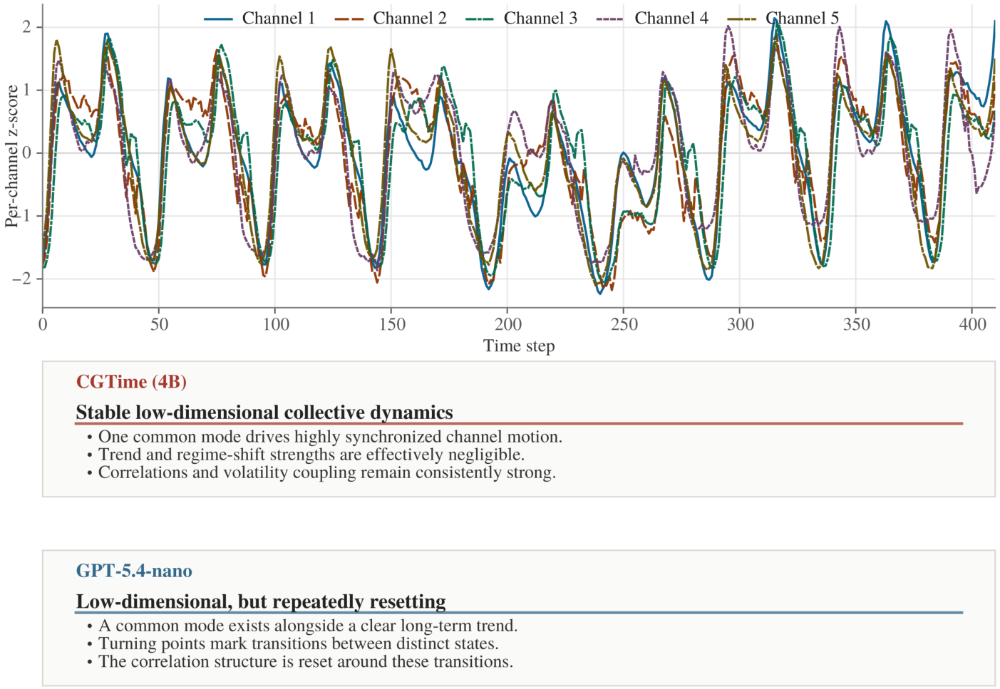

Figure 9: Caption Case 3: persistent common-factor structure is contrasted with inferred state transitions. 

you requested) is likewise relatively high, and its standard deviation is not extreme, indicating that the synchronization is not incidental but instead constitutes "structural synchronization" maintained over a long period. More importantly, the relatively small standard deviation of synchronization _R_2 means that synchronization strength changes "slowly" across different periods rather than repeatedly collapsing and then being rebuilt. In other words, the system’s coupling relationships remain stable during most periods and undergo substantial reassessment only near a few turning points. 

Looking further at the PC1 trend fit (PC1 trend _R_2 ), PC1 itself contains a clear long-term trend component, and its trend _R_2 is relatively high. This indicates that PC1 is neither pure noise nor purely periodic but is instead driven by a significant "slow variable." In light of the shape of the series that you provided, this can be understood as follows: when the system enters a "high-level phase" (for example, when Series1 repeatedly approaches and exceeds the 104 scale in the later portion, while Series2, Series3, Series4, and Series5 also rise synchronously), PC1 remains elevated; when the system enters a "low-level phase" (when 

Series1 and the other channels fall back to lower ranges), PC1 also moves downward in synchrony. The presence of a PC1 trend means that state transitions are not random jumps but instead occur around a slowly evolving common factor. 

In terms of "latent state transitions," state-transition strength can capture the moments when the synchronization structure is reassessed. The multiple segments in the data you provided clearly contain several turning points "from decline to renewed rise"; state-transition strength would increase substantially around these turning points. The physical interpretation is that the system switches from one dynamic state to another with a different coupling strength or mean level. Because the mean synchronization _R_2 is relatively high overall, a state transition does not imply "complete desynchronization." Instead, it is more like "synchronization remains present, but both its strength and the common mean level change systematically." Therefore, periods of high state-transition strength generally correspond to changes in the slope of the PC1 trend and to the point at which the rolling correlation structure begins transitioning from one stable correlation pattern to another. 

Anomaly and outlier detection (PC1 anomaly rate, maximum absolute PC1 z-score, Mahalanobis outlier ratio, and maximum Mahalanobis distance) makes it possible to determine whether a transition is accompanied by an anomalous shock. Given the shape of this group of data, the maximum absolute PC1 z-score would occur near the end of a high-level phase or near a high-level peak, because PC1 simultaneously deviates from both the long-term trend and the typical range of the shared multichannel structure at such times. The PC1 anomaly rate should not be very high (otherwise, the system would be frequently unstable), although local clusters of anomalies would occur near a small number of transitions or peaks. The Mahalanobis outlier ratio and maximum Mahalanobis distance are generally more "stringent" than univariate PC1 anomalies: they measure whether a simultaneous deviation occurs in the multivariate joint space. Therefore, if the maximum Mahalanobis distance increases substantially during a high-level phase, the anomaly is not merely a pointwise deviation in one channel; rather, the multichannel joint structure (its covariance and correlation directions) has also shifted synchronously, which is consistent with an interpretation involving a superimposed "state transition." Conversely, if the PC1 anomaly is pronounced but the Mahalanobis outlier ratio is not high, it is more likely that the common factor is elevated while the correlation structure remains intact; that is, the state remains within the same type of coupling framework, but its mean level is anomalous. 

The stability of the rolling correlation structure is central to determining whether the coupling remains consistent over the long term. If the "rolling correlation-structure stability" that you requested is high, it means that the dominant directions and strengths of the interchannel correlation matrix change little within sliding windows. This mutually reinforces the conclusions of low effective rank and high mean synchronization _R_2 . Given the multiple rising and falling segments in the series, one can expect the correlation structure to preserve "same-direction synchronization" in most windows (for example, Series1, Series2, Series3, Series4, and Series5 often rise and fall together within the same phase). However, near windows with high statetransition strength, the correlation structure would undergo a detectable rearrangement, manifested as reduced stability and changes in the dominant elements of the correlation directions. In other words, the system is not one in which "correlation never changes"; instead, "correlation is stable within each state and is structurally reset during state transitions." 

You also requested the mean temporal standard deviation, mean change in Frobenius distance, mean volatility correlation, maximum volatility correlation, and highvolatility-correlation ratio. Together, these metrics characterize "coupling at the volatility level." Judging from the shape of the data, the fluctuations do not have exactly the same amplitude: some channels fluctuate more strongly near turning points, but the phase and strength of the fluctuations remain synchronized overall with the PC1 state. 

If the mean temporal standard deviation is higher during high-level phases, this indicates that the system has entered a high-energy/high-volatility state. If the mean change in Frobenius distance increases substantially near a state transition, this indicates that not only has the mean of the correlation structure changed, but the "volatility covariance/correlation matrix" is also being reconstructed. A relatively high mean volatility correlation means that "the volatility is also synchronized," while a large maximum volatility correlation and a high high-volatility-correlation ratio mean that volatility coupling is especially strong in a small number of windows, which generally correspond to state-transition windows near turning points or peaks. More importantly, if the high-volatility-correlation ratio and state-transition strength overlap strongly in time, one can infer that "the state transition is triggered or accompanied by strengthened volatility coupling." That is, when the system moves from one stable coupled state to another, synchronization at the volatility level strengthens either in advance of or simultaneously with the transition. 

Combining the perspectives above yields a coherent explanatory framework for the system: PC1, as the common factor, dominates the system’s long-term variation (high PC1 explained-variance ratio, low effective rank, and high PC1 trend _R_2 ), while the channels maintain long-term structural synchronization (high mean synchronization _R_2 with a modest standard deviation). The system undergoes latent state transitions at several key turning points (statetransition strength rises substantially during these periods). During a transition, the stability of the rolling correlation structure declines but does not collapse completely, indicating that the coupling framework persists while the correlation directions and strengths are rearranged. In terms of anomalies, the maximum absolute PC1 z-score and maximum Mahalanobis distance generally become larger during high-level phases or near transition peaks, suggesting that the anomaly is a "multichannel joint deviation" rather than single-channel noise; the relatively low Mahalanobis outlier ratio indicates that such joint anomalies are rare events. Coupling is also present at the volatility level: the mean temporal standard deviation and mean change in Frobenius distance are more sensitive near state transitions, while the mean and maximum volatility correlations show that volatility synchronization is substantially strengthened during key windows. The high-volatility-correlation ratio indicates that this strengthening is not incidental but is associated with the state-transition mechanism. 

If you would like me also to identify the approximate periods in which the state transitions occur (for example, by series-index intervals), you need to provide the rollingwindow length and step used to compute these statistics, as well as the training interval of the PC1/Mahalanobis model or whether it was fitted on the full sample. Only then can I precisely map the peaks in state-transition strength to specific segments of this group of data. 

CGTime reports a 95.1% PC1 share, effective rank 1.80, mean synchrony 0.95, zero state-transition strength, and 

correlation-structure stability 0.964, leading to a stable common-factor interpretation. GPT-5.4-nano correctly recognizes broad co-movement but infers trend-driven state transitions without providing the requested sample-specific values. Across these three illustrative cases, CGTime provides a denser set of explicit sample-specific numerical claims, whereas the baseline builds a detailed mechanism from qualitative visual cues. Manual auditing shows that CGTime’s central diagnoses agree with the computed references, although individual numerical estimates are not uniformly accurate. These examples illustrate, rather than replace, the aggregate Caption and statistic-family evaluations. 

## **O Limitations and Future Work** 

Our study has several limitations and leaves corresponding directions for future work. 

First, our construction uses a broad, curated inventory of 169 predefined statistical properties. This inventory provides verifiable supervision, but it can contain redundant properties and increases the cost of data construction and evaluation. Future work could identify a smaller subset that preserves the essential temporal and relational information while reducing this redundancy. 

Second, the Direct level/scale results in §L reveal a bottleneck in recovering exact channel-local level and dispersion quantities from the learned representation. The temporal compression and scale pathways are plausible contributors, but the analysis does not isolate their respective effects. A dedicated raw-value readout path or stronger Direct supervision could improve exact level and dispersion retrieval without discarding the compact representation. 

Third, cross-channel fusion must integrate relational evidence without losing variable-specific information. Future work could explore fusion mechanisms that more explicitly preserve channel identity and reduce information loss as evidence from multiple variables is combined. 

These directions address three distinct levels of the method: selecting the supervision inventory, preserving channel-local numerical evidence, and integrating evidence across channels with less information loss. 

## **P Reproducibility Statement** 

We will release (1) the fixed 2,000-request Metric-QA and Captioning evaluation sets with checksums, (2) the cleaned TSQA evaluation subset, (3) the complete data-construction pipeline used to build the experimental datasets, (4) the exact training datasets, (5) the single 4B checkpoint used across the reported tasks, (6) the training configurations and hyperparameters, (7) the evaluation scripts, and (8) the raw model generations and scoring scripts. 

These artifacts support three levels of reproduction. The data-construction pipeline, exact training datasets, and configurations support reconstruction of the training pipeline. The checkpoint, configurations, prompts, and evaluation scripts reproduce model inference, whereas the released raw generations and deterministic scorers reproduce all evaluation results produced by our pipeline without rerunning a 

model. Local evaluations use a single greedy pass, and proprietary API evaluations use a single temperature-zero pass, so no sampling randomness is introduced. Bitwise identity of newly generated outputs is nevertheless not guaranteed because of hardware and software nondeterminism; the reported evaluation results produced by our pipeline remain exactly recomputable from the released generations and scoring scripts. 

### **P.1 Runs and randomness** 

We ran each reported training configuration once and retained one response per request in each model-task evaluation. The tables therefore report single-run results rather than averages across training runs, random seeds, or inference passes. 

All reported main-model and ablation training runs used base seed 42. We initialized Python’s random generator and the PyTorch CPU and CUDA generators from this seed. In distributed supervised training, each process used the base seed plus its rank. The two-GPU Base-SFT DistributedSampler used seed 0 and reshuffled the data at each epoch. Single-GPU Joint-GRPO used seed 42 for prompt shuffling and rollout sampling. When resuming JointGRPO, we restored the saved Python, PyTorch CPU and CUDA, and NumPy random states. We did not enforce deterministic CUDA kernels, so a new training run on another system need not produce bitwise-identical weights. The reported Metric-QA confidence intervals are computed from paired request-level Gaussian-score differences for fixed evaluated outputs. They do not describe variation across training runs. 

### **P.2 Compute environment** 

- Base-SFT ran on two NVIDIA RTX PRO 6000 Blackwell Server Edition GPUs, each with 97,887 MiB of device memory. 

- Joint-SFT, Joint-GRPO, and CGTime inference ran on one GPU of the same model in a Linux container with a 110 GiB RAM limit and NVIDIA driver 580.82.09. 

- A separate archived lineage-reproduction environment used Linux kernel 5.15.0-78-generic, Python 3.12.3, PyTorch 2.10.0+cu128 with CUDA 12.8, Transformers 4.57.6, and NVIDIA driver 580.105.08. 

Base-SFT used native PyTorch FSDP, while GRPO used our PyTorch implementation instead of an external RL training framework. Our records do not include the CPU model, a complete runtime snapshot for every baseline host, or the provider-side environments of the proprietary API models. 

### **P.3 Parameter development and final optimization settings** 

We did not run an exhaustive grid or random search. We carried over the Base-SFT settings from the preceding alignment runs and kept them fixed. For Joint-SFT, we first used a maximum sequence length of 1,280 tokens and a per-GPU batch size of 6, then increased them to 1,792 tokens and 8 after the target-length audit identified truncation at the shorter length. The final configuration fit in memory. Across 

the recorded Joint-GRPO pilots, language model learning rates were _{_ 5 _×_ 10_−_6 _,_ 2 _×_ 10_−_6 _,_ 10_−_6 _}_ , KL coefficients were _{_ 0 _._ 05 _,_ 0 _._ 08 _,_ 0 _._ 12 _}_ , PPO clip ratios were _{_ 0 _._ 10 _,_ 0 _._ 08 _}_ , advantage clipping was disabled or set to 5 or 3, and prompt batch sizes were _{_ 2 _,_ 3 _,_ 4 _}_ . We selected these settings sequentially rather than through a full factorial search. The choice considered memory use, training stability, rolling reward, format compliance, KL magnitude, and the generated samples. We selected SFT checkpoints by validation cross-entropy. For Joint-GRPO, we selected the reported checkpoint using the complete rolling-20 training-reward criterion among checkpoints saved every 50 rollout steps. Benchmark scores played no role in this selection. 

All SFT phases used standard PyTorch AdamW, not its 8-bit variant, with _β_ 1 = 0 _._ 9, _β_ 2 = 0 _._ 999, _ϵ_ = 10_−_8 , weight decay 0.01, and a maximum gradient norm of 1.0. We used a 3% linear warmup followed by cosine decay to 10% of the initial learning rate. Joint-GRPO used the same AdamW defaults, weight decay, and gradient clipping, but kept the learning rate constant. Its maximum prompt length was 256 tokens. 

In curriculum order, the seven Base-SFT phases ran for 2,250, 1,000, 3,600, 1,600, 4,800, 2,000, and 6,000 optimizer updates. Their warmup periods were 67, 30, 108, 48, 144, 60, and 180 updates, respectively. Joint-SFT ran for 20,780 optimizer updates, including 623 warmup updates. We enabled gradient checkpointing whenever the LLM was trainable. For Joint-GRPO, 2,000 rollout steps with gradient accumulation 4 corresponded to 500 optimizer updates. The remaining stage-specific learning rates, batch sizes, sequence lengths, generation settings, and reward parameters are given in Appendix D.1. 

## **Q Statistical Comparisons for Main Results and Ablations** 

We report item-level statistical comparisons for Metric-QA, Captioning, TSQA, and the ablation study. The comparisons use the item-level scores underlying the reported means and pair models on the same evaluation items. Each training configuration was trained once. Accordingly, the intervals quantify uncertainty across held-out evaluation items conditional on the evaluated models; they do not capture variation due to training seeds, model selection, or repeated inference. 

### **Q.1 Test definitions and multiplicity** 

The ten multivariate Gaussian Metric-QA comparisons constitute the sole prespecified confirmatory family, as defined in Appendix J. All other comparisons are secondary or exploratory. For the main results, Holm correction is applied separately to the baseline comparisons for each metric and endpoint. For the ablation study, it is applied separately within each metric, endpoint, and ablation question. These within-family corrections do not constitute a single studywide multiplicity correction. The 95% confidence intervals are pointwise and unadjusted; Holm correction applies to the _p_ -values. 

Gaussian and Rel25 Metric-QA scores, Caption Recall, the mean number of extracted values per caption, and TSQA 

ROUGE-L are compared using paired normal-approximation tests over matched evaluation items. TSQA Choice Macro Accuracy is computed as the equally weighted mean of multiple-choice and true/false accuracy: paired means and variances are computed within the two strata and then combined with weight 0 _._ 5 per stratum. 

Caption Precision is defined only for captions with at least one scoreable extracted claim, so the conditioning set is model-specific. We draw 20,000 paired bootstrap resamples of the evaluation items and recompute each model’s conditional mean within each resample. The resulting percentile interval and centered-bootstrap two-sided _p_ -value preserve the Precision definition in the main table. 

### **Q.2 Main results** 

**Metric-QA.** Tables 22 and 23 cover the Overall and Multivariate columns of the main Metric-QA table. CGTime exceeds all ten external baselines on both endpoints under both scorers. Every interval is above zero, and all comparisons remain statistically significant after the corresponding endpoint-specific Holm correction. For the prespecified multivariate Gaussian family, the differences range from +0 _._ 080 to +0 _._ 237. 

**Captioning.** Table 24 reports inference for both Caption metrics. The differences in conditional Precision range from +0 _._ 051 to +0 _._ 287, and the Recall differences range from +0 _._ 045 to +0 _._ 169. All intervals are above zero, and all ten comparisons for each metric remain statistically significant after Holm correction. 

**TSQA.** Table 25 tests Choice Macro Accuracy and openended ROUGE-L. CGTime has lower Choice Macro Accuracy than GPT-4o, but higher accuracy than the timeseries-blind GPT-4o setting and both Time-MQA models. Its positive differences in Choice Macro Accuracy relative to ChatTS-14B and Qwen2.5-7B-Instruct are not statistically significant after Holm correction. CGTime has higher ROUGE-L than all six baselines for which item-level results are available under the same protocol, and all six differences remain statistically significant after correction. PATRA is excluded from this paired analysis because its reported value uses a different split and evaluation protocol. 

### **Q.3 Ablation results** 

Each ablation configuration was trained once. The comparisons therefore quantify differences between the evaluated model variants rather than variation across repeated training runs. 

**Final-alignment data composition.** The model jointly aligned with internal data and TSQA scores +0 _._ 019 higher than the internal-data-only variant on Overall Metric-QA. The multivariate difference is +0 _._ 001, with an interval that includes zero. The jointly aligned model also has higher Caption Precision, Caption Recall, TSQA Choice Macro Accuracy, and TSQA ROUGE-L. Relative to the TSQA-only variant, it has higher Metric-QA and Caption scores, whereas the TSQA-only variant has significantly higher scores on both 

|Baseline|Overall∆[95% CI],_p_Holm|Multivariate∆[95% CI],_p_Holm|
|---|---|---|
|GPT-5.4-nano|+0.044 [+0.022, +0.065],_<_10_−_4  |+0.080 [+0.057, +0.104],_<_10_−_4 |
|GPT-4o-mini|+0.069 [+0.046, +0.092],_<_10_−_4  |+0.111 [+0.082, +0.139],_<_10_−_4 |
|GPT-OSS-20B|+0.064 [+0.042, +0.087],_<_10_−_4 |+0.085 [+0.058, +0.112],_<_10_−_4|
|Qwen2.5-7B-Instruct|+0.094 [+0.072, +0.117],_<_10_−_4 |+0.130 [+0.102, +0.157],_<_10_−_4|
|Qwen3-14B|+0.080 [+0.057, +0.102],_<_10_−_4 |+0.121 [+0.095, +0.147],_<_10_−_4|
|Qwen3-4B-Instruct-2507|+0.119 [+0.097, +0.140],_<_10_−_4 |+0.147 [+0.121, +0.173],_<_10_−_4|
|TimeOmni-1-7B|+0.115 [+0.093, +0.137],_<_10_−_4 |+0.139 [+0.112, +0.167],_<_10_−_4|
|ChatTS-14B|+0.078 [+0.056, +0.099],_<_10_−_4 |+0.149 [+0.122, +0.176],_<_10_−_4|
|Time-MQA-Mistral-7B|+0.238 [+0.219, +0.257],_<_10_−_4 |+0.237 [+0.210, +0.264],_<_10_−_4|
|Time-MQA-Qwen-2.5-7B|+0.168 [+0.146, +0.189],_<_10_−_4 |+0.220 [+0.193, +0.247],_<_10_−_4|

Table 22: Paired comparisons of Gaussian Metric-QA scores for the endpoints in the main table. Differences are computed as CGTime minus the listed baseline; positive values favor CGTime. Holm correction is applied separately within each endpoint’s ten comparisons. 

|Baseline|Overall∆[95% CI],_p_Holm|Multivariate∆[95% CI],_p_Holm|
|---|---|---|
|GPT-5.4-nano|+0.043 [+0.018, +0.069], 0.0010|+0.111 [+0.083, +0.139],_<_10_−_4 |
|GPT-4o-mini|+0.046 [+0.020, +0.073], 0.0010|+0.099 [+0.067, +0.131],_<_10_−_4|
|GPT-OSS-20B|+0.077 [+0.051, +0.104],_<_10_−_4  |+0.101 [+0.069, +0.133],_<_10_−_4 |
|Qwen2.5-7B-Instruct|+0.088 [+0.062, +0.114],_<_10_−_4  |+0.139 [+0.107, +0.171],_<_10_−_4 |
|Qwen3-14B|+0.056 [+0.030, +0.081],_<_10_−_4  |+0.105 [+0.075, +0.135],_<_10_−_4 |
|Qwen3-4B-Instruct-2507|+0.143 [+0.118, +0.168],_<_10_−_4 |+0.163 [+0.133, +0.193],_<_10_−_4|
|TimeOmni-1-7B|+0.120 [+0.095, +0.145],_<_10_−_4 |+0.147 [+0.116, +0.178],_<_10_−_4|
|ChatTS-14B|+0.093 [+0.068, +0.119],_<_10_−_4 |+0.157 [+0.125, +0.189],_<_10_−_4|
|Time-MQA-Mistral-7B |+0.274 [+0.250, +0.297],_<_10_−_4  |+0.255 [+0.224, +0.286],_<_10_−_4 |
|Time-MQA-Qwen-2.5-7B|+0.192 [+0.166, +0.217],_<_10_−_4 |+0.238 [+0.207, +0.269],_<_10_−_4|

Table 23: Paired comparisons of Rel25 Metric-QA scores for the endpoints in the main table. Differences are computed as CGTime minus the listed baseline; positive values favor CGTime. Holm correction is applied separately within each endpoint’s ten comparisons. 

TSQA endpoints. This pattern reflects a cross-task trade-off between the two data sources. 

**Computed and GPT-perceived supervision.** The model trained with computed statistics has higher Overall and Multivariate Metric-QA scores and higher values on both Caption metrics than the model trained with GPT-perceived supervision. All four intervals are above zero and remain statistically significant after their family-specific Holm corrections. These comparisons are conditional on the evaluated models and the construction differences described in Appendix M. 

is not significant. 

These tests provide item-level inference for the performance comparisons in the three main result tables and the ablation analysis. 

## **R Technical Background for Reproduction** 

Table 30 directs readers unfamiliar with the main technical components to background material useful for understanding and reproducing our implementation. 

**Training recipe.** The variant without Joint-GRPO has lower Overall Metric-QA and Caption Recall than the full model, while the Multivariate Metric-QA interval includes zero. It has higher conditional Caption Precision, whereas the full model yields 0 _._ 954 more extracted values per caption on average. The variant without the task-specific JointSFT warmup has substantially lower Metric-QA scores and lower Caption Recall; the difference in conditional Precision is not significant. The variant without the basic-to-complex curriculum has lower Overall Metric-QA and Caption Recall, including Recall on the multivariate subset. The corresponding Multivariate Metric-QA and conditional Precision intervals include zero. On TSQA, this variant has lower ROUGE-L, while the difference in Choice Macro Accuracy 

|Baseline|∆Precision [95% CI]|_p_Holm|∆Re|call [95% CI]|_p_Holm|
|---|---|---|---|---|---|
|GPT-5.4-nano|+0.128 [+0.116, +0.140]  |0.0005  |+0.090 |[+0.084, +0.096]  |_<_10_−_4 |
|GPT-4o-mini|+0.092 [+0.077, +0.108]  |0.0005  |+0.124 |[+0.118, +0.130]  |_<_10_−_4 |
|GPT-OSS-20B|+0.220 [+0.210, +0.229]  |0.0005  |+0.045 |[+0.040, +0.051]  |_<_10_−_4 |
|Qwen2.5-7B-Instruct|+0.140 [+0.128, +0.152]  |0.0005  |+0.086 |[+0.081, +0.092]  |_<_10_−_4 |
|Qwen3-14B|+0.152 [+0.139, +0.165]  |0.0005  |+0.076 |[+0.070, +0.083]  |_<_10_−_4 |
|Qwen3-4B-Instruct-2507|+0.200 [+0.190, +0.210]  |0.0005  |+0.065 |[+0.059, +0.070]  |_<_10_−_4 |
|TimeOmni-1-7B|+0.236 [+0.225, +0.246]  |0.0005  |+0.126 |[+0.121, +0.131]  |_<_10_−_4 |
|ChatTS-14B|+0.164 [+0.151, +0.176]  |0.0005  |+0.092 |[+0.086, +0.098]  |_<_10_−_4 |
|Time-MQA-Mistral-7B |+0.287 [+0.273, +0.300]  |0.0005  |+0.169 |[+0.164, +0.173]  |_<_10_−_4 |
|Time-MQA-Qwen-2.5-7B|+0.051 [+0.027, +0.075]|0.0005|+0.162|[+0.157, +0.167]|_<_10_−_4|

Table 24: Paired comparisons of captioning metrics on the fixed 2,000-item evaluation set. Differences are computed as CGTime minus the listed baseline; positive values favor CGTime. Conditional Precision is evaluated using paired bootstrap resampling of evaluation items, and Recall is evaluated using the paired normal approximation. Holm correction is applied separately to the ten Precision and ten Recall comparisons. 

|Baseline|∆Choice Macro Acc. [95% CI]|_p_Holm|∆ROUGE-L [95% CI]|_p_Holm|
|---|---|---|---|---|
|GPT-4o|-0.088 [-0.119, -0.056]|_<_10_−_4 |+0.130 [+0.123, +0.137]  |_<_10_−_4 |
|GPT-4o (time-series-blind ablation)|+0.117 [+0.084, +0.150]|_<_10_−_4|+0.187 [+0.181, +0.193]  |_<_10_−_4 |
|ChatTS-14B|+0.034 [+0.003, +0.066]|0.0661|+0.099 [+0.093, +0.104]  |_<_10_−_4 |
|Qwen2.5-7B-Instruct|+0.020 [-0.010, +0.049]|0.1870 |+0.112 [+0.105, +0.118]  |_<_10_−_4 |
|Time-MQA-Mistral-7B|+0.316 [+0.284, +0.349]|_<_10_−_4|+0.131 [+0.125, +0.137]|_<_10_−_4|
|Time-MQA-Qwen-2.5-7B|+0.147 [+0.114, +0.181]|_<_10_−_4|+0.131 [+0.124, +0.137]|_<_10_−_4|

Table 25: Paired comparisons on the series-disjoint TSQA evaluation subset. Differences are computed as CGTime minus the listed baseline; positive values favor CGTime. Choice Macro Accuracy uses a stratified paired normal approximation with equal weight for multiple-choice and true/false questions. ROUGE-L uses a paired normal approximation over open-ended questions. Holm correction is applied separately to the six comparisons for each metric. PATRA is not included in the paired analysis because it uses a different split and evaluation protocol. 

|Contrast|Metric-QA Overall∆[95% CI]|_p_Holm|Metric-QA Multivariate∆[95% CI]|_p_Holm|
|---|---|---|---|---|
|Joint fnal alignment_−_|||||
|Internal-data-only fnal alignment|+0.019 [+0.002, +0.036]|0.0284|+0.001 [-0.024, +0.026]|0.9348|
|Joint fnal alignment_−_|||||
|TSQA-only fnal alignment|+0.286 [+0.268, +0.303]|_<_10_−_4|+0.283 [+0.258, +0.309]|_<_10_−_4|
|Computed-statistics supervision_−_|||||
|GPT-perceived supervision|+0.106 [+0.087, +0.125]|_<_10_−_4|+0.125 [+0.098, +0.153]|_<_10_−_4|
|Full model_−_Without Joint-GRPO|+0.057 [+0.040, +0.074]|_<_10_−_4|+0.019 [-0.006, +0.043]|0.1977|
|Full model_−_|||||
|Without Joint-SFT warmup|+0.288 [+0.270, +0.305]|_<_10_−_4|+0.283 [+0.258, +0.309]|_<_10_−_4|
| Full model_−_Without the|||||
|basic-to-complex curriculum|+0.042 [+0.024, +0.061]|_<_10_−_4|+0.022 [-0.004, +0.048]|0.1977|

Table 26: Paired comparisons of Gaussian Metric-QA scores for the reported ablations. Within each endpoint, Holm correction is applied separately to the final-alignment data-composition, supervision-source, and training-recipe comparison families. Each configuration was trained once, so the intervals quantify uncertainty across held-out evaluation items only. 

|Contrast|∆Precision [95% CI]|_p_Holm|∆Recall [95% CI]|_p_Holm|
|---|---|---|---|---|
|Joint fnal alignment_−_|||||
|Internal-data-only fnal alignment|+0.016 [+0.008, +0.024]|0.0001|+0.014 [+0.010, +0.018]|_<_10_−_4|
|Joint fnal alignment_−_|||||
|TSQA-only fnal alignment|+0.135 [+0.126, +0.144]|_<_10_−_4 |+0.087 [+0.083, +0.091]|_<_10_−_4|
|Computed-statistics supervision_−_|||||
|GPT-perceived supervision|+0.262 [+0.251, +0.272]|_<_10_−_4 |+0.132 [+0.128, +0.137]  |_<_10_−_4 |
|Full model_−_Without Joint-GRPO|-0.012 [-0.020, -0.004]|0.0079|+0.011 [+0.007, +0.015]|_<_10_−_4|
|Full model_−_|||||
|Without Joint-SFT warmup|+0.003 [-0.005, +0.011]|0.4567|+0.018 [+0.014, +0.022]|_<_10_−_4|
|Full model_−_Without the|||||
|basic-to-complex curriculum|-0.006 [-0.014, +0.003]|0.3532|+0.030 [+0.026, +0.034]|_<_10_−_4|

Table 27: Paired comparisons of captioning metrics for the reported ablations. Conditional Precision uses paired bootstrap resampling of evaluation items, and Recall uses the paired normal approximation. Within each metric, Holm correction is applied separately to the final-alignment data-composition, supervision-source, and training-recipe comparison families. Each configuration was trained once. 

||Choice Macro Acc. |ROUGE-L |
|---|---|---|
|Variant|∆[95% CI],_p_Holm|∆[95% CI],_p_Holm|
||+0.213|+0.156|
|Internal-data-only|[+0.179, +0.247]|[+0.151, +0.161]|
|fnal alignment|_p_Holm _<_10_−_4 -0.062|_p_Holm _<_10_−_4 -0.021|
|TSQA-only|[-0.086, -0.039]|[-0.025, -0.017]|
|fnal alignment|_p_Holm _<_10_−_4|_p_Holm _<_10_−_4|

Table 28: Paired comparisons for the TSQA final-alignment data-composition ablation. Differences are computed as joint final alignment minus the listed variant. Holm correction is applied separately to Choice Macro Accuracy and ROUGEL. Each configuration was trained once. 

|Variant|Endpoint|∆[95% CI]|_p_Holm|
|---|---|---|---|
|Without|Mean extracted values|||
|Joint-GRPO|per caption|+0.954 [+0.857, +1.050]|_<_10_−_4|
|Without basic-to- complex curriculum|Caption Recall (multivariate)|+0.056 [+0.049, +0.062]|_<_10_−_4|
|Without basic-to-|TSQA Choice|||
|complex curriculum|Macro Accuracy|+0.008 [-0.010, +0.026]|0.4003|
|Without basic-to- complex curriculum|TSQA ROUGE-L|+0.014 [+0.010, +0.017]|_<_10_−_4|

Table 29: Paired comparisons for selected secondary ablation endpoints. Differences are computed as the full model minus the listed variant. Each endpoint constitutes a separate comparison family. Each configuration was trained once. 

|Component|Background reference|Relevance to this work|
|---|---|---|
|Principal component|Jollife (2002)|Explained variance, retained components, and the PCA-based|
|analysis||summaries used in multivariate data construction.|
|MOMENT|Goswami et al. (2024)|The pretrained time-series encoder, patch representations, and masking conventions underlying the frozen encoder in CGTime.|
|Group relative policy optimization|Shao et al. (2024); DeepSeek-AI (2025)|The grouped-rollout policy objective and reference-policy reg- ularization used during Joint-GRPO.|

Table 30: Background references for the principal technical components needed to reproduce CGTime. 

