# FD-LLM: LARGE LANGUAGE MODEL FOR FAULT DIAGNOSIS OF MACHINES 

A PREPRINT 

### **HAMZAH A.A.M. QAID** 

School of Mechatronic Engineering China University of Mining and Technology Xuzhou, China `fb23050001e@cumt.edu.cn` 

### **Bo Zhang** 

School of Computer Science and Technology China University of Mining and Technology Xuzhou, China `zbcumt@cumt.edu.cn` 

**Dan Li** School of Software Engineering Sun Yat-Sen University Zhuhai, China `lidan263@mail.sysu.edu.cn` 

### **See-Kiong Ng** 

Institute of Data Science National University of Singapore Singapore, Singapore `seekiong@nus.edu.sg` 

### **Wei Li** 

School of Mechatronic Engineering China University of Mining and Technology Xuzhou, China `liwei_cmee@163.com` 

December 3, 2024 

## **ABSTRACT** 

Large language models (LLMs) are effective at capturing complex, valuable conceptual representations from textual data for a wide range of real-world applications. However, in fields like Intelligent Fault Diagnosis (IFD), incorporating additional sensor data—such as vibration signals, temperature readings, and operational metrics—is essential but it is challenging to capture such sensor data information within traditional text corpora. This study introduces a novel IFD approach by effectively adapting LLMs to numerical data inputs for identifying various machine faults from time-series sensor data. We propose FD-LLM, an LLM framework specifically designed for fault diagnosis by formulating the training of the LLM as a multi-class classification problem. We explore two methods for encoding vibration signals: the first method uses a string-based tokenization technique to encode vibration signals into text representations, while the second extracts statistical features from both the time and frequency domains as statistical summaries of each signal. We assess the fault diagnosis capabilities of four open-sourced LLMs based on the FD-LLM framework, and evaluate the models’ adaptability and generalizability under various operational conditions and machine components, namely for traditional fault diagnosis, cross-operational conditions, and cross-machine component settings. Our results show that LLMs such as Llama3 and Llama3-instruct demonstrate strong fault detection capabilities and significant adaptability across different operational conditions, outperforming state-of-the-art deep learning (DL) approaches in many cases. 

## **1 Introduction** 

Driven by automation and advanced technologies to maximize productivity and efficiency, modern industrial systems have evolved into highly sophisticated networks with growing complexity that amplifies the risks associated with machine faults. Even minor faults may potentially lead to significant downtime, financial losses, and safety hazards. 

FD-LLM: Large Language Model for Fault Diagnosis of Machines 

A PREPRINT 

Timely and accurate detection of potential issues is crucial to maintain the integrity and long-term viability of industrial operations in this increasingly competitive and complex landscape. 

Over the past two decades, numerous studies have focused on developing Intelligent Fault Diagnosis (IFD) systems using traditional machine learning (ML) and advanced deep learning (DL) algorithms. With their effectiveness in processing time-series data and enhancing the automation of fault detection [Liu et al., 2018, Zhao et al., 2020], these systems are now widely used in industry. However, ML and DL algorithms come with several limitations. They can produce uncertain results, struggle to handle complex and heterogeneous data sources, and often fail to provide maintenance engineers with actionable insights into the root causes of faults. Additionally, ML and DL models tend to have limited generalization ability across different operational conditions or machines, often requiring extensive retraining or fine-tuning when applied to new equipment or changing environments. These challenges can hinder their effectiveness in critical industrial contexts, where rapid adaptability and high interpretability are essential. 

Recently, large language models (LLMs) [Zhao et al., 2023, Zhou et al., 2023a], such as GPT-2 [Radford et al., 2019], Llama-2 [Touvron et al., 2023], and Qwen-2 [Yang et al., 2024], have achieved groundbreaking advances in the field of natural language processing (NLP). With their exceptional language comprehension and near-human conversational abilities, LLMs have shown great promise in advancing toward General Artificial Intelligence (GAI) in complex, data-intensive environments. Although originally designed to process large volumes of unstructured data like text and images, the advancements in LLMs also offer a promising alternative for intelligent fault diagnosis, through the use of encoding methods such as _string-based tokenization_ [Gruver et al., 2023], which transforms time-series data into numerical strings that LLMs can interpret as natural language inputs, _modality-specific encoding_ , which embeds non-text data modalities including time-series into LLMs’ token space using pre-trained encoder [Belyaeva et al., 2024] or neural network [Sun et al., 2023], and _statistical summarization_ [Jin et al., 2023], which generates statistical summaries of time-series data and serializes them as text. 

Several time series LLMs have recently been developed using these encoding methods. They generally fall into two categories: general-purpose and domain-specific applications. General-purpose models aim to tackle a wide range of tasks, including forecasting [Ansari et al., 2024, Jin et al., 2023], anomaly detection [Zhou et al., 2023b], and classification [Sun et al., 2023] for various application domains, while domain-specific LLMs are designed for specialized applications in specific domains, such as Health-llm [Kim et al., 2024] for health prediction tasks, and StockGPT [Mai, 2024] and Stock-Chain [Li et al., 2024] for financial analysis tasks such as stock trend prediction. 

As research continues to uncover the broader capabilities of LLMs, expanding their use to more complex challenges— such as intelligent fault diagnosis that involves the integration of time-series data—remains a key area for future exploration that can bring about great impact in many other domains. For example, the strong zero-shot generalizability in instruction-tuned LLMs is crucial for fault diagnosis, where there are limited data yet multiple diverse operational conditions and machine components. Unlike the DL models which would require much data for additional training or fine-tuning, if LLMs can be leveraged to create reliable fault predictors that perform effectively across different operational conditions and machine components without extensive retraining, it would greatly improve diagnostic efficiency. As such, this paper investigates the potential of LLMs in fault diagnosis in various operational conditions and machine component settings, with the following contributions: 

(1) We present FD-LLM, a framework designed to enable large language models (LLMs) to adapt to fault diagnosis tasks. This new approach is formulated as a multi-class classification problem, where we fine-tune LLMs using vibration signals and instruction prompts to identify potential faults; 

(2) We incorporate two representation methods for vibration signals into FD-LLM. The first method uses a string-based tokenization technique, converting FFT-processed vibration data into text representations that are compatible with LLM input. The second method extracts statistical summaries from both the time and frequency domains of vibration signals, resulting in a text paragraph that can be processed by the LLMs; 

(3) We conduct an extensive evaluation of several leading open-source LLMs, including Llama3-8B, Llama3-8B-instruct, Qwen1.5-7B, and Mistral-7B-v0.2. We assess the models’ performance in fault diagnosis under three settings: traditional fault diagnosis settings followed in DL and ML models; cross-dataset settings to assess the models’ generalizability across various operational conditions and machine components settings. 

## **2 Related work** 

**Intelligent Fault Diagnosis (IFD).** IFD has been a critical area of research in industrial maintenance, with significant advancements driven by the application of ML and DL-based techniques. Traditional ML-based fault diagnosis methods typically rely on handcrafted features derived from sensor data through signal processing techniques [Wang et al., 2017] and fault identification [Sun et al., 2018] using ML models. Common models used in these approaches include 

2 

FD-LLM: Large Language Model for Fault Diagnosis of Machines 

A PREPRINT 

support vector machine (SVM) [Wu and Meng, 2006, Tang et al., 2010], K-Nearest neighbour (k-NN) [Wang, 2016, Pandya et al., 2013], Naïve Bayes classifier[Zhao et al., 2009, Muralidharan and Sugumaran, 2012], and artificial neural networks (ANN) [Mrugalski et al., 2008, Rafiee et al., 2007]. While these techniques have shown good performance, they are constrained by the quality of feature extraction and the challenges of managing large, complex datasets. 

The subsequent advent of DL which enabled the automatic extraction of features directly from raw sensor data has led to a paradigm shift in IDF. Convolutional neural networks (CNNs), for instance, have been effectively employed to detect and classify faults by learning spatial hierarchies of features from vibration signals [Zhang et al., 2017, Abdeljaber et al., 2017, Ince et al., 2016]. Recurrent neural networks (RNNs) were used to capture temporal dependencies in the time-series data [Yuan et al., 2016, Zhao et al., 2016]. Despite their success, DL models typically require large amounts of labelled data for training, and they may struggle to generalize across different machines or operational conditions without extensive retraining. Furthermore, as "black boxes," they provide little interpretability. 

Recently, domain adaptation, which aims to improve the performance of DL models when applied to new, unseen domains by transferring knowledge from a source domain (where labelled data is abundant) to a target domain (where labelled data is scarce), has gained increasing attention as a promising method to address the adaptability challenges of DL models in IFD [Zhao et al., 2019]. Several studies have explored domain adaptation in various experimental settings, including Closed-Set Domain Adaptation (CSDA) [Zhang et al., 2022], Partial Domain Adaptation (PDA) [Wang et al., 2022], and Open Set Domain Adaptation (OSDA) [Guo et al., 2022]. While these domain adaptation techniques have shown promise in enhancing the generalization capabilities of DL models, they still face several challenges. While these techniques have shown promise in improving the generalization capabilities of DL models, they still face several challenges. For instance, the success of domain adaptation models often relies heavily on the similarity between the source and target domains; significant differences between them can lead to suboptimal performance. Furthermore, these models may still require retraining or fine-tuning, which can be time-consuming and resource-intensive. Ensuring consistent and stable adaptation of the DL models across varying fault conditions and domains remains a critical challenge for their practical deployment. 

**Time Series Data with LLMs.** Recently, it has been demonstrated that large language models (LLMs) can be applied to time series or tabular data modeling using techniques such as direct prompting and multimodal fine-tuning [Jin et al., 2024]. Direct prompting involve preprocessing non-textual data into representations that fit the token space of LLMs, incorporating these representations into prompt templates to create the final input, and then feeding the processed input into the LLM to generate responses. On the other hand, multimodal fine-tuning techniques integrate the capabilities of LLMs’ text processing with time-series modality, where the text modality serves as task instructions or prompts that describe the time-series modality guiding LLMs to learn representation from the input. Multimodal fine-tuning follows three steps, typically including a pre-processing step where numerical signals are patched and tokenized, followed by a fine-tuning step tailored for general time series tasks or domain-specific applications, and post-processing step responsible for inference of the prediction results. 

In both techniques, the pre-processing step aims to bridge the modality gap between numerical or sensory data and LLMs input. Spathis et al.[Spathis and Kawsar, 2024] addressed the modality gap between text and numerical data by employing lightweight embedding layers and prompt design. Gruver et al.[Gruver et al., 2023] proposed a highly effective yet simple string-based tokenization method, converting numerical time-series values into text-like representations. Ansari et al.[Ansari et al., 2024] encoded time series into fixed vocabulary using a sequence of reversible steps including scaling and quantization, then trained transformer-based models through cross-entropy loss, achieving strong zero-shot forecasting performance. 

Another line of studies introduces modality-specific encoding by utilizing lightweight adaptation layers. For example, Time-LLM[Jin et al., 2023] reprogrammed time-series data into the LLMs language space and used text prompts as prefixes, improving LLM performance in forecasting tasks. Likewise, TEST[Sun et al., 2023] resolves embedding inconsistencies by developing a time-series encoder, leveraging alignment contrasts with soft prompts for efficient fine-tuning of frozen LLMs. However, employing modality-specific encoding raises a number of possible issues, including the complexity of multimodal fine-tuning frameworks, the computational cost, particularly when handling long time-series signals, and the possibility of information imbalance, where some modalities may be underrepresented or dominate the model’s attention. 

**Our work.** Our FD-LLM framework is specifically designed for fault diagnosis, through framing the training (i.e., fine-tuning) of existing open-source LLMs as a multi-class classification problem. FD-LLM incorporates two methods for pre-processing vibration signals. In the first method, we apply the Fast Fourier Transform (FFT) to the vibration signals and calculate the magnitudes from the FFT results, generating feature vectors with non-negative values. These vectors are then converted into string-based representations, following the approach outlined by [Gruver et al., 2023]. In the second method, we extract various metrics, including statistical features from the time domain and spectral features from the frequency domain (collectively referred to as statistical features). These features are then summarized in a 

3 

FD-LLM: Large Language Model for Fault Diagnosis of Machines 

A PREPRINT 

tabular-like format. Inspired by [Belyaeva et al., 2024], we serialize each feature attribute along with its corresponding feature name into a prompt template that is compatible with LLM input. Through utilizing these two encoding methods, the FD-LLM framework treats vibration signals as text modality inputs, thereby avoiding the complexity and embedding inconsistencies or pseudo-alignment behavior introduced by modality-specific encoding methods. 

## **3 Methods** 

### **3.1 Problem definition** 

We formulate the fine-tuning of large language models (LLMs) as a multi-class classification problem. The objective is to predict the fault type _t ∈ T_ , where _T_ = _{t_ 1 _, t_ 2 _, . . . , tk}_ represents the set of possible fault categories, given a set of fault samples _X_ = _{x_ 1 _, x_ 2 _, . . . , xn}_ , and their corresponding prompts _P_ = _{p_ 1 _, p_ 2 _, . . . , pn}_ . 

In other words, the task is to train a fault prediction system llm : ( _X, P_ ) _→ T_ , where the prediction system llm maps each pair of fault sample _xi_ and prompt _pi_ to a predicted fault label _t_ˆ _i_ . This system is to generate a prediction that corresponds to one of the predefined fault categories, expressed mathematically as follows: 

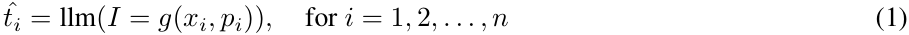

where _g_ ( _·_ ) is a function that integrates an input sample _xi_ and its corresponding prompt _pi_ , generating the final input _I_ . Our objective is to leverage both the raw fault data and the additional context provided by the prompts to assess LLMs’ potential in fault diagnosis and investigate whether leveraging machine specification enhances the performance across different work conditions and machine components. 

### **3.2 FD-LLM framework** 

Figure 1 illustrates our proposed pipeline for FD-LLM (Fault Diagnosis Large Language Model), designed to assess the health state of mechanical equipment by predicting potential faults based on vibration signals. The process begins with the preprocessing of vibration signals into representative samples, either by applying the FFT or by generating statistical summaries from both the time and frequency domains, thereby preparing the signals for LLM input. These processed samples are then combined with carefully crafted instruction prompts to create the final input for the LLM to analyze and generate predictions for the potential fault types. Specifically, for an input sample _xi_ , which could either be an FFT vector or a row of statistical features, along with the corresponding prompt _Pi_  fft_ or _Pi_  st_ , the LLM is fine-tuned to analyze the data and output fault type predictions. 

Note that the prompt contains essential contextual information, including equipment specifications (e.g., name, model, geometric parameters) and the machine’s operating conditions, such as speed and load. By embedding this contextual information alongside each signal sample in the input prompt, the LLM can utilize both the raw data and the relevant operational details to make accurate fault predictions. Moreover, incorporating such information leads to more robust and reliable diagnostic results by the LLM across various machine components operating under diverse conditions, as it enables the LLM to consider how different operational conditions and machine component types affect performance. 

### **3.2.1 Data pre-processing** 

As mentioned, FD-LLM utilizes two methods for pre-processing vibration signals to generate proper time-series representations that are LLM-ready. We discuss these two methods in detail as follows. 

**(1) FFT pre-processing.** The raw vibration signals are first subjected to random sampling, segmenting each signal into multiple overlapping or non-overlapping windows, each of which is then analyzed to capture its frequency characteristics. The objectives are: (i) to reduce the overall length of the vibration signals, ensuring they do not exceed the LLMs’ maximum sequence length (e.g., MISTRAL has a maximum context length of 32k tokens, and Llama3 supports up to 8k tokens) while augmenting the training samples; and (ii) to produce a normalized frequency representation for each segment, which can then be incorporated into the prompt template after a proper encoding. 

Given a set of time-domain signals _{x_(_j_) ( _n_ ) _}__J_ _j_ =1, where_J_is the total number of signals, we divide each signal into_K_ segments, with each segment having a length of _L_ data points. For instance, if the total length of the _j_ -th signal is _N_(_j_) , we can denote the _k_ -th segment of the _j_ -th signal as _x_( _k__j_)(_n_), where_n_= 0_,_1_, . . . , L −_1.For each segment_x_( _k__j_)(_n_), we compute the FFT, which is essentially an efficient implementation of the Discrete Fourier Transform (DFT). The DFT 

4 

FD-LLM: Large Language Model for Fault Diagnosis of Machines 

A PREPRINT 

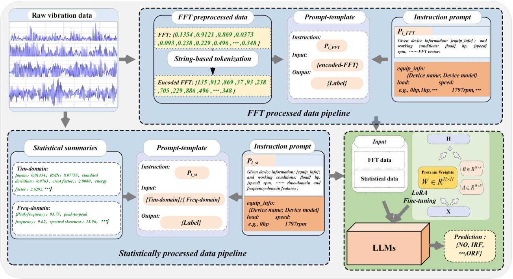

Figure 1: An illustration of the FD-LLM framework using both FFT-processed and statistically processed data pipelines. 

can be expressed mathematically as: 

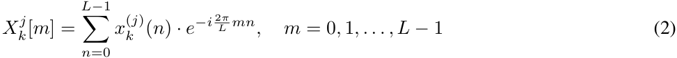

where _i_ is the imaginary unit. 

We further compute the magnitude _Pk_(_j_)[_m_] for each FFT coefficient as_P_( _k__j_)[_m_] =_|X_ _k_(_j_)[_m_]_|_, representing the amplitude of each frequency in the segment. This results in FFT-processed samples that include only positive values, thereby avoiding the need for unnecessary sign tokenization. To ensure consistency across different segments, we scale the magnitudes by dividing by the segment length _L_ : _Yk_(_j_) [ _m_ ] =_P_( _<u>k</u>__j_ _L_) <u>[</u> _m_ <u>]</u> . For each segment _k_ of the _j_ -th signal, the output _Yk_(_j_) [ _m_ ] comprises _L_ normalized values, one for each frequency component _m_ . Finally, a set of FFT-processed samples for all signals is obtained and represented as follows:: _Y_ = _{Y_(_j_) _}__J_ _j_ =1_,_ where _Y_(_j_) = _{Yk_(_j_) _}__K_ _k_ =1_,_for_j_= 1 _,_ 2 _, . . . , J,_ and _Yk_(_j_) = [ _Yk_(_j_) [0] _, Yk_(_j_) [1] _, . . . , Yk_(_j_) [ _L −_ 1]]. 

The FFT-processed samples are subsequently encoded and incorporated into a structured prompt template to include essential machine information, operating conditions, encoded FFT samples, and the corresponding label. The prompt template consists of three main elements: " _instruction_ ", " _input_ ", and " _output_ ", as displayed in Table 1. Please also refer to Figure 2 for a visual illustration of the FFT pre-processing steps using a complete vibration signal. 

**Instruction** : A prompt _pi_  fft_ that integrates an instruction or task query along with the machine specifications _{_ equip-info _}_ , operating conditions (workload _{_ load _}_ hp and rotation speed _{_ speed _}_ rpm) into a cohesive paragraph using the function _f_ ( _·_ ) in formula 3. 

**Input:** This element, represented as _xi_ , consists of the FFT samples, which are transformed into a suitable format for integration into the LLM input through a string encoding function `encode` ( _·_ ), as expressed in formula 4. 

**Output:** Captures the corresponding label for each pair of the previous two elements. 

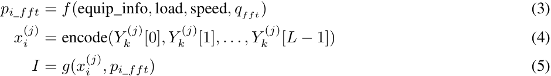

5 

FD-LLM: Large Language Model for Fault Diagnosis of Machines 

A PREPRINT 

Table 1: Instruction prompts used to generate the training data 

|**Dataset**|**Prompt-template**|
|---|---|
|FFT processed samples|`"Instruction"`: Given machine information: {equip_info}; and work- ing conditions: {load} hp, {speed} rpm, please predict the operating status of the bearing based on the following FFT vector. `"Input"`: {FFT} `"Output"`: {label}|
|Statistically processed samples|`"Instruction"`: Given machine information: {equip_info}; and work- ing conditions: {load} hp, {speed} rpm, please predict the operating status of the bearing based on the following time-domain and frequency- domain features. `"Input"`: {Tim-domain features}; {freq-domain features} `"Output"`: {label}|

where _f_ ( _·_ ) is the function that aggregates the equipment details equip_info, load, and speed, and task query _q_ . _x_( _i__j_)is the encoded FFT vector. _g_ ( _·_ ) concatenates the instruction prompt _p_( _i__j_) and encodes FFT vector into a single input _I_ . In Section 3.2.2, we introduce a method for string encoding of FFT samples. 

(2) **Statistical pre-processing.** We extract a set of 15 statistical features: 10 from the time domain and 5 from the frequency domain. The time-domain features include the mean, root mean squared (RMS), standard deviation, crest factor, skewness, shape factor, kurtosis, peak-to-peak value, energy factor, and impulse factor. The frequency-domain features include peak frequency, peak-to-peak frequency, spectral kurtosis, spectral bandwidth, and spectral skewness. 

For each segment _x_( _k__j_)(_n_), we derive a total of 15 features, resulting in a feature vector**F**( _k__j_) that encapsulates both time-domain and frequency-domain statistics: 

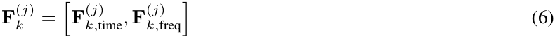

where 

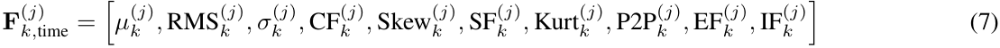

are the 10 time-domain features, and 

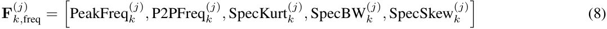

are the 5 frequency-domain features. The feature vectors from all segments are systematically arranged in a tabular format, with the first row listing the feature names to define each dimension of the data. Each subsequent row corresponds to an individual segment, encapsulating its extracted features as a structured vector. 

To ensure compatibility with LLMs, the feature vectors are serialized by converting them into concise textual summaries within a predefined prompt template presented in Table 1. Similar to the FFT-processed data, the prompt template also consists of the same three elements, where _pi_  st_ includes a task query indicating the input being statistical summaries, and the input element _xi_ contains the textual summaries of the statistical feature vectors. This transformation preserves the integrity of the original data while enabling efficient input to LLMs. A visual demonstration of this process is illustrated in Figure 2. A detailed breakdown of the 15 features along with their respective mathematical formulas can be found in Appendix A Table 10. 

### **3.2.2 Time series data encoding** 

Each LLM uses a tokenizer to convert input text into a sequence of tokens, a critical process since even small discrepancies can lead to significant changes in model behavior. One common tokenization technique is Byte-Pair Encoding (BPE), which processes input data as bit strings and generates tokens based on their frequency in the training data. However, BPE can sometimes split a single number into multiple tokens that do not align with its individual digits, which can hinder the model’s ability to interpret and perform operations on numerical data. As a result, properly encoding time series data into a textual format that ensures accurate tokenization is a crucial step for enabling LLMs to make reliable predictions. 

6 

FD-LLM: Large Language Model for Fault Diagnosis of Machines 

A PREPRINT 

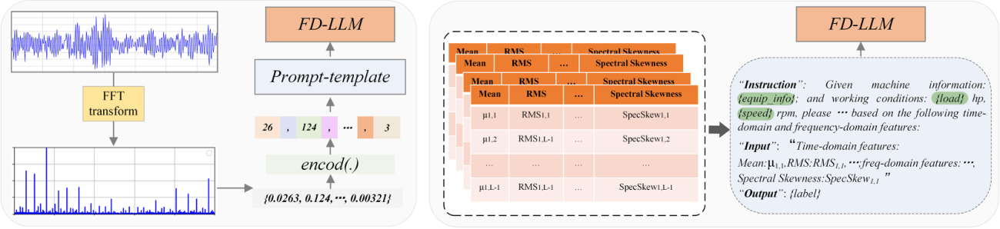

Figure 2: **Left:** Illustrates the FFT pre-processing steps. For illustration purposes, we use a complete vibration signal and its corresponding FFT transformation from an outer race fault of the bearings. We select to use a length of 512 for each segment, and the number of decimal places _D_ is set to 3. **Right:** Presents the statistically processed data, where each table contains the statistical features of segments from a certain signal collected under certain machine health state. Each feature name and its corresponding value are serialized into the input element of the prompt template for every segment in the tables. 

Inspired by the method presented in [Gruver et al., 2023], we transform the FFT-processed samples into a sequence of values that can be accurately tokenized. Given a segment _Yk_(_j_) = [ _Yk_(_j_) (0) _, Yk_(_j_) (1) _, . . . , Yk_(_j_) ( _L −_ 1)], for simplicity, we use _Y_ = ( _y_ 0 _, y_ 1 _, . . . , yL−_ 1) instead. We define an encoding function encode( _·_ ) that performs a series of reversible steps: sign handling, quantization, and string tokenization, as described below. 

**Sign Handling:** Although FFT magnitudes _yi_ are inherently non-negative, we incorporate a mechanism for handling potential sign adjustments for completeness. The sign of each spectral value is processed using conditional logic: 

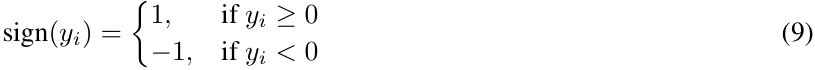

This step ensures compatibility for scenarios where sign adjustments might be applicable. Given that FFT magnitudes are generally positive, this prevents unnecessary sign tokenization and reduces the length of the input samples. 

**Quantization:** To address the potentially high precision of FFT magnitudes, we apply a quantization function quantize( _Y, D_ ) over the FFT-processed sample _Y_ = ( _y_ 0 _, y_ 1 _, . . . , yL−_ 1) to enhance computational efficiency. The parameter _D_ specifies the number of decimal places to retain before truncation. Each magnitude _yi_ in the _Y_ is truncated to _D_ decimal places and converted into an integer representation to minimize token usage associated with floating-point values. Consequently, the quantized FFT-processed samples become _Yq_ = ( _yq_ 0 _, yq_ 1 _, . . . , yq_ ( _L−_ 1)). 

**String Tokenization:** The quantized samples are then transformed into a formatted string representation with a specific separator. Given that we utilize open-source LLMs such as Llama-3, Llama3-instruct, and Mistral, which effectively manage the tokenization of numbers, there is no need to insert spaces between digits. However, handling missing values is also considered in this transformation, where a placeholder string (e.g., "NaN") replaces any missing values. Finally, we obtain an encoded representation _X_ of the FFT-processed samples, such that _X_ = ( _x_ 0 _, x_ 1 _, . . . , xL−_ 1). 

### **3.2.3 Instruction fine-tuning** 

Fine-tuning helps a model to better grasp specific industrial terminologies, fault mechanisms, and operational settings, thereby enhancing its ability to generate accurate and contextually relevant answers in the target task. Instruction tuning [Wei et al., 2021, Ouyang et al., 2022] is a fully supervised fine-tuning technique used to further train LLMs on specific target domains. This approach not only enhances the controllability of LLMs to follow human instructions helpfully and safely but also enables them to adapt their existing knowledge to the nuanced demands of new tasks. In fact, recent studies [Sanh et al., 2021] have shown that instruction-tuned LLMs exhibit strong zero-shot generalizability on unseen tasks, which is a highly valuable trait in industrial fault diagnosis, where limited data and diverse operational conditions pose significant challenges in building a robust, generalized system. 

We employ Low-Rank Adaptation (LoRA) [Hu et al., 2021], an efficient approach for fine-tuning large models which reduces the computational burden by introducing trainable low-rank matrices into the model’s layers. Instead of updating the full weight matrix _W ∈_ **R**_H×H_ in each layer, LoRA decomposes the weight update into the sum of a frozen base matrix _W_ and a low-rank matrix ∆ _W_ . The decomposition is given by: 

_W__′_ = _W_ + ∆ _W_ (10) 

7 

FD-LLM: Large Language Model for Fault Diagnosis of Machines 

A PREPRINT 

where ∆ _W_ = _AB__T_ , with _A ∈_ **R**_H×R_ and _B ∈_ **R**_H×R_ , and _R ≪ H_ . During training, only the low-rank matrices _A_ and _B_ are updated, while the original weight matrix _W_ remains frozen, significantly reducing the number of trainable parameters. In the forward pass, the original intermediate calculation **h** = _W · I_ is modified as: 

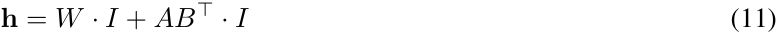

where _α_ is a scaling factor that controls the contribution of the low-rank update ∆ _W_ = _AB__T_ . This ensures that the low-rank adaptation integrates smoothly with the pre-trained model, preventing the low-rank update from overpowering the original weights. By freezing the main weights and updating only the low-rank matrices, LoRA achieves efficient fine-tuning with minimal computational overhead. 

### **3.2.4 Post-processing and evaluation** 

Since the LLMs produce predictions in natural language, to evaluate the performance of the LLM using standard DL and ML metrics, we map the textual predictions and corresponding true labels into a numerical or categorical format by defining a mapping function _ϕ_ such that: 

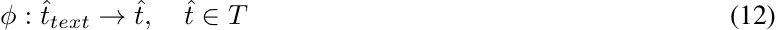

where _t_ˆ _text_ is the LLM’s predicted text, and _ttext_ is the true label text. Similarly, the true label _t_ is mapped as: 

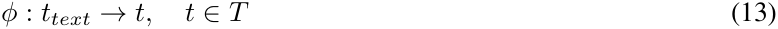

> We can then evaluate the model’s performance by comparing the predicted class _t_ˆ against the true class _t_ , using metrics such as Accuracy (Acc), Precision (Prec), Recall (Rec), F1-Score (F1), and Confusion Matrix (MC). 

## **4 Experiments** 

### **4.1 Dataset source and tasks** 

**Dataset:** In this study, we use the Case Western Reserve University (CWRU) dataset1 , which includes vibration signals from ball bearings in both healthy and faulty states. Faults were deliberately introduced into the bearings using electro-discharge machining (EDM), generating single-point defects of varying sizes (0.007, 0.014, and 0.021 inches in diameter) on critical bearing components such as the inner race, outer race, and rolling elements. Then, vibration data were systematically recorded via accelerometers mounted at both the drive end and fan end of the motor housing at sampling rates of 12KHz and 48KHz, and under four operational conditions, including motor loads of 0HP, 1HP, 2HP, and 3HP, and speeds ranging from 1797 to 1730 RPM. 

We use the data collected at a 12KHz sampling rate for both drive end and fan end bearings. The data collected from both the drive end and fan end are pre-processed as described in Section 3.2.1. A single label was assigned to each bearing condition, irrespective of fault size, as shown in Table 2. For instance, all inner race faults with diameters ranging from 0.007 inches to 0.021 inches were grouped under the "Inner Race Fault" (IRF) label. The resulting dataset contains four types of faults—Normal (NO), Inner Race Fault (IRF), Outer Race Fault (ORF), and Rolling Element Fault (REF). Additionally, a more detailed dataset was constructed following traditional settings of DL and ML based fault diagnosis, where each fault size is treated as a distinct fault type. The detailed configuration is shown in Table 3. 

**Tasks:** We designed a series of experimental tasks under different settings to comprehensively evaluate the performance of LLMs for fault diagnosis in terms of adaptability to various operational conditions (0HP, 1HP, 2HP, etc.) and generalizability, by analyzing data across different components of the machine (Drive end and Fan end). 

### **Task 1: Traditional fault diagnosis settings.** 

In this task, we follow the common experimental settings of fault diagnosis. Specifically, we combine the subsets collected from the drive end (0HPDE, 1HPDE, 2HPDE, and 3HPDE) into a dataset named CWRUfft-DE for FFTprocessed data and CWRUst-DE for statistically processed data. Similarly, the subsets from the fan end (0HPFE, 1HPFE, 2HPFE, and 3HPFE) are merged into datasets called CWRUfft-FE and CWRUst-FE. For each merged dataset, 10% is reserved for evaluation. 

**Task 2: Cross-dataset settings.** In this task, we assess the adaptation capabilities of LLMs by conducting domainspecific fine-tuning and cross-domain evaluation as follows. First, we fine-tune LLMs on the data collected under certain operational conditions (source domain). Specifically, we utilize 0HPDE subset collected from the drive end 

> 1http://csegroups.case.edu/bearingdatacenter/home 

8 

FD-LLM: Large Language Model for Fault Diagnosis of Machines 

A PREPRINT 

Table 2: Dataset configuration for FFT and Statistically Processed Data. The table outlines the samples corresponding to each working condition, which form subsets for either the drive end or the fan end. These subsets are designated as 0HPDE, 1HPDE, 2HPDE, and 3HPDE for the drive end, where "xHP" indicates the working condition and "DE" denotes the drive end. Similarly, for the fan end, the subsets are labelled 0HPFE, 1HPFE, 2HPFE, and 3HPFE, with "FE" representing the fan end. 

|Work condition|0HP/1797RPM|1HP/1772RPM|2HP/1750RPM|2HP/1750RPM|
|---|---|---|---|---|
|Fault size/inch|0.007 0.014 0.021|0.007 0.014 0.021|0.007 0.014 0.021|0.007 0.014 0.021|
|Label|NO/IRF/ ORF/ REF|NO/IRF/ ORF/ REF|NO/IRF/ ORF/ REF|NO/IRF/ ORF/ REF|
|No of samples|230/690/690/690|230/690/690/690|230/690/690/690|230/690/690/690|
|Total|2300|2300|2300|2300|
|Subsets|0HPDE/0HPFE|1HPDE/1HPFE|2HPDE/2HPFE|3HPDE/3HPFE|

Table 3: Dataset detailed configuration 

|Labels|Fault size/inches|Working condition|No of samples|
|---|---|---|---|
|NO|Non||230|
|IFR1/ ORF1/ REF1|0.0070|0HP/1797RPM|690|
|IFR2/ ORF2/ REF2|0.0014||690|
|IFR3/ ORF3/ REF3|0.021||690|
|NO|Non||230|
|IFR1/ ORF1/ REF1|0.0070|1HP/1772RPM|690|
|IFR2/ ORF2/ REF2|0.0014||690|
|IFR3/ ORF3/ REF3|0.021||690|
|NO|Non||230|
|IFR1/ ORF1/ REF1|0.0070|2HP/1750RPM|690|
|IFR2/ ORF2/ REF2|0.0014||690|
|IFR3/ ORF3/ REF3|0.021||690|
|NO|Non||230|
|IFR1/ ORF1/ REF1|0.0070|2HP/1730RPM|690|
|IFR2/ ORF2/ REF2|0.0014||690|
|IFR3/ ORF3/ REF3|0.021||690|
|Total No of samples|||9200|

operating at 0HP load and speed of 1797rpm to train LLMs. In this phase, 10% of 0HPDE data is used for evaluation which is similar to any traditional fault diagnosis settings. 

We then investigate the adaptability of these fine-tuned models using subsets from other operational conditions (target domains) but within the same machine component (drive end). These subsets are 1HPDE, 2HPDE, and 3HPDE, which are collected under loads of 1HP, 2HP, and 3HP respectively. 

To further investigate LLMs generalizability across distinct machine components, we also evaluate the fine-tuned models utilizing 0HPFE and 1HPFE subsets from the fan end (target domain). This task settings enables us to examine the model’s generalizability from the drive end training data (source domain) to fan-end test data in cross-machine components evaluation. 

**Task 3: Overall evaluation.** In this task, we integrate all available data from both the drive end and the fan end into a unified dataset named CWRUfft-all and CWRUst-all for FFT processed data and statistically processed data, respectively. 90% of the data is used for fine-tuning and a proportion of 10% is allocated for evaluation. By evaluating the model on this extensive dataset, we assess the model’s overall effectiveness and robustness in predicting faults across a broad spectrum of operational conditions and different machine components. 

9 

FD-LLM: Large Language Model for Fault Diagnosis of Machines 

A PREPRINT 

### **4.2 Models** 

To fully validate the effectiveness of our FD-LLM on the test dataset, we select three categories of models: 

- **ML Algorithm:** For the traditional ML category, we use Support Vector Machine (SVM) which is a widely used ML algorithm in machine health state identification especially for the essential elements of rotating machinery, such as gears, rolling bearings, and motors. 

- **DL Algorithm:** For the DL category, we use the one-dimensional convolutional neural network (1D-CNN) model, which is a popular yet efficient DL model used in many fault diagnosis frameworks and has proven its capability of producing accurate predictions. Specifically, we used the WDCNN[Zhang et al., 2017] model after adding minor changes to the network’s structure, such as rescaling the kernel size of the first convolutional layer from 64 to 16 and reducing the stride to 2, to meet the length of the samples in our data. 

- **Open-source LLM:** For the LLM category, we use four leading open-source LLMs namely, Llama3-8B, Llama3-8B instruct, Qwen1.5-7B, and Mistral-7B. The selection of these models is based on their wide range of applications and their capacities in handling numerical data. 

### **4.3 Settings** 

Since both the ML and DL algorithms can only take in numerical data, we used only the statistical data without incorporating any text for the ML algorithm, and only the FFT dataset for the DL algorithm. Although both ML and DL models have the ability to process either FFT or statistical data, our selection is based on best practices and the strengths of each approach: DL models are most suitable for analyzing high-dimensional data like FFT vectors that capture the frequency-domain characteristics of vibration signals, while ML models frequently benefit from compact, high-level statistical features. In contrast, LLMs are able to incorporate both the textual data and the vibration data either in the form of statistical quantities or encoded FFT vectors. 

Specifically, the hyperparameters used in this study are as follows: batch size 2, LoRA rank 4, cosine lr scheduler, learning rate 1e-4, bf16, and NVIDIA A10 for all training processes. We trained 3 epochs for all LLMs experiments. 

### **4.4 Metrics** 

We employ multiple standard DL and ML evaluation metrics, including Accuracy, Precision, Recall, and F1-Score, to evaluate the LLM’s classification performance. For conciseness, we will focus on presenting the accuracy and F1-score in the following discussion, with results for the other metrics provided in Appendix B. 

### **4.5 Results and discussions** 

### **4.5.1 Task 1: Traditional fault diagnosis settings** 

Table 4 shows the results of the traditional fault diagnosis settings. All models were evaluated using the statistically processed data (CWRUst-DE) and FFT-processed data (CWRUfft-DE) from the drive end, as well as CWRUst-FE and CWRUfft-FE from the fan end. 

**Statistically processed data.** The evaluation results on the statistical datasets CWRUst-DE and CWRUst-FE reveal significant variations in the performance across different models. Llama3 and Llama3-instruct exhibited relatively satisfactory results on the drive end data (CWRUst-DE), in which Llama3 obtained accuracy and F1-score of 0.9480 and 9420, respectively, and Llama3-instruct demonstrated relatively higher metrics, with an accuracy of 0.9521 and an F1-score of 0.9520. However, on the fan end data (CWRUst-FE), both Llama3 and Llama3-instruct showed a substantial decline in performance, with decreases of 10% and 5% in accuracy, respectively. Moreover, the other LLMs, Qwen1.5-7B and Mistral7B_v0.2 displayed consistently low accuracy and F1-scores, indicating their failure to generalize effectively across both datasets. Additionally, the ML method represented by SVM achieved the best performance on CWRUst-DE but yielded relatively low accuracy and F1-scores on CWRUst-FE. 

**FFT processed data.** Llama3 and Llama3-instruct achieved perfect fault diagnostic accuracy on FFT-processed data from both the drive end (CWRUfft-DE) and the fan end (CWRUfft-FE). Conversely, Qwen1.5-7B and Mistral7B_v0.2 continued to exhibit low accuracy and F1-scores, demonstrating poor generalization across both datasets. However, DL models, represented by WDCNN, achieved competitive results. These evaluation results demonstrate that FFT-processed data provides richer information from which the models can effectively learn, leading to superior performance in fault diagnosis compared to statistically processed data. 

10 

FD-LLM: Large Language Model for Fault Diagnosis of Machines 

A PREPRINT 

Table 4: Evaluation results of all models under combined datasets from drive end and fan end subsets 

|||Drive|end|||Fan|end||
|---|---|---|---|---|---|---|---|---|
|Model|CWRU|st-DE|CWRU|fft-DE|CWRU|st-FE|CWR|Ufft-FE|
||Accuracy|F1-Score|Accuracy|F1-Score|Accuracy|F1-Score|Accuracy|F1-Score|
|Llama3|**0.9480**|**0.9402**|**0.997**|**0.9969**|**0.8467**|**0.8464**|**0.9875**|**0.9874**|
|Qwen1.5-7B|0.3826|0.3711|0.762|0.7562|0.3508|0.3127|0.6725|0.6484|
|Mistral-7B|0.3453|0.2641|0.5390|0.4951|0.3347|0.2530|0.3504|0.3059|
|Llama3-instruct|**0.9521**|**0.9520**|**0.998**|**0.998**|**0.9097**|**0.9094**|**0.9975**|**0.9974**|
|SVM|**0.9739**|**0.9739**|N/A|N/A|0.8733|0.8760|N/A|N/A|
|WDCNN|N/A|N/A|**0.9928**|**0.9911**|N/A|N/A|**0.9916**|**0.9910**|

In answering the question “Are LLMs valid fault diagnosis tools?”, the results have indeed shown that LLMs such as LLama3 and LLama3-Instruct exhibited robust fault diagnosis performance. This effectiveness can be attributed to their ability to interpret numerical data when appropriately pre-processed, leverage domain knowledge, and recognize complex patterns across diverse inputs. In fact, Llama models take numerical tokenization into account during their pretraining stage, enabling effective handling of complex token patterns– an advantage that likely contributes to its higher fault diagnosis accuracy as compared to models like Mistral and Qwen1.5[Touvron et al., 2023]. In contrast, Mistral prioritizes modularity and computational efficiency over detailed numerical pattern learning, while Qwen1.5 focuses on extended context length and multilingual robustness rather than specific adaptations for numerical data processing. Additionally, the models achieved near 100% accuracy and F1-score on FFT-processed data, highlighting that the FFT transformations provide richer, more informative representations and thus enable LLMs to extract meaningful insights, resulting in superior fault diagnosis performance compared to statistical features alone. 

### **4.5.2 Task 2: Cross-dataset evaluation** 

In this task, we conducted a zero-shot evaluation for all models to assess the generalization abilities of LLMs compared to ML and DL-based fault diagnosis models. Specifically, we trained all models on the 0HPDE subset and carried out the evaluation as follows: 

- (1) _Within the same subset:_ To evaluate within the same subset, we use 10% of 0HPDE for evaluation following common fault diagnosis experimental settings; 

- (2) _Across operational conditions:_ To evaluate within the same machine component (drive end) but across operational conditions (target domains), we assess the models under different operational conditions using subsets from the drive end (1HPDE, 2HPDE, and 3HPDE); 

- (3) _Across machine components:_ To evaluate across different machine components (target domains), we evaluate all models using two subsets from the fan end (0HPFE and 1HPFE). 

Tables 5 and 6 display the evaluation results of all models using both statistical and FFT-processed data, respectively. 

**Statistically processed data:** As presented in Table 5, the evaluation results revealed low levels of generalization and adaptability across different target domains for the tested models. This is likely due to the nature of statistical representations, which capture only global properties of vibration signals and may overlook subtle changes or local patterns essential for adapting to different operational conditions. Consequently, the evaluation indicates that statistical representations do not improve the generalization capabilities of LLMs. 

- (1) _Within the same subset:_ Llama-3 demonstrated the strongest performance compared to other LLMs, achieving the highest accuracy (97.62%) and F1-score (96.93%) on 0HPDE data. Similarly, SVM showed a strong diagnostic performance. 

- (2) _Across operational conditions:_ The diagnostic performance of all models dramatically declined as they were exposed to data from increasingly divergent operational conditions. The best accuracy achieved on 1HPDE by SVM is 77.60% and further dropped to 71.30% on 2HPDE. 

11 

FD-LLM: Large Language Model for Fault Diagnosis of Machines 

A PREPRINT 

- (3) _Across-machine components:_ None of the models, including SVM, were able to generalize well to data from different machine components, indicating poor adaptability to unseen conditions from the fan end. 

Table 5: The cross-dataset evaluation results of all models using statistically processed data 

|Data|Llama|3-8B|SV|M|Qwen|1.5-7B|Llama3-|instruct|Mistra|l-7B|
|---|---|---|---|---|---|---|---|---|---|---|
||Accuracy|F1-Score|Accuracy|F1-Score|Accuracy|F1-Score|Accuracy|F1-Score|Accuracy|F1-Score|
|0HPDE|**0.9762**|**0.9693**|**0.9760**|**0.9759**|0.8102|0.8096|**0.8956**|**0.8874**|0.665|0.6415|
|1HPDE|0.7230|0.7170|0.7760|0.7734|0.6647|0.6497|0.7091|0.7016|0.3785|0.3698|
|2HPDE|0.6669|0.6273|0.7130|0.6972|0.6665|0.6284|0.6630|0.6219|0.4034|0.3904|
|3HPDE|0.6678|0.6166|0.7826|0.7646|0.6552|0.5993|0.6808|0.6301|0.3614|0.3408|
|0HPFE|0.6552|0.6263|0.5043|0.4998|0.6143|0.5906|0.6095|0.5769|0.3634|0.3515|
|1HPFE|0.3630|0.3329|0.4956|0.5020|0.3508|0.3127|0.3521|0.3222|0.3697|0.3538|

Table 6: The cross-dataset evaluation results of all models using FFT-processed data 

|Data|Llama|3-8B|WD|CNN|Llama3|-instruct|Qwen1|.5-7B|Mistr|al-7B|
|---|---|---|---|---|---|---|---|---|---|---|
||Accuracy|F1-Score|Accuracy|F1-Score|Accuracy|F1-Score|Accuracy|F1-Score|Accuracy|F1-Score|
|0HPDE|**1.0**|**1.0**|**0.999**|**0.9989**|**1.0**|**1.0**|**0.968**|**0.9680**|0.548|0.5518|
|1HPDE|**0.986**|**0.9859**|0.927|0.9264|**0.998**|**0.9979**|0.9304|0.9297|0.5088|0.5059|
|2HPDE|**0.9376**|**0.9359**|0.912|0.9109|**0.9648**|**0.9643**|0.8964|0.8961|0.4936|0.4894|
|3HPDE|**0.9376**|**0.9359**|0.848|0.8455|**0.9648**|**0.9643**|0.8964|0.8961|0.4936|0.4894|
|0HPFE|0.4377|0.4100|0.479|0.4539|0.529|0.4757|0.6565|0.6322|0.4663|0.4722|
|1HPFE|0.433|0.3876|0.396|0.3539|0.4755|0.4099|0.586|0.5186|0.4805|0.4840|

**FFT-processed data:** Table 6 summarises all models’ evaluation results on FFT data and shows that Llama3 and Llama3-instruct exhibited the most satisfactory results. 

- (1) _Within the same subset:_ Amongst all the evaluated LLMs, Llama3 and Llama3-instruct delivered the best results, achieving perfect accuracy and F1-score (100%). Qwen1.5 also demonstrated relatively strong performance, while Mistral showed the lowest accuracy and F1-scores at 54.8% and 55.18%, respectively. On the other hand, WDCNN exhibited strong diagnostic accuracy at 99.9%, outperforming both Qwen1.5 and Mistral. 

- (2) _Across operational conditions:_ Llama3 and Llama3-instruct maintained robust performance, with Llama3instruct showing significant superiority on 2HPDE and 3HPDE, demonstrating strong adaptation and generalization to unseen conditions. In contrast, Qwen1.5’s performance declined rapidly as operational conditions became more divergent, while Mistral continued to underperform. WDCNN displayed acceptable yet competitive results, though its adaptation was expectedly limited. DL models like WDCNN often struggle with new operational conditions or equipment due to the distributional discrepancies between training and test data, which explains the performance degradation, particularly on 2HPDE and 3HPDE. 

- (3) _Across-machine components:_ The results indicate a significant performance decline for all models when applied to data from different machine components, underscoring poor generalization to new mechanical devices. 

12 

FD-LLM: Large Language Model for Fault Diagnosis of Machines 

A PREPRINT 

### **4.5.3 Task 3: Overall evaluation** 

For overall evaluation, we constructed one comprehensive dataset that encompassed all the subsets from the drive end and fan end, using 90% of this dataset for training all models. We then evaluate the models using the remaining 10% of the data. The evaluation was conducted using both statistically processed data (CWRUst-all) and FFT processed data (CWRUfft-all). 

Based on the results presented in Table 7, Llama-3-8B and FF-DM achieved the highest performance, demonstrating strong generalization across both the statistically processed data (CWRUst-all) and FFT processed data (CWRUfft-all). In contrast, models such as Qwen1.5-7B and Mistral7B_v0.2 performed poorly. probably due to their design choices that position them as strong general-purpose models but less specialized for tasks requiring complex numerical data interpretation. Traditional machine learning methods, such as SVM, also did not perform well. 

Table 7: Evaluation results of all models using all data from the drive and fan end. In the table, CWRUst-all represents all statistically processed data from both the drive and fan end, while CWRUfft-all denotes the FFT-processed data from both the drive and fan end 

|model|CWR|Ust-all|CWRU|fft-all|
|---|---|---|---|---|
||Accuracy|F1-Score|Accuracy|F1-Score|
|Llama-3-8B|**0.9480**|**0.9407**|**0.99**|**0.990**|
|Qwen1.5-7B|0.5309|0.5357|0.3766|0.330|
|Mistral-7B|0.2843|0.2010|0.3857|0.3233|
|Llama3-instruct|**0.9538**|**0.9537**|**0.9988**|**0.9988**|
|SVM|0.9445|0.9446|N/a|N/a|
|WDCNN|N/a|N/a|**0.9641**|**0.9627**|

However, DL models, represented by WDCNN, exhibited strong performance on the FFT processed data, achieving an accuracy of 96.41% and an F1-score of 96.27%. This result indicates that DL models can still be highly effective. Nevertheless, LLMs possess an advantage in their ability to integrate not only numerical data but also textual information that describes machine operational conditions and specifications. This capability allows LLMs to contextualize vibration signals with additional insights, enabling them to capture more nuanced patterns and relationships in the data, thereby achieving relatively higher performance than ML and DL models, especially when deployed for fault diagnosis on different devices. 

### **4.6 Ablation study** 

We also performed an ablation study to systematically evaluate the influence of different dataset configurations on the performance of LLMs for fault diagnosis. The objective is to understand how various settings and data preprocessing techniques affect the overall effectiveness of LLMs. 

First, we investigate the impact of incorporating machine specifications into the input prompts, focusing on the performance of Llama3 and Llama3-instruct. This evaluation is conducted using the comprehensive datasets outlined in Task 3. Specifically, we compare the performance of each model with and without machine specifications included in the input prompts. Then, we examine the effect of dataset labelling configurations. We compare the models’ performance using the dataset structure presented in Table 3 with an alternative configuration where only one label per fault is used, regardless of fault size. This helps us understand whether detailed labelling or simplified labelling is more beneficial for fault diagnosis tasks. The evaluation results are as follows: 

- **Impact of Incorporating Machine Specifications:** As shown in Table 8, including machine specifications in the input prompts significantly improves the performance of both Llama3 and Llama3-instruct on statistically processed data, yielding a 20% and 11% increase in accuracy, respectively. However, when machine specifications are incorporated into FFT-processed data, the performance gains are less noticeable, as both models already exhibit high accuracy and F1-scores on this data. 

13 

FD-LLM: Large Language Model for Fault Diagnosis of Machines 

A PREPRINT 

- **Effect of dataset labelling configurations:** From Table 9, we found out that detailed labelling of the fault type according to their malfunction size did not significantly impact the performance of LLMs. The models had remained robust, demonstrating that LLMs, besides identifying the faults, can determine the fault severity effectively. 

Table 8: Impact of incorporating machine specifications in the instruction prompt using statistical and FFT-processed data 

|Data|Llam Accuracy|a3-8B F1-Score|Llama3 Accuracy|-instruct F1-Score|
|---|---|---|---|---|
|Statistical data (No machine specifcation)|0.7467|0.7455|0.8451|0.8449|
|Statistical data (machine specifcation)|**0.9480**|**0.9407**|**0.9555**|**0.9556**|
|FFT data (No machine specifcation)|**0.975**|**0.9750**|**0.99**|**0.990**|
|FFT data (machine specifcation)|**0.99**|**0.990**|**0.9988**|**0.9988**|

Table 9: Effect of dataset labelling configurations using all FFT-processed data from drive end and fan end 

|Data|Llama|3-8B|Llama3|-instruct|
|---|---|---|---|---|
||Accuracy|F1-Score|Accuracy|F1-Score|
|CWRUfft-all-10labels|**0.9910**|**0.9904**|**0.9944**|**0.9944**|
|CWRUfft-all-4labels|**0.99**|**0.990**|**0.9988**|**0.9988**|

## **5 Conclusion** 

This study presents FD-LLM, a novel framework that bridges the gap between fault diagnosis and advanced language modeling through three key steps: data pre-processing, instruction fine-tuning, and post-processing. In the preprocessing phase, the challenge of aligning vibration signal modalities with LLM input formats was addressed by encoding the vibration signals into text. Two encoding methods were employed: string-based tokenization of FFTprocessed signals and statistical summaries derived from both time and frequency domains. The second step involves instruction fine-tuning using LoRA, which allows for efficient adaptation of LLMs to fault diagnosis tasks. In the final post-processing step, the LLM-generated predictions were mapped to numerical labels for the calculation of evaluation metrics in the assessment of model performance. 

Our extensive experiments have validated the effectiveness of FD-LLM in various fault diagnosis scenarios. Models such as Llama3 and Llama3-instruct demonstrated exceptional diagnostic performance in all settings, particularly when utilizing FFT-processed data. These models also exhibited strong adaptability, achieving high accuracy in diagnosing faults under new operational conditions. However, performance was lower when the models were tasked with diagnosing faults across different machine components, revealing a challenge in cross-component generalization. 

In summary, FD-LLM has showcased the considerable potential of utilizing LLMs for intelligent fault diagnosis across a range of diagnostic scenarios. On the other hand, our experiments have highlighted that future research should focus on enhancing cross-component adaptability to improve the system’s robustness and reliability. One promising direction for achieving this would be the incorporation of reasoning intelligence into the fault diagnosis process such as chain-of-thought (CoT) [Kim et al., 2023] or the more fine-grained Process-Supervised Reward Model (PRM)[Ma et al., 2023], which would guide the LLMs through a structured diagnostic process to systematically analyze vibration signals, calculate characteristic fault frequencies step by step, and progressively generate more accurate fault predictions. 

14 

FD-LLM: Large Language Model for Fault Diagnosis of Machines 

A PREPRINT 

## **References** 

- Ruonan Liu, Boyuan Yang, Enrico Zio, and Xuefeng Chen. Artificial intelligence for fault diagnosis of rotating machinery: A review. _Mechanical Systems and Signal Processing_ , 108:33–47, 2018. `https://doi.org/10.1016/ j.ymssp.2018.02.016` . 

- Zhibin Zhao, Tianfu Li, Jingyao Wu, Chuang Sun, Shibin Wang, Ruqiang Yan, and Xuefeng Chen. Deep learning algorithms for rotating machinery intelligent diagnosis: An open source benchmark study. _ISA transactions_ , 107: 224–255, 2020. `https://doi.org/10.1016/j.isatra.2020.08.010` . 

- Wayne Xin Zhao, Kun Zhou, Junyi Li, Tianyi Tang, Xiaolei Wang, Yupeng Hou, Yingqian Min, Beichen Zhang, Junjie Zhang, Zican Dong, Yifan Du, Chen Yang, Yushuo Chen, Z. Chen, Jinhao Jiang, Ruiyang Ren, Yifan Li, Xinyu Tang, Zikang Liu, Peiyu Liu, Jianyun Nie, and Ji rong Wen. A survey of large language models. _arXiv preprint arXiv:2303.18223_ , 2023. `https://doi.org/10.48550/arXiv.2303.18223` . 

- Ce Zhou, Qian Li, Chen Li, Jun Yu, Yixin Liu, Guan Wang, Kaichao Zhang, Cheng Ji, Qi Yan, Lifang He, Hao Peng, Jianxin Li, Jia Wu, Ziwei Liu, Pengtao Xie, Caiming Xiong, Jian Pei, Philip S. Yu, Lichao Sun Michigan State University, Beihang University, Lehigh University, Macquarie University, Nanyang Technological University, University of California at San Diego, Duke University, University of Chicago, and Salesforce Research. A comprehensive survey on pretrained foundation models: A history from bert to chatgpt. _arXiv preprint arXiv:2302.09419_ , 2023a. `https://doi.org/10.48550/arXiv.2302.09419` . 

- Alec Radford, Jeffrey Wu, Rewon Child, David Luan, Dario Amodei, Ilya Sutskever, et al. Language models are unsupervised multitask learners. _OpenAI blog_ , 1(8):9, 2019. `https://cdn.openai.com/better-language-models/ language_models_are_unsupervised_multitask_learners.pdf` . 

- Hugo Touvron, Louis Martin, Kevin R. Stone, Peter Albert, Amjad Almahairi, Yasmine Babaei, Nikolay Bashlykov, Soumya Batra, Prajjwal Bhargava, Shruti Bhosale, Daniel M. Bikel, Lukas Blecher, Cristian Cantón Ferrer, Moya Chen, Guillem Cucurull, David Esiobu, Jude Fernandes, Jeremy Fu, Wenyin Fu, Brian Fuller, Cynthia Gao, Vedanuj Goswami, Naman Goyal, Anthony S. Hartshorn, Saghar Hosseini, Rui Hou, Hakan Inan, Marcin Kardas, Viktor Kerkez, Madian Khabsa, Isabel M. Kloumann, A. V. Korenev, Punit Singh Koura, Marie-Anne Lachaux, Thibaut Lavril, Jenya Lee, Diana Liskovich, Yinghai Lu, Yuning Mao, Xavier Martinet, Todor Mihaylov, Pushkar Mishra, Igor Molybog, Yixin Nie, Andrew Poulton, Jeremy Reizenstein, Rashi Rungta, Kalyan Saladi, Alan Schelten, Ruan Silva, Eric Michael Smith, R. Subramanian, Xia Tan, Binh Tang, Ross Taylor, Adina Williams, Jian Xiang Kuan, Puxin Xu, Zhengxu Yan, Iliyan Zarov, Yuchen Zhang, Angela Fan, Melanie Kambadur, Sharan Narang, Aurelien Rodriguez, Robert Stojnic, Sergey Edunov, and Thomas Scialom. Llama 2: Open foundation and fine-tuned chat models. _arXiv preprint arXiv:2307.09288_ , 2023. `https://doi.org/10.48550/arXiv.2307.09288` . 

- An Yang, Baosong Yang, Binyuan Hui, Bo Zheng, Bowen Yu, Chang Zhou, Chengpeng Li, Chengyuan Li, Dayiheng Liu, Fei Huang, Guanting Dong, Haoran Wei, Huan Lin, Jialong Tang, Jialin Wang, Jian Yang, Jianhong Tu, Jianwei Zhang, Jianxin Ma, Jin Xu, Jingren Zhou, Jinze Bai, Jinzheng He, Junyang Lin, Kai Dang, Keming Lu, Ke-Yang Chen, Kexin Yang, Mei Li, Min Xue, Na Ni, Pei Zhang, Peng Wang, Ru Peng, Rui Men, Ruize Gao, Runji Lin, Shijie Wang, Shuai Bai, Sinan Tan, Tianhang Zhu, Tianhao Li, Tianyu Liu, Wenbin Ge, Xiaodong Deng, Xiaohuan Zhou, Xingzhang Ren, Xinyu Zhang, Xipin Wei, Xuancheng Ren, Yang Fan, Yang Yao, Yichang Zhang, Yunyang Wan, Yunfei Chu, Zeyu Cui, Zhenru Zhang, and Zhi-Wei Fan. Qwen2 technical report. _arXiv preprint arXiv:_ , 2407.10671, 2024. `https://doi.org/10.48550/arXiv.2407.10671` . 

- Nate Gruver, Marc Finzi, Shikai Qiu, and Andrew Gordon Wilson. Large language models are zero-shot time series forecasters. _arXiv preprint arXiv:_ , 2310.07820, 2023. `https://doi.org/10.48550/arXiv.2310.07820` . 

- Anastasiya Belyaeva, Justin Cosentino, Farhad Hormozdiari, Krish Eswaran, Shravya Shetty, Greg Corrado, Andrew Carroll, Cory Y. McLean, and Nicholas A. Furlotte. Multimodal llms for health grounded in individual-specific data. In Andreas K. Maier, Julia A. Schnabel, Pallavi Tiwari, and Oliver Stegle, editors, _Machine Learning for Multimodal Healthcare Data_ , page 86–102, Cham, 2024. Springer Nature Switzerland. ISBN 978-3-031-47678-5. `https://doi.org/10.1007/978-3-031-47679-2_7` . 

- Chenxi Sun, Hongyan Li, Yaliang Li, and Shenda Hong. Test: Text prototype aligned embedding to activate llm’s ability for time series. _arXiv preprint arXiv:2308.08241_ , 2023. `https://doi.org/10.48550/arXiv.2308.08241` . 

- Ming Jin, Shiyu Wang, Lintao Ma, Zhixuan Chu, James Y Zhang, Xiaoming Shi, Pin-Yu Chen, Yuxuan Liang, YuanFang Li, Shirui Pan, et al. Time-llm: Time series forecasting by reprogramming large language models. _arXiv preprint arXiv:2310.01728_ , 2023. `https://doi.org/10.48550/arXiv.2310.01728` . 

- Abdul Fatir Ansari, Lorenzo Stella, Caner Turkmen, Xiyuan Zhang, Pedro Mercado, Huibin Shen, Oleksandr Shchur, Syama Sundar Rangapuram, Sebastian Pineda Arango, Shubham Kapoor, et al. Chronos: Learning the language of time series. _arXiv preprint arXiv:2403.07815_ , 2024. `https://doi.org/10.48550/arXiv.2403.07815` . 

15 

FD-LLM: Large Language Model for Fault Diagnosis of Machines 

A PREPRINT 

- Tian Zhou, Peisong Niu, Liang Sun, Rong Jin, et al. One fits all: Power general time series analysis by pretrained lm. _Advances in neural information processing systems_ , 36:43322–43355, 2023b. `https://doi.org/10.48550/ arXiv.2302.11939` . 

- Yu Han Kim, Xuhai Orson Xu, Daniel McDuff, Cynthia Breazeal, and Hae Won Park. Health-llm: Large language models for health prediction via wearable sensor data. _arXiv preprint arXiv:_ , 2401.06866, 2024. `https://doi. org/10.48550/arXiv.2401.06866` . 

- Dat Mai. Stockgpt: A genai model for stock prediction and trading. _arXiv preprint arXiv:_ , 2404.05101, 2024. `https://doi.org/10.48550/arXiv.2404.05101` . 

- Xiang Li, Zhenyu Li, Chen Shi, Yong Xu, Qing Du, Mingkui Tan, Jun Huang, and Wei Lin. Alphafin: Benchmarking financial analysis with retrieval-augmented stock-chain framework. _arXiv preprint arXiv:_ , 2403.12582, 2024. `https://doi.org/10.48550/arXiv.2403.12582` . 

- Shibin Wang, Xuefeng Chen, Chaowei Tong, and Zhibin Zhao. Matching synchrosqueezing wavelet transform and application to aeroengine vibration monitoring. _IEEE Transactions on Instrumentation and Measurement_ , 66: 360–372, 2017. `https://doi.org/10.1109/TIM.2016.2613359` . 

- Chuang Sun, Meng Ma, Zhibin Zhao, and Xuefeng Chen. Sparse deep stacking network for fault diagnosis of motor. _IEEE Transactions on Industrial Informatics_ , 14:3261–3270, 2018. `https://doi.org/10.1109/TII. 2018.2819674` . 

- Fengqi Wu and Guang Meng. Compound rub malfunctions feature extraction based on full-spectrum cascade analysis and svm. _Mechanical Systems and Signal Processing_ , 20:2007–2021, 2006. `https://doi.org/10.1016/j. ymssp.2005.10.004` . 

- Xianlun Tang, Zhuang Ling, Jun Cai, and Changbing Li. Multi-fault classification based on support vector machine trained by chaos particle swarm optimization. _Knowl. Based Syst._ , 23:486–490, 2010. `https://doi.org/10. 1016/j.knosys.2010.01.004` . 

- Dong Wang. K-nearest neighbors based methods for identification of different gear crack levels under different motor speeds and loads: Revisited. _Mechanical Systems and Signal Processing_ , 70:201–208, 2016. `https: //doi.org/10.1016/j.ymssp.2015.10.007` . 

- Divyang H. Pandya, Sanjay H. Upadhyay, and Suraj Prakash Harsha. Fault diagnosis of rolling element bearing with intrinsic mode function of acoustic emission data using apf-knn. _Expert Syst. Appl._ , 40:4137–4145, 2013. `https://doi.org/10.1016/j.eswa.2013.01.033` . 

- Wen Qing Zhao, Yanfang Zhang, and Yongli Zhu. Diagnosis for transformer faults based on combinatorial bayes network. _2009 2nd International Congress on Image and Signal Processing_ , pages 1–3, 2009. `https://doi.org/ 10.1109/CISP.2009.5301965` . 

- V. Muralidharan and V. Sugumaran. A comparative study of naïve bayes classifier and bayes net classifier for fault diagnosis of monoblock centrifugal pump using wavelet analysis. _Appl. Soft Comput._ , 12:2023–2029, 2012. `https://doi.org/10.1016/j.asoc.2012.03.021` . 

- Marcin Mrugalski, Marcin Witczak, and Józef Korbicz. Confidence estimation of the multi-layer perceptron and its application in fault detection systems. _Eng. Appl. Artif. Intell._ , 21:895–906, 2008. `https://doi.org/10.1016/j. engappai.2007.09.008` . 

- Javad Rafiee, Farid Arvani, Abbas Harifi, and M. H. Sadeghi. Intelligent condition monitoring of a gearbox using artificial neural network. _Mechanical Systems and Signal Processing_ , 21:1746–1754, 2007. `https://doi.org/10. 1016/j.ymssp.2006.08.005` . 

- Wei Zhang, Gaoliang Peng, Chuanhao Li, Yuanhang Chen, and Zhujun Zhang. A new deep learning model for fault diagnosis with good anti-noise and domain adaptation ability on raw vibration signals. _Sensors (Basel, Switzerland)_ , 17, 2017. `https://doi.org/10.3390/s17020425` . 

- Osama Abdeljaber, Onur Avcı, Serkan Kiranyaz, M. Gabbouj, and Daniel J. Inman. Real-time vibration-based structural damage detection using one-dimensional convolutional neural networks. _Journal of Sound and Vibration_ , 388: 154–170, 2017. `https://doi.org/10.1016/j.jsv.2016.10.043` . 

- Turker Ince, Serkan Kiranyaz, Levent Eren, Murat Askar, and M. Gabbouj. Real-time motor fault detection by 1-d convolutional neural networks. _IEEE Transactions on Industrial Electronics_ , 63:7067–7075, 2016. `https: //doi.org/10.1109/TIE.2016.2582729` . 

- Mei Yuan, Yuting Wu, and Li Lin. Fault diagnosis and remaining useful life estimation of aero engine using lstm neural network. _2016 IEEE International Conference on Aircraft Utility Systems (AUS)_ , pages 135–140, 2016. `https://doi.org/10.1109/AUS.2016.7748035` . 

16 

FD-LLM: Large Language Model for Fault Diagnosis of Machines 

A PREPRINT 

- Rui Zhao, Jinjiang Wang, Ruqiang Yan, and Kezhi Mao. Machine health monitoring with lstm networks. _2016 10th International Conference on Sensing Technology (ICST)_ , pages 1–6, 2016. `https://doi.org/10.1109/ICSensT. 2016.7796266` . 

- Zhibin Zhao, Qiyang Zhang, Xiaolei Yu, Chuang Sun, Shibin Wang, Ruqiang Yan, and Xuefeng Chen. Applications of unsupervised deep transfer learning to intelligent fault diagnosis: A survey and comparative study. _IEEE Transactions on Instrumentation and Measurement_ , 70:1–28, 2019. `https://doi.org/10.1109/TIM.2021.3116309` . 

- Yongchao Zhang, Zhaohui Ren, Shihua Zhou, Ke Feng, Kun Yu, and Zheng Liu. Supervised contrastive learning-based domain adaptation network for intelligent unsupervised fault diagnosis of rolling bearing. _IEEE/ASME Transactions on Mechatronics_ , 27:5371–5380, 2022. `https://doi.org/10.1109/TMECH.2022.3179289` . 

- Yu Wang, Yanxu Liu, Tommy W. S. Chow, Junwei Gu, and Mingquan Zhang. A balanced adversarial domain adaptation method for partial transfer intelligent fault diagnosis. _IEEE Transactions on Instrumentation and Measurement_ , 71: 1–11, 2022. `https://doi.org/10.1109/TIM.2022.3214490` . 

- Qun Guo, Jing Li, Fengdao Zhou, Gang Li, and Jun Lin. An open-set fault diagnosis framework for mmcs based on optimized temporal convolutional network. _Appl. Soft Comput._ , 133:109959, 2022. `https://doi.org/10.1016/ j.asoc.2022.109959` . 

- Ming Jin, Yifan Zhang, Wei Chen, Kexin Zhang, Yuxuan Liang, Bin Yang, Jindong Wang, Shirui Pan, and Qingsong Wen. Position: What can large language models tell us about time series analysis. In Ruslan Salakhutdinov, Zico Kolter, Katherine Heller, Adrian Weller, Nuria Oliver, Jonathan Scarlett, and Felix Berkenkamp, editors, _Proceedings of the 41st International Conference on Machine Learning_ , volume 235 of _Proceedings of Machine Learning Research_ , pages 22260–22276. PMLR, 21–27 Jul 2024. `https://proceedings.mlr.press/v235/jin24i.html` . 

- Dimitris Spathis and Fahim Kawsar. The first step is the hardest: Pitfalls of representing and tokenizing temporal data for large language models. _Journal of the American Medical Informatics Association_ , 31(9):2151–2158, 2024. `https://doi.org/10.1093/jamia/ocae090` . 

- Jason Wei, Maarten Bosma, Vincent Zhao, Kelvin Guu, Adams Wei Yu, Brian Lester, Nan Du, Andrew M. Dai, and Quoc V. Le. Finetuned language models are zero-shot learners. _arXiv preprint arXiv:_ , 2109.01652, 2021. `https://doi.org/10.48550/arXiv.2109.01652` . 

- Long Ouyang, Jeff Wu, Xu Jiang, Diogo Almeida, Carroll L. Wainwright, Pamela Mishkin, Chong Zhang, Sandhini Agarwal, Katarina Slama, Alex Ray, John Schulman, Jacob Hilton, Fraser Kelton, Luke E. Miller, Maddie Simens, Amanda Askell, Peter Welinder, Paul Francis Christiano, Jan Leike, and Ryan J. Lowe. Training language models to follow instructions with human feedback. _arXiv preprint arXiv:_ , 2203.02155, 2022. `https://doi.org/10.48550/ arXiv.2203.02155` . 

- Victor Sanh, Albert Webson, Colin Raffel, Stephen H. Bach, Lintang Sutawika, Zaid Alyafeai, Antoine Chaffin, Arnaud Stiegler, Teven Le Scao, Arun Raja, Manan Dey, M Saiful Bari, Canwen Xu, Urmish Thakker, Shanya Sharma, Eliza Szczechla, Taewoon Kim, Gunjan Chhablani, Nihal V. Nayak, Debajyoti Datta, Jonathan D. Chang, Mike Tian-Jian Jiang, Han Wang, Matteo Manica, Sheng Shen, Zheng-Xin Yong, Harshit Pandey, Rachel Bawden, Thomas Wang, Trishala Neeraj, Jos Rozen, Abheesht Sharma, Andrea Santilli, Thibault Févry, Jason Alan Fries, Ryan Teehan, Stella Biderman, Leo Gao, Tali Bers, Thomas Wolf, and Alexander M. Rush. Multitask prompted training enables zero-shot task generalization. _arXiv preprint arXiv:_ , 2110.08207, 2021. `https://doi.org/10.48550/arXiv.2110.08207` . 

- J. Edward Hu, Yelong Shen, Phillip Wallis, Zeyuan Allen-Zhu, Yuanzhi Li, Shean Wang, and Weizhu Chen. Lora: Low-rank adaptation of large language models. _arXiv preprint arXiv:_ , 2106.09685, 2021. `https://doi.org/10. 48550/arXiv.2106.09685` . 

- Seungone Kim, Se June Joo, Doyoung Kim, Joel Jang, Seonghyeon Ye, Jamin Shin, and Minjoon Seo. The cot collection: Improving zero-shot and few-shot learning of language models via chain-of-thought fine-tuning. _arXiv preprint arXiv:2305.14045_ , 2023. `https://arxiv.org/abs/2305.14045` . 

- Qianli Ma, Haotian Zhou, Tingkai Liu, Jianbo Yuan, Pengfei Liu, Yang You, and Hongxia Yang. Let’s reward step by step: Step-level reward model as the navigators for reasoning. _arXiv preprint arXiv:2310.10080_ , 2023. `https://arxiv.org/abs/2310.10080` . 

## **A Appendix A. Statistical Features Calculation** 

Table 10 presents the features extracted from time and frequency domains and their calculation formulas, where _xj,k_ ( _n_ ) represents the _k__th_ segment from the _j__th_ signal. _|Xj,k_ ( _m_ ) _|_ denotes the magnitude of the FFT output, _µ|X|_ is the mean (average) value of the magnitudes, and _σ|X|_ represents the standard deviation of the magnitudes. 

17 

FD-LLM: Large Language Model for Fault Diagnosis of Machines 

A PREPRINT 

Table 10: Summary of features and formulas used in time and frequency domains. 

|**Domain**|**Feature**|**Formula for Segment**_k_**from Signal**_j_|
|---|---|---|
||Mean|_µj,k_ = 1 _L_ �_L−_1 _n_=0 _xj,k_(_n_)|
||RMS|RMS_j,k_ = ~~�~~ 1 _L_ �_L−_1 _n_=0 _xj,k_(_n_)2|
||Standard Deviation|_σj,k_ = � 1 _L_ �_L−_1 _n_=0 (_xj,k_(_n_)_−µj,k_)2|
||Crest Factor|CF_j,k_ = max _|xj,k_(_n_)_|_ RMS_j,k_|
|**Time**|Skewness|Skew_j,k_ = 1 _L_ �_L−_1 _n_=0 (_xj,k_(_n_)_−µj,k_)3 _σ_3 _j,k_|
||Shape Factor|SF_j,k_ = RMS_j,k_ 1 _L_ �_L−_1 _n_=0 _|xj,k_(_n_)_|_|
||Kurtosis|Kurt_j,k_ = 1 _L_ �_L−_1 _n_=0 (_xj,k_(_n_)_−µj,k_)4 _σ_4 _j,k_|
||Peak-to-Peak Value|P2P_j,k_ = max_xj,k_(_n_)_−_min_xj,k_(_n_)|
||Energy Factor|EF_j,k_ = �_L−_1 _n_=0 _xj,k_(_n_)2 ( �_L−_1 _n_=0 _|xj,k_(_n_)_|_) 2|
||Impulse Factor|IF_j,k_ = max _|xj,k_(_n_)_|_ 1 _L_ �_L−_1 _n_=0 _|xj,k_(_n_)_|_|
||Peak Frequency|PeakFreq_j,k_ = arg max_m |Xj,k_(_m_)_|_|
||Peak-to-Peak Frequency|P2PFreq_j,k_ = max_|Xj,k_(_m_)_| −_min_|Xj,k_(_m_)_|_|
|**Frequency**|Spectral Kurtosis|SpecKurt_j,k_ = 1 _L_ �_L−_1 _m_=0(_|Xj,k_(_m_)_|−µ|X|_) 4 _σ_4 _|X|_|
||Spectral Bandwidth|SpecBW_j,k_ = ~~�~~ �_L−_1 _m_=0(_m−µf_ )2_·|Xj,k_(_m_)_|_ �_L−_1 _m_=0 _|Xj,k_(_m_)_|_|
||Spectral Skewness|SpecSkew_j,k_ = 1 _L_ �_L−_1 _m_=0(_|Xj,k_(_m_)_|−µ|X|_) 3 _σ_3 _|X|_|

## **B Appendix B. Additional Evaluation Metrics** 

In Tables 11, 12, 13, 14, 15, and 16 , we present additional evaluation metrics (precision and recall) for all experiments from Task 1 to Task 3, along with the ablation study. 

18 

FD-LLM: Large Language Model for Fault Diagnosis of Machines 

A PREPRINT 

Table 11: The Evaluation results of all models under combined datasets from drive end and fan end subsets 

||Drive end||||Fan end||||
|---|---|---|---|---|---|---|---|---|
|Model|CWRUst-D|E|CWRUfft-|DE|CWRUst-F|E|CWRUfft-|FE|
||Precision|Recall|Precision|Recall|Precision|Recall|Precision|Recall|
|Llama3|0.9405|0.9402|0.9970|0.997|0.850|0.8467|0.9875|0.9875|
|Qwen1.5-7B|0.4077|0.3826|0.7706|0.762|0.5338|0.5369|0.6593|0.6725|
|Mistral-7B|0.2541|0.3453|0.5197|0.5390|0.2037|0.3347|0.3140|0.3504|
|Llama3-instruct|0.9525|0.9521|0.998|0.998|0.9104|0.9097|0.9975|0.9975|
|SVM|0.9744|0.9739|N/A|N/A|0.8997|0.8733|N/A|N/A|
|WDCNN|N/A|N/A|0.9980|0.9928|N/A|N/A|0.995|0.9916|

Table 12: The cross-dataset evaluation results of all models using FFT processed data 

|Data|Llama|3-8B|SV|M|Qwen1.|5-7B|Llama3-|instruct|Mistral|-7B|
|---|---|---|---|---|---|---|---|---|---|---|
||Precision|Recall|Precision|Recall|Precision|Recall|Precision|Recall|Precision|Recall|
|0HPDE|0.9651|0.9536|0.9763|0.9760|0.9053|0.8874|0.8256|0.8074|0.675|0.6615|
|1HPDE|0.7884|0.7230|0.8008|0.7760|0.7091|0.7588|0.7387|0.6647|0.3971|0.3785|
|2HPDE|0.770|0.666|0.7379|0.7130|0.758|0.6630|0.7635|0.6665|0.4084|0.4034|
|3HPDE|0.7877|0.6678|0.7856|0.7826|0.7783|0.6808|0.7538|0.6552|0.3728|0.3614|
|0HPFE|0.7037|0.6552|0.5048|0.5043|0.6382|0.6095|0.6143|0.6540|0.3701|0.3634|
|1HPFE|0.3787|0.3630|0.5249|0.49565|0.3701|0.3521|0.4154|0.350|0.3625|0.3697|

Table 13: The cross-dataset evaluation results of all models using statistically processed data 

|Data|Llama|3-8B|SVM||Qwen1|.5-7B|Llama3-i|nstruct|Mistral|-7B|
|---|---|---|---|---|---|---|---|---|---|---|
||Precision|Recall|Precision|Recall|Precision|Recall|Precision|Recall|Precision|Recall|
|0HPDE|1.0|1.0|0.999|0.999|1.0|1.0|0.9683|0.968|0.560|0.548|
|1HPDE|0.9861|0.986|0.9361|0.927|0.9980|0.9979|0.9308|0.9304|0.5114|0.5088|
|2HPDE|0.9441|0.9359|0.924|0.912|0.9666|0.9648|0.8966|0.8964|0.4929|0.4936|
|3HPDE|0.9441|0.9359|0.8793|0.848|0.9666|0.9648|0.8966|0.8964|0.4929|0.4936|
|0HPFE|0.3933|0.4100|0.480|0.479|0.529|0.5634|0.6734|0.6565|0.4914|0.4663|
|1HPFE|0.3798|0.433|0.3537|0.398|0.4351|0.4755|0.5550|0.586|0.50|0.4805|

19 

FD-LLM: Large Language Model for Fault Diagnosis of Machines 

A PREPRINT 

Table 14: The evaluation results of all models using all data from the drive and fan end. In the table, CWRUst-all represents all statistically processed data from both the drive and fan end, while CWRUfft-all denotes the FFT-processed data from both the drive and fan end 

|model|CWRU|st-all|CWRU|fft-all|
|---|---|---|---|---|
||Precision|Recall|Precision|Recall|
|Llama-3-8B|0.9480|0.9407|0.99|0.990|
|Qwen1.5-7B|0.5617|0.5309|0.4077|0.3766|
|Mistral-7B|0.1714|0.2843|0.2877|0.3857|
|Llama3-instruct|0.9538|0.9537|0.9988|0.9988|
|SVM|0.9448|0.9445|N/a|N/a|
|WDCNN|N/a|N/a|0.955|0.9627|

Table 15: The Impact of incorporating machine specifications in the instruction prompt using statistical and FFTprocessed data 

|Data|Llama|3-8B|Llama3-i|nstruct|
|---|---|---|---|---|
||Precision|Recall|Precision|Recall|
|Statistical data (No machine specifcation)|0.7484|0.7467|0.8452|0.8451|
|Statistical data (machine specifcation)|0.9483|0.9480|0.9555|0.9556|
|FFT data (No machine specifcation)|0.9752|0.975|0.990|0.99|
|FFT data (machine specifcation)|0.99|0.99|0.9988|0.9988|

Table 16: The effect of dataset labelling configurations using all FFT-processed data from drive end and fan end 

|Data|Llama|3-8B|Llama3-i|nstruct|
|---|---|---|---|---|
||Precision|Recall|Precision|Recall|
|CWRUfft-all-10labels|0.9910|0.9910|0.9944|0.9944|
|CWRUfft-all-4labels|0.99|0.990|0.9988|0.9988|

20 

