Advanced Engineering Informatics 65 (2025) 103208 

Contents lists available at ScienceDirect 

# Advanced Engineering Informatics 

journal homepage: www.elsevier.com/locate/aei 

#### Full length article 

## FD-LLM: Large language model for fault diagnosis of complex equipment 

### Lin Lin , Sihao Zhang* , Song Fu* , Yikun Liu 

_School of Mechatronics Engineering, Harbin Institute of Technology, Harbin, Heilongjiang 150000, China_ 

|A R T I C L E I N F O|A B S T R A C T|
|---|---|
|_Keywords:_ Large language model Multimodal large language model Modal alignment Complex equipment fault diagnosis Time-series engineering data|In complex equipment fault diagnosis, traditional deep learning-based fault diagnosis methods usually require special design and training of“one model for one scenario,”the features of different fault categories overlap seriously, making misdiagnosis easy to occur. The Multimodal Large Language Model (MM-LLM) demonstrates strong multimodal understanding and logical reasoning abilities. This article attempts to use MM-LLM for complex equipment fault diagnosis to yield higher diagnostic accuracy. However, existing MM-LLMs lack domain-specifc knowledge and modal alignment training for engineering time-series data, limiting their effec- tiveness in industrial fault diagnosis tasks. This article proposes a new fault diagnosis method based on MM-LLM in response to the above issues. First, by conducting modal alignment training on the description text of engi- neering data and equipment operation status in the feature space, the ability of the LLM to understand time-series data modalities is activated. Second, a fuzzy semantic embedding method is proposed to address the diffculty of identifying engineering data with pattern aliasing in the feature space. In addition, supplementary fault diagnosis background knowledge is introduced into MM-LLM by a learnable prompt embedding. Finally, the LORA method is used to fne-tune the LLM. Experimental results show that the proposed method can achieve higher fault classifcation accuracy.|

##### **1. Introduction** 

Large pre-trained language models (LLM) such as GPT and GLM are driven by scaling effects [1], continuously increasing model size, training data volume, and training computation. LLMs have developed abilities such as in-context learning, instruction following, and step-bystep reasoning, demonstrating excellent performance in natural language processing (NLP) tasks [2]. Recently, the research about LLMs has expanded from a single “language modality” to the “multimodal large language model” (MM-LLM) that can understand modalities such as “image” and “speech” [3]. New methods such as Vit [4], CLIP [5], and BLIP-2 [6] have achieved a cross-modal understanding between vision and text by aligning visual features with text features. Furthermore, Image-bind [7], Panda-GPT [8], and others have achieved understanding and processing capabilities for multiple modalities by mapping multiple modalities to a unified representation. The success of MM-LLM has unlocked more vertical application scenarios, bringing a new round of research hotspots in General Artificial Intelligence (AGI) [9–12]. Although MM-LLMs are pre-trained by large-scale multimodal data sets from the Internet, their knowledge in specific fields is relatively limited [13]. 

The current LLMs lack pre-training of corresponding modalities for engineering data from complex mechanical equipment, restricting their potential for research and application in intelligent fault diagnosis tasks [14]. The fault diagnosis task aims to monitor and diagnose internal faults of complex mechanical equipment through sensor data to ensure operational safety and improve maintenance efficiency [15]. The team members have long focused on using deep learning models for prognostics and health management (PHM) research on complex mechanical equipment such as aero-engines and have achieved many valuable results in fault diagnosis and remaining useful life prediction with a specific research foundation [16–21]. As the core component of an aircraft, fault diagnosis of aero-engines is beneficial for ensuring the safety and reliability of aircraft operation, reducing maintenance costs, and extending service life, which is extremely important for research [22]. 

However, the existing intelligent fault diagnosis methods based on time series operation and maintenance data still face several challenges. TCN [23]can achieve lengthy sequence modeling by introducing causal convolution, dilated convolution, and residual connection. Still, it is limited by the receptive field and relies on a large amount of training data. GRU [24] improves the training efficiency by integrating the forget gate and input gate of LSTM into an update gate, but it is prone to 

* Corresponding authors. 

_E-mail addresses:_ 22s108323@stu.hit.edu.cn (S. Zhang), fusong@hit.edu.cn (S. Fu). 

https://doi.org/10.1016/j.aei.2025.103208 Received 30 September 2024; Received in revised form 29 January 2025; Accepted 10 February 2025 Available online 18 February 2025 

1474-0346/© 2025 Elsevier Ltd. All rights are reserved, including those for text and data mining, AI training, and similar technologies. 

> _L. Lin et al.                                                                                                                                                                                                                                       Advanced Engineering Informatics 65 (2025) 103208_ 

gradient vanishing and gradient explosion when the sequence is too long. Comformer [25] improves the noise resistance of lengthy sequence modeling by introducing optimization methods such as Fourier transform, multi-frequency sequence sampling, and periodic term trend decomposition. Still, it is often helpless for poorly structured time series. At the same time, more importantly, these methods usually follow the learning paradigm of “one model for one application scenario” and require many normal samples to learn their distribution for different situations [26]. The models are sensitive to the choice of algorithms and parameters and require repeated tuning and verification. This makes them unsuitable for dynamic production environments and does not meet our best vision for general artificial intelligence (AGI) [27]. 

Therefore, this paper takes aero-engine fault diagnosis as the background of its application and introduces a new fault diagnosis method (FD-LLM) based on LLM. Specifically, we focus on fine-tuning LLM using engineering data and text data obtained from aero-engine sensors, integrating domain knowledge into the LLM so that it can perform fault diagnosis based on engineering data. 

However, there are many challenges in directly training LLM using fault diagnosis data. The first issue is the readability of engineering data [28]. Different from the natural comprehensibility of data in NLP and CV, engineering data is collected by industrial sensors installed on complex mechanical equipment, including high-frequency information with poor readability, such as sound and vibration, and various composite multi-dimensional data. In addition, the uncertainty factors of the industrial environment often cause noise problems in the data [29]. Image-bind and MiniGPT-4 [30] and other methods use Internet images and other modal data sets to align the pre-trained multimodal encoder with LLM so that LLM can understand more modal information. However, there is a lack of pre-trained encoders and corresponding modal alignment training for the engineering data obtained from sensors, which makes LLM unable to directly process and analyze the engineering data due to the mismatch between fault data and text data modalities. The second challenge is data scarcity. CLIP is pre-trained on 400 million-level image text pairs, and methods such as Panda GPT are also trained on million-level image text pairs with corresponding multiple rounds of dialogue. However, collecting numerous fault samples on complex equipment such as aero-engines has always been challenging. The limited availability of training samples often results in overfitting and catastrophic forgetting when directly fine-tuning LLM [31]. 

To address the above issues, this paper proposes a novel FD-LLM, which integrates engineering time-series data that traditional GPT cannot process into fine-tuning large models by utilizing multimodal data alignment fusion, achieving the application of large models in industrial fault diagnosis and achieving excellent fault diagnosis performance. Firstly, a data encoder was trained to vectorize time-series engineering data. By modal alignment with the LLM text vector space, LLM can understand the modal information of engineering data. Secondly, in response to the problem of pattern similarity in engineering data, which leads to aliasing in the feature space, this paper proposes a fuzzy semantic embedding method that maps engineering data to fuzzy semantic embedding. Utilizing LLMs’ strong semantic reasoning ability can lead to higher accuracy in fault classification. In addition, we added additional prompt embeddings after inputting engineering data, introducing supplementary fault diagnosis knowledge into LLM. The finetuning process uses the Lora method, significantly reducing computational complexity and memory requirements during model training by adjusting fewer parameter quantities. 

The contributions of this paper are summarized as follows: 

- (1) Map multidimensional time series into fuzzy semantic embeddings using modal alignment and then utilize LLMs to perform inferences to provide rich diagnostic information for downstream fault diagnosis tasks. 

- (2) When data patterns are similar or have high overlap in the feature space, accurate semantic conclusions can be obtained by using 

FD-LLM to infer fuzzy semantic embeddings. This leverages LLMs’ strong semantic reasoning ability to overcome identification difficulties in the data space. 

- (3) The developed FD-LLM has excellent portability and can be applied to inference tasks in fault diagnosis by engineering data, addressing the widespread issue of model applicability to data in machine learning. 

The rest of this work is organized as follows. Section 2 introduces the related works. Section 3 carefully describes the theories and procedures of the developed FD-LLM. Section 4 presents the detailed experimental results and discussion. Finally, the conclusions are given in Section 5. 

##### **2. Related work** 

**_Intelligent fault diagnosis:_** Intelligent fault diagnosis methods can be divided into rule-based, model-based, and data-driven [32]. The rulebased approach uses pre-defined rules based on expert knowledge to diagnose faults. The model-based approach diagnoses faults by establishing a mathematical-physical model. These two methods require extensive specialist expertise and equipment data support, and modeling for complex mechanical equipment is often more difficult and costlier. In contrast, the data-driven approaches utilize the excellent feature automatic learning ability, large-scale and multi-dimensional data processing ability, and the mining ability of deep learning models’ hidden patterns and association relationships to diagnose faults. Therefore, data-driven methods have become a hot research direction for solving intelligent fault diagnosis tasks [33]. 

In general, data-driven fault diagnosis methods can be roughly divided into four categories according to the basic architecture of deep learning: deep autoencoder (DAE)-based methods, deep belief networks (DBN)-based method, convolutional neural networks (CNN)-based method, and recurrent neural networks (RNN)-based methods. DAEbased methods utilize a multi-level SAE network structure model, calculate higher-order feature representations through multiple nonlinear mappings, and avoid the error dispersion problem of deep networks [34]. The high-order features extracted by the model correspond to detailed features that differ from the background, improving performance for minor faults that are difficult to detect. DBN-based methods utilize a deep belief network of restricted Boltzmann machines (RBMs) to establish a joint distribution between observation data and labels through layer-by-layer training [35]. When the number of hidden units is enough, RBM can fit any discrete distribution without the need for restrictive assumptions, making it more suitable for the stochastic uncertainty of industrial processes. CNN-based methods utilize convolutional layers to extract local spatial correlation features from input information, which can enhance certain features of the original signal while reducing noise impact [36]. Moreover, the features extracted by CNN have translation invariance, which is suitable for the random interference of solid magnetism, high temperature, or considerable noise often accompanied by complex industrial processes, increasing the robustness of diagnostic algorithms and improving generalization ability. RNN-based methods utilize recurrent neural networks to establish connections between units in the directed loop of input time-series data. Through the chain rule of representing data cyclic updates on the hidden layer, the mapping of the entire historical sequence of the original data to the target vector is achieved, which is conducive to extracting and representing nonlinear data characteristics in industrial processes [37]. At the same time, the introduction of gating units enables each cycle unit to adaptively capture dependencies at different time scales to avoid long-term dependency problems. 

These methods can achieve good fault classification and predictive regression results when sufficient data and comprehensive features are available. However, designing different model architectures for various application scenarios is usually necessary. The diagnostic accuracy is often not ideal when classifying faults with similar or highly overlapping 

2 

> _L. Lin et al.                                                                                                                                                                                                                                       Advanced Engineering Informatics 65 (2025) 103208_ 

patterns. In contrast, the method proposed in this article obtains fuzzy semantic embeddings by aligning data with semantic modalities. It obtains accurate semantic conclusions through LLM reasoning, solving the complex pattern recognition problem of similar faults in the data space that current deep-learning models cannot solve. 

**_Fine-tuning methods for LLM:_** The excellent performance of LLM in tasks such as NLP has recently made it a research hotspot [38]. However, the training cost of LLM is very high, requiring substantial computing resources and a large amount of data. It has resulted in higher research costs and difficulty in repeating and verifying research results, which has restricted most researchers from continuing related work. To solve this problem, a series of Parameter-Efficient Fine-Tuning (PEFT) methods were proposed [39]. PEFT aims to improve the performance of pre-trained models on new tasks by minimizing the number of finetuning parameters and computational complexity, thereby alleviating the training cost of LLM. 

Currently, there are three main PEFT methods: Adapter Tuning, Prompt Tuning, and Lora [40]. Adapter tuning [41] designed and embedded an adapter structure into the Transformer. Fix the pre-trained model’ s parameters during training and only fine-tune the newly added adapter structure. Adapter tuning can achieve similar results to full finetuning with only an additional 3.6 % parameter size adjustment. Prompt Tuning [42] added prompt token embeddings to each task at the input layer, then concatenated query token embeddings to input LLM. Fix the pre-training parameters of LLM and only train these embeddings. The larger the size of the LLM parameter, the closer the effect of the Prompt Tuning method is to full fine-tuning. The Prefix Tuning [43] constructed a task-related virtual token as the prefix before inputting the token. Then, it fixed the LLM pre-training parameters during training, updating only the parameters of the prefix part. Unlike the explicit prompt in the Prompt Tuning method, the prompt in Prefix Tuning is implicit and learnable. P-Tuning [44] also converted prompts into learnable embedding layers. However, the difference is that Prefix Tuning added additional prompt embeddings at the beginning, like an instruction, while the position of P-Tuning is not fixed. Lora [45] allowed for the parallel insertion of a bypass module into any linear transformer layer. The input of the linear layer is transformed by both the original weight and the weight of the bypass module, and the resulting result is added and outputted. The bypass module adopts a low-rank matrix structure, representing the original matrix _W_ ∈ R_d_×_d_ by multiplying a matrix _A_ ∈ R_d_×_r_ and a matrix _B_ ∈ R_r_×_d_ ( _r_ **≪** _d_ ) through matrix factorization. It ensures that the additional number of parameters is minimal. Ada-Lora [46] automatically adjusted the rank of each low-rank matrix during the training process, assigned a more significant rank to critical weights, and achieved performance optimization under the same number of bypass module parameters. 

Overall, referring to the fine-tuning GPT-3-175B results on the Wiki SQL dataset in literature [45], the fine-tuning accuracy of the Adapter Tuning is comparable to that of the Lora, both of which are superior to the Prompt Tuning. However, the Adapter Tuning uses a serial structure, ’s and the inserted adapter module significantly impacts the model computational efficiency, which can easily lead to inference delays. The Prompt Tuning uses a parallel structure. However, introducing prefix tokens will occupy the available input length of the model, resulting in poor scalability of Prompt Tuning. Lora uses a parallel structure that does not affect the computational efficiency of the original base model, and the trained plugin parameters can be directly merged into the significant model parameters during inference. Overall, the Lora is the best in terms of computational efficiency and fine-tuning effect. Therefore, this paper chooses the Lora for domain fine-tuning on the base model. 

**_Multimodal Large Language Model_** (MM-LLM) **_:_** LLM has succeeded 

tremendously in traditional NLP tasks, with application-level deployments for dialogue, translation, code generation, and more. However, the representation forms of information in the real world include various modalities such as visual and audio. AGI hopes large models can 

understand and process more modal information beyond language modalities. MM-LLM has become another hot research direction for current LLM researchers [47]. 

The primary task of MM-LLM is multimodal data alignment, which aligns data features from different modalities (such as text, images, audio, et al.) to a shared representation space for cross-modal learning and information fusion. In 2021, Open AI proposed the Comparative Language Image pre-training (CLIP) method, which uses contrastive learning to unsupervised train image text pairs and achieves alignment between visual and text modalities. In the training data, the image text pair consists of an image and its corresponding text description. Text Encoder is used to extract text features, and a vision transformer (ViT) is used to extract image features. Compare and learn a batch’s text and image features pairwise, calculate cosine similarity, and construct a contrast loss function for training by maximizing positive sample similarity and minimizing negative sample similarity. CLIP provides an effective research paradigm for cross-modal learning, such as BLIP2 using Q-Transformer to input visual features from Vision Transformer into the Flan-T5 model. Image Bind utilizes paired data from multiple modalities (text, audio, depth, IMU) and images to learn a shared representation space. Using large-scale visual language models such as CLIP for initialization can utilize these models’ rich image and text representations to adapt to multimodal tasks with minimal training. 

By combining modal alignment with LLM, LLM can understand and process modal data other than text. For example, Mini-GPT4 connects the image feature encoder of BLIP-2 with the Vicuna [48] model using linear layers and fine-tunes the model using a large amount of paired image text data; Panda GPT connects Image Bind and Vicuna models through linear layers, utilizing Image Bind’s multimodal alignment representation ability to achieve information understanding of multimodal data through fine-tuning. However, as mentioned earlier, these models are trained on general data and lack specialized knowledge in specific fields. This paper proposes a novel method – FD-LLM, which can achieve intelligent fault diagnosis for complex mechanical equipment such as aero-engines by utilizing mechanical equipment fault diagnosis data, modal alignment training of engineering data and text, fuzzy semantic embedding, and prompt embedding. 

##### **3. Methodology** 

The FD-LLM proposed in this paper is an innovative large language model that leverages engineering data for fault diagnosis, primarily applied to diagnose complex equipment failures and maintenance guidance. As illustrated in Fig. 1, FD-LLM consists of two key processes: the alignment training of data and text modalities, and the fine-tuning of a large model for fault diagnosis. 

During the data-text modality alignment phase, the primary objective is to train an encoder for time-series engineering data (denoted as “ ” in the figure), which encodes the data into high-quality embeddings and aligns its features with the text modality. This enables the pretrained large language model (LLM) to effectively receive and comprehend the input from the time-series data modality. In this step, there is no need to train a text encoder from scratch; instead, the LLM’s pretraining text encoder (denoted as “ ” in the figure) can be directly employed. This approach offers two significant advantages: first, the pre-trained base model has learned rich linguistic features from vast corpora, which enhances the performance of the text modality encoding, making it easily understandable by the LLM deployed in the second phase; second, using the pre-trained text encoder from the LLM significantly reduces training time and computational resource consumption. 

In the process of fine-tuning the large model for fault diagnosis, the data encoder and text encoder, both pre-trained in the first step, are employed to encode the time-series engineering data and the corresponding fault descriptions. Subsequently, through prompt learning and fuzzy semantic embedding techniques, the data encoding is transformed 

3 

_Advanced Engineering Informatics 65 (2025) 103208_ 

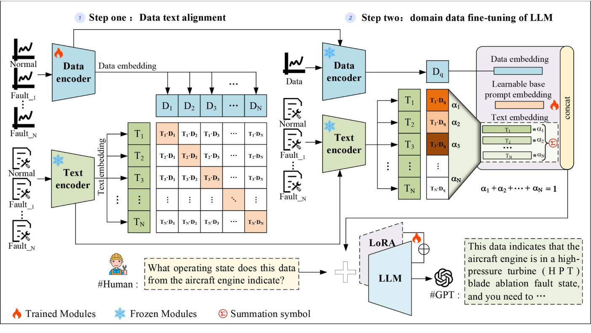

**Fig. 1.** The Architecture of FD-LLM. In this figure, “ ” indicates the modules that require training, while “ ” represents the modules that should be frozen and not updated during parameter optimization. The specific steps to freeze a module involve loading the pre-trained model, setting the gradient update attribute of the model’ s parameters to False to prevent updates during training, and finally, incorporating the frozen module as part of the overall framework, where it works in tandem with the trainable modules and others to optimize the entire system. 

into an embedding representation that the LLM can understand. Finetuning then activates the LLM’s powerful reasoning capabilities within the fault diagnosis domain. At this stage, we freeze the parameters of the data encoder, text encoder, and the LLM backbone network (denoted as “ ” in the figure) to prevent them from being updated during the LLM fine-tuning process. This strategy effectively improves training efficiency and reduces computational costs while avoiding the catastrophic forgetting of knowledge caused by large-scale updates of the LLM backbone model parameters. 

The effectiveness of the FD-LLM method is due to the following key designs: First, a data encoder is designed to embed the engineering timeseries data into features space to obtain the data embedding features. Besides, the pre-trained text encoder in LLM is used to encode the corresponding text description into the feature space to obtain the text embedding features. Then, the data and text embedding features are aligned in the feature space through a multimodal alignment operation to make the time-series data understood by LLM. Third, a fuzzy semantic embedding method is developed to address the problem of easy aliasing in the feature space of time-series data with similar patterns. Specifically, it employs the data encoder to obtain the data embedding features of the test sample. It matches them with the text embedding features of all known fault instances to obtain the categories probability set. The text embedding features of the test sample are obtained by the weight fusion of the text embedding features of all known fault instances. In addition, a learnable prompt embedding is introduced to represent unknown domain knowledge. Finally, data embedding features, learnable prompt embedding, and fuzzy semantic embedding are all fed into LLM for fault inference through fine-tuning. The method is described in detail below. 

##### _3.1. Data-Text encoding and alignment_ 

The success of MM-LLM methods such as X-LLM [49], Shikra [50], 

Qwen VL [51], and NExT GPT [52] has shown us that modal alignment is an effective way to activate LLM’s understanding and processing capabilities of other modalities besides text. We propose a method for aligning time-series engineering data with text to activate the understanding ability of large-scale time-series data modalities, including descriptive text generation, time-series data feature encoding, descriptive text feature encoding, and data text alignment training. 

**Descriptive Text Generation:** This paper draws upon methods such as WinCLIP [53] and AnomalyGPT [26], employing a strategy of combining prompt sets to generate representative descriptive texts for time-series engineering data, thus establishing a correlation between engineering data and natural language descriptions. Specifically, when constructing the descriptive text dataset, two key descriptive dimensions were considered: the attribute description dimension and the status description dimension. The attribute description dimension encompasses the source features of the engineering data, such as component name (e.g., bearing), load conditions, speed range, and installation location. The status description dimension includes the current operational state of the component, such as health or failure. In the event of a failure, it also includes specific fault details, such as fault location (e.g., inner race fault or rolling element fault) and fault severity (e.g., fault depth). 

As shown in Fig. 2, a complete description can be generated by inserting the attribute and status descriptions into a combined prompt template: “This {bearing} has a load of {X}, speed of {Y}, and is installed at location {Z}, currently experiencing {inner race fault} with a {fault depth of 0.007 in.}.” The descriptive text generated by this template provides a comprehensive reflection of the key features and status information of the engineering data, offering accurate and readable natural language support for analyzing equipment operational states and potential faults. Furthermore, the generated descriptive text and the original time-series engineering data form a set of data-text pairs. 

**Data Encoding:** We first performed preprocessing for engineering 

4 

> _L. Lin et al.                                                                                                                                                                                                                                       Advanced Engineering Informatics 65 (2025) 103208_ 

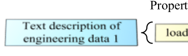

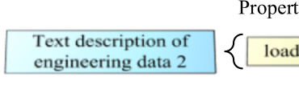

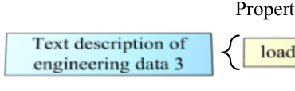

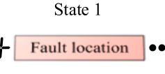

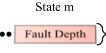

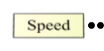

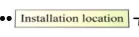

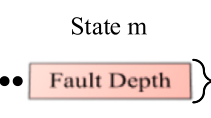

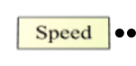

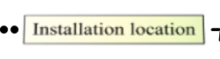

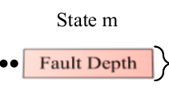

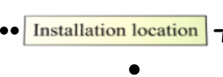

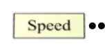

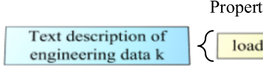

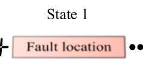

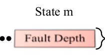

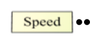

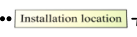

**Fig. 2.** Constructing descriptive text of engineering data. 

data, including maximum normalization and sliding window sampling. Engineering data is generally time-series data. Long Short-Term Memory Networks (LSTM) are an effective method for modeling time-series data as they can capture both long-term and short-term dependencies. Therefore, we use the LSTM model as the data encoder to extract engineering data embedding. 

The embedding process of descriptive text can be obtained by Eq. (1): 

_Di_ = _LSTM_ ( _di_ ) (1) 

where _di_ represents the _i_ − _th_ engineering data; _LSTM_ (⋅) represents the data encoder; _Di_ represents the obtained data embedding. Here, we set the embedding dimension of _LSTM_ (⋅) to be the same as that of LLM, both of which are R_D_ , for comparative learning. 

**Text Encoding:** To make the LLM better understand the data modality after data-text alignment training, we use the LLM pre-trained text 

encoder to process text embedding in data-text alignment. 

The embedding process of engineering data can be obtained by Eq. (2): 

##### _Ti_ = _LLME_ ( _ti_ ) (2) 

where _ti_ represents the _i_ − _th_ descriptive text; _LLME_ (⋅) represents the text encoder of the LLM; _Ti_ represents the obtained text embedding. 

**Data-text alignment:** The alignment process between data and text is shown in Fig. 3. The data encoder extracts the feature embedding of the raw data, and the LLM text encoder extracts the semantic representation information of the corresponding equipment under various operating states to obtain the semantic feature embedding. Freeze the text encoder, combine data features of the same category with semantic features to form a data-text pair, and train the data encoder through a contrastive learning method so that the extracted data feature 

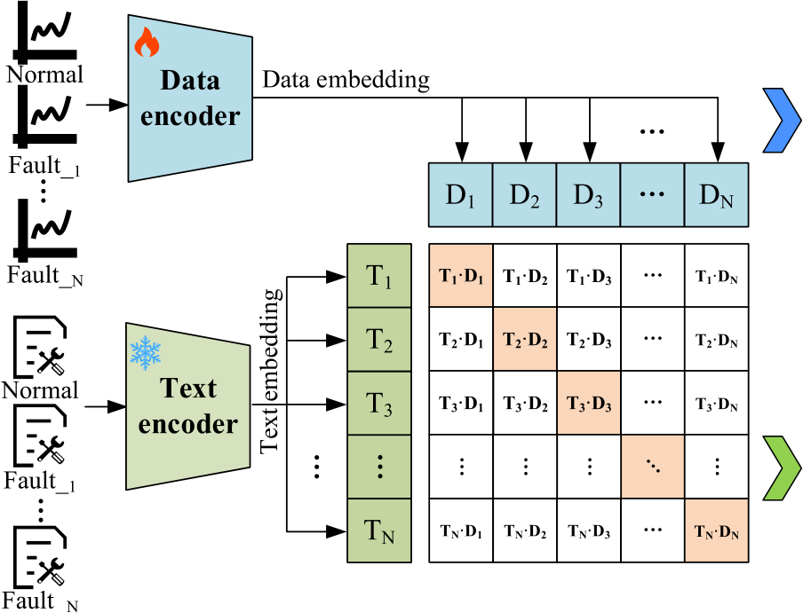

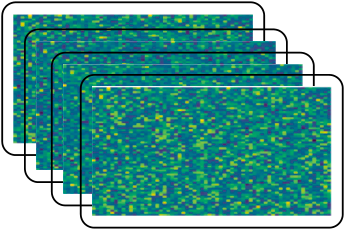

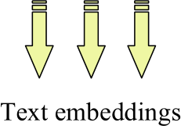

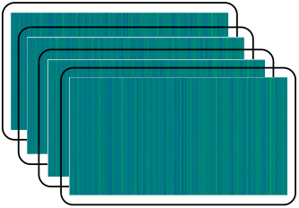

**Fig. 3.** Data text alignment. 

5 

_Advanced Engineering Informatics 65 (2025) 103208_ 

_L. Lin et al.                                                                                                                                                                                                                                       Advanced_ 

embedding aligns with the semantic feature embedding of the same category. We only updated the parameters of the data encoder, which reduced the high computational cost of the LLM text encoder parameter updates. 

Specifically, we combine engineering data with corresponding text descriptions of the same category to form positive sample pairs and engineering data with text descriptions of different categories to form negative sample pairs. We maximize the comparative loss _L_ ( _Ti, Di_ ) of negative sample pairs and minimize the comparative loss _L_ ( _Ti, Di_ ) of positive sample pairs to achieve alignment between data encoding and text encoding. We use cosine similarity to calculate the similarity between the two modalities of text encoding _Ti_ and data encoding _Di_ , as shown in Eq. (3): 

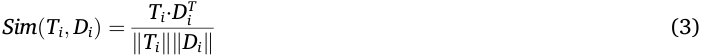

Then, we need to train two comparative loss functions. The first loss function is the comparative loss of the _i_ − _th_ text-to-data pair, as shown in Eq. (4): 

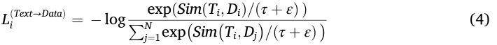

> Set initialization _τ_ to 0.07 and _ε_ to 1 × 10−6 . Similarly, the comparative loss of the _i_ - _th_ data-to-text pair, as shown in Eq. (5): 

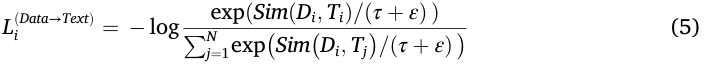

Finally, losses _L_( _i__Text_→_Data_) and _L_( _i__Data_→_Text_) are combined by calculating the mean, as shown in Eq. (6): 

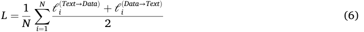

##### _3.2. Fuzzy semantic embedding and prompt learner_ 

**Fuzzy Semantic Embedding:** The engineering data collected by aircraft engine sensors may exhibit aliasing under certain fault conditions, where there is a similarity between the mapping of specific fault categories and data features. This similarity, which leads to the risk of misclassification, restricts the accuracy of current deep-learning models for fault diagnosis. After modality alignment training as described in 

Section 3.1, we obtain the feature embeddings of the test engineering data and the semantic feature embeddings of the fault description texts, together forming a shared feature embedding space. If we simply compute the similarity between data features and text semantic features and classify the engineering data according to the category corresponding to the most similar semantic feature, misclassification, as mentioned above, may occur. To address this limitation, this paper introduces fuzzy set theory [54] and proposes a fuzzy semantic embedding method, as illustrated in Fig. 4. By calculating spatial similarity, fuzzy weights are obtained, representing the membership degree of the test engineering data to each fault description category. Through a fuzzy embedding function, the final fuzzy semantic embedding is derived. Specifically, given a piece of engineering data _Dq_ that needs to be diagnosed and a set of text description information _T_ = { _Ti_ | _i_ = 1 _,_ 2 _, ..., N_ } containing various operating states of the equipment, we freeze the pre-trained data encoder and text encoder and perform feature embedding on engineering data and text, respectively. Calculate the cosine similarity _Sim_ ( _Ti, Dq_ ) between the test data embedding and each text embedding, and then perform softmax processing to obtain _α_ = { _αi_ | _i_ = 1 _,_ 2 _, ..., N_ }, which satisfies∑ _i__N_ =1_αi_=1, as shown in Eq. (7–8): 

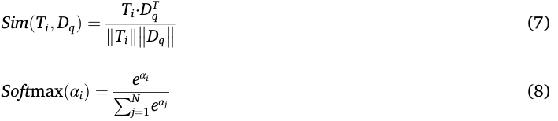

Fuzzy semantic embedding can be obtained by Eq. (9): 

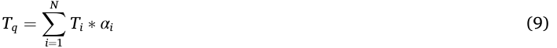

feature information of the corresponding category but also reflects the The resulting fuzzy semantic encoding _Tq_ not only encapsulates the degree of similarity to other categories through fuzzy weights. This design enables each sample to maintain a certain level of semantic association with multiple categories, thereby reducing the phenomenon of excessive clustering in the feature space. It allows the feature distribution to preserve category distinction while tolerating boundary ambiguity between patterns. Given the more complex structure, a larger number of hidden layers, and neuron parameters of LLMs, and after the large-scale pre-training, these models possess the ability to conduct complex reasoning by integrating contextual information. By combining 

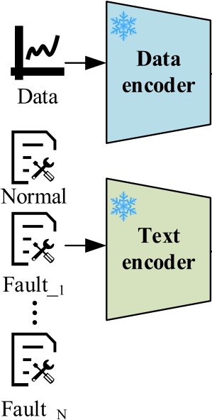

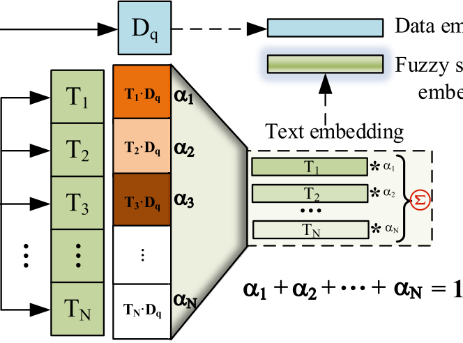

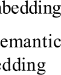

**Fig. 4.** Fuzzy semantic embedding. 

6 

> _L. Lin et al.                                                                                                                                                                                                                                       Advanced Engineering Informatics 65 (2025) 103208_ 

the feature embedding of engineering data with the fuzzy semantic embedding as input to the LLM, and fine-tuning the model, the LLM can infer the category of feature boundary samples based on this combined input. This approach reduces the classification uncertainty of ambiguous samples and significantly improves the accuracy of fault classification. Thus, our method overcomes the limitations of traditional hard classification methods in the presence of fuzzy category boundaries, making it better suited to handle the inherent uncertainty and overlap between categories in real-world engineering data. 

**Prompt Learner:** In FD-LLM, we have developed a prompt learner by integrating the prompt learning method, which combines the original engineering data encoding, fuzzy semantic encoding, and the introduced learnable prompt encoding as input for fine-tuning the LLM. The concept of prompt learning was initially proposed to transform complex tasks into forms comprehensible by pre-trained large models through the design of task-specific prompts. In this paper, we adopted two forms of prompt learning: continuous prompts and discrete prompts. 

Continuous prompts refer to the optimization of a set of learnable vectors in the model’s embedding space to represent prompt information. This form does not directly manifest as natural language but is implicitly encoded as vectors. In this paper, the learnable prompt embedding is represented by a randomly initialized parameter matrix, optimized through gradient descent and backpropagation during the Lora fine-tuning process of the LLM. It automatically learns to generate prompt information tailored to the specific task, thereby enhancing the model’s adaptability and reasoning performance. 

Discrete prompts, on the other hand, involve explicitly expressing task prompts in natural language. These prompts are either designed by humans or derived from existing knowledge. Their advantage lies in their interpretability, with natural language templates making them well-suited for direct input into pre-trained models. In this paper, the designed discrete prompt template includes identifiers, delimiters, engineering data feature embeddings, learnable prompt embeddings, fuzzy semantic embeddings, and diagnostic context-related query statements, as outlined below: 

Prompts fed to the LLM typically follow the format: ### Human: _<_ Data _>Edata<_ /Data _>Ebase_ ∼ _prompt<_ Fuzzy semantic _>Etext<_ /Fuzzy semantic _>_ What is the state of the aero-engine? ###Assistant: 

where _Edata_ ∈ R1×_Cemb_ represents the engineering data embedding, _Ebase_ ∼ _prompt_ ∈ R_n_1×_Cemb_ represents the learnable base prompt embedding, and _Etext_ ∈ R_n_2×_Cemb_ represents the fuzzy semantic embedding. 

By combining the strengths of both continuous and discrete prompts, the Prompt Learner in this paper is capable of automatically generating and optimizing prompt information based on task requirements when dealing with complex engineering data, providing adaptive training ’s input for fine-tuning the LLM. This approach enhances the LLM adaptability to the task and its reasoning performance, thereby improving the accuracy of fault diagnosis and classification. 

##### _3.3. Loss functions_ 

In fine-tuning LLM, this paper uses cross-entropy Loss as the loss function. Cross entropy loss is commonly used for training language models, quantifying the differences between the text sequence generated by the model and the target text sequence. The formula is as follows: 

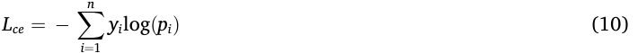

where _n_ is the number of tokens, _yi_ is the true label for token _i_ , _pi_ is the predicted probability for token _i_ . 

##### **4. Experiments** 

This section presents experiments conducted on the aircraft engine 

dataset, the CWRU bearing fault diagnosis dataset, and a rock drilling rig dataset, including two cases, to verify the effectiveness and generalization of the proposed method. In Case I, we performed comparative and ablation experiments using the aircraft engine dataset to validate the method’ s efficacy. The data set used, and the data preprocessing method in this study is introduced in detail in Section 4.1.1. Section 4.1.2 establishes evaluation indicators to evaluate the proposed method. Section 4.1.3 describes the details of the implementation of the model, including the specific structure and parameter design. Sections 4.1.4, 4.1.5, 4.1.6 and 4.1.7 conduct comparative experiments, mainly including ablation experiments and comparisons with other advanced methods. Case II involved comparative experiments using the CWRU bearing dataset and the rock drilling rig dataset, demonstrating the method’s generalization capability across different domains and equipment. The workstation CPU model used in the experiment is 13900_KF, the GPU model is RTX_4090, and the operating system is Linux-Ubuntu_0.22.04.3. In addition, all experiments use Python_3.9 and Torch_2.1.2 + CUDA_12.1 architecture. 

##### _4.1. Case I. Experiments on the aero-engine fault diagnosis dataset_ 

##### _4.1.1. Dataset description and preprocessing_ 

**_Dataset description:_** The aero-engine fault diagnosis data set is collected from Boeing series aero-engines, including different models such as CFM56-7B26 and GE90-115B [55]. As shown in Fig. 5, this type of aero-engine mainly consists of the fan, the low-pressure compressor (LPC), the high-pressure compressor (HPC), the combustion chamber (CC), the low-pressure turbine (LPT), and the high-pressure turbine (HPT). 

Further, the acquisition and conversion process of engine monitoring data is shown in Fig. 5. That is, gas path performance parameters such as exhaust gas temperature (EGT), fuel flow (FF), low-pressure rotor speed (N1), and high-pressure rotor speed (N2) can be measured and monitored through sensors installed in the low-pressure chamber (LPC), highpressure chamber (HPC), et al. The engine’s original manufacturer (OEM) uses the thrust setting value, environmental factors, and working condition information to convert the original monitored gas path parameters into baseline deviation values to monitor the performance status of the engine. According to the CNR fed back by the OEM to the airlines and combined with the literature [56], the OEM mainly uses the deviation value of the exhaust gas temperature (DEGT), the variation of the exhaust gas temperature margin (EGTM), the high-pressure rotor speed deviation value (DN2), and the fuel flow deviation value (DFF) to monitor the engine gas path performance. 

This paper organizes engine operation and maintenance data into an aero-engine fault diagnosis data set based on engine maintenance and CNR reports, which include EGT indication fault, TAT indication fault, and HPT blade ablation fault, as well as monitoring data obtained under normal conditions. Among them, each state’s data encompasses four gas path parameters: DEGT, EGTM, DN2, and DFF. This data has the characteristics of feature aliasing and difficulty in classification. Fig. 6 uses the currently most commonly used t-SNE method to visualize the data. It is easy to find that the spatial distribution of engine normal and fault data is complex, making it difficult to diagnose faults accurately. 

**_Data preprocessing_** : The aero-engine fault diagnosis data set is extracted from some airline maintenance reports in this paper. Different engine models have differences in the structure, system, design parameters, and performance characteristics. To minimize this difference, all OEM data in the experiment should come from engines of the same model. As the CFM56-7B engine is widely used in the airline industry, it was chosen as the research object. By analyzing and organizing the engine maintenance reports and CNR of the sample aircraft fleets, 200 EGT indication fault case samples, 200 TAT fault case samples, 200 HPT fault case samples, and 200 standard samples were obtained. The number of training samples accounts for 80 % of all samples, and the number of testing samples accounts for 20 %. Table 1 shows the gas path 

7 

> _L. Lin et al.                                                                                                                                                                                                                                       Advanced Engineering Informatics 65 (2025) 103208_ 

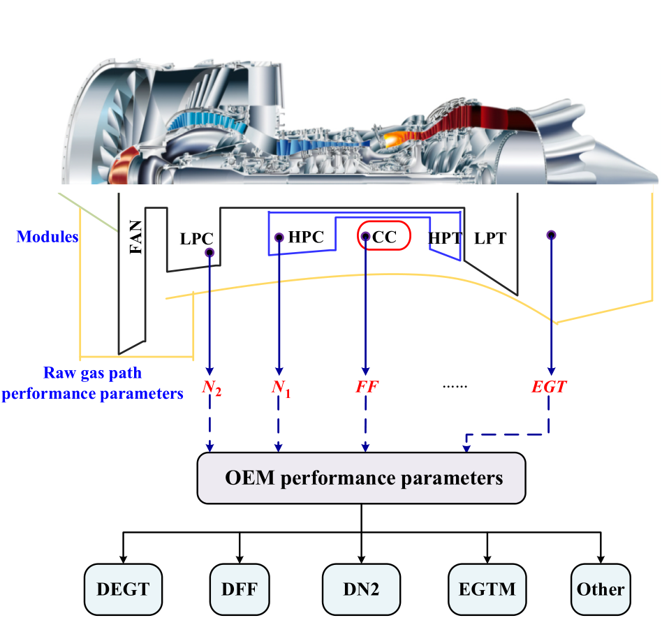

**Fig. 5.** Collecting and converting air path parameters for aero-engines [55]. 

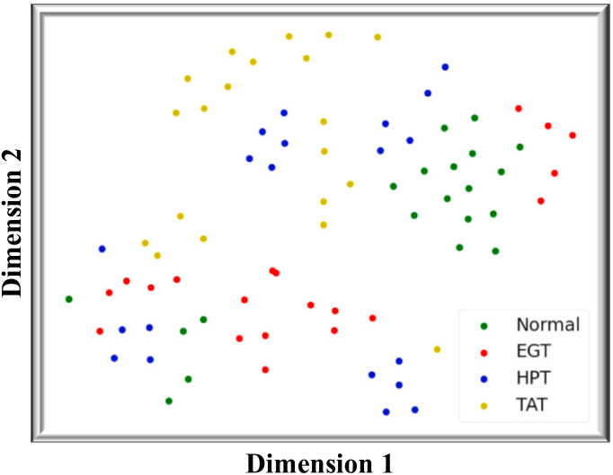

**Fig. 6.** Visualization of engine data. 

parameters for the first 100 cycles of an engine with an EGT indicator failure. 

Civil aero-engine flight parameters have different orders of magnitude, and the differences between orders of magnitude are significant. To eliminate the dimensional influence between parameters, the original flight parameters must be standardized and preprocessed to compare the sample parameters. This paper uses a Z-score to normalize the data, and the calculation formula is shown in Equation (11). 

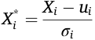

###### **Table 1** 

Examples of parameter changes when an aero-engine EGT failure occurs. 

|Cycle|Time|DEGT|DN2|DFF|EGTM|
|---|---|---|---|---|---|
|1|2014/11/30 3:56|99.6779|12.7493|−0.398|−1.7558|
|2|2014/11/30 8:16|102.0603|8.7797|−0.2833|−2.2861|
|3|2014/12/1 2:32|84.4916|9.077|−0.2147|−2.0031|
|4|2014/12/1 7:03|101.9956|10.9561|−0.5236|−1.2|
|5|2014/12/1 12:07|100.2962|9.9783|−0.3247|−2.0135|
|……|……|……|……|……|……|
|96|2014/12/15 9:50|76.4943|28.8405|−0.2122|−1.5522|
|97|2014/12/15 11:44|77.938|24.6006|−0.1159|−3.0177|
|98|2014/12/15 23:51|64.3597|12.6154|−0.5546|−0.9355|
|99|2014/12/16 3:43|101.6324|15.0015|−0.3937|−1.297|
|100|2014/12/16 8:44|70.5865|44.4396|−0.5554|−1.3208|

where _Xi_ represents the actual value of the _i_ -th gas path parameter of the sample data set; _ui_ represents the mean value of the _i_ -th gas path parameter of the sample data set; _σi_ represents the standard deviation of the _i_ -th gas path parameter of the sample data set. 

The above analysis of the aero-engine fault diagnosis data set shows that it is a typical multi-dimensional time series data. To better capture this sequence characteristic, this paper uses the sliding window method to extract samples, as shown in Fig. 7. And _n_ is the dimension of the engine data set if the length of the sliding window is _l_ and the step size of the sliding window is _s_ . After obtaining the data fragment of the current window, the sliding window will move forward _s_ steps. As the window slides forward in the time-series data, data fragments will continue to be generated. In this article, _l_ takes ten, and _s_ takes ten. 

##### _4.1.2. Evaluation metrics_ 

Based on existing research on fault diagnosis [57], this paper selects accuracy, precision, and F1 score as evaluation indicators. Accuracy 

(11) 

8 

_Advanced Engineering Informatics 65 (2025) 103208_ 

_L. Lin et al.                                                                                                                                                                                                                                       Advanced_ 

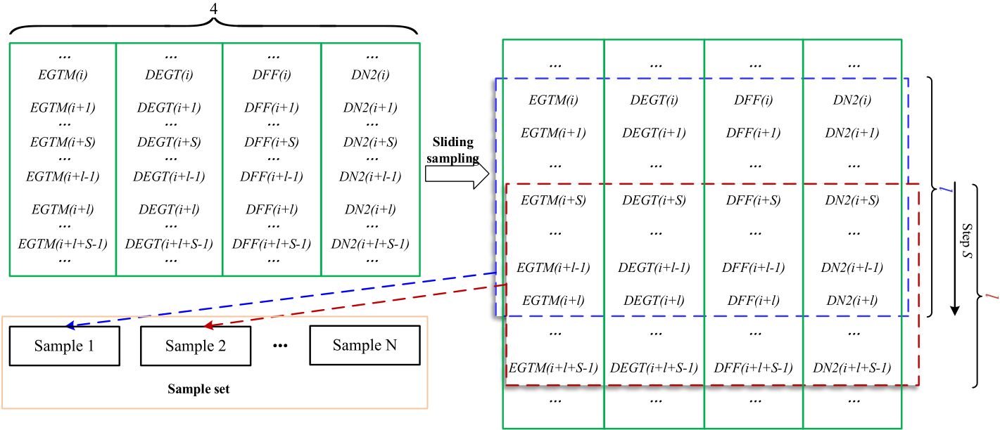

**Fig. 7.** Sliding window sample extraction. 

refers to the system’s ability to identify faults or issues correctly, usually expressed as a percentage. Precision refers to the proportion of faults recognized by the system that are genuinely faults. The F1 score is the weighted average of accuracy and recall, which can be used to comprehensively evaluate the system’s performance. Accuracy, precision, and F1 score can be obtained using the following equations: 

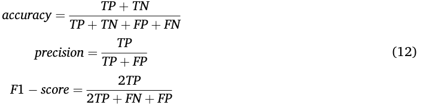

where TP, TN, FP, and FN represent true positive, true negative, false positive, and false negative, respectively. 

##### _4.1.3. Implementation details_ 

This study employs Vicuna-7B [48] as the base LLM. Vicuna-7B excels in dialogue generation, context understanding, and multi-turn interaction tasks, making it well-suited to meet the demands of our research. With a parameter scale of 7 billion, it strikes a balance between performance and computational efficiency, significantly reducing resource usage and training costs while being compatible with existing hardware environments. This model effectively balances capability with resource requirements. Furthermore, as an open-source model, Vicuna7B supports lightweight fine-tuning and benefits from extensive community resources and documentation, facilitating implementation and optimization. Given these advantages, Vicuna-7B is the ideal choice for this study. Further, the Vicuna-7B’s text encoder and a universal and feasible engineering data encoder are used for data-text alignment training. Since the text encoder of Vicuna-7B is pre-trained with a large amount of text data, we freeze the text encoder and only train the data encoder, which dramatically reduces the number of the training parameters, and the alignment results can be directly used as input to Vicuna-7B. In fine-tuning LLM, the text and data encoders are frozen simultaneously, and only prompt learners and the parameters specified in Lora are updated. The training was conducted on an RTX_4090 GPU, and the training time on both datasets introduced in the paper did not exceed six hours. The hyperparameter settings are listed in Table 2. 

###### **Table 2** 

Details of experimental hyperparameters (%). 

|Model hyperparameters|Lora hyperparameters|
|---|---|
|Epoch=50|r= 32|
|Learning rate=1e-3|Lora_alpha= 32|
|Batch size= 8|Lora_dropout=0.1|
|Max_length=1024|Target_modules= Q_proj|
|Warmup_rate=0.1|Target_modules= K_proj|
|Penalty_alpha= 0.6|Target_modules= V_proj|
|Top_k= 1024|Target_modules=O_proj|
|Top_p=0.7 |**\**|
|Random_prefx_len=5|**\**|
|Sample_num=2|**\**|
|Decoding_method=Sampling|**\**|

##### _4.1.4. Quantitative results_ 

We compare the proposed method (FD-LLM) with several advanced fault diagnosis methods. The compare models include CNN [58], Resnet18 [59], Transformer [60], SimCLR [61], Attention + LSTM [62], and Attention + GRU [63]. The hyperparameters of feature extractors, classifiers, et al. included in all comparison methods are consistent with those set in their paper. 

Each method undergoes ten repeated experiments to reduce the impact of randomness. The results for accuracy, precision, and F1 score are presented in Table 3. Our method is significantly superior to previous small parameter models, with a comprehensive lead in accuracy, precision, and F1 score. Among them, the classification method that directly uses CNN has the lowest accuracy; Reset introduces residual learning and trains deeper network layers by stacking residual blocks, resulting in better performance compared to CNN on our aero-engine fault diagnosis data set; The Transformer, Attention + LSTM, and 

###### **Table 3** 

Aero-engine gas circuit fault diagnosis experimental results (%). 

|Methods|Accuracy|Precision|F1 score|
|---|---|---|---|
|CNN[58]|66.25|66.17|63.79|
|Resnet18[59]|68.13|77.26|69.08|
|transformer[60]|76.25|80.79|75.66|
|SimCLR[61]|78.44|80.34|78.42|
|Attention-LSTM[62]|84.38|87.62|83.2|
|Attention-GRU[63]|84.38|87.25|83.98|
|_FD-LLM (ours)_|**_94.38_**|**_95.35_**|**_93.85_**|

9 

> _L. Lin et al.                                                                                                                                                                                                                                       Advanced Engineering Informatics 65 (2025) 103208_ 

Attention + GRU methods are specifically designed to handle sequential data. The introduced attention mechanism enables them to handle longdistance dependencies and focus on more important information. The experimental results show that these methods better classify engineering sequence data than CNN and Resnet. However, such methods are not ideal for highly aliased data in the feature space, as the number of parameters and the size of training parameters limit their potential. The SimCLR method effectively learns data representations through selfsupervised contrastive learning, which can obtain higher-quality embedded features but is also significantly affected by data quality. Our method aligns engineering data with semantic information through an effective contrastive learning method, utilizing fuzzy semantic embedding and the powerful reasoning ability of LLMs to solve the misclassification problem of highly aliased data effectively. Given the outstanding performance of FD-LLM on real aero-engine datasets, the model proposed in this paper is highly suitable for the fault diagnosis task of aero-engines. 

##### _4.1.5. Qualitative examples_ 

Figs. 8 and 9, respectively, show the results of our training on the aero-engine fault diagnosis data set and the CWRU-bearing fault diagnosis dataset. Our model can perform fuzzy semantic embedding on aliasing data, accurately determining whether there are abnormalities in the equipment and the types of faults under abnormal conditions based on the input engineering data. Users can participate in multiple rounds of dialogue related to subsequent maintenance recommendations. 

##### _4.1.6. Performance under different LLM backbones_ 

When fine-tuning large models for downstream tasks, performance, inference time, memory usage, and parameter scale are typically considered evaluation metrics for selecting the base LLM. The choice of base model can significantly influence the final performance. To quantify and analyze this impact, this section experiments with different LLM backbone models. We selected a range of models with parameter scales from hundreds of millions to billions, including BERT [64], GPT-2 [65], LLaMA-2 [66], BLOOM [67], GLM-3 [68], LLaMA-3 [69], Vicuna-7B, and Vicuna-13B, to comprehensively assess the effect of model scale on the proposed method. BERT is a Transformer-based bidirectional encoder model. GPT-2 is a Transformer-based autoregressive language model. LLaMA-2 and LLaMA-3 are a series of open-source large models released by Meta-AI. Among them, LLaMA-3, as a new version of LLaMA2, uses larger training data and a tokenizer with higher encoding efficiency. LLaMA-3(Light) is a quantized version of the LLaMA-3 model. 

Through eight-bit and four-bit quantization strategies, the parameter scale can be reduced to 3B while retaining a certain performance. BLOOM is an open-source multilingual model developed by the BigScience team. GLM-3 is a model jointly released by Zhiyuan AI and Tsinghua University’s KEG Lab. Vicuna-7B and Vicuna-13B were obtained by the Vicuna team by fine-tuning LLaMA using user-shared conversations collected from ShareGPT. 

The experimental results, shown in Table 4, reveal a clear improvement in model accuracy as the parameter scale increases. Among these models, BERT and GPT-2 yield relatively low accuracy as base models. As the parameter scale grows to 6-7B, LLaMA-2, BLOOM, GLM-3, LLaMA-3, and Vicuna-7B exhibit acceptable performance, demonstrating the reliability and generalizability of our method. Notably, LLaMA-3, benefiting from a more efficient encoding scheme, achieves significantly faster inference speeds. As the base model, LLaMA-3 slightly surpasses Vicuna-7B in F1 score, while Vicuna-7B holds a slight edge in Accuracy and Precision, outperforming by 1.34 % and 1.9 %, respectively. For Vicuna-13B, we applied quantization and mixed precision processing to run it on the RTX_4090 used in the experiments. Compared to Vicuna-7B, Vicuna-13B improves accuracy by 0.03 %, precision by 0.11 %, and F1 score by 0.12 % when used as the base model of our method. While the performance improvement was modest, the parameter scale, memory usage, and inference time nearly doubled. Therefore, considering performance, computational resources, and energy consumption, the performance evaluation of the proposed method in this paper primarily relies on the Vicuna-7B model as the base model. 

##### _4.1.7. Ablation studies_ 

Extensive ablation experiments were conducted on the aero-engine fault diagnosis data set to demonstrate the effectiveness of each module. We mainly focus on four aspects: Data-text alignment and fuzzy semantic embedding (DTA&FSE), prompt learner, using LLM for inference, and fine-tuning LLM using Lora. The main results are shown in Table 5 . It can be observed that LLM significantly improves the classification accuracy of data after DTA&FSE. In addition, Lora also played a significant role in fine-tuning LLM on vertical domain datasets. 

##### _4.2. Case 2. Cross-dataset generalization validation_ 

##### _4.2.1. Experiments on the CWRU dataset_ 

**_Dataset Description:_** The CWRU-bearing fault diagnosis dataset is a commonly used benchmark dataset in fault diagnosis [70]. As shown in 

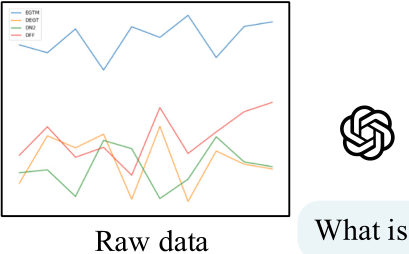

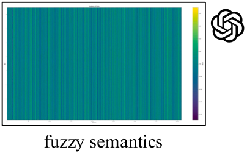

**Fig. 8.** Qualitative example of FD-LLM on aero-engine fault diagnosis data set. 

10 

> _L. Lin et al.                                                                                                                                                                                                                                       Advanced Engineering Informatics 65 (2025) 103208_ 

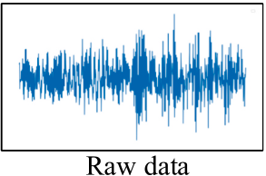

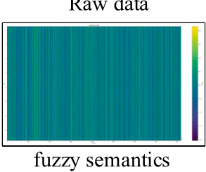

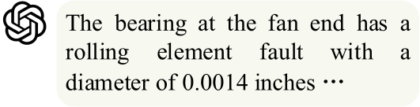

**Fig. 9.** Qualitative example of FD-LLM on CWRU-bearing fault diagnosis data set. 

**Table 4** 

Performance under different LLM backbones (%). 

|Backbone model|Params|Single inference time (50 tokens)|Memory usage(fp16)|Accuracy|Precision|F1 score|
|---|---|---|---|---|---|---|
|BERT[64]|340M|_<_50 ms|1.3 GB|39.47|41.25|38.63|
|GPT-2[65]|1.5B|_<_150 ms|3 GB|53.26|55.71|53.84|
|LlaMA-2[66]|7B|_<_0.5 s|14 GB|92.55|92.91|91.78|
|LlaMA-3(Light)[69]|3B|_<_0.2 s|6 GB|85.24|86.77|85.98|
|LlaMA-3[69]|8B|_<_0.4 s|16 GB|93.04|93.45|**93.86**|
|BLOOM[67]|7.1B|_<_1 s|14 GB|88.42|88.56|87.45|
|GLM-3[68]|6B|_<_0.6 s|12 GB|90.37|91.02|90.29|
|Vicuna-7B[48]|7B|_<_0.5 s|14 GB|**_94.38_**|**_95.35_**|**_93.85_**|
|Vicuna-13B[48]|13B|_<_1.4 s|26 GB|**_94.41_**|**_95.46_**|**_93.97_**|

###### **Table 5** 

Ablation experiments (%). 

|DTA&FSE|Prompt learner|LLM|Lora|Accuracy|Precision|F1 score|
|---|---|---|---|---|---|---|
|√ ||||76.3|77.58|75.2|
|√ ||√ ||89.4|89.25|90.04|
|√ |√|√ ||89.6|89.22|89.36|
|√ ||√ |√ |94.27|**_95.37_**|93.46|
|√|√|√|√|**_94.38_**|95.35|**_93.85_**|

Fig. 10, this dataset was collected from a rolling bearing fault diagnosis experimental platform consisting of a 1.5 kW (2 horsepower) motor, a torque sensor/decoder, a dynamometer, and an electronic controller. The data sampling points are from the drive and fan end, with a speed of 1797 r/min and a sampling frequency of 12 kHz. They simulate single- 

point fault bearings with the ball, inner, and outer raceways with a fault diameter of ranging from 0.007 to 0.021 in. 

Table 6 shows this paper selects data from 19 operating states, including one normal category, nine fan-end bearing fault categories, and nine motor-end bearing fault categories. The data preprocessing is the same as _Case I_ , with _l_ taking 1024 and _s_ taking 1024 for sliding window sampling, resulting in 150 samples per class. 

**_Experimental Results and Discussion:_** CNN [58], Resnet18 [59], Transformer [60], SimCLR [61], Attention + LSTM [62], and Attention + GRU [63] were used as comparison models for comparative experiments. The hyperparameters of feature extractors, classifiers, et al. included in all comparison methods are consistent with those set in their paper. Each method undergoes ten repeated experiments to reduce the impact of randomness. The accuracy, precision, and F1 score results are 

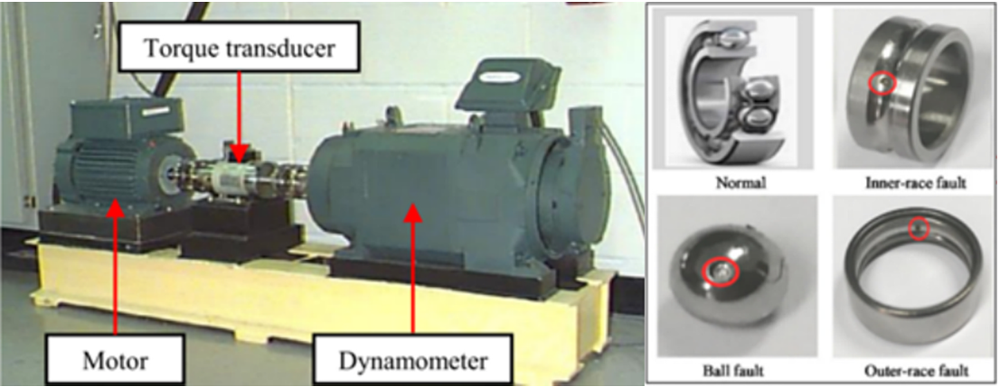

**Fig. 10.** Illustration of the test stand. Apparatus & Procedures | Case School of Engineering | Case Western Reserve University. 

11 

> _L. Lin et al.                                                                                                                                                                                                                                       Advanced Engineering Informatics 65 (2025) 103208_ 

###### **Table 6** 

Building the dataset. 

|Class number|Bearing Position|Fault Position|Fault Size (Inches)|
|---|---|---|---|
|0(Normal)|None|None|None|
|Fault-1|Fan end|Inner raceway|0.007|
|Fault-2|||0.014|
|Fault-3|||0.021|
|Fault-4||Roller|0.007|
|Fault-5|||0.014|
|Fault-6|||0.021|
|Fault-7||Outer raceway|0.007|
|Fault-8|||0.014|
|Fault-9|||0.021|
|Fault-10|Drive end|Inner raceway|0.007|
|Fault-11|||0.014|
|Fault-12|||0.021|
|Fault-13||Roller|0.007|
|Fault-14|||0.014|
|Fault-15|||0.021|
|Fault-16||Outer raceway|0.007|
|Fault-17|||0.014|
|Fault-18|||0.021|

displayed in Table 7. Our method is comprehensively ahead of the comparison method in terms of accuracy, precision, and F1 score. 

##### _4.2.2. Experiments on the rock drilling rig dataset_ 

**_Dataset Description:_** This section further validates the generalization capability of the proposed method using a publicly available rock drilling rig dataset [71]. As shown in Fig. 11, the data collection platform includes a rock drill, drill steel, hydraulic supply, sensors, and other components, simulating the scenario where the rock drill usually needs to perform high-performance operations in a harsh environment with vibration and humidity. By replacing, modifying, or removing parts to induce different faults, data variations were measured at three distinct locations: the inlet fitting, the outer chamber, and the volume behind the piston, at a frequency of 50 kHz. 

As shown in Table 8, the dataset contains 11 distinct categories, including ten fault categories and one normal category. Each category comprises data from 300 to 700 cycles collected from eight different test units. A cycle consists of a time series with a length of 556 to 748 sample points. In the experiments, all 11 categories were selected for classification testing, with 240 cycles chosen from each category as training samples and 60 cycles as testing samples. It is worth noting that the time series data in the dataset has already undergone normalization, so no further preprocessing is required, and the data can be directly used in our experiments. 

**_Experimental Results and Discussion:_** Table 9 presents the experimental results for six comparative methods and the proposed FD-LLM, using accuracy, precision, and F1 score as evaluation metrics. Each method was evaluated through ten repeated experiments to mitigate the impact of randomness. Our method outperforms the comparative methods in terms of accuracy, precision, and F1 score, achieving 99.89 %, 99.86 %, and 99.78 %, respectively. Compared to the second-best method, these results represent improvements of 3.53 %, 3.4 %, and 3.3 %, respectively. This further demonstrates the effectiveness and generalizability of our method for classifying time-series engineering 

###### **Table 7** 

CWRU bearing fault diagnosis experimental results (%). 

|Methods|Accuracy|Precision|F1 score|
|---|---|---|---|
|CNN[58]|90.06|91.99|89.32|
|Resnet18[59]|95.23|95.76|95.25|
|transformer[60]|97.31|97.53|97.31|
|SimCLR[61]|92.18|93.33|92.17|
|Attention-LSTM[62]|95.17|95.49|95.19|
|Attention-GRU[63]|95.61|95.86|95.61|
|**_FD-LLM (ours)_**|**_98.79_**|**_98.83_**|**_98.78_**|

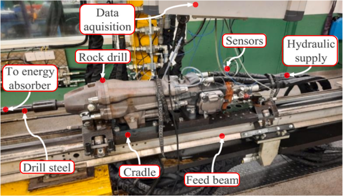

**Fig. 11.** The test setup used to collect data [71]. 

###### **Table 8** 

Overview of rock drilling rig dataset. 

|Label|Description|
|---|---|
|1|No-fault.|
|2|Thicker drill steel.|
|3|A-seal missing. Leakage from high-pressure channel to control channel.|
|4|B-seal missing. Leakage from the control channel to the return channel.|
|5|Return accumulator, damaged.|
|6|Longer drill steel. |
|7|The damper orifce is larger than usual. |
|8|Low fow to the damper circuit. |
|9| Valve damage. A small wear-fat on one of the valves lands. |
|10| The orifce on the control line outlet is larger than usual.|
|11| The charge level in high-pressure accumulators is low.|

###### **Table 9** 

Rock drilling rig fault diagnosis experimental results (%). 

|Methods|Accuracy|Precision|F1 score|
|---|---|---|---|
|CNN[58]|89.26|88.98|89.17|
|Resnet18[59]|94.05|93.62|94.43|
|transformer[60]|96.68|96.60|97.04|
|SimCLR[61]|92.34|93.18|92.75|
|Attention-LSTM[62]|96.22|95.92|95.37|
|Attention-GRU[63]|96.36|96.46|96.48|
|**_FD-LLM (ours)_**|**_99.89_**|**_99.86_**|**_99.78_**|

data. 

##### **5. Conclusions** 

This paper introduces a novel dialogue fault diagnosis multimodal large model FD-LLM to solve classification difficulties caused by timeseries data aliasing in complex mechanical equipment fault diagnosis tasks such as aero-engines. Firstly, we propose a data-text alignment method: embedding descriptive information through frozen LLM text encoders and training data encoders for feature embedding of engineering data through contrastive learning. Aligning data embedding with text embedding in the feature space unlocks the understanding and processing capabilities of LLM’s engineering data modality. Then, to better utilize the powerful logical reasoning ability of LLM, this paper proposes a dynamic fuzzy semantic embedding method, which can also have good classification performance for challenging to categorize samples with high overlap in the feature space. Finally, the Lora method was used to fine-tune the LLM for fault diagnosis, and good experimental results were achieved. The accuracy on the aero-engine dataset is 94.38 %, the precision is 95.35 %, and the F1 score is 93.85 %, which is 10 %, 8.1 %, and 9.87 % higher than the best-performing Attention GRU in the comparison method. On the CWRU bearing dataset, the accuracy is 98.79 %, the precision is 98.83 %, and the F1 score is 98.78 %. And on 

12 

> _L. Lin et al.                                                                                                                                                                                                                                       Advanced Engineering Informatics 65 (2025) 103208_ 

the rock drill dataset, the accuracy is 99.89 %, the precision is 99.86 %, and the F1 score is 99.78 %. Our work delves into the potential applications of multimodal large models in fault diagnosis of complex mechanical equipment such as aero-engines, providing new ideas and possibilities for industrial fault diagnosis. 

##### **CRediT authorship contribution statement** 

**Lin Lin:** Writing – review & editing, Funding acquisition, Conceptualization. **Sihao Zhang:** Writing – original draft, Validation, Methodology. **Song Fu:** Resources, Project administration, Formal analysis. **Yikun Liu:** Visualization, Data curation. 

##### **Declaration of competing interest** 

The authors declare that they have no known competing financial interests or personal relationships that could have appeared to influence the work reported in this paper. 

##### **Acknowledgements** 

The authors would like to thank the National Natural Science Foundation of China Key Support Project (No. U2133202), the National Natural Science Foundation of China (No. 52305570), the Fellowship of China Postdoctoral Science Foundation (2022 M720955), the Fellowship of Heilongjiang Province Postdoctoral Science Foundation (LBHZ22187), and the Outstanding Doctoral Dissertation Funding Project of Heilongjiang Province (LJYXL2022-011) for providing support for this paper. 

##### **Data availability** 

Data will be made available on request. 

##### **References** 

- [1] L. Chen, Z. Cai, Z. Jiang, J. Luo, L. Sun, P. Childs, H. Zuo, AskNatureNet: A divergent thinking tool based on bio-inspired design knowledge, Adv. Eng. Inf. 62 (2024) 102593. 

- [2] W.X. Zhao, K. Zhou, J. Li, T. Tang, X. Wang, Y. Hou, Y. Min, B. Zhang, J. Zhang, Z. Dong, Y. Du, C. Yang, Y. Chen, Z. Chen, J. Jiang, R. Ren, Y. Li, X. Tang, Z. Liu, P. Liu, J. Nie, J. Wen, A Survey of Large Language Models (2023). 

- [3] S. Yin, C. Fu, S. Zhao, K. Li, X. Sun, T. Xu, E. Chen, A Survey on Multimodal Large Language Models, Cornell University Library, arXiv.org, Ithaca, 2024. 

- [4] A. Dosovitskiy, L. Beyer, A. Kolesnikov, D. Weissenborn, X. Zhai, T. Unterthiner, M. Dehghani, M. Minderer, G. Heigold, S. Gelly, J. Uszkoreit, N. Houlsby, An image is worth 16x16 words, Transformers for Image Recognition at Scale (2021). 

- [5] A. Radford, J.W. Kim, C. Hallacy, A. Ramesh, G. Goh, S. Agarwal, G. Sastry, A. Askell, P. Mishkin, J. Clark, G. Krueger, I. Sutskever, Learning Transferable Visual Models From Natural Language Supervision, Cornell University Library, arXiv.org, Ithaca, 2021. 

- [6] J. Li, D. Li, S. Savarese, S. Hoi, BLIP-2: Bootstrapping Language-Image Pre-training with Frozen Image Encoders and Large Language Models, 2023. 

- [7] R. Girdhar, A. El-Nouby, Z. Liu, M. Singh, K.V. Alwala, A. Joulin, I. Misra, ImageBind: One Embedding Space to Bind Them All (2023). 

- [8] Y. Su, T. Lan, H. Li, J. Xu, Y. Wang, D. Cai, PandaGPT: One Model To InstructionFollow Them All, Cornell University Library, arXiv.org, Ithaca, 2023. 

- [9] A.J. Thirunavukarasu, D.S.J. Ting, K. Elangovan, L. Gutierrez, T.F. Tan, D.S. 

   - W. Ting, Large language models in medicine, Nat. Med. 29 (2023) 1930–1940. 

- [10] C. Deng, T. Zhang, Z. He, Y. Xu, Q. Chen, Y. Shi, L. Fu, W. Zhang, X. Wang, C. Zhou, 

   - Z. Lin, J. He, K2: A Foundation Language Model for Geoscience Knowledge 

   - Understanding and Utilization, Cornell University Library, arXiv.org, Ithaca, 2023. 

- [11] H. Xiong, S. Wang, Y. Zhu, Z. Zhao, Y. Liu, L. Huang, Q. Wang, D. Shen, DoctorGLM: Fine-tuning your Chinese Doctor is not a Herculean Task, Cornell University Library, arXiv.org, Ithaca, 2023. 

- [12] J. Cui, Z. Li, Y. Yang, B. Chen, Y. Li, ChatLaw: Open-Source Legal Large Language Model with Integrated External Knowledge Bases, Cornell University Library, arXiv.org, Ithaca, 2023. 

- [13] M. Cascella, J. Montomoli, V. Bellini, E. Bignami, Evaluating the feasibility of ChatGPT in healthcare: an analysis of multiple clinical and research scenarios, J. Med. Syst. 47 (2023). 

- [14] S. Zheng, K. Pan, J. Liu, Y. Chen, Empirical study on fine-tuning pre-trained large language models for fault diagnosis of complex systems, Reliab. Eng. Syst. Saf. 252 (2024) 110382. 

- [15] Z. Xu, J.H. Saleh, Machine learning for reliability engineering and safety applications: Review of current status and future opportunities, Reliab. Eng. Syst. Saf. 211 (2021) 107530. 

- [16] L. Lin, J. Wu, S. Fu, S. Zhang, C. Tong, L. Zu, Channel attention & temporal attention based temporal convolutional network: a dual attention framework for remaining useful life prediction of the aircraft engines, Adv. Eng. Inf. 60 (2024) 102372. 

- [17] X. Xia, X. Fu, S. Zhong, Z. Li, S. Fu, Z. Bai, X. Liu, A multi-agent convolution deep reinforcement learning network for aeroengine fleet maintenance strategy optimization, J. Manuf. Syst. 68 (2023) 410–425. 

- [18] M. Zhao, S. Zhong, X. Fu, B. Tang, M. Pecht, Deep residual shrinkage networks for fault diagnosis, IEEE Trans. Ind. Inf. 16 (2020) 4681–4690. 

- [19] S. Fu, L. Lin, Y. Wang, M. Zhao, F. Guo, S. Zhong, Y. Liu, High imbalance fault diagnosis of aviation hydraulic pump based on data augmentation via local wavelet similarity fusion, Mech. Syst. Sig. Process. 209 (2024) 111115. 

- [20] W. He, L. Lin, S. Fu, C. Tong, L. Zu, Differential contrast guidance for aeroengine fault diagnosis with limited data, J. Intell. Manuf. (2024) 2024. 

- [21] J. Wu, L. Lin, D. Liu, S. Fu, S. Suo, S. Zhang, Deep hierarchical sorting networks for fault diagnosis of aero-engines, Comput. Ind. 165 (2025) 104229. 

- [22] E. Zio, Prognostics and Health Management (PHM): Where are we and where do we (need to) go in theory and practice, Reliab. Eng. Syst. Saf. 218 (2022) 108119. 

- [23] S. Bai, J.Z. Kolter, V. Koltun, An Empirical Evaluation of Generic Convolutional and Recurrent Networks for Sequence Modeling, 2018. 

- [24] J. Chung, Ç.G.U. Lçehre, K. Cho, Y. Bengio, Empirical evaluation of gated recurrent neural networks on sequence modeling, ArXiv vol. abs/1412.3555 (2014). 

- [25] Z. Peng, Z. Guo, W. Huang, Y. Wang, L. Xie, J. Jiao, Q. Tian, Q. Ye, Conformer: local features coupling global representations for recognition and detection, IEEE Trans. Pattern Anal. Mach. Intell. 45 (2023) 9454–9468. 

- [26] Z. Gu, B. Zhu, G. Zhu, Y. Chen, M. Tang, J. Wang, AnomalyGPT: Detecting Industrial Anomalies Using Large Vision-Language Models, Cornell University Library, arXiv.org, Ithaca, 2023. 

[27] Z. Chu, S. Ni, Z. Wang, X. Feng, C. Li, X. Hu, R. Xu, M. Yang, W. Zhang, History, Development, and Principles of Large Language Models-an Introductory Survey (2024). 

- [28] J.A. Heredia Alvaro, J.G. Barreda, An advanced retrieval-augmented generation´ system for manufacturing quality control, Adv. Eng. Inf. 64 (2025) 103007. 

- [29] S. Wang, Y. Fan, S. Jin, P.T. Aninakwa, C. Fernandez, Improved anti-noise adaptive long short-term memory neural network modeling for the robust remaining useful life prediction of lithium-ion batteries, Reliab. Eng. Syst. Saf. 230 (2023) 108920. 

- [30] D. Zhu, J. Chen, X. Shen, X. Li, M. Elhoseiny, MiniGPT-4: Enhancing VisionLanguage Understanding with Advanced Large Language Models, 2023. 

[31] P. LIU, L. Qian, X. Zhao, B. Tao, Joint Knowledge Graph and Large Language Model for Fault Diagnosis and Its Application in Aviation Assembly, IEEE Transactions on Industrial Informatics, pp. 1-10. 

[32] T. Zhou, T. Han, E.L. Droguett, Towards trustworthy machine fault diagnosis: a probabilistic Bayesian deep learning framework, Reliab. Eng. Syst. Saf. 224 (2022) 108525. 

[33] C. Jian, Y. Peng, G. Mo, H. Chen, Open-set domain generalization for fault diagnosis through data augmentation and a dual-level weighted mechanism, Adv. Eng. Inf. 62 (2024) 102703. 

- [34] F. Jia, Y. Lei, L. Guo, J. Lin, S. Xing, A neural network constructed by deep learning technique and its application to intelligent fault diagnosis of machines, Neurocomputing 272 (2018) 619–628. 

- [35] C. Zhang, C.L.P. Chen, M. Gan, L. Chen, Predictive deep boltzmann machine for multiperiod wind speed forecasting, IEEE Trans. Sustainable Energy 6 (2015) 1416–1425. 

- [36] J. Liu, F. Qu, X. Hong, H. Zhang, A small-sample wind turbine fault detection method with synthetic fault data using generative adversarial nets, IEEE Trans. Ind. Inf. 15 (2019) 3877–3888. 

- [37] R. Yang, M. Huang, Q. Lu, M. Zhong, Rotating Machinery Fault Diagnosis Using Long-short-term Memory Recurrent Neural Network, IFAC-PapersOnLine 51 (2018) 228–232. 

- [38] Y. Zhang, F. Li, D. Chang, VR rehabilitation system evaluator: a fNIRS-based and LLM-enabled evaluation paradigm for Mild Cognitive Impairment, Adv. Eng. Inf. 62 (2024) 102734. 

- [39] Y. Li, S. Ma, X. Wang, S. Huang, C. Jiang, H. Zheng, P. Xie, F. Huang, Y. Jiang, EcomGPT: Instruction-Tuning Large Language Models with Chain-of-Task Tasks for E-Commerce (2023). 

- [40] S. Zhang, L. Dong, X. Li, S. Zhang, X. Sun, S. Wang, J. Li, R. Hu, T. Zhang, F. Wu, G. Wang, Instruction Tuning for Large Language Models: A Survey, Cornell University Library, arXiv.org, Ithaca, 2024. 

- [41] N. Houlsby, A. Giurgiu, S. Jastrzebski, B. Morrone, Q. de Laroussilhe, A. Gesmundo, M. Attariyan, S. Gelly, Parameter-Efficient Transfer Learning for NLP, Cornell University Library, arXiv.org, Ithaca, 2019. 

- [42] B. Lester, R. Al-Rfou, N. Constant, The Power of Scale for Parameter-Efficient Prompt Tuning, Cornell University Library, arXiv.org, Ithaca, 2021. 

- [43] X.L. Li, P. Liang, Prefix-Tuning: Optimizing Continuous Prompts for Generation, Cornell University Library, arXiv.org, Ithaca, 2021. 

- [44] X. Liu, Y. Zheng, Z. Du, M. Ding, Y. Qian, Z. Yang, J. Tang, GPT understands, too, AI Open (2023). 

- [45] J. E. Hu, Y. Shen, P. Wallis, Z. Allen-Zhu, Y. Li, S. Wang, W. Chen, LoRA: Low-rank adaptation of large language models, ArXiv, vol. abs/2106.09685, 2021. 

- [46] Q. Zhang, M. Chen, A. W. Bukharin, N. Karampatziakis, P. He, Y. Cheng, W. Chen, T. Zhao, AdaLoRA: adaptive budget allocation for parameter-efficient fine-tuning, 2023. 

13 

- [47] Y. Wang, W. Zhong, L. Li, F. Mi, X. Zeng, W. Huang, L. Shang, X. Jiang, Q. Liu, Aligning Large Language Models with Human: A Survey, Cornell University Library, arXiv.org, Ithaca, 2023. 

- [48] B. Ji, VicunaNER: Zero/Few-shot Named Entity Recognition using Vicuna, 2023. 

- [49] F. Chen, M. Han, H. Zhao, Q. Zhang, J. Shi, S. Xu, B. Xu, X-LLM: Bootstrapping Advanced Large Language Models by Treating Multi-Modalities as Foreign Languages, 2023. 

- [50] K. Chen, Z. Zhang, W. Zeng, R. Zhang, F. Zhu, R. Zhao, Shikra: Unleashing Multimodal LLM’s Referential Dialogue Magic (2023). 

- [51] J. Bai, S. Bai, S. Yang, S. Wang, S. Tan, P. Wang, J. Lin, C. Zhou, J. Zhou, Qwen-VL: A Versatile Vision-Language Model for Understanding, Text Reading, and Beyond, Localization, 2023. 

- [52] S. Wu, H. Fei, L. Qu, W. Ji, T. Chua, NExT-GPT: Any-to-Any Multimodal LLM, 2023. [53] J. Jeong, Y. Zou, T. Kim, D. Zhang, A. Ravichandran, O. Dabeer, WinCLIP: Zero-/ few-Shot Anomaly Classification and Segmentation (2023). 

- [54] X. Zhang, D. Tian, Q. Ren, M. Li, Y. Shen, S. Han, A hybrid deep semantic mining method considering fuzzy expressions for the automatic recognition of construction safety hazard information, Adv. Eng. Inf. 61 (2024) 102507. 

- [55] L. Lin, W. He, S. Fu, C. Tong, L. Zu, Novel aeroengine fault diagnosis method based on feature amplification, Eng. Appl. Artif. Intel. 122 (2023) 106093. 

- [56] Z. Li, S. Zhong, L. Lin, Novel gas turbine fault diagnosis method based on performance deviation model, J. Propul. Power 33 (2016), pp. 1–10, 0012-1-12. 

- [57] Q. He, S. Li, C. Li, J. Zhang, A. Zhang, P. Zhou, A hybrid matching network for fault diagnosis under different working conditions with limited data, Comput. Intell. Neurosci. 2022 (2022) 1–14. 

- [58] D. Ruan, J. Wang, J. Yan, C. Gühmann, CNN parameter design based on fault signal analysis and its application in bearing fault diagnosis, Adv. Eng. Informat. 55 (2023) 101877. 

_Advanced Engineering Informatics 65 (2025) 103208_ 

- [59] K. He, X. Zhang, S. Ren, J. Sun, Deep Residual Learning for Image Recognition (2015). 

- [60] A. Vaswani, N. Shazeer, N. Parmar, J. Uszkoreit, L. Jones, A.N. Gomez, L. Kaiser, I. Polosukhin, Attention Is All You Need (2023). 

- [61] T. Chen, S. Kornblith, M. Norouzi, G. Hinton, A Simple Framework for Contrastive Learning of Visual Representations, 2020. 

- [62] X. Cheng, K. Lv, Y. Zhang, L. Wang, W. Zhao, G. Liu, J. Qiu, RUL prediction method for electrical connectors with intermittent faults based on an attention-LSTM model, IEEE Trans. Compon. Packag. Manuf. Technol. 13 (2023) 628–637. 

- [63] R. Lin, H. Wang, M. Xiong, Z. Hou, C. Che, Attention-based Gate Recurrent Unit for remaining useful life prediction in prognostics, Appl. Soft Comput. 143 (2023) 110419. 

- [64] J. Devlin, M. Chang, K. Lee, K. Toutanova, BERT: Pre-training of Deep Bidirectional Transformers for Language Understanding, 2019. 

- [65] A. Radford, J. Wu, R. Child, D. Luan, D. Amodei, I. Sutskever, Language Models Are Unsupervised Multitask Learners (2019). 

- [66] H. Touvron, L. Martin, K. Stone, P. Albert, Y. Babaei, Llama 2, Open Foundation and Fine-Tuned Chat Models (2023). 

- [67] B. Workshop, T. Le Scao, A. Fan, C. Akiki, E. Pavlick, S. Ili´c, Bloom: a 176BParameter Open-Access Multilingual Language Model (2023). 

- [68] T. GLM, A. Zeng, B. Xu, B. Wang,C. Zhang, ChatGLM: A Family of Large Language Models from GLM-130B to GLM-4 All Tools, 2024. 

- [69] A. Grattafiori, A. Dubey, A. Jauhri, The Llama 3 Herd of Models (2024). 

- [70] W.A. Smith, R.B. Randall, Rolling element bearing diagnostics using the Case Western Reserve University data: A benchmark study, Mech. Syst. Sig. Process. 

   - 64–65 (2015) 100–131. 

- [71] E. Jakobsson, E. Frisk, R. Pettersson, M. Krysander, A Dataset for Fault Classification in Rock Drills, a Fast Oscillating Hydraulic System, 2022. 

14 

