# S2S-FDD: Bridging Industrial Time Series and Natural Language for Explainable Zero-shot Fault Diagnosis 

1st Baoxue Li 

_1. State Key Laboratory of Industrial Control Technology, College of Control Science and Engineering Zhejiang University_ Hangzhou, China 

2nd Chunhui Zhao* 

_1. State Key Laboratory of Industrial Control Technology, College of Control Science and Engineering Zhejiang University_ 

_2. School of Information and Electrical Engineering, Zhejiang University City College_ Hangzhou, China chhzhao@zju.edu.cn 

**_Abstract_ —Fault diagnosis is critical for the safe operation of industrial systems. Conventional diagnosis models typically produce abstract outputs such as anomaly scores or fault categories, failing to answer critical operational questions like “Why” or “How to repair”. While large language models (LLMs) offer strong generalization and reasoning abilities, their training on discrete textual corpora creates a semantic gap when processing high-dimensional, temporal industrial signals. To address this challenge, we propose a Signals-to-Semantics fault diagnosis (S2S-FDD) framework that bridges high-dimensional sensor signals with natural language semantics through two key innovations: We first design a Signal-to-Semantic operator to convert abstract time-series signals into natural language summaries, capturing trends, periodicity, and deviations. Based on the descriptions, we design a multi-turn tree-structured diagnosis method to perform fault diagnosis by referencing historical maintenance documents and dynamically querying additional signals. The framework further supports human-inthe-loop feedback for continuous refinement. Experiments on the multiphase flow process show the feasibility and effectiveness of the proposed method for explainable zero-shot fault diagnosis.** **_Index Terms_ —Fault diagnosis, large language models, zeroshot, temporal description** 

## I. INTRODUCTION 

Fault diagnosis is essential to ensuring the safe and stable operation of industrial processes [1]. With the advancement of sensing technologies in modern industry, massive operational data can now be collected, paving the way for data-driven approaches [2]. These methods can identify abnormal patterns directly from historical data, enabling the monitoring and diagnosis of complex systems that are difficult to model analytically. 

Over the past decades, both multivariate statistical methods and deep learning techniques have seen success in this 

This work is supported by the Zhejiang Key Research and Development Project (2024C01163), the National Natural Science Foundation of China (No. 62125306), the National Natural Science Foundation of China (No. 62450020), the State Key Laboratory of Industrial Control Technology, China (ICT2025C01), and the Open Research Project of the State Key Laboratory of Industrial Control Technology, China (ICT2025B27). 

field. Statistical methods such as Fisher Discriminant Analysis (FDA) [3], Support Vector Machines (SVM) [4], and Bayesian Networks [5] have laid a solid foundation. More recently, deep learning models, particularly Convolutional Neural Networks (CNNs) [6] and Transformers [7], have pushed the boundaries of fault detection [8]. Given the scarcity of fault samples in industrial environments, researchers have explored few-shot learning [9] and transfer learning [10] to improve diagnosis performance. In parallel, the demand for interpretability in industrial settings has led to the development of explainable diagnosis algorithms [11]. Despite these advancements, most existing approaches still require fault data during training. Feng [12] introduced the concept of zero-shot fault diagnosis and provided a theoretical framework for its feasibility. This method leverages attribute transfer to recognize unseen faults while improving interpretability through the generation of attribute vectors during prediction. Therefore, zero-shot fault diagnosis has recently emerged as a promising direction [13]. However, conventional diagnosis models typically produce abstract outputs such as anomaly scores or fault categories without answering critical questions like “Why is this abnormal?” or “How should we repair it?” 

The rise of large language models (LLMs) has brought transformative progress across various domains [14]. These models exhibit strong comprehension and generalization capabilities, offering a potential path toward zero-shot and interpretable fault diagnosis [15], [16]. However, they have not yet achieved the same level of success in industrial applications. One major obstacle lies in the nature of industrial data—highdimensional, abstract, and temporal—which poses challenges to current large models primarily trained on discrete, tokenbased textual corpora. Unlike natural language, time-series data are continuous and dynamic, making them difficult to discretize or encode in ways that language models can effectively interpret [17]. In addition to temporal understanding, conventional models often lack domain-specific knowledge of industrial processes [18], raising concerns about the reliability 

and stability of their outputs in real-world diagnosis tasks. 

To address these challenges, we propose a Signals-toSemantics (S2S) framework for industrial fault diagnosis that can operate without any fault data. Our approach is capable of interpreting abstract time-series signals and producing reliable diagnosis results by leveraging historical maintenance records. Central to our design is a reconstruction-based S2S operator that enables the model to assess deviations between current and baseline (normal) signals. This operator transforms numerical time-series inputs into natural language descriptions with trends, periodicity, and deviations in industrial terms. 

Building on these textual representations, we design a multiturn tree-structured diagnosis method powered by LLMs. The method can retrieve relevant historical maintenance documents, perform iterative reasoning, and dynamically request additional sensor measurements to address input information gaps. More importantly, the framework supports human-in-theloop feedback, allowing experts to refine the reasoning process and establish a closed-loop optimization system. 

The contributions of our work are summarized as follows. 

- 1) We identify a fundamental challenge in intelligent industrial maintenance: the semantic gap between industrial time-series data and natural language understanding. To address this, we propose a Signals to Semantics (S2S) framework, translating sensor data into semantically rich descriptions by leveraging LLMs. 

- 2) To bridge the gap between continuous time-series signals and natural language understanding, we design a Signals-to-Semantics operator that converts raw sensor data into domain-aware natural language summaries, capturing trends, periodicity, and deviations. 

- 3) We propose a multi-turn tree-structured diagnosis method based on LLMs. Leveraging textual time-series descriptions, the method achieves zero-shot fault diagnosis and analysis. It also supports dynamic reasoning updates based on operator feedback, forming a humanin-the-loop adaptive diagnosis loop. 

## II. METHOD 

In this section, the details of the proposed S2S framework are presented. It contains two key components, including the S2S operator and multi-turn tree-structured diagnosis method. The former converts raw sensor data into concise and domainaware natural language summaries, bridging the gap between continuous time-series signals and natural language understanding. Based on the descriptions, the latter retrieves relevant historical maintenance documents and conducts zero-shot fault diagnosis. 

## _A. The Signals to Semantics operator_ 

In order to better obtain an accurate tim description, we introduce an S2S operator. This operator is essentially a reconstruction module that satisfies the logic of the specialist to determine the faults, i.e., to compare them with the normal values. This comparison helps the LLM to output a more reliable and targeted description. 

For an industrial system with _m_ measurement points (e.g., temperature, pressure), the sample collected at time _i_ is denoted as **W** _i_ = [ _x_ 1( _i_ ) _, x_ 2( _i_ ) _, . . . , xm_ ( _i_ )]_T_ _∈_ R_m×_1 . Temporal data under normal operating conditions are collected to construct a feature matrix **W** _∈_ R_m×L_ , where _L_ is the length of the time series. To characterize typical temporal patterns, _n_ representative samples are selected via the following steps: (1). Cluster the _L_ time-series samples into _n_ clusters using K-means clustering. (2). Calculate the geometric centroid for each cluster. (3). Select the sample closest to each centroid as a representative sample, which is then aggregated into a state matrix: 

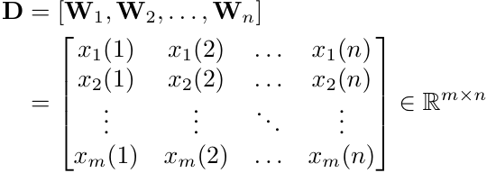

This matrix represents _n_ typical temporal patterns of the system under normal operation. 

For an online input sample **W** in _∈_ R_m×_1 , a weight vector **_ω_** _∈_ R_n×_1 is computed to represent **W** in as a linear combination of the normal temporal patterns in **D** . The weight vector is derived via: 

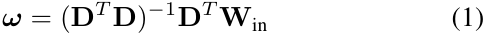

where ( _·_ )_−_1 denotes matrix inversion. This formula can be derived from least squares regression directly. The input sample is reconstructed as **W** out = **D** **_ω_** . A large reconstruction residual RES = **W** in _−_ **W** out indicates a potential fault. 

Given test data **X** and its reconstruction residual **R** , both are segmented into baseline and fault portions using the fault start time _t_ start and end time _t_ end (provided by the monitoring system with allowable deviations): 

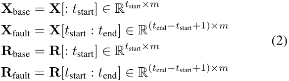

The average baseline reconstruction error is: 

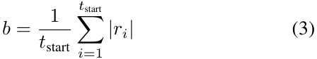

For each variable _j_ , the absolute residual in the fault segment is _dj_ = _|_ **R** fault[: _, j_ ] _|_ , and the anomaly threshold is _τj_ = _α · bj_ , where _α_ is a pre-set coefficient and _bj_ is the baseline residual for variable _j_ . 

An anomaly indicator function identifies faulty time points: 

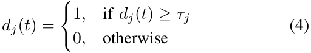

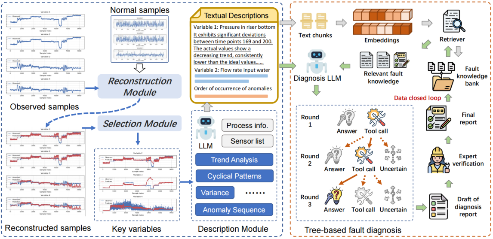

Fig. 1. Overview of the proposed S2S framework. It contains two key components, including the S2S operator and multi-turn tree-structured diagnosis method. The former converts raw sensor data into concise and domain-aware natural language summaries. Based on the descriptions, the latter retrieves relevant historical maintenance documents and conducts zero-shot fault diagnosis. 

A fault is confirmed if the indicator remains 1 for a consecutive window of length _W_ . The earliest fault occurrence time for variable _j_ is: 

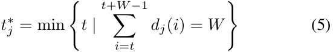

The anomaly score for variable _j_ is: 

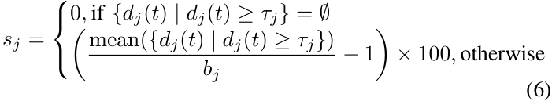

Candidate variables are selected by top _n_ 1 anomaly scores ( _S_ 1) and top _n_ 2 earliest fault times ( _S_ 2), forming _S_ = _S_ 1 _∪S_ 2. Final selection uses variance comparison: 

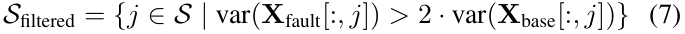

For any target variable _j ∈ S_ filtered, there exists a corresponding data table Table _j_ . The measured values, reconstructed values, reconstruction errors, and reconstruction error percentages of the target variables obtained in _S_ filtered with length _tend − tstart_ are organized into tabular form. The final constructed temporal description prompt can be seen in Table I. 

In the prompt, [PROCESS_INFO] denotes the textual description of the background and principles of the industrial process, [ALL_SENSORS] denotes all the measurement points of the industrial object, i.e., the variable information, [TARGET_SENSOR] denotes the target measurement point, i.e., the target variable in _S_ filtered, and [TABLE] denotes the target variable corresponding to the data table Table _j_ . 

The integrated prompt is input into the large language model, which will sequentially generate temporal textual descriptions _Di_ for all target variables ( _i_ = 1 _,_ 2 _,_ 3 _, . . . , p_ ), where _p_ = _|S_ filtered _|_ denotes the total number of target variables. 

## _B. Multi-turn tree-structured diagnosis method_ 

In this part, the details of multi-turn tree-structured diagnosis method are introduced. This part includes two important aspects: how to retrieve relevant knowledge from the historical knowledge base, and how to combine the retrieved knowledge for diagnosis. 

First, fault knowledge base from diagnosis records and expert experience is encoded into embeddings **e** _j_ = Embedder( _Kj_ ), where _Kj_ are fault records. LLM-generated descriptions _Di_ are also embedded ( **d** _i_ ), and their cosine similarity with **e** _j_ is computed: 

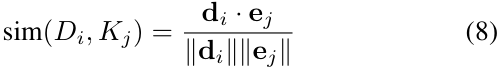

Fault records _Ktarget_ with similarity above a threshold are included in LLM prompts to activate reasoning. Notably, a chunking operation is performed before encoding each report _Kj_ , and after recalling a particular chunk, the corresponding full report is retrieved. 

Then, the fault diagnosis prompt is constructed based on textual descriptions of industrial processes, sensor measurement point information, relevant fault descriptions _Ktarget_ , and temporal textual descriptions of target variables _Di_ , and the prompt is fed into the LLM for the fault diagnosis. The prompt can be seen in Table I. If the LLM feels that the textual information for given variables is not sufficient to infer a fault, a function calling is made to retrieve information about variables that the LLM believes may be useful for fault diagnosis. Therefore, the diagnosis process is a treebased structure as shown in the right part of Fig. 1. Notably, the results of the funtion calling will be appended into the massages and the model will be prompted to continue the diagnosis, allowing it to output the <uncertain> mode in addition to the <answer> and <tool> modes. The output 

### TABLE I 

### PROMPT TEMPLATES 

#### **Prompt Template for Temporal Description** 

|Your task is to describe the deviation between the measured value and the ideal normal value of a measurement point, focusing on trends, periodic patterns, volatility, and key anomalies.|
|---|
|_•_ Industrial process: [PROCESS_INFO] _•_ All measurement points: [ALL_SENSORS] _•_ Target measurement point: [TARGET_SENSOR] _•_ Data table: [TABLE] (measured value, ideal normal value, deviation, and time-varying deviation percentage, along with the average deviation and deviation percentage under normal conditions)|
|Only focus on time intervals where the deviation or deviation percentage signifcantly exceeds that under normal conditions, as these intervals indicate possible faults. Ignore periods with deviation close to normal. For signifcantly deviated periods, describe:|
|1) The trend of the measured value (increasing, decreasing, stable, or cyclically fuctuating) 2) Whether the measured value is above or below the ideal value|
|If no signifcant deviation is observed, state that the variable has no obvious abnormality. Provide both quantitative indicators (time intervals) and qualitative insights, focusing on observable patterns. Avoid speculating on root causes. Do not use subheadings or Markdown syntax. Keep the response concise—no more than 100 words.|
|**Prompt Template for Fault Diagnosis**|
|You are an expert in fault diagnosis for industrial processes. Your task is to analyze the following information to identify potential faults: _•_ Industrial Process: [PROCESS_INFO] _•_ Measurement Points (List of available sensors): [ALL_SENSORS] _•_ Fault Knowledge (Known faults and their characteristics): [FAULT_KNOWLEDGE] _•_ Time-Series Observations: [TIME_DESP] (Deviation = Measured - Predicted)|
|Follow these steps:|
|1) Identify Key Sensors: Determine which sensors show signifcant deviations from expected values. 2) Cross-Reference with Fault Knowledge: Compare the observed patterns with known fault characteristics to hypothesize possible faults. Please note that sometimes different faults may exhibit similar patterns in certain variables. So, do not rely solely on the provided fault knowledge; you should combine fault causes and process workfow to reasonably infer the trends of different variables. 3) Check data suffciency:|
|_•_ If the time series observations provide enough information to identify the fault, output the fault number in the following format:<reasoning>...</reasoning> and <answer>...</answer> _•_ If the time series observations are insuffcient or critical variables are missing, use the ‘get target table‘ tool to query detailed data for specifc sensors. Ensure the sensor name exists in the Measurement Points before querying. Output the tool call in the following format:<tool>get_target_table("SENSOR")</tool>|
|Important Notes:|
|_•_ Prioritize sensors listed in [ALL_SENSORS] _•_ Only call get_target_table when necessary: **–** When time series observations are insuffcient to determine the fault|
|**–** When critical variables for fault diagnosis are missing from the observations|

of the LLM is reviewed by several votes, and the fault type with the most votes is selected as the final result, while the inference process of the LLM output is used as the judgment basis. The whole process can be found in Algorithm 1. 

Moreover, the results of the model diagnosis can be further organized to output a fault diagnosis report, which can be incorporated into the knowledge base for future retrieval after dedicated expert verification. This constitutes a human-in-theloop closure and knowledge iteration. 

## _C. Theoretical Analysis of Fault Detectability_ 

The proposed reconstruction module leverages the linear representation of normal temporal patterns to distinguish between healthy and faulty operations. Below, we provide a theoretical theorem to analyze the fault detectability. 

## **Theorem 1 (Residual Energy Bound and Detectability).** 

Let the state matrix **D** _∈_ R_m×n_ span a subspace M _⊂_ R_m_ with _σ_ min( **D** ) denoting its minimum singular value. For a faulty sample **W** fault = **D** **_ω_** + **_δ_** , the residual energy satisfies: 

where **_δ_** _⊥_ is the orthogonal projection of **_δ_** onto M_⊥_ , _θ_ is the principal angle between **_δ_** and M, and _σ_ max( **D** ) is the maximum singular value of **D** . 

**Proof.** The residual is the orthogonal projection of **_δ_** : 

By the definition of principal angles in Euclidean space: 

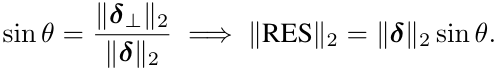

According to standard results in subspace perturbation theory, the sine of the principal angle between a vector **_δ_** and the subspace M satisfies: 

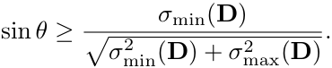

Therefore, we obtain the residual energy lower bound: 

This completes the proof. ■ 

## III. EXPERIMENTS 

In this section, the performance of the proposed TSA-ILLM is evaluated on the multiphase flow process. The multiphase flow facility at Cranfield University is designed to provide a controlled and measured flow rate of water, oil, and air to a pressurized system [19]. It can be supplied with a single phase of air, water, and oil, or a mixture of those fluids at certain 

**Algorithm 1** The S2S Framework For Fault Diagnosis 

|1:|**Initialization**:|
|---|---|
|2:|Set the maximum retry count as _R_max.|
|3:|Set the retry counter as _r ←_0.|
|4:|Set the message list as _M ←{_User Input_}_.|
|5:|**Main Loop**:|
|6:|**while** _r < R_max **do**|
|7:|**Chat with LLM**:|
|8:|Obtain model response **R**_←_Model(_M_).|
|9:|Extract response content **R**content, update message list: _M ←M ∪_ _{_**R**_}_.|
|10:|**Check Response Pattern**:|
|11:|**if R**content contains <answer> **then**|
|12:|Extract fault _f ←_Extract(**R**content_,_<answer>).|
|13:|Store result: Result_←f_, exit loop.|
|14:|**else if R**content contains <tool> **then**|
|15:|Parse function calling: _T ←_Parse(**R**content_,_<tool>).|
|16:|Validate function calling legality: _T_valid _←{t ∈T |_Validate(_t_)_}_.|
|17:|Execute function calling and obtain results:_R_tool _←{_Execute(_t_)_|_ |
||_t ∈T_valid_}_.|
|18:|Construct tool result prompt: **P**_←_ConstructPrompt(_R_tool).|
|19:|Update message list: _M ←M ∪{_**P**_}_, continue loop.|
|20:|**else if R**content contains <uncertain> **then**|
|21:|Extract possible fault number list: _F_ _←_|
||Extract(**R**content_,_<uncertain>).|
|22:|Store result: Result_←F_, exit loop.|
|23:|**else**|
|24:|_r ←r_+ 1.|
|25:|**end if**|
|26:|**end while**|
|27:|**Termination Condition**:|
|28:|**if** _r_ =_R_max **then**|
|29:|Output “Maximum retry count reached” and set default result:|
||Result_←_0.|
|30:|**end if**|

rates. The sketch of the multiphase flow process is shown in Fig. 2. 

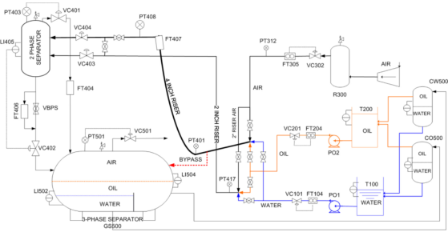

Fig. 2. Sketch of the multiphase flow process. 

## _A. Experimental setup_ 

We conducted experiments on both LLMs and reasoning LLMs. Qwen2.5-7B, 72B, Deepseek-V3 were selected in the non-reasoning LLMs. DeepSeek-R1-Distill-Qwen7B, DeepSeek-R1-Distill-Qwen-32B, QwQ-32B, DeepSeekR1 were selected in the reasoning LLMs. 

The multiphase flow process includes six fault types. In this paper, five fault types are chosen and the fault 4 is excluded. Fault 4 is simulating a leak at the bottom of the riser by opening direct bypass. Since the bottom of the riser is not really leaking, there is no reduction in flow through the entire system, and some of the variable curves 

do not behave exactly like the leak. Therefore, we removed this fault. 500 normal samples are used to construct the state matrix. For information that needs to be filled in the prompts, such as [PROCESS_INFO], [ALL_SENSORS], and [FAULT_KNOWLEDGE] are extracted from the paper [19]. 

A total of 13 cases were evaluated with fault 1 (case 1- case 3), fault 2 (case 4-case 6), fault 3 (case 7-case 9), fault 5 (case 10-case 11), and fault 6 (case 12-case 13). Each case was reasoned 5 times and the final diagnosis result was voted to obtain and calculate the accuracy. 

## _B. Comparison of diagnosis accuracy_ 

### TABLE III 

DIAGNOSIS RESULTS OF THREE LLMS UNDER CASE 4 

**Results of** **<u>Qwen2.5-7B-Instruct</u>** <reasoning> Based on the significant deviations in the sensors and the known fault characteristics, the most likely fault is **Fault Type 1 (Air Line Blockage)**, as the deviations in PT312 and PT401 align with the expected behavior of a blockage in the air line. </reasoning> <answer>1</answer> **Results of DeepSeek-R1-Distill-Qwen-7B** 

**Step-by-Step Analysis:** 1. **Identify Key Sensors**: The significant deviations in air and water flow rates, along with pressure changes, were observed in sensors like PT312, PT401, PT408, FT305, FT104, and FT406. 

2. **Cross-Reference with Fault Knowledge**: The observed trends in decreasing air and water flow rates, along with pressure decreases, matched the expected behavior of a water line blockage (Fault Type 2). 

3. **Determine Data Sufficiency**: The data from key sensors provided enough information to infer the fault, without needing additional data retrieval. **Conclusion:** 

The most probable fault is **Fault Type 2: water line blockage**. <answer>2</answer> 

|**Results of Deepseek-R1**|
|---|

<reasoning> 1. **Key Sensor Deviations**: - **Air Delivery Pressure (PT312)**: Decreasing trend (158-200), lower than ideal. - **Flow Rate Input Air (FT305)**: Higher than ideal (5-24, 37-200), inconsistent with a blocked air line. 

- **Flow Rate Input Water (FT104)**: Drops to zero (156-185) despite VC101 valve 

- opening more (156-200 deviation). - **Pressure in Riser (PT401/PT408)**: Decreasing trends, likely due to reduced water flow affecting mixture density. - **Position of VC101**: Increasing beyond ideal values, indicating attempts to compensate for restricted water flow. 

2. **Cross-Reference with Fault Knowledge**: 

- **Fault 1 (Air Line Blockage)**: Contradicted by FT305 (air flow rate increasing). 

- A blocked air line would reduce FT305 readings. 

- **Fault 2 (Water Line Blockage)**: Matches FT104 (water flow drops to zero) and 

- VC101 (valve opens more to compensate). Physical blockage downstream of VC101 explains these trends. 

- **Fault 3 (Top Separator Blockage)**: Inconsistent with FT406 (output flow 

- increases sharply). A blocked input would reduce output flow. - **Fault 5 (Slugging)**: No oscillatory pressure/flow patterns described in observations. 

- **Fault 6 (2” Line Pressurization)**: Requires PT417 data, which is not analyzed 

- here. Primary deviations align with water blockage. 

3. **Conclusion**: The simultaneous drop in water flow (FT104) and overcompensation by VC101 (opening beyond normal) strongly indicate a water line blockage (Fault 2). The air system deviations (PT312, FT305) are secondary effects or unrelated to the primary fault. </reasoning> <answer>2</answer> 

The results can be found in Table II. The following conclusions can be drawn. First, the proposed method is effective and can achieve up to 76.92% accuracy with only 500 normal samples without any faulty sample training. Second, the performance of the inferential macromodel is generally higher than that of the normal macromodel, which indicates that for fault diagnosis tasks, the inferential macromodel is 

TABLE II 

COMPARISON OF DIFFERENT METHODS 

|**Methods**|**Case 1 **|**Case 2 **|**Case 3**|**Case 4 **|**Case 5 **|**Case 6**|**Case 7 **|**Case 8 **|**Case 9**|**Case 10 **|**Case 11**|**Case 12 **|**Case 13**|**ACC@5**|
|---|---|---|---|---|---|---|---|---|---|---|---|---|---|---|
|Qwen2.5-7B-Instruct|1|1|1|0|0|0|0|0|0|0|0|0|0|23.08%|
|Qwen2.5-72B-Instruct|0|1|1|0|1|1|0|0|0|0|0|0|0|30.77%|
|DeepSeek-V3|0|1|1|0|1|0|0|0|0|0|0|0|0|23.08%|
|DeepSeek-R1-Distill-Qwen-7B|1|1|1|1|1|1|0|0|0|0|1|0|1|61.54%|
|DeepSeek-R1-Distill-Qwen-32B|1|0|1|0|1|1|1|0|0|1|0|0|1|53.85%|
|QwQ-32B|1|1|1|1|1|1|1|0|0|0|0|0|1|61.54%|
|DeepSeek-R1|1|1|1|1|1|1|1|1|0|0|0|1|1|76.92%|

more competent. Finally, for inference LLMs, larger model parameters result in higher accuracy. 

Here we select Case 4 for analysis. We focus on analyzing qwen2.5-7B, DeepSeek-R1-Distill-Qwen-7B, and DeepSeekR1. The former two are compared considering that they are the same model architecture and number of parameters, but the latter possesses reasoning capabilities. DeepSeek-R1 is introduced to compare with the second one to show how the number of parameters changes the performance of the reasoning LLMs. 

The related results can be seen in Table III. For the nonreasoning Qwen2.5-7B, its output was short and got the wrong answer. It mentioned PT312 as the reason for fault 1. If it were fault 1, the value of PT312 would be taken up, but it actually tends to go down. For the DeepSeek-R1-Distill-Qwen7B, it gave the correct answer and mentioned that no additional tool calls need to be made. But its reasoning process was rather sketchy. For the Deepseek-R1, it not only got the right answer, but also gave an analysis for excluding other faults. In particular, fault 1, it mentioned that the FT305 (air flow rate) raise conflicts with the air flow blockage. 

## IV. CONCLUSION 

This study addresses the critical challenge of bridging the semantic gap between industrial time-series data and natural language understanding for explainable zero-shot fault diagnosis. For the first time, we formally define the industrial time-series description task and propose a Signalsto-Semantics (S2S) framework to realize temporal-semantic alignment through a S2S operator and a multi-turn treestructured diagnosis method based on LLMs. The S2S operator successfully converts raw sensor data into concise and domain-aware natural language descriptions, including trends, periodicity, and deviations. Experiments are conducted on the multiphase flow process to show the feasibility and effectiveness. The proposed framework can achieve 76.92% diagnosis accuracy with 500 normal samples and without any fault data. This work pioneers a new frontier in industrial AI, where temporal-semantic alignment transforms raw signals into explainable dialogues. 

## REFERENCES 

   - [2] J. Chen and C. Zhao, “Addressing Information Asymmetry: Deep Temporal Causality Discovery for Mixed Time Series,” _IEEE Trans. Pattern Anal. Mach. Intell._ , 2025, doi: 10.1109/TPAMI.2025.3553957. 

   - [3] L. H. Chiang, M. E. Kotanchek, and A. K. Kordon, “Fault diagnosis based on Fisher discriminant analysis and support vector machines,” _Comput. Chem. Eng._ , vol. 28, no. 8, pp. 1389–1401, Jul. 2004. 

   - [4] F. Deng, S. Guo, R. Zhou, and J. Chen, “Sensor multifault diagnosis with improved support vector machines,” _IEEE Trans. Autom. Sci. Eng._ , vol. 14, no. 2, pp. 1053–1063 Apr. 2017. 

   - [5] B. Cai, L. Huang, and M. Xie, “Bayesian Networks in Fault Diagnosis,” _IEEE Trans. Ind. Informat._ , vol. 13, no. 5, pp. 2227–2240, Oct. 2017. 

   - [6] V. Sinitsin, O. Ibryaeva, V. Sakovskaya, and V. Eremeeva, “Intelligent bearing fault diagnosis method combining mixed input and hybrid CNNMLP model,” _Mech. Syst. Signal Process._ , vol. 180, p. 109454, Nov. 2022. 

   - [7] Y. Ding, M. Jia, Q. Miao, and Y. Cao, “A novel time–frequency Transformer based on self–attention mechanism and its application in fault diagnosis of rolling bearings,” _Mech. Syst. Signal Process._ , vol. 168, p. 108616, Apr. 2022. 

   - [8] C. Zhao, “Perspectives on nonstationary process monitoring in the era of industrial artificial intelligence,” _J. Process Control_ , vol. 116, pp. 255–272, Aug. 2022. 

   - [9] H. Wang, J. Wang, Y. Zhao, Q. Liu, M. Liu, and W. Shen, “Few-Shot Learning for Fault Diagnosis With a Dual Graph Neural Network,” _IEEE Trans. Ind. Inform._ , vol. 19, no. 2, pp. 1559–1568, Feb. 2023. 

   - [10] L. Guo, Y. Lei, S. Xing, T. Yan, and N. Li, “Deep convolutional transfer learning network: A new method for intelligent fault diagnosis of machines with unlabeled data,” _IEEE Trans. Ind. Electron._ , vol. 66, no. 9, pp. 7316–7325, Sep. 2019. 

   - [11] K. Jang, K. E. S. Pilario, N. Lee, I. Moon, and J. Na, “Explainable Artificial Intelligence for Fault Diagnosis of Industrial Processes,” _IEEE Trans. Ind. Inform._ , vol. 21, no. 1, pp. 4–11, Jan. 2025. 

   - [12] L. Feng and C. Zhao, “Fault description-based attribute transfer for zerosample industrial fault diagnosis,” _IEEE Trans. Ind. Informat._ , vol. 17, no. 3, pp. 1852–1862, Mar. 2021. 

   - [13] J. Yue, J. Zhao, and C. Zhao, “Similarity Makes Difference: SSHTN for Generalized Zero-Shot Industrial Fault Diagnosis by Leveraging Auxiliary Set,” _IEEE Trans. Ind. Inf._ , vol. 20, no. 5, pp. 7598-7607, May 2024. 

   - [14] Y. Chang et al., “A Survey on Evaluation of Large Language Models,” _ACM Trans. Intell. Syst. Technol._ , vol. 15, no. 3, p. 39:1-39:45, Mar. 2024. 

   - [15] L. Tao, H. Liu, G. Ning, W. Cao, B. Huang, and C. Lu, “LLM-based framework for bearing fault diagnosis,” _Mech. Syst. Signal Process._ , vol. 224, p. 112127, Feb. 2025. 

   - [16] B. Li and C. Zhao, “Federated Zero-Shot Industrial Fault Diagnosis With Cloud-Shared Semantic Knowledge Base,” _IEEE Internet Things J._ , vol. 10, no. 13, pp. 11619–11630, Jul. 2023. 

   - [17] M. Jin et al., “Time-LLM: Time Series Forecasting by Reprogramming Large Language Models,” in _Proc. Int. Conf. Learn. Represent._ , 2024. 

   - [18] P. Liu, L. Qian, X. Zhao, and B. Tao, “Joint Knowledge Graph and Large Language Model for Fault Diagnosis and Its Application in Aviation Assembly,” _IEEE Trans. Ind. Inf._ , vol. 20, no. 6, pp. 8160–8169, Jun. 2024. 

   - [19] C. Ruiz-C´arcel, Y. Cao, D. Mba, L. Lao, and R. T. Samuel, “Statistical process monitoring of a multiphase flow facility,” _Control Eng. Pract._ , vol. 42, pp. 74–88, Sep. 2015. 

- [1] R. Isermann, “Supervision, fault-detection and fault-diagnosis methods — An introduction,” _Control Eng. Pract._ , vol. 5, no. 5, pp. 639–652, May 1997. 

