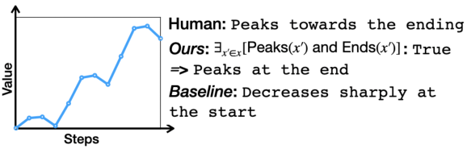
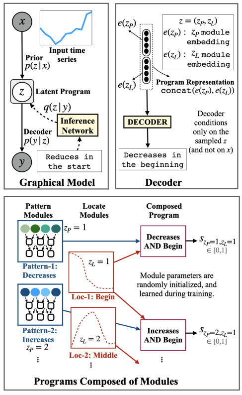
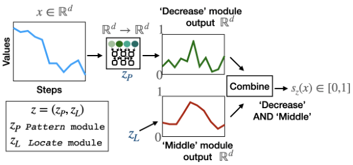
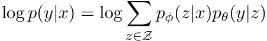
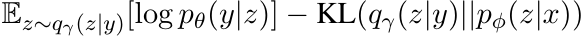
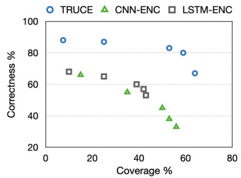
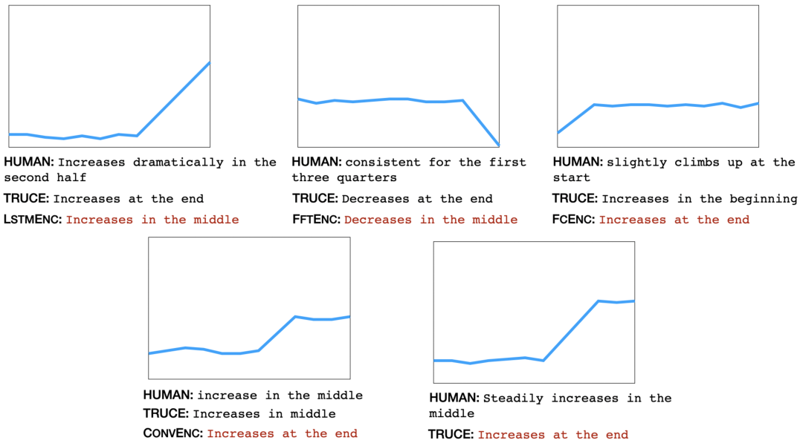
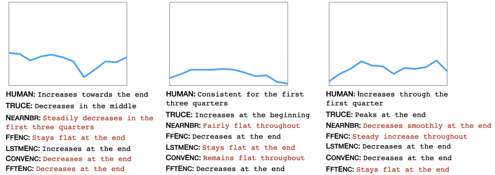
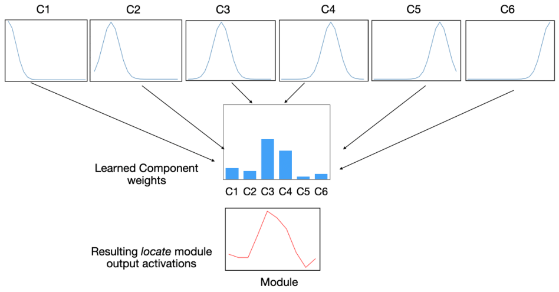

# **Truth-Conditional Captioning of Time Series Data** 

**Harsh Jhamtani** School of Computer Science Carnegie Mellon University jharsh@cs.cmu.edu 

**Taylor Berg-Kirkpatrick** Computer Science and Engineering University of California San Diego tberg@ucsd.eng.edu 

## **Abstract** 

In this paper, we explore the task of automatically generating natural language descriptions of salient patterns in a time series, such as stock prices of a company over a week. A model for this task should be able to extract high-level patterns such as presence of a peak or a dip. While typical contemporary neural models with attention mechanisms can generate fluent output descriptions for this task, they often generate factually incorrect descriptions. We propose a computational model with a truth-conditional architecture which first runs small learned programs on the input time series, then identifies the programs/patterns which hold true for the given input, and finally conditions on _only_ the chosen valid program (rather than the input time series) to generate the output text description. A program in our model is constructed from modules, which are small neural networks that are designed to capture numerical patterns and temporal information. The modules are shared across multiple programs, enabling compositionality as well as efficient learning of module parameters. The modules, as well as the composition of the modules, are unobserved in data, and we learn them in an end-to-end fashion with the only training signal coming from the accompanying natural language text descriptions. We find that the proposed model is able to generate high-precision captions even though we consider a small and simple space of module types. 

## **1 Introduction** 

There has been a large interest in generating automatic text description (McKeown, 1992) of tabular data – for example, prior work has sought to generate biographies from tables of biographical information (Lebret et al., 2016), and generating descriptions from structured meaning representations (Gardent et al., 2017). However, in many of these tasks, the main focus is on designing systems that are able to _select entries_ from tabular or 

Figure 1: We propose a neural truth-conditional model for high precision and diverse time series caption generation. 

equivalent data during generation by using neural attention mechanisms. In many naturally occurring descriptions of tabular data, humans often refer to higher-level patterns, for example in the description of stock index pricing over the week in Fig. 1, the speaker refers to how the stock price peaks towards the ending. Some recent work has looked into setups that require non-trivial inference (Wiseman et al., 2017; Chen et al., 2020). However, they typically don’t involve inference about numerical patterns in time series data. Moreover, much recent prior work on identifying more complex patterns in data for captioning has relied on deep neural networks, often employing neural encoders and attention mechanisms. However, such approaches often fail to generate faithful responses and lack interpretability (Tian et al., 2019; Dhingra et al., 2019; Parikh et al., 2020). 

We present a novel neural truth-conditional model for time series captioning, which learns to identify patterns that hold true for the input time series (Figure 2). We first sample a latent program from the space of learned neural operators. Each program produces a soft truth-value. Then, with probability proportional to each program’s truth-value, a language decoder generates a caption. Thus, programs that yield low truth values, do not produce captions. Critically, the decoder takes _an encoding of the program itself_ , rather than the time series, in order to determine output text. Overall, this approach allows for both: (a) precision in generated output through explicit truth conditioning, and explicit program structure as a representation 

Figure 2: Method Overview: We present a truth-conditional model for time series captioning, which first identifies patterns (composed of simpler modules) that hold true for a given data point. Decoder conditions only on a sampled program _z_ (and not on input _x_ ), generating high precision outputs. 

of time series trends, and (b) diversity in caption generation through the sampling process. 

While some of the patterns in data are complex, they can be considered to have been constructed by composing simpler concepts such as slope (rate of change of value) or comparisons (between values at give points). As such, our programs are constructed by composing simpler operations/modules. Such a modular design enables sharing of modules across multiple programs, leading to more data efficient learning of module parameters, and also providing better generalization to unseen compositions of modules. We consider a relatively simple space of three module types, using which our model is able to capture a significant fraction of the patterns present in data. The module types could be expanded in future to capture more complex patterns. Our model treats the choice of composed computation graph of programs as a latent variable, learned using natural language descriptions as the only supervision. In this respect, our approach is related to neural module networks used in Andreas et al. (2016a,b), which condition on a question to generate a program, which then operates on an image or other data to predict an answer. In our case, the con- 

Figure 3: A program _z_ = ( _zP , zL_ ) operates on an input time series _x_ to given final output score _sz_ ( _x_ ). The module instances are learned from scratch during training. 

structed computation graph operates and identifies salient patterns in the source data directly, without being guided by an input question. 

Our main contributions are as follows: We propose a novel method for time series captioning which first induces useful patterns via composing simpler modules, identifies the programs which hold true, and finally generates text describing the selected program. Towards this end, we collect and release two datasets consisting of time series data with accompanying English language description of salient patterns. We observe that the proposed method is able to learn useful patterns, exhibits compositionality and interpretability, and generates outputs that are much more faithful to the input compared to strong traditional neural baselines.1 

## **2 Truth-Conditional Natural Language Description** 

Our goal is to learn models for describing salient patterns in time series data. The main research challenge involved is to learn the types of patterns that humans find salient in time series data, using natural language descriptions as the only source of supervision during training. Based on the novel dataset we collect (described in Section 4 , we find that the patterns humans identify tend to describe increasing or decreasing trends, volatility, comparisons of start and end values, presence of peaks and dips. They also mention the temporal location of patterns, such as ‘at the beginning’ of the time series. Thus, our model should be able to learn patterns such as ‘increase’ or ‘ends with higher value compared to start’, and temporal aspects such as ‘begin’ or ‘end’. 

One way to operationalize this process is through the lens of formal logic: e.g. an increasing trend at the beginning of a time series _x_ can be represented 

> 1Data and code can be found at https://github. com/harsh19/TRUCE. 

trough the logic _z_ : � _∃i_ s.t. INCREASE( _xi_ ) AND BEGIN( _i_ ) � Thereafter, if the program returns true on the input, one can condition on only the logical program _z_ to generate output text that describes this pattern via a decoder, _p_ ( _y|z_ ). However, this still requires learning or defining modules for patterns and temporal location. Inspired by neural module networks (Andreas et al., 2016a,b), we propose to use functions parameterized by neural networks (Figure 2) as modules, incorporating inductive bias through architecture design. However, unlike past work, we condition only on an encoding of sampled programs that return true to generate output text. 

### **2.1 Model** 

Our goal is to generate a text caption _y_ describing a salient pattern in an input time series _x_ . Our model’s generative process is depicted in Figure 2 and operates as follows: Conditioned on an input time series _x_ , we first sample a program _z_ from a learned prior, _p_ ( _z|x_ ). The latent program _z_ is composed of several operations/modules composed together, and outputs a truth value score. The prior is governed by the truth-values of corresponding programs so that we are likely to sample programs with high truth values. Next, we sample caption _y_ conditioning _only_ on the encoding of sampled program _z_ to generate the final text – i.e. _y_ is independent of _x_ given _z_ . Intuitively, if the latent program encodes sufficient information to describe the pattern it detects, caption needs to only depend on the program itself. 

The set of latent ‘programs’ in our model are learned from data. On executing a program _z_ on the input time series data _x_ , we obtain an output score _sz_ ( _x_ ) (between 0 and 1, both inclusive). Score _sz_ ( _x_ ) represents the model’s confidence about whether the pattern corresponding to the program holds true for the given input time series. Note that _sz_ ( _x_ ) does _not_ represent the prior probability of program _z_ – since multiple programs can be true for a given time series, and� _z__sz_(_x_) = 1. We provide our model with a set of building blocks/modules, which combine to form programs. The composition of modules into programs as well as the module parameters are unobserved in data and are learned during model training. The compositionality in the program space enables modules to be shared across programs, leading to more efficient learning. The programs we consider will prove quite effective in experiments, but are actually relatively 

simple, being composed of only three module types. Our framework is extensible, however, and future work might consider larger program spaces. We refer to our proposed method as TRUCE ( **TRU** th **C** onditional g **E** neration). 

### **2.2 Programs and Modules** 

As previously mentioned, each program _z_ in our model is composed of several learnable operations/modules. Following prior work on neural modular networks (Andreas et al., 2016b), we consider multiple module types, and incorporate inductive biases in their architecture to learn useful numerical patterns. In the current study, however, we limit to three simple types of patterns: _pattern_ , _locate_ , and _combine_ , leaving extensions to the module space as a future direction. These modules are composed together into programs that operate on the input time series (Figure 2) 

The module types _pattern_ and _locate_ , output a vector of the same length as the input vector. Both of them output a temporally localized vector, with each value between 0 and 1 (achieved by applying a sigmoid activation function), representing the degree of confidence that the pattern it represents is present at the corresponding position on the temporal axis. For example, as shown in Figure 3, the output of a learned _locate_ module is a vector with high values in the middle part, and the output of the _pattern_ module is high on those positions where there is a decrease in the value in the input time series. 

For the current study, we restrict the space of programs to consist of one _pattern_ ( _zP_ ) module instance and one _locate_ ( _zL_ ) module instance. Outputs from the two modules are combined using a _combine_ module, which carries out positionwise multiplication of outputs from _zP_ and _zL_ , followed by a feed-forward layer and a sigmoid non-linearity. 

_Pattern_ modules are aimed at learning patterns such as peaks, dips, increasing trend, and so on. We realize _pattern_ modules through multi layer 1- D convolutions. We argue that 1D convolutions provide an appropriate architecture to induce aspects such as slopes, and compose them to identify patterns such as peaks. The _locate_ module types are realized though a mixture model of K fixed Gaussians placed at equal intervals on the temporal axis of given length _T_ . The weights of the components represent learnable parameters for such types 

of modules. The _combine_ module type learns to transform the position-wise multiplied outputs to a real-valued score, which is then passed through a sigmoid function. 

### **2.3 Prior** 

As discussed above, the output of each program _z_ is a real-valued score between 0 and 1. We define prior over the set of programs _Z_ as _p_ ( _z_ ) _∝ e__λs_(_z_) , where _λ_ is a hyperparameter. This formulation makes an implicit assumption that a program _z_ being true for an input time series will make other programs less probable through conservation of probability mass. Such an assumption is necessary, as otherwise directly trying to optimize the likelihood without normalizing across programs will lead to trivial solutions, wherein each program will output a high score for every input. Note that an alternative formulation could directly use softmax on an unrestricted real-value output from modules – such a formulation loses out on the semantics of soft truth output from the programs, and also fared worse in our preliminary experimental evaluations in comparison with the proposed formulation. 

### **2.4 Decoder** 

As mentioned previously, our decoder conditions only on the program _z_ sampled from the prior _p_ ( _z|x_ ) to generate final text. To achieve this, we need to pass a program representation to the decoder. We consider an auto-regressive neural decoder such as LSTM or Transformer. At every step, the decoder considers embedding of the previous token as well as the input program representation. 

A straightforward approach to obtain program representation is to associate each unique program with a low dimension embedding vector. However, such an approach will not fully exploit the program structures and shared modules. Instead, we first associate each module with an embedding. Next, the representation of a program is constructed by appending the embeddings of the corresponding modules (using a fixed pre-determined order of module types). Such a representation achieves sharing of module embeddings across programs. Moreover, it enables obtaining the representation of a new (unseen) program composed using the same set of modules. 

## **3 Learning and Inference** 

The log probability of observing a natural language description _y_ of the time series _x_ under the model can be written as follows: 

where _Z_ is the set of all possible programs, and _θ_ and _φ_ are learnable model parameters. The model is trained to maximize the log likelihood of the the observed descriptions conditioned on the corresponding time series data. Since the programs _z_ are unobserved at training, we must marginalize over all possible values of _z_ . 

**Inference Network:** The space of programs we currently employ is relatively small (about 20-60 number of programs), which makes it feasible to marginalize over the program space. However, any future work expanding the space of programs might run into feasibility issues when computing the exact likelihood. In such cases, we can perhaps resort to variational learning to optimize a lower bound to the likelihood by drawing samples from an inference network. 

Additionally, use of inference networks can provide a useful inductive bias by using the observed text descriptions to guide the model learning. For example, words ‘increase’ and ‘begin’ in a caption could inform the inference network about a high chance of the presence of an increase pattern in the initial duration of the time series. We observe that training with inference networks results in models which can better capture the patterns in data. Note that the inference network is used only for model training. At test time, we sample from the learned prior and decoder without regard to the inference network. 

We use amortized variational learning by introducing an inference network _qγ_ , and train the model to maximize the following evidence lowerbound (ELBO): 

We use a BiLSTM encoder to encode the caption _y_ , followed by a classification layer to predict the approximate posterior _qγ_ ( _z|y_ ) over the programs. We also considered fine-tuning of a pre-trained BERT model instead of BiLSTM, but did not observe any improvement in the model performance during the initial experiments. 

**Optimization:** _θ_ , _φ_ and _γ_ are learned through directly optimizing the ELBO term. We compute the exact reconstruction and the KL-terms – the number of programs in our case is small enough to enable this exact computation (typically we consider 6-10 instances each of _pattern_ and _locate_ module). 

However, normalizing this way directly would create undesirable biases in the dataset since each time series would necessarily cover entire range 0-100. Instead, to compute _max_ and _min_ , we additionally consider 10 values (chosen based on manual inspection) just before and just after the currently selected range. 

## **4 Datasets** 

We are interested in modeling numerical patterns and trends in time series data. However, there is a lack of existing data sources with time series data paired with natural language descriptions. Some prior work on weather forecasting data (such as Sumtime-Mausam (Sripada et al., 2003)) are typically small (only 1045 data instances), and are limited in the scope of patterns they encompass. ToTTo dataset (Parikh et al., 2020) contains a small fraction of descriptions based on numerical reasoning and patterns - however, the main challenge is to find the correct value(s) by identifying the relevant row and column in a table. LOGIC-NLG (Chen et al., 2020) consists of 37K tables and corresponding natural language descriptions, some of which require comparisons of cells in a table. In contrast, we focus on trends and patterns in time series data. Thus, we construct a new dataset where natural language descriptions are collected for naturally occurring stock price time series data (Section 4.1). Additionally, we collect natural language descriptions for a synthetically constructed set of time series to evaluate and analyse our models in a more controlled setup (Section 4.2). 

### **4.1 STOCK Dataset** 

We collect naturally occurring time series data in the form of stock prices. We utilize the Google Finance API to collect stock prices of 7 randomly chosen technology companies over a period of 20 years. We collect weekly (beginning of week) as well as and daily stock price values. We sub-select a total of 1900 instances, each of consists of sequence of T(=12) values. Each instance is sampled from the stock data as follows: (1) we pick one of the companies uniformly at random (2) we randomly pick weekly or daily series with equal probability, (3) we pick a sequence of values of given length T, ensuring no overlap with any previously selected time series. (4) Additionally, since different company stocks can be in very different range of values, we normalize such that all the values are between 0 and 100: _v__′_ = 100 _∗_ ( _v − min_ ) _/_ ( _max − min_ ) . 

**Annotation collection:** We collect 3 natural language annotations for each of the 1900 data points, leading to a total of 5700 paired time-series with natural language descriptions. We split the 1900 unique time series and associated captions into train, dev, and test splits with ratio 8:1:1. 

**Annotator description:** We use Amazon Mechanical Turk as a crowd-sourcing platform. We limit to annotators from Anglophone countries, with HIT (Human Intelligence Task) acceptance rates of more than 90%, and minimum number of accepted HITs as 100. Annotators were paid 25 cents for each annotation (which comes to average hourly rate of over USD 23). 

**Quality Control:** Based on initial pilot studies, we found it useful to show annotators plots instead of tables of values, as we are interested in high level patterns rather than specific values. We do not label the plot lines with actual stock names to remove any potential biases one may have about specific company stocks. Finally, we restrict annotations to a maximum of 9 words, so that one annotation reflects only one pattern. Each HIT is labelled by 3 different annotators. We manually inspected at least one annotation from each unique annotator, and ruled out (but still paid) annotations for about 7% annotators for being poor quality. 

**Encouraging Lexical Diversity:** We encouraged annotators (through instructions) to not limit themselves to words shown in examples. Additionally, we limit each annotator to a maximum of 10 HITs to increase diversity in annotations. 

**Dataset Statistics:** There are a total of 861 unique words across the 5700 captions. Most annotation sentences follow a simple syntactic structure. Additionally, we picked a random subset of 100 data points, and manually classified most of them into following major buckets: trend (increase/decrease trends: 48%) superlative(max/min values; peaks and troughs: 20%); comparisons(comparison of start and end values: 10%); volatility (flat/smooth; irregular: 12%). 

|**Method**|**COR PPL **|**Bleu-3/4** **Cider **|**Rouge **|**BERT**|
|---|---|---|---|---|
|TRUCE|**92**% 13_._9  |0_._61_/_0_._46 1_._40 |0_._74|0_._77|
|FCENC|39% 16_._7|0_._45_/_0_._28 0_._81|0_._61|0_._65|
|LSTMENC|45% 11_._2|0_._43_/_0_._28 0_._87|0_._62|0_._63|
|CONVENC|53% 11_._0|0_._47_/_0_._32 1_._00|0_._66|0_._67|
|FFTENC|39% 22_._7|0_._38_/_0_._22 0_._67|0_._58|0_._54|
|NEARNBR|71% NA|0_._28_/_0_._14 0_._60|0_._40|0_._48|

Table 1: Results on test split of SYNTH dataset: Human evaluation for correctness (COR) and various automated metrics. TRUCE performs much better than baselines as per correctness evaluation. 

### **4.2 Synthetic Time Series (SYNTH)** 

To develop and test models in a more controlled setup, we synthetically construct time series data. Our synthetic time series data is constructed such that each time series has exactly one of the following 6 patterns: increases-in-beginning, increases-inmiddle, increases-in-end, decreases-in-beginning, decreases-in-middle, decreases-in-end. The resulting dataset consists of a total of paired 720 time series - natural language annotations. 

Each synthetic time series is generated as follows: First, the trend is chosen: increase or decrease. A trend is realized through a straight line of length _L <_ = _T/_ 3, with randomly chosen intercept and slope within a range based on the trend selected. Next, we randomly select one of the 3 temporal locations : begin, middle, end – and based on the choice, the pattern is placed in first 40 percentile, 30-70 percentile, or 60-100 percentile respectively, of the entire length T. The region outside the trend is flat. Finally, small noise is added to each point. The setup is such that the resulting values are always in (0,100) range. Examples and more specific details can be found in Appendix. 

## **5 Experiments with Synthetic Data** 

### **5.1 Methods** 

For SYNTH data, we consider several baselines listed below (More detailed descriptions are provided in the Appendix). Note that all non-retrieval baselines use the same LSTM decoder architecture as our model. (1) **NEARNBR:** The ground-truth caption of the closest matching training data instance is used as the prediction. The closest matching instance is identified via L2 distance between input time series. (2) **FCENC** : Encodes the input time series sequence using a multi-layer feedforward encoder. (3) **LSTMENC** : Encodes the input time series sequence using a LSTM recurrent 

|**Method**|**COR** |Table 2: Models trained on SYNTH|
|---|---|---|
|TRUCE|**97**% |data (where each|
|FCENC|38% |time series has|
|LSTMENC|50% |T=12 values) are|
|CONVENC|59% |tested on another|
|FFTENC|39% |synthetic data with|
|NEARNBR|72%|T=24 without any fne-tuning.|

neural network. (4) **CONVENC** : Encodes time series using a multi layer convolutional neural network. (5) **FFTENC** : Encodes time series using Fourier transform features of the input. 

### **5.2 Results** 

For TRUCE, we pick the highest scoring program, according to the prior, for description generation. We generate captions (using greedy decoding) from each of the methods for the test split. 

**Automated metrics** measure overlap between model generated caption and the reference ground truth captions. We report Perplexity ( **PPL** ), BLEU3/4 (2002), METEOR (Banerjee and Lavie, 2005), ROUGE-L ( **Rouge** ) (Lin, 2004), and BertScorePrecision ( **BERT** ) (Zhang et al., 2020). The proposed TRUCE method gets favorable scores as per various automated metrics on the test split of SYNTH (Table 1). 

**Human Evaluations for Correctness:** Automated metrics may not correlate well with actual quality of the generated output in text generation tasks (Celikyilmaz et al., 2020). As such, we report human evaluation results as well. We recruit human annotators who are requested to provide a binary label on factual correctness **(COR)** of the captions for the test split. Each caption is annotated by three annotators, and the majority label is used. The proposed method is able to achieve a high correctness score of 92%, which is much better than the baselines. This demonstrates the usefulness of the proposed truth-conditional model in generating highly faithful captions. Output samples are provided in the Appendix. 

### **5.3 Analysis** 

**Generalization to different time series duration:** SYNTH data consists of time series instances with T=12 sequence of values. We experiment the extent to which models trained on SYNTH can accurately detect patterns in time series data of different lengths without any fine-tuning. For this, we evaluate results on a separate synthetic data consisting of 

|**Module**|**Most freq. words associated**|
|---|---|
|**id**|**with learned modules**|
|pattern-1 pattern-2|increases, rises decreases, decline, dips|
|locate-1|end, late|
|locate-2|beginning , start, initial|
|locate-3|middle, halfway|

Table 3: Some of the most frequent words associated with some of the learned module instances for SYNTH data. 

Model’s prediction is considered to be correct if, for example, for an input with ‘decrease-beginning’ pattern, model assigns highest score to the program composed using modules corresponding to ‘decrease’ and ‘beginning’. We observe that the highest scoring program is the correct/expected program for 92% of the cases in the test split. 

## **6 Experiments with STOCK Dataset** 

100 time series with T’=24 values per time series (dataset created in the same manner as SYNTH and consists of the same set of 6 classes as in SYNTH). 

We observe that TRUCE retains high correctness of the output captions (Table 5.2), whereas some of the high performing baseline show significant reduction in correctness. Note that some of the employed methods like NEARNBR and FCENC cannot work directly on inputs of length different than present in the training data. For such models, we first adjust length of series. For example, for length 24 input, we consider alternate values only, thereby reducing the series to length 12 (same as in the training data). 

**Analyzing Learned Modules:** We analyze the characteristics of the learned modules by identifying the top words (excluding stop words) associated with each learned module. To do so, for a given series, we find program with highest score, and associate the annotations for that series to corresponding modules in that program. Finally, we collect the most frequent words in annotations associated with each module. We show a summary in the Table 3. The two trend modules seem to be getting activated for increase and decrease patterns respectively. 

**Compositionality of Learned Modules** We analyze if the proposed model uses its compositional parameterization effectively. To do so, we conduct a simple analysis as follows: We train TRUCE on a subset of synthetic data consisting of only the following 4 patterns: increase-beginning, decreasesend, increase-middle, decreases-middle. We examine this trained model’s behavior on test data points consisting of the two unseen patterns: increase-end and decrease-beginning. More specifically, we analyze the argmax program prediction as per the conditional prior. Based on manual inspection of modules (similar to what we discussed for analysis in Table 3), we know before hand the program which should be selected for these patterns. 

### **6.1 Posterior Regularization:** 

In the initial experiments with STOCK dataset, we observe that our model suffers from model collapse, and degenerates into learning a single program only. This is perhaps because randomly initialized modules do not have much guidance to begin with. To mitigate such mode collapse issues, prior work has used mutual posterior divergence (MPD) regularization (Ma et al., 2019) _−Eyi,yj KL_ ( _q_ ( _z|yi_ ) _||q_ ( _z|yj_ )), where _yi_ and _yj_ captions for two randomly chosen data points. 

However, we note that MPD term enforces the divergence in an indiscriminate manner – divergence is encouraged even if captions are paraphrases of each other. An alternate way to encourage divergence in the inference network prediction is to encourage divergence only when two captions _yi_ and _yj_ represent different programs or patterns. However, such information is not available in the training data. Instead, we use an approximation as follows: We identify the _M_ most frequently occurring words excluding stop-words (list available in Appendix) in the captions and are manually labelled to to represent pattern or locate or neither. Each of the words labelled to be of type pattern or locate is assigned a unique _pattern_ or _locate_ module id respectively. The corresponding captions thus get tagged with some heuristic (but potentially noisy) labels for module ids. Only those captions are tagged which have exactly one ‘locate’ word and one ‘pattern’ word. This leads to about 31% of the captions being assigned such heuristic labels, while the remaining data stays unlabelled. 

The above procedure does involve a small human-in-the-loop component. However, we note that it is a pretty light-weight involvement. For example, the system presents M(=10) most frequent pairs of words (excluding stopwords) in captions, and a person spends a couple of minutes labeling their type (locate or pattern). 

|**Method**|**COR**|**Bleu-3/4**|**Cider Rouge **|**BERT**|
|---|---|---|---|---|
|TRUCE(Ours)|**88.4%**|0.35 / 0.19|0.36 0.50|0.57|
|FCENC|64_._2%|0.32 / 0.19|0.43 0.47|0.56|
|LSTMENC|65_._5%|0.35 / 0.21|0.41 0.50|0.61|
|CONVENC|65_._9%|0.33 / 0.18|0.41 0.49|0.59|
|FFTENC|61.8%|0.34 / 0.19|0.39 0.49|0.58|
|NEARNBR|47.2%|0.12 / 0.06|0.14 0.28|0.35|

Table 4: Results with STOCK data: Proposed method TRUCE scores the best on correctness evaluation. The best performing baseline scores 20% less on correctness evaluation. Greedy decoding was used for all the methods. 

Figure 4: Coverage and Correctness of model outputs at different sampling settings. In general, settings with higher coverage of human written captions have lower precision of generated captions. TRUCE achieves much higher correctness scores compared to baselines for similar coverage values. 

### **6.2 Results** 

We now report results with STOCK dataset. As mentioned above, we utilize heuristic labels as an auxiliary loss when training the proposed method. Thus, for a fair comparison, the baselines **LSTMENC** , **CONVENC** and **FCENC** also use the same set of heuristic labels via a classification loss on the encoded representation in a multi-task learning setup. 

The proposed method TRUCE produces high precision captions as judged by human annotators (Table 4). We additionally report automated text overlap scores against reference captions, though the automated metrics seem only mildly correlated with human judgement ratings. Interestingly, some of the baselines show large differences in performance in STOCK vs SYNTH datasets. For example, NEARNBR performs well on SYNTH but rather poorly on STOCK dataset, perhaps because of variety in time series instances in SYNTH being small, while the same being large in STOCK. 

**Diversity and Coverage:** Ideally, we want models which can identify all the interesting patterns present in an input time series. Correctness results discussed earlier are indicative of faithful generation but do not necessarily capture coverage of patterns. We compute coverage of various models via the following procedure. First, we collect L(=12) samples per data point from the model. Next, we recruit human annotators to rate whether a human written reference annotations for that data point is covered by the set of L generated captions or not. For TRUCE, we perform sampling at the program selection stage, while baselines admit sampling only at the token generation stage. 

Note that this makes the coverage score depend on the settings used in the sampling process (e.g. top-p value in nucleus sampling), which will also affect the correctness of the generated captions. In 

Figure 4, we demonstrate coverage and correctness values of TRUCE and two of the baseline models under different sampling conditions. In general, restricting samples to a low value of top-p leads to lower coverage but higher correctness. Overall, TRUCE behaves in a more favorable manner. For example, comparing TRUCE against CONVENC, for roughly same level of coverage (e.g. 50%), correctness is much higher for TRUCE ( 83% against 45% for CONVENC). However, there still seems to be a gap in the coverage of patterns, and can perhaps be addressed by incorporating more module types. 

### **6.3 Analysis** 

**Direct conditioning on the input:** Our decoder conditions only an encoding of a sampled program. We hypothesize that such an approach creates a bottleneck discouraging the decoder from learning spurious correlations between the input time series and the output text. To inspect the usefulness of the proposed abstraction, we consider an alternative model wherein the decoder conditions on the input time series as well – by providing output of a convolutional encoder (same as in CONVENC) to the decoder. More specifically, the program representation and the encoder representation are concatenated before being fed to the decoder. Lets refer to such a model with decoder having direct access to the input as TRUCE-D. For STOCK data, TRUCE-D gets correctness of 69% compared to 88% for TRUCE. 

**Analysis of Inference Network:** We analyze the predictions of the inference network at the end of model training. Particularly, we associate the set of ground truth annotations in validation split to module-ids present in the argmax program predic- 

|**Module id**|**Most frequently associated words**|
|---|---|
|pattern-1|increases, rises, gains|
|pattern-3|stays, remains, fat|
|pattern-4|bottoms, out, decline, dips|
|loc-1|start, beginning, initially|

Table 5: Inference Network Analysis: Analyzing words frequently present in captions when the argmax program prediction from inference network comprises of a give module-id. 

tion from the inference network. Next, we identify the most frequently occurring tokens present for each module-id/module-instance. We observe that the inference network seems to be associating semantically similar words to the same module instance (Table 5). 

## **7 Related Work** 

**Time-Series Numerical Data and Natural Language** Andreas and Klein (2014) worked on grounding news headlines to stock time series data by aligning sub-trees in sentence parses to segments of time series. Murakami et al. (2017) generate stock data commentary using encoders such as convolutional and recurrent neural networks, similar to the baselines used in our experiments. Sowdaboina et al. (2014) focus on the task of describing wind speed and direction. Time series data in the form of charts has been utilized in some prior work in figure question answering (Kahou et al., 2018; Chen et al., 2019). 

Past work has explored ways to handle numerical data in a variety of input data domains using neural networks. Trask et al. (2018) propose neural logic unit for tasks such as counting objects in images. Prior work has investigated handling of numeracy in question answering datasets (Dua et al., 2019; Andor et al., 2019; Gupta et al., 2020), typically using a predefined set of executable operations or using specific distributions for number prediction (Spokoyny and Berg-Kirkpatrick, 2020; Thawani et al., 2021). 

**Neuro-Symbolic Methods:** Andreas et al. (2016b) proposed to use neural modular networks for visual question answering. Since then, similar approaches have been used for several other tasks such as referring expression comprehension (Cirik et al., 2018), image captioning (Yang et al., 2019), and text question answering (Andreas et al., 2016a; Khot et al., 2021). Compared to such past efforts, we induce the latent numerical and temporal detection operations, pick a high-scoring program, and condition 

only on a program encoding to generate the output description. In this respect, our work is also related to prior work on neural discrete representation learning (van den Oord et al., 2017; Zhao et al., 2018), though none of these past works explore utilizing such techniques for data to text problems. Our proposed model abstracts the numerical pattern detection from text generation. Related ideas have been explored in the past in other domains and tasks (Gehrmann et al., 2018; Jhamtani and Berg-Kirkpatrick, 2018; Amizadeh et al., 2020). **Data to Text:** Tabular or structured data to text generation has been explored in prior work (Lebret et al., 2016; Novikova et al., 2017; Wiseman et al., 2017; Jhamtani et al., 2018; Gehrmann et al., 2021). The Rotowire dataset (Wiseman et al., 2017) is comprised of sports summaries for tabular game data which may require modeling of numerical operations and trends. However, much of the past work has relied on neural models with attention mechanisms, without explicit and interpretable notions of numerical operations. Fidelity to the input in the context of neural text generation has received a lot of attention lately (Cao et al., 2018). Prior work has approached the aspect of fidelity to input through changes in model training and/or decoding methods (Tian et al., 2019; Kang and Hashimoto, 2020; Majumder et al., 2021; Goyal and Durrett, 2021; Liu et al., 2021). We explore a different approach that increases fidelity through conditional independence structure and model parameterization. 

## **8 Conclusion** 

We present a truth-conditional neural model for time series captioning. Our model composes learned operations/modules to identify patterns which hold true for a given input. Outputs from the proposed model demonstrate higher precision and diversity compared to various baselines. Further, the proposed model (and some of the baselines) successfully generalize, to some extent, to multiple input sizes. We release two new datasets (in English) for the task of time series captioning. Future work might expand to a broader set of module types to cover more numerical patterns. 

## **Acknowledgements** 

We thank anonymous EMNLP reviewers for insightful comments and feedback. We thank Nikita Duseja for useful discussions. 

## **Ethics Statement** 

We collect natural language annotations from a crowd-sourcing platform. We do not collect or store any person identifiable information. We did not observe any toxic or hateful language in our dataset – though researchers working on the dataset in future are advised due caution since the annotations are crowd-sourced, and might reflect certain biases. Our work primarily performs experiments on text generation in English language. Our method generates high precision text output – much higher than all the baselines considered. However, it is still not perfect, and must be used cautiously in any real world deployment. 

## **References** 

- Saeed Amizadeh, Hamid Palangi, Alex Polozov, Yichen Huang, and Kazuhito Koishida. 2020. Neuro-symbolic visual reasoning: Disentangling "visual" from "reasoning". In _Proceedings of the 37th International Conference on Machine Learning, ICML 2020_ , Proceedings of Machine Learning Research PMLR. 

- Daniel Andor, Luheng He, Kenton Lee, and Emily Pitler. 2019. Giving BERT a calculator: Finding operations and arguments with reading comprehension. In _Proceedings of the 2019 Conference on Empirical Methods in Natural Language Processing, EMNLPIJCNLP 2019_ . 

- Jacob Andreas and Dan Klein. 2014. Grounding language with points and paths in continuous spaces. In _Proceedings of the Eighteenth Conference on Computational Natural Language Learning, CoNLL 2014_ . 

- Jacob Andreas, Marcus Rohrbach, Trevor Darrell, and Dan Klein. 2016a. Learning to compose neural networks for question answering. In _The 2016 Conference of the North American Chapter of the Association for Computational Linguistics: Human Language Technologies, NAACL-HLT 2016_ . 

- Jacob Andreas, Marcus Rohrbach, Trevor Darrell, and Dan Klein. 2016b. Neural module networks. In _Proceedings of the IEEE Conference on Computer Vision and Pattern Recognition_ , pages 39–48. 

- Satanjeev Banerjee and Alon Lavie. 2005. Meteor: An automatic metric for mt evaluation with improved correlation with human judgments. In _Proceedings of the ACL workshop on intrinsic and extrinsic evaluation measures for machine translation and/or summarization_ . 

- Ziqiang Cao, Furu Wei, Wenjie Li, and Sujian Li. 2018. Faithful to the original: Fact aware neural abstractive summarization. In _Proceedings of the Thirty-_ 

_Second AAAI Conference on Artificial Intelligence, (AAAI-18)_ . 

- Asli Celikyilmaz, Elizabeth Clark, and Jianfeng Gao. 2020. Evaluation of text generation: A survey. _arXiv preprint arXiv:2006.14799_ . 

- Charles Chen, Ruiyi Zhang, Eunyee Koh, Sungchul Kim, Scott Cohen, Tong Yu, Ryan A. Rossi, and Razvan C. Bunescu. 2019. Figure captioning with reasoning and sequence-level training. _CoRR_ , abs/1906.02850. 

- Wenhu Chen, Jianshu Chen, Yu Su, Zhiyu Chen, and William Yang Wang. 2020. Logical natural language generation from open-domain tables. In _Proceedings of the 58th Annual Meeting of the Association for Computational Linguistics, ACL 2020_ . 

- Volkan Cirik, Taylor Berg-Kirkpatrick, and LouisPhilippe Morency. 2018. Using syntax to ground referring expressions in natural images. In _Proceedings of the Thirty-Second AAAI Conference on Artificial Intelligence, (AAAI-18)_ . AAAI Press. 

- Bhuwan Dhingra, Manaal Faruqui, Ankur P. Parikh, Ming-Wei Chang, Dipanjan Das, and William W. Cohen. 2019. Handling divergent reference texts when evaluating table-to-text generation. In _Proceedings of the 57th Conference of the Association for Computational Linguistics, ACL 2019_ . 

- Dheeru Dua, Yizhong Wang, Pradeep Dasigi, Gabriel Stanovsky, Sameer Singh, and Matt Gardner. 2019. DROP: A reading comprehension benchmark requiring discrete reasoning over paragraphs. In _Proceedings of the 2019 Conference of the North American Chapter of the Association for Computational Linguistics: Human Language Technologies, NAACLHLT 2019_ . 

- Claire Gardent, Anastasia Shimorina, Shashi Narayan, and Laura Perez-Beltrachini. 2017. The webnlg challenge: Generating text from rdf data. In _Proceedings of the 10th International Conference on Natural Language Generation_ , pages 124–133. 

- Sebastian Gehrmann, Yuntian Deng, and Alexander M. Rush. 2018. Bottom-up abstractive summarization. In _Proceedings of the 2018 Conference on Empirical Methods in Natural Language Processing EMNLP_ , pages 4098–4109. 

- Sebastian Gehrmann et al. 2021. The GEM benchmark: Natural language generation, its evaluation and metrics. _CoRR_ , abs/2102.01672. 

- Tanya Goyal and Greg Durrett. 2021. Annotating and modeling fine-grained factuality in summarization. In _Proceedings of the 2021 Conference of the North American Chapter of the Association for Computational Linguistics, NAACL-HLT 2021_ . 

- Nitish Gupta, Kevin Lin, Dan Roth, Sameer Singh, and Matt Gardner. 2020. Neural module networks for reasoning over text. In _8th International Conference on Learning Representations, ICLR 2020_ . 

- Harsh Jhamtani and Taylor Berg-Kirkpatrick. 2018. Learning to describe differences between pairs of similar images. In _Proceedings of the 2018 Conference on Empirical Methods in Natural Language Processing EMNLP 2018_ . 

- Harsh Jhamtani, Varun Gangal, Eduard H. Hovy, Graham Neubig, and Taylor Berg-Kirkpatrick. 2018. Learning to generate move-by-move commentary for chess games from large-scale social forum data. In _Proceedings of the 56th Annual Meeting of the Association for Computational Linguistics, ACL 2018_ . 

- Samira Ebrahimi Kahou, Vincent Michalski, Adam Atkinson, Ákos Kádár, Adam Trischler, and Yoshua Bengio. 2018. Figureqa: An annotated figure dataset for visual reasoning. In _6th International Conference on Learning Representations, ICLR 2018, Workshop Track Proceedings_ . OpenReview.net. 

- Daniel Kang and Tatsunori Hashimoto. 2020. Improved natural language generation via loss truncation. In _Proceedings of the 58th Annual Meeting of the Association for Computational Linguistics, ACL 2020_ . 

- Tushar Khot, Daniel Khashabi, Kyle Richardson, Peter Clark, and Ashish Sabharwal. 2021. Text modular networks: Learning to decompose tasks in the language of existing models. In _Proceedings of the 2021 Conference of the North American Chapter of the Association for Computational Linguistics: Human Language Technologies, NAACL-HLT 2021_ . 

- Rémi Lebret, David Grangier, and Michael Auli. 2016. Neural text generation from structured data with application to the biography domain. In _Proceedings of the 2016 Conference on Empirical Methods in Natural Language Processing, EMNLP 2016_ . 

- Chin-Yew Lin. 2004. Rouge: A package for automatic evaluation of summaries. In _Text summarization branches out_ , pages 74–81. 

- Tianyu Liu, Xin Zheng, Baobao Chang, and Zhifang Sui. 2021. Towards faithfulness in open domain table-to-text generation from an entity-centric view. In _Thirty-Fifth AAAI Conference on Artificial Intelligence, AAAI 2021_ . 

- Xuezhe Ma, Chunting Zhou, and Eduard H. Hovy. 2019. MAE: mutual posterior-divergence regularization for variational autoencoders. In _7th International Conference on Learning Representations, ICLR 2019_ . 

- Bodhisattwa Prasad Majumder, Taylor BergKirkpatrick, Julian J. McAuley, and Harsh Jhamtani. 2021. Unsupervised enrichment of persona-grounded dialog with background stories. In _Proceedings of the 59th Annual Meeting of the Association for Computational Linguistics, ACL 2021_ . 

- Kathleen McKeown. 1992. _Text generation_ . Cambridge University Press. 

- Soichiro Murakami, Akihiko Watanabe, Akira Miyazawa, Keiichi Goshima, Toshihiko Yanase, Hiroya Takamura, and Yusuke Miyao. 2017. Learning to generate market comments from stock prices. In _Proceedings of the 55th Annual Meeting of the Association for Computational Linguistics, ACL 2017_ . 

- Jekaterina Novikova, Ondrej Dusek, and Verena Rieser. 2017. The E2E dataset: New challenges for end-toend generation. In _Proceedings of the 18th Annual SIGdial Meeting on Discourse and Dialogue 2017_ . 

- Aäron van den Oord, Oriol Vinyals, and Koray Kavukcuoglu. 2017. Neural discrete representation learning. In _Advances in Neural Information Processing Systems 30: Annual Conference on Neural Information Processing Systems Neurips 2017_ . 

- Kishore Papineni, Salim Roukos, Todd Ward, and WeiJing Zhu. 2002. Bleu: a method for automatic evaluation of machine translation. In _Proceedings of the 40th annual meeting of the Association for Computational Linguistics ACL 2002_ . 

- Ankur Parikh, Xuezhi Wang, Sebastian Gehrmann, Manaal Faruqui, Bhuwan Dhingra, Diyi Yang, and Dipanjan Das. 2020. Totto: A controlled table-totext generation dataset. In _Proceedings of the 2020 Conference on Empirical Methods in Natural Language Processing (EMNLP)_ . 

- Pranay Kumar Venkata Sowdaboina, Sutanu Chakraborti, and Somayajulu Sripada. 2014. Learning to summarize time series data. In _International Conference on Intelligent Text Processing and Computational Linguistics, CICLING 2014_ . 

- Daniel Spokoyny and Taylor Berg-Kirkpatrick. 2020. An empirical investigation of contextualized number prediction. In _Proceedings of the 2020 Conference on Empirical Methods in Natural Language Processing, EMNLP 2020_ . 

- Somayajulu Sripada, Ehud Reiter, and Ian Davy. 2003. Sumtime-mousam: Configurable marine weather forecast generator. _Expert Update_ , 6(3). 

- Avijit Thawani, Jay Pujara, Filip Ilievski, and Pedro A. Szekely. 2021. Representing numbers in NLP: a survey and a vision. In _Proceedings of the 2021 Conference of the North American Chapter of the Association for Computational Linguistics: Human Language Technologies, NAACL-HLT 2021_ . 

- Ran Tian, Shashi Narayan, Thibault Sellam, and Ankur P. Parikh. 2019. Sticking to the facts: Confident decoding for faithful data-to-text generation. _CoRR_ , abs/1910.08684. 

- Andrew Trask, Felix Hill, Scott E. Reed, Jack W. Rae, Chris Dyer, and Phil Blunsom. 2018. Neural arithmetic logic units. In _Advances in Neural_ 

_Information Processing Systems 31: Annual Conference on Neural Information Processing Systems 2018, NeurIPS 2018_ . 

- Sam Wiseman, Stuart M. Shieber, and Alexander M. Rush. 2017. Challenges in data-to-document generation. In _Proceedings of the 2017 Conference on Empirical Methods in Natural Language Processing, EMNLP 2017_ . 

- Xu Yang, Hanwang Zhang, and Jianfei Cai. 2019. Learning to collocate neural modules for image captioning. In _2019 IEEE/CVF International Conference on Computer Vision, ICCV 2019_ . 

- Tianyi Zhang, Varsha Kishore, Felix Wu, Kilian Q. Weinberger, and Yoav Artzi. 2020. Bertscore: Evaluating text generation with BERT. In _8th International Conference on Learning Representations, ICLR 2020_ . OpenReview.net. 

- Tiancheng Zhao, Kyusong Lee, and Maxine Eskénazi. 2018. Unsupervised discrete sentence representation learning for interpretable neural dialog generation. In _Proceedings of the 56th Annual Meeting of the Association for Computational Linguistics, ACL 2018_ . 

## **A Additional Details on Data Sets** 

A downloadable json file for each of the two datasets is provided in the github repository2 . 

### **A.1 Synthetic Data** 

Our synthetic time series data is constructed such that each time series has exactly one of the following 6 patterns: increases-in-beginning, increases-inmiddle, increases-in-end, decreases-in-beginning, decreases-in-middle, decreases-in-end. The position in which the pattern is placed is based on the temporal choice (begin/middle/end). i.e. L must lie withing first one-third of the time-series (0,T/3) in case of ‘begin’ pattern, should lie in middle one-third for ‘middle’, and last one third for ‘end’ respectively. We consider equation a*x+b of a line, where ‘a’ represents the slope and ‘b’ represents the y-axis intercept. We pick a random slope value between 0 and 2, and a random intercept value between 1 and 20. Finally, we pick _|L|_ random integral values for x such that ax+b point lies between 0 and 1. The points in the time series outside the pattern are fixed to be same as the nearest point in the patter. Finally, small noise is added to each point using U(-2,2). 

Some random data samples are shown in Fig. 5. The text corresponding to ‘HUMAN’ marker represents one of the collected annotations for the corresponding time series data. 

### **A.2 STOCK data** 

Figures 6 show data samples for STOCK dataset. The text corresponding to ‘HUMAN’ marker represents one of the collected annotations for the corresponding time series data. The total number of unique words (considering train and validation splits) are 861, out of which only 560 words occur more than once in the dataset. 

## **B Additional Results** 

|**Method** **PPL **|**Bleu-3/4** **Cider **|**Rouge **|**BERT**|
|---|---|---|---|
|TRUCE 9_._02  |0_._61_/_0_._50 1_._92 |0_._74|0_._76|
|FCENC 9_._66|0_._41_/_0_._34 1_._17|0_._63|0_._57|
|LSTMENC 7_._5|0_._43_/_0_._35 1_._39|0_._63|0_._63|
|CONVENC 7_._6|0_._63_/_0_._53 1_._99|0_._73|0_._71|
|FFTENC 15_._7|0_._39_/_0_._29 1_._26|0_._61|0_._62|
|NEARNBR NA|0_._32_/_0_._19 0_._68|0_._50|0_._48|

Table 6: Results on validation split for SYNTH dataset. 

|**Method**|**Bleu-3/4** **Cider **|**Rouge **|**BERT**|
|---|---|---|---|
|TRUCE(Ours)|0.36 / 0.22 0.40|0.50|0.58|
|FCENC|0.32 / 0.20 0.38|0.47|0.56|
|LSTMENC|0.34 / 0.18 0.33|0.51|0.61|
|CONVENC|0.34 / 0.17 0.35|0.50|0.60|
|FFTENC|0.32 / 0.18 0.36|0.48|0.56|
|NEARNBR|0.11 / 0.05 0.11|0.27|0.37|

Table 7: Results on validation split of STOCK data. 

### **B.4 Analyzing Learned Modules** 

Figure 7 shows visualization of a learned _locate_ module when model is trained on SYNTH data. 

### **B.5 Additional Ablation Studies** 

We consider following ablations for the TRUCE: (1) TRUCE-NOINF: Train TRUCE without the use of inference network (2) TRUCE-NOHEUR: Train TRUCE without the use of heuristic labels 

## **C Additional Training Details** 

We code our models in Pytorch library. 

### **C.1 Heuristic Labels** 

List of the keywords selected for use in constructing heuristic labels: 

— ‘locate’:[‘beginning’,‘middle’,‘end’,‘throughout’], — ‘pattern’:[‘increase’,‘decrease’,‘peak’,‘flat’,‘dip’] 

### **C.2 Optimizer** 

We use Adam optimizer with initial learning rate of 1 _e −_ 4. 

### **B.1 SYNTH: Generated Samples** 

Additional examples are provided in Figure 5. 

### **B.2 STOCK: Generated Samples** 

Figure 6 shows some generated samples on STOCK dataset. 

### **B.3 Validation Split Results** 

Tables 6 and 7 show automated metrics on the validation split. 

2https://github.com/harsh19/TRUCE 

### **C.3 Infrastructure** 

We use GeForce RTX 2080 GPUs for training models. 

### **C.4 Additional method details** 

While the automated metrics are only moderately correlated with quality, we found it reasonable to select best model configurations based on the Bleu4 scores on validation split. The model configurations, when using STOCK dataset, are as follows: 

Figure 5: SYNTH: Data and Generated Samples. The captions marked in red were judged as incorrect by human annotators. TRUCE achieves very high precision of 95% on outputs for the test split of SYNTH dataset. 

Figure 6: STOCK: Data and Generated Samples. The captions marked in red were judged as incorrect by human annotators. (Best viewed in color) 

- LSTM Decoder: Token embedding size and hidden size are varied from the set 

- {32,64,128,256}. 

- Weight for the classification loss term (in case of multitask objective in baselines): Following three weights of classification loss (i.e. the weight of the classification term which is present in addition to the conditional language modeling objective) are tried: 0.3,1.0,3.0. 

- TRUCE: Program embedding encoding size. Number of module instantiations are varied in following ranges: 

   - LOCATE: 4-7 instantiations of each of locate 

   - PATTERN: 6-10 instantiations of each of trend 

**–** COMBINE: 1 instantiation 

- Module embedding is varied in the set {9,18,36,72}. Final module embedding size is 18. 

- Number of trainable parameters: 466K (excluding inference network parameters since inference network is used only at training and not at prediction time) 

- FFTENC: - Number of trainable parameters: 462K - Construct features based on numpy:fft:rfft functions, using real as well as imaginary components from the transformation. 

- CONVENC: Number of trainable parameters: 463K 

- LSTMENC: - Representation: A single LSTM 

Figure 7: Visualizing a learned ’locate’ module. Our locate modules are weighted mixtures of equally spaced Gaussians. The module’s weight on each of these components is shown, along with the resulting distribution – the module being visualized seems to have learned to focus on middle part of the time series. 

step involves feeding an embedding of the input and using the previous step’s hidden state. To construct an input embedding of size _h_ for a given number _xt_ , we simply repeat the number _xt_ for _h_ times. 

- Number of trainable parameters: 464K 

- NEARNBR: We experiment with L2 distance and L1 distance, and observed former to perform better in terms of automated as well as human evaluations. 

